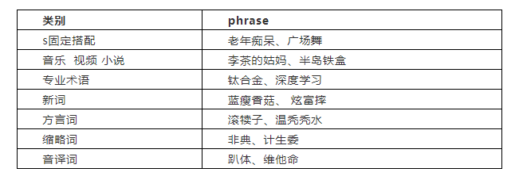

# 【关于 新词发现】那些你不知道的事

> 作者：杨夕 </br>
> 个人github：https://github.com/km1994/nlp_paper_study </br>
> NLP百面百搭：https://github.com/km1994/NLP-Interview-Notes</br>
> 【注：手机阅读可能图片打不开！！！】


## 一、动机

网络文档和领域文档文本的特点在于包含大量新词，一般词典的涵盖程度比较低。对于领域文档，各领域的专家可以人工构建知识本体，拓展已有词库的不健全，但是需要消耗大量的人力成本资源。

那么有没有一种有效方法能够发现上述两种文本中的新词呢？

## 二、 新词发现模块 有哪些阶段？

新词发现模块 主要包含两个阶段：

1. 离线阶段：从海量文本语料中挖掘出高质量的 短语及其属性；
2. 在线阶段：识别给定文本中出现的 短语 供下游模块使用。

## 三、 新词发现模块 的需求有哪些？

1. 热更新。相比于其他任务，由于网络文档和领域文档的文本更新较快，所以新词发现模块需要持续积累和更新；
2. 及时性。网络文档和领域文档的文本更新后，新词发现需要及时更新 资源库，以满足 任务需求。

## 四、 新词发现模块 的任务形式是怎么样的？

1. phrase挖掘

```s
    输入：一堆文本语料，输出：语料中出现的phrase；
```

2. phrase识别

```s
    输入：一段文本（query/title），输出：文本中出现的phrase（需要消歧）；
```

## 五、什么样的新词才属于高质量的新词？ 

首先，看一下这个表格：



会发现，新词存在两个特点：

1. 构成形式无规律性。新词构成形式比较开放，并无明显规律可循；
2. 类别多。新词类别较多。

因此，什么样的新词才属于高质量的新词呢？

从上述表格看出，高质量的 新词 需要满足以下条件：

1. Popularity：候选phrase要有一定的热度；（eg：“信息检索”> “多语种信息检索”）
2. Concordance：候选phrase的内凝度应该比较高；（eg：“深度学习”> “学习分类器”）
3. Informative：候选phrase要包含一定的信息量，表示某个特定话题；（eg：“今天早晨”“该文中”虽然频次很高，但不表示特定话题，信息量低）
4. Completeness：候选phrase相比于父（存在冗余）/子（不可切分）phrase更适合作为phrase；（eg：“幽门螺旋杆菌”>“幽门螺旋”）

## 六、新词发现算法介绍


> 引用 [新词发现 (作者：涛笙依旧_)](https://www.jianshu.com/p/d24b6e197410) 的图片

### 6.1 出现频次

- 介绍：新词在 段落中出现频率往往比其他词要高，所以当出现频率越高，越有可能是新词。
- 代码实现：

> 将 text 进行 n_gram 
```python
    # 功能：将 text 进行 n_gram 
    def n_gram_words(self,text):
        """
            功能：将 text 进行 n_gram 
            input:
                text : String       输入句子 
            return：
                words_freq：Dict    词频 字典
        """
        words = []
        for i in range(1,self.n_gram+1):
            words += [text[j:j+i] for j in range(len(text)-i+1)]
        words_freq = dict(Counter(words))    
        new_words_freq = {}
        for word,freq in words_freq.items():
            new_words_freq[word]=freq
        return new_words_freq  
```

### 6.2 点间互信息（Pointwise Mutual Information）

- 动机：新词一般在文本中出现频率较高，但是出现频率越高的词并代表一定是新词；

```s
    eg：“的电影”出现了 389 次，“电影院”只出现了 175 次，然而我们却更倾向于把“电影院”当作一个词，因为直觉上看，“电影”和“院”凝固得更紧一些。
```

- 思考：在出现频率较高的候选新词中，我们需要 计算 这些候选新词的凝固程度，因为**词的内部凝聚度越高，越容易成词**
- 做法：采用互信息计算方式，衡量知道一个词之后另一个词不确定性的减少程度。
- 公式：

$$\operatorname{PMI}(x, y)=\log _{2} \frac{p(x, y)}{p(x) p(y)}$$

> 注：其中$p(x, y)$表示两个词一起出现的概率，而$p(x)$和$p(y)$表示各词出现的概率。

- 结论：**点间互信息越大，说明这两个词经常出现在一起，意味着两个词的凝固程度越大，其组成一个新词的可能性也就越大。**
- 代码实现：

```python
    # 功能：PMI 过滤掉 噪声词  
    def PMI_filter(self, word_freq_dic):
        """
            功能：PMI 过滤掉 噪声词 
            input:
                words_freq：Dict    词频 字典
            return:
                new_words_dic:Dict  PMI 过滤噪声后 剩余新词 
        """
        new_words_dic = {}
        for word in word_freq_dic:
            if len(word) == 1:
                pass
            else:
                p_x_y = min([word_freq_dic.get(word[:i])* word_freq_dic.get(word[i:]) for i in range(1,len(word))])
                mpi = p_x_y/word_freq_dic.get(word)
                if mpi > self.min_p:
                    new_words_dic[word] = [mpi]
        return new_words_dic
```

### 6.3 左右熵（Information Entropy）

- 动机：如果一个n-gram能够算作一个phrase的话，它应该能够灵活地出现在各种不同的环境中，具有非常丰富的左邻字集合和右邻字集合。左右搭配越丰富，越可能独立成词。

```s
    eg：“被子”和“辈子”右邻字信息熵分别为3.87和4.11。而“被子”的左邻字搭配却丰富得多，有叠被子、盖被子、抢被子、新被子、掀被子等等。“辈子”的左邻字搭配则非常少，只有这辈子、八辈子、上辈子等。
```

- 做法：信息熵是一种衡量信息量大小的方式，熵越大，所含信息量越大，不确定性越高。因此可以分别计算n-gram的左邻字信息熵和右邻字信息熵，并取两者的最小值。
- 公式：

 $$E_{left}(PreW)=-\sum_{\forall Pre \subseteq A} P(PreW) \log _{2} P(PreW )$$

- 结论：**左右熵值越大，说明该词的周边词越丰富，意味着词的自由程度越大，其成为一个独立的词的可能性也就越大。**
- 代码实现：

>  计算字符列表的熵
```python
    # 功能： 计算字符列表的熵
    def calculate_entropy(self, char_list):
        """
            功能： 计算字符列表的熵
            input： 
                char_list: List     字符列表 
            return:
                entropy: float       熵 
        """
        char_freq_dic =  dict(Counter(char_list)) 
        entropy = (-1)*sum([ char_freq_dic.get(i)/len(char_list)*np.log2(char_freq_dic.get(i)/len(char_list)) for i in char_freq_dic])
        return entropy
```

 >  通过熵阈值从限定词字典中过滤出最终的新词
```python   
    # 功能：通过熵阈值从限定词字典中过滤出最终的新词
    def Entropy_left_right_filter(self,condinate_words_dic,text):
        """
            功能：通过熵阈值从限定词字典中过滤出最终的新词
            input： 
                condinate_words_dic：Dict       限定词字典     
                text：String                    句子 
            output： 
                final_words_list:List           最终的新词列表 
        """
        final_words_list = []
        for word in condinate_words_dic.keys():
            left_right_char =re.findall('(.)%s(.)'%word,text)

            left_char = [i[0] for i in left_right_char] 
            left_entropy = self.calculate_entropy(left_char)

            right_char = [i[1] for i in left_right_char]
            right_entropy = self.calculate_entropy(right_char)
            score = condinate_words_dic[word][0]-min(left_entropy,right_entropy)
            if min(right_entropy,left_entropy)> self.min_entropy and score<self.max_score and score>self.min_score:
                final_words_list.append({
                    "word":word,
                    "pmi":condinate_words_dic[word][0],
                    "left_entropy":left_entropy,
                    "right_entropy":right_entropy,
                    "score":score
                })
        final_words_list = sorted(final_words_list, key=lambda x: x['score'], reverse=True)
        return final_words_list
```

## 七、新词发现代码实现

### 7.1 导库

```python
    from collections import Counter
    import numpy as np
    import re,os
    import glob
    import six
    import codecs
    import math
```

### 7.2 函数定义

#### 7.2.1 停用词加载

```python
# 功能：停用词加载
def get_stop_word(stop_word_path):
    #停用词列表，默认使用哈工大停用词表
    f = open(stop_word_path,encoding='utf-8')
    stop_words = list()
    for stop_word in f.readlines():
        stop_words.append(stop_word[:-1])
    return stop_words
```

#### 7.2.2 语料生成器，并且初步预处理语料

```python
# 语料生成器，并且初步预处理语料
def text_generator(file_path):
    txts = glob.glob(f'{file_path}/*.txt')
    for txt in txts:
        d = codecs.open(txt, encoding='utf-8').read()
        title = d.split("\n")[0]
        d = d.replace(u'\u3000', '').strip()
        yield title,re.sub(u'[^\u4e00-\u9fa50-9a-zA-Z ]+', '', d)
```

### 7.3 新词发现类定义

```python
class NewWordFind():
    def __init__(self, n_gram=5, min_p=2 , min_entropy=1, max_score=100, min_score=2):
        '''
            input:
                n_gram: int         n_gram 的 粒度 
                min_p: int          最小 信息熵 阈值 
                min_entropy: int          左右熵 阈值 
                max_score: int          综合得分最大阈值
                min_score: int          综合得分最小阈值
        '''
        self.n_gram = n_gram
        self.min_p = min_p
        self.min_entropy = min_entropy
        self.max_score = max_score
        self.min_score = min_score
    
    # 功能：将 text 进行 n_gram 
    def n_gram_words(self,text):
        """
            功能：将 text 进行 n_gram 
            input:
                text : String       输入句子 
            return：
                words_freq：Dict    词频 字典
        """
        words = []
        for i in range(1,self.n_gram+1):
            words += [text[j:j+i] for j in range(len(text)-i+1)]
        words_freq = dict(Counter(words))    
        new_words_freq = {}
        for word,freq in words_freq.items():
            new_words_freq[word]=freq
        return new_words_freq    
    
    # 功能：PMI 过滤掉 噪声词  
    def PMI_filter(self, word_freq_dic):
        """
            功能：PMI 过滤掉 噪声词 
            input:
                words_freq：Dict    词频 字典
            return:
                new_words_dic:Dict  PMI 过滤噪声后 剩余新词 
        """
        new_words_dic = {}
        for word in word_freq_dic:
            if len(word) == 1:
                pass
            else:
                p_x_y = min([word_freq_dic.get(word[:i])* word_freq_dic.get(word[i:]) for i in range(1,len(word))])
                mpi = p_x_y/word_freq_dic.get(word)
                if mpi > self.min_p:
                    new_words_dic[word] = [mpi]
        return new_words_dic

    # 功能： 计算字符列表的熵
    def calculate_entropy(self, char_list):
        """
            功能： 计算字符列表的熵
            input： 
                char_list: List     字符列表 
            return:
                entropy: float       熵 
        """
        char_freq_dic =  dict(Counter(char_list)) 
        entropy = (-1)*sum([ char_freq_dic.get(i)/len(char_list)*np.log2(char_freq_dic.get(i)/len(char_list)) for i in char_freq_dic])
        return entropy
    
    # 功能：通过熵阈值从限定词字典中过滤出最终的新词
    def Entropy_left_right_filter(self,condinate_words_dic,text):
        """
            功能：通过熵阈值从限定词字典中过滤出最终的新词
            input： 
                condinate_words_dic：Dict       限定词字典     
                text：String                    句子 
            output： 
                final_words_list:List           最终的新词列表 
        """
        final_words_list = []
        for word in condinate_words_dic.keys():
            left_right_char =re.findall('(.)%s(.)'%word,text)

            left_char = [i[0] for i in left_right_char] 
            left_entropy = self.calculate_entropy(left_char)

            right_char = [i[1] for i in left_right_char]
            right_entropy = self.calculate_entropy(right_char)
            score = condinate_words_dic[word][0]-min(left_entropy,right_entropy)
            if min(right_entropy,left_entropy)> self.min_entropy and score<self.max_score and score>self.min_score:
                final_words_list.append({
                    "word":word,
                    "pmi":condinate_words_dic[word][0],
                    "left_entropy":left_entropy,
                    "right_entropy":right_entropy,
                    "score":score
                })
        final_words_list = sorted(final_words_list, key=lambda x: x['score'], reverse=True)
        return final_words_list
```

### 7.4 新词发现类 测试

```python
# read the data and preprocessing the data to a whole str
stop_word= get_stop_word("resource/stopword.txt")

file_path = "data/"

n_gram = 5
min_p = 2
min_entropy = 1
max_score = 100
min_score = 2

new_word_find = NewWordFind( n_gram=n_gram, min_p=min_p , min_entropy=min_entropy, max_score=max_score, min_score=min_score)

for index,(title,text) in enumerate(text_generator(file_path)):
    print(f"\n index :{index} => title:{title}")
    for i in stop_word:
        text=text.replace(i,"")

    n_gram = new_word_find.n_gram_words(text)
    new_words_dic = new_word_find.PMI_filter(n_gram)
    new_words_list = new_word_find.Entropy_left_right_filter(new_words_dic,text)
    
    for new_words in new_words_list:
         print(f"{new_words}")
```

### 7.5 新词发现结果展示

```s
 index :0 => title:##习近平在第六届东方经济论坛全会开幕式上的致辞（全文）
{'word': '方面', 'pmi': 18.666666666666668, 'left_entropy': 1.584962500721156, 'right_entropy': 1.584962500721156, 'score': 17.08170416594551}
{'word': '合作', 'pmi': 13.75, 'left_entropy': 3.0, 'right_entropy': 3.0, 'score': 10.75}
{'word': '中国', 'pmi': 12.0, 'left_entropy': 1.584962500721156, 'right_entropy': 1.584962500721156, 'score': 10.415037499278844}
{'word': '中俄', 'pmi': 6.0, 'left_entropy': 1.584962500721156, 'right_entropy': 1.584962500721156, 'score': 4.415037499278844}
{'word': '发展', 'pmi': 5.0, 'left_entropy': 1.584962500721156, 'right_entropy': 1.584962500721156, 'score': 3.415037499278844}
{'word': '世界', 'pmi': 5.0, 'left_entropy': 2.321928094887362, 'right_entropy': 2.321928094887362, 'score': 2.678071905112638}
```

## 参考

1. [phrase挖掘 - 基于PMI+左右熵的传统方法](https://mp.weixin.qq.com/s/eUEpUBy7S3UGaIj4ecLnhA)
2. [基于互信息和左右熵的新词发现算法——python实现](https://zhuanlan.zhihu.com/p/107663648)
3. [学习NLP的第20天——基于信息熵和互信息的新词提取实现_数据艺术家-程序员宅基地](https://www.cxyzjd.com/article/Changxing_J/106036365)
4. [反作弊基于左右信息熵和互信息的新词挖掘](https://zhuanlan.zhihu.com/p/25499358)
5. [重新写了之前的新词发现算法：更快更好的新词发现](https://kexue.fm/archives/6920)
6. [新词发现](https://zhuanlan.zhihu.com/p/28095072)
7. [新词发现 (作者：涛笙依旧_)](https://www.jianshu.com/p/d24b6e197410)