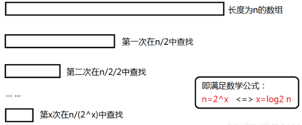
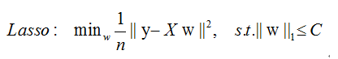
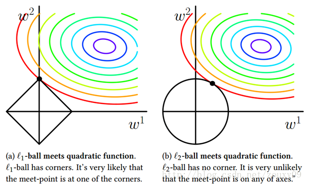

# 【关于 AI 面试】那些你不知道的事 

> 作者：杨夕
> 
> 项目地址：https://github.com/km1994/nlp_paper_study
> 
> 个人介绍：大佬们好，我叫杨夕，该项目主要是本人在研读顶会论文和复现经典论文过程中，所见、所思、所想、所闻，可能存在一些理解错误，希望大佬们多多指正。

## 目录

- [【关于 AI 面试】那些你不知道的事](#关于-ai-面试那些你不知道的事)
  - [目录](#目录)
  - [一、基础算法篇](#一基础算法篇)
    - [1.1.1. 二分查找递归 和 非递归的时间复杂度 和 空间复杂度](#111-二分查找递归-和-非递归的时间复杂度-和-空间复杂度)
    - [1.1.2. 稳定和非稳定排序算法](#112-稳定和非稳定排序算法)
  - [二、机器算法优化篇](#二机器算法优化篇)
    - [1.2.1. 如何判断过拟合，欠拟合，怎么防止过拟合，欠拟合？](#121-如何判断过拟合欠拟合怎么防止过拟合欠拟合)
    - [1.2.2. 欠拟合 和 过拟合 的解决方法](#122-欠拟合-和-过拟合-的解决方法)
      - [1.2.2.1. 解决 欠拟合 的方法](#1221-解决-欠拟合-的方法)
      - [1.2.2.2. 解决过拟合 的方法](#1222-解决过拟合-的方法)
    - [1.2.3. 正则化](#123-正则化)
      - [1.2.3.1. 什么是正则化](#1231-什么是正则化)
      - [1.2.3.2. L0、L1、L2 介绍及区别？](#1232-l0l1l2-介绍及区别)
      - [1.2.3.3. Dropout 介绍？](#1233-dropout-介绍)
    - [1.2.4. 归一化](#124-归一化)
      - [1.2.4.1. 为什么要归一化](#1241-为什么要归一化)
      - [1.2.4.2. 归一化 有 哪些方法？](#1242-归一化-有-哪些方法)
      - [1.2.4.3. 归一化 各方法 特点？](#1243-归一化-各方法-特点)
      - [1.2.4.4. 归一化 的 意义？](#1244-归一化-的-意义)
      - [1.2.4.5. 哪些机器学习算法 需要做 归一化？](#1245-哪些机器学习算法-需要做-归一化)
      - [1.2.4.6. 哪些机器学习算法 不需要做 归一化？](#1246-哪些机器学习算法-不需要做-归一化)
  - [三、机器算法篇](#三机器算法篇)
    - [3.1 什么是支持向量机（support vector machine，SVM）？](#31-什么是支持向量机support-vector-machinesvm)
      - [3.1.1 支持向量机（support vector machine，SVM）的原理？](#311-支持向量机support-vector-machinesvm的原理)
    - [3.2 逻辑回归（Logistic Regression） 是什么？](#32-逻辑回归logistic-regression-是什么)
      - [3.2.1 逻辑回归（Logistic Regression） 的原理是什么？](#321-逻辑回归logistic-regression-的原理是什么)
  - [参考](#参考)

## 一、基础算法篇

### 1.1.1. 二分查找递归 和 非递归的时间复杂度 和 空间复杂度

1. 递归
   
- 时间复杂度：O(logN)
- 空间复杂度：O(logN)
  

2. 非递归

- 时间复杂度：O(logN)
- 空间复杂度：O(1)

### 1.1.2. 稳定和非稳定排序算法

<table>
    <tr>
        <td></td>
        <td>稳定</td>
        <td>非稳定</td>
    </tr>
    <tr>
        <td>特点</td>
        <td>通俗地讲就是能保证排序前2个相等的数其在序列的前后位置顺序和排序后它们两个的前后位置顺序相同。在简单形式化一下，如果Ai = Aj，Ai原来在位置前，排序后Ai还是要在Aj位置前。</td>
        <td>相反</td>
    </tr>
    <tr>
        <td>算法</td>
        <td>冒泡排序、插入排序、归并排序、基数排序</td>
        <td>选择排序、快速排序、希尔排序、堆排序</td>
    </tr>
</table>

## 二、机器算法优化篇

### 1.2.1. 如何判断过拟合，欠拟合，怎么防止过拟合，欠拟合？

(1) 欠拟合问题及解决方法

- 问题表现：高偏差
  - 当训练集和测试集的误差收敛但却很高时，为高偏差;
  - 当偏差很高，训练集和验证集的准确率都很低，很可能是欠拟合；
- 解决方法：增加模型参数：
  - 构建更多特征；
  - 减少正则项；
- 举例：小学生学习 高等数学

(2) 过拟合问题及解决方法

- 问题表现：高方差
  - 当训练集和测试集的误差之间有大的差距时，为高方差；
  - 当方差很高，训练集和验证集的准确率相差太多，应该是过拟合
- 解决方法：
  - 增加训练集；
  - 减低模型复杂度；
  - 增加正则项；
  - 通过特征选择减少特征数；
- 举例：应试能力很强，实际应用能力很差。擅长背诵知识，却不懂得灵活利用知识

### 1.2.2. 欠拟合 和 过拟合 的解决方法

#### 1.2.2.1. 解决 欠拟合 的方法

1. 增加新特征，可以考虑加入进特征组合、高次特征，来增大假设空间;
2. 尝试非线性模型，比如核SVM 、决策树、DNN等模型;
3. 如果有正则项可以较小正则项参数 $\lambda$;
4. Boosting ,Boosting 往往会有较小的 Bias，比如 Gradient Boosting 等.

#### 1.2.2.2. 解决过拟合 的方法

1. 交叉检验，通过交叉检验得到较优的模型参数;
2. 特征选择，减少特征数或使用较少的特征组合，对于按区间离散化的特征，增大划分的区间;
3. 正则化，常用的有 L1、L2 正则。而且 L1正则还可以自动进行特征选择;
4. 如果有正则项则可以考虑增大正则项参数 $\lambda$;
5. 数据集扩增，增加训练数据可以有限的避免过拟合;
6. Bagging ,将多个弱学习器Bagging 一下效果会好很多，比如随机森林等；
7. 早停策略。本质上是交叉验证策略，选择合适的训练次数，避免训练的网络过度拟合训练数据；
8. DropOut策略。所谓的Dropout指的是在用前向传播算法和反向传播算法训练DNN模型时，一批数据迭代时，随机的从全连接DNN网络中去掉一部分隐藏层的神经元。　在对训练集中的一批数据进行训练时，我们随机去掉一部分隐藏层的神经元，并用去掉隐藏层的神经元的网络来拟合我们的一批训练数据。使用基于dropout的正则化比基于bagging的正则化简单，这显而易见，当然天下没有免费的午餐，由于dropout会将原始数据分批迭代，因此原始数据集最好较大，否则模型可能会欠拟合。

### 1.2.3. 正则化

#### 1.2.3.1. 什么是正则化

正则化方法是指**在进行目标函数或代价函数优化时，在目标函数或代价函数后面加上一个正则项**，一般有L1正则与L2正则等。

#### 1.2.3.2. L0、L1、L2 介绍及区别？

(1) L0 

- 介绍：指向量中非 0 的元素的个数，希望参数中的大部分元素是 0，希望参数是稀疏的
- 缺点：难以优化
  
(2) L1 （稀疏规则算子 Lasso regularization）

- 介绍：指 向量中各元素绝对值之和，是 L0 正则项的最优凸近似；
- 优点：
  - 比 L0 容易优化求解，L0存在NP难问题，所以 使用 较多；
  - L1范数是L0范数的最优凸近似；
- 参数稀疏 的 优点：
  - 特征选择：通过将无用特征所对应的权重设为0，以去除无用特征；
  - 可解释性：因为无用特征的权重对应权重都为0，所以只需要介绍权重不为 0 的特征；

(3) L2 （岭回归 Ridge Regression 或者 权重衰减 Weight Decay）

- 介绍：指 向量各元素的平方和然后求平方根
- 作用：防止过拟合问题
- 优点：
  - 防止过拟合，提升模型泛化能力；
  - 有助于处理 condition number不好的情况下矩阵求逆很困难的问题

(4) L1 vs L2

<table>
    <tr>
        <td></td>
        <td>L1</td>
        <td>L2</td>
    </tr>
    <tr>
        <td>目标</td>
        <td>绝对值最小化</td>
        <td>平方值最小化</td>
    </tr>
    <tr>
        <td>下降速度</td>
        <td>以绝对值函数方式下降，较快</td>
        <td>以二次函数函数方式下降，较慢</td>
    </tr>
    <tr>
        <td>规则化的代价函数</td>
        <td>图 1 </td>
        <td>图 2 </td>
    </tr>
    <tr>
        <td>最优解是 w1 和 w2 的取值</td>
        <td>L1在和每个坐标轴相交的地方都有“角”出现，而目标函数的测地线除非位置摆得非常好，大部分时候都会在角的地方相交。注意到在角的位置就会产生稀疏性，例如图中的相交点就有w1=0，而更高维的时候（想象一下三维的L1-ball 是什么样的？）除了角点以外，还有很多边的轮廓也是既有很大的概率成为第一次相交的地方，又会产生稀疏性 </td>
        <td>因为没有角，所以第一次相交的地方出现在具有稀疏性的位置的概率就变得非常小了。这就从直观上来解释了为什么L1-regularization 能产生稀疏性，而L2-regularization 不行的原因了 </td>
    </tr>
    <tr>
        <td>总结</td>
        <td>L1 会趋向于产生少量的特征，而其他的特征都是0 </td>
        <td>L2 会选择更多的特征，这些特征都会接近于0 </td>
    </tr>
    <tr>
        <td>特点</td>
        <td>Lasso在特征选择时候非常有用 </td>
        <td>Ridge就只是一种规则化而已 </td>
    </tr>
    <tr>
        <td>使用选择方面</td>
        <td>特征多，但是其作用的特征少的情况【自动选择特征】 </td>
        <td>特征中起作用的特征多的情况 </td>
    </tr>
    <tr>
        <td>分布类型</td>
        <td>拉普拉斯分布 </td>
        <td>高斯分布 </td>
    </tr>
</table>

> 图 1

> 图 2

> 图 3
> 
> 将模型空间限制在w的一个L1-ball 中。为了便于可视化，我们考虑两维的情况，在(w1, w2)平面上可以画出目标函数的等高线，而约束条件则成为平面上半径为C的一个 norm ball 。等高线与 norm ball 首次相交的地方就是最优解：

#### 1.2.3.3. Dropout 介绍？

- 方式：Dropout 通过 修改ANN中隐藏层的神经元个数 来 防止过拟合
- 操作：训练时，随机删除一些隐藏层神经元，即让他们以一定概率不工作
  

> s1：在训练开始时，随机得删除一些（可以设定为一半，也可以为1/3，1/4等）隐藏层神经元，即认为这些神经元不存在，同时保持输入层与输出层神经元的个数不变;
> s2：然后按照BP学习算法对ANN中的参数进行学习更新（虚线连接的单元不更新，因为认为这些神经元被临时删除了）。这样一次迭代更新便完成了。下一次迭代中，同样随机删除一些神经元，与上次不一样，做随机选择。这样一直进行瑕疵，直至训练结束。

- 原因：由于每一轮都相当于在一个 新的 子网络上训练。那么最终得到的模型便是 无数个 子网络 共同训练 的成果，效果自然会更好

### 1.2.4. 归一化

#### 1.2.4.1. 为什么要归一化

因为 每一列 数据的量纲不同，导致 数据分布区间存在差异。（人的身高可以是 180cm，也可以是 1.8m，这两个虽然表示意义相同，但是由于单位的不同，导致 机器学习在计算过程中也容易出现差异，所以就需要对数据进行归一化）。

#### 1.2.4.2. 归一化 有 哪些方法？

- 线性比例变换法：

- 极差变换法：

- 0 均值标准化（z-score 方法）：

#### 1.2.4.3. 归一化 各方法 特点？

- 线性比例变换法 and 极差变换法
  - 特点：将原始数据线性化的方法转换到[0 1]的范围，该方法实现对原始数据的等比例缩放。通过利用变量取值的最大值和最小值（或者最大值）将原始数据转换为界于某一特定范围的数据，从而消除量纲和数量级影响，改变变量在分析中的权重来解决不同度量的问题。由于极值化方法在对变量无量纲化过程中仅仅与该变量的最大值和最小值这两个极端值有关，而与其他取值无关，这使得该方法在改变各变量权重时过分依赖两个极端取值。
- 0 均值标准化（z-score 方法）
  - 特点：即每一变量值与其平均值之差除以该变量的标准差。虽然该方法在无量纲化过程中利用了所有的数据信息，但是该方法在无量纲化后不仅使得转换后的各变量均值相同，且标准差也相同，即无量纲化的同时还消除了各变量在变异程度上的差异，从而转换后的各变量在聚类分析中的重要性程度是同等看待的。而实际分析中，经常根据各变量在不同单位间取值的差异程度大小来决定其在分析中的重要性程度，差异程度大的其分析权重也相对较大。

#### 1.2.4.4. 归一化 的 意义？

每个维度都是去量纲化的，避免了不同量纲的选取对距离计算产生的巨大影响。

#### 1.2.4.5. 哪些机器学习算法 需要做 归一化？

- 机器学习算法算法：
  - 基于距离计算的模型：KNN；
  - 通过梯度下降法求解的模型：线性回归、逻辑回归、支持向量机、神经网络

#### 1.2.4.6. 哪些机器学习算法 不需要做 归一化？

- 机器学习算法算法：
  - 树形模型：决策树、随机森林(Random Forest)
- 为什么：
  - 原因1：因为它们不关心变量的值，而是关心变量的分布和变量之间的条件概率；
  - 原因2：因为数值缩放不影响分裂点位置，对树模型的结构不造成影响。按照特征值进行排序的，排序的顺序不变，那么所属的分支以及分裂点就不会有不同。而且，树模型是不能进行梯度下降的，因为构建树模型（回归树）寻找最优点时是通过寻找最优分裂点完成的，因此树模型是阶跃的，阶跃点是不可导的，并且求导没意义，也就不需要归一化。

##  三、机器算法篇

### 3.1 什么是支持向量机（support vector machine，SVM）？

#### 3.1.1 支持向量机（support vector machine，SVM）的原理？

- 介绍：支持向量机，因其英文名为support vector machine，故一般简称SVM；
- 类型：一种二类分类模型；
- 基本模型定义：特征空间上的间隔最大的线性分类器，其学习策略便是间隔最大化，最终可转化为一个凸二次规划问题的求解。

### 3.2 逻辑回归（Logistic Regression） 是什么？

#### 3.2.1 逻辑回归（Logistic Regression） 的原理是什么？

## 参考

1. [机器学习面试150题：不只是考SVM xgboost 特征工程（1-50）](https://zhuanlan.zhihu.com/p/213774840)
2. [机器学习面试150题：不只是考SVM xgboost 特征工程（51-100）](https://zhuanlan.zhihu.com/p/217494137)

