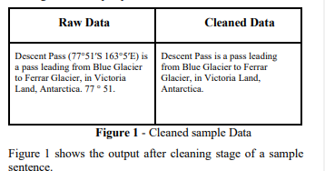
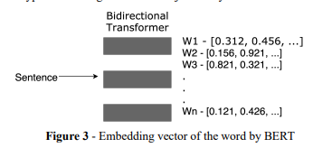
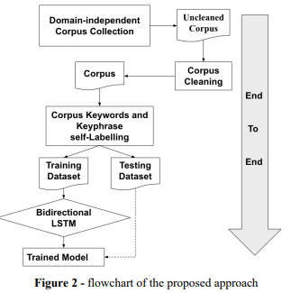

# 【关于 KeyBERT 】 那些你不知道的事

> 论文：Sharma, P., & Li, Y. (2019). Self-Supervised Contextual Keyword and Keyphrase Retrieval with Self-Labelling.
> 
> 论文地址：https://www.preprints.org/manuscript/201908.0073/download/final_file
> 
> 论文代码：https://github.com/MaartenGr/KeyBERT
> 
> 作者：杨夕
> 
> 项目地址：https://github.com/km1994/nlp_paper_study
> 
> 个人介绍：大佬们好，我叫杨夕，该项目主要是本人在研读顶会论文和复现经典论文过程中，所见、所思、所想、所闻，可能存在一些理解错误，希望大佬们多多指正。

- [【关于 KeyBERT 】 那些你不知道的事](#关于-keybert--那些你不知道的事)
  - [一、摘要](#一摘要)
  - [二、动机](#二动机)
  - [三、论文方法](#三论文方法)
  - [四、实践](#四实践)
    - [4.1 安装](#41-安装)
    - [4.2 KeyBERT 调用](#42-keybert-调用)
    - [4.3 语料预处理](#43-语料预处理)
    - [4.4 利用 KeyBert 进行关键词提取](#44-利用-keybert-进行关键词提取)
  - [参考](#参考)


## 一、摘要

In this paper we propose a novel self-supervised approach of keywords and keyphrases retrieval and extraction by an end-to-end deep learning approach, which is trained by contextually self-labelled corpus. 

Our proposed approach is novel to use contextual and semantic features to extract the keywords and has outperformed the state of the art. 

Through the experiment the proposed approach has been proved to be better in both semantic meaning and quality than the existing popular algorithms of keyword extraction. 

In addition, we propose to use contextual features from bidirectional transformers to automatically label short-sentence corpus with keywords and keyphrases to build the ground truth. This process avoids the human time to label the keywords and do not need any prior knowledge. To the best of our knowledge, our published dataset in this paper is a fine domain-independent corpus of short sentences with labelled keywords and keyphrases in the NLP community.

论文创新点：将 预训练模型 Bert 应用于 关键词提取

## 二、动机

1. 文本数据量增长，关键词提取 能有效捕获 文档或句子 中的关键信息；
2. 上下文语义信息对于关键词提取的重要性（the word ‘bank’ could mean a banking organisation, or it could mean river bank. Thus, context is an important aspect. ）；
3. 传统的关键词提取方法在短文本上性能低下；

## 三、论文方法

- 介绍：end2end 的关键词提取方法（注：end2end 表示可以对无标注数据自标注）；
- 思路：

1. Domain-independent corpus collection；
2. corpus cleaning；



3. corpus self-labelling；




4. keyword extraction model training by bidirectional LSTM. 

- The self labelling stage extracted contextual features from the text by leveraging Bidirectional Transformer Encoders, and outperforms the keyword labels obtained from some of the approaches discussed above, such as RAKE [11] and TextRank [14]. 



## 四、实践

### 4.1 安装

```python
pip install keybert
```

### 4.2 KeyBERT 调用

```python
from keybert import KeyBERT
import jieba 
model = KeyBERT('distiluse-base-multilingual-cased/')
```

### 4.3 语料预处理

```python
doc = "刚刚，理论计算机科学家、UT Austin 教授、量子计算先驱 Scott Aaronson 因其「对量子计算的开创性贡献」被授予 2020 年度 ACM 计算奖。在获奖公告中，ACM 表示：「量子计算的意义在于利用量子物理学定律解决传统计算机无法解决或无法在合理时间内解决的难题。Aaronson 的研究展示了计算复杂性理论为量子物理学带来的新视角，并清晰地界定了量子计算机能做什么以及不能做什么。他在推动量子优越性概念发展的过程起到了重要作用，奠定了许多量子优越性实验的理论基础。这些实验最终证明量子计算机可以提供指数级的加速，而无需事先构建完整的容错量子计算机。」 ACM 主席 Gabriele Kotsis 表示：「几乎没有什么技术拥有和量子计算一样的潜力。尽管处于职业生涯的早期，但 Scott Aaronson 因其贡献的广度和深度备受同事推崇。他的研究指导了这一新领域的发展，阐明了它作为领先教育者和卓越传播者的可能性。值得关注的是，他的贡献不仅限于量子计算，同时也在诸如计算复杂性理论和物理学等领域产生了重大影响。」"
doc = " ".join(jieba.cut(doc))
doc
>>>
'刚刚 ， 理论 计算机 科学家 、 UT   Austin   教授 、 量子 计算 先驱   Scott   Aaronson   因 其 「 对 量子 计算 的 开创性 贡献 」 被 授予   2020   年度   ACM   计算 奖 。 在 获奖 公告 中 ， ACM   表示 ： 「 量子 计算 的 意义 在于 利用 量子 物理学 定律 解决 传统 计算机无法 解决 或 无法 在 合理 时间 内 解决 的 难题 。 Aaronson   的 研究 展示 了 计算 复杂性 理论 为 量子 物理学 带来 的 新视角 ， 并 清晰 地 界定 了 量子 计算机 能 做 什么 以及 不能 做 什么 。 他 在 推动 量子 优越性 概念 发展 的 过程 起到 了 重要 作用 ， 奠定 了 许多 量子 优越性 实验 的 理论 基础 。 这些 实验 最终 证明 量子 计算机 可以 提供 指数 级 的 加速 ， 而 无需 事先 构建 完整 的 容错 量子 计算机 。 」   ACM   主席   Gabriele   Kotsis   表示 ： 「 几乎 没有 什么 技术 拥有 和 量子 计算 一样 的 潜力 。 尽管 处于 职业生涯 的 早期 ， 但   Scott   Aaronson   因 其 贡献 的 广度 和 深度 备受 同事 推崇 。 他 的 研究 指导 了 这 一新 领域 的 发展 ， 阐明 了 它 作为 领先 教育者 和 卓越 传播者 的 可能性 。 值得 关注 的 是 ， 他 的 贡献 不仅 限于 量子 计算 ， 同时 也 在 诸如 计算 复杂性 理论 和 物理学 等 领域 产生 了 重大 影响 。 」'
```

### 4.4 利用 KeyBert 进行关键词提取

```python
model.extract_keywords(doc, keyphrase_ngram_range=(1, 1))

# docs：待提取关键词 的 文档
# keyphrase_ngram_range：提取的短语，的词汇长度
# stop_words
# top_n：提取 的 关键词 数量
>>>
['计算', '计算机无法', '量子', '计算机', '物理学']
```

## 参考

1. [Sharma, P., & Li, Y. (2019). Self-Supervised Contextual Keyword and Keyphrase Retrieval with Self-Labelling](https://www.preprints.org/manuscript/201908.0073/download/final_file)
2. [KeyBERT github](https://github.com/MaartenGr/KeyBERT)
