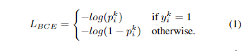
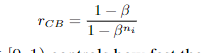
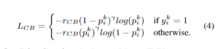
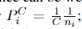
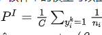
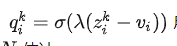

# 【关于 Balancing Methods for Multi-label Text Classification 】 那些你不知道的事

> 作者：杨夕
> 
> 论文：Balancing Methods for Multi-label Text Classification with Long-Tailed Class Distribution
> 
> 论文地址：https://arxiv.org/abs/2109.04712
> 
> github: https://github.com/Roche/BalancedLossNLP
> 
> 论文出处：EMNLP2021
> 
> 项目地址：https://github.com/km1994/nlp_paper_study
> 
> NLP 面经地址：https://github.com/km1994/NLP-Interview-Notes
> 
> 推荐系统 百面百搭：https://github.com/km1994/RES-Interview-Notes
> 
> 个人介绍：大佬们好，我叫杨夕，该项目主要是本人在研读顶会论文和复现经典论文过程中，所见、所思、所想、所闻，可能存在一些理解错误，希望大佬们多多指正。


## 一、引言

Multi-label text classification is a challenging task because it requires capturing label dependencies. It becomes even more challenging when class distribution is long-tailed. Resampling and re-weighting are common approaches used for addressing the class imbalance problem, however, they are not effective when there is label dependency besides class imbalance because they result in oversampling of common labels. Here, we introduce the application of balancing loss functions for multi-label text classification. We perform experiments on a general domain dataset with 90 labels (Reuters-21578) and a domain-specific dataset from PubMed with 18211 labels. We find that a distribution-balanced loss function, which inherently addresses both the class imbalance and label linkage problems, outperforms commonly used loss functions. Distribution balancing methods have been successfully used in the image recognition field. Here, we show their effectiveness in natural language processing.

- 介绍：多标签文本分类是一项具有挑战性的任务，因为它需要捕获标签依赖关系。 
- 动机：
  - 问题1：类别不均衡问题：当类分布是长尾时，它变得更具挑战性；
    - 方法1：重采样和重新加权
  - 问题2：类别标签的联动（类别共现）；
    - 方法1会导致 公共标签的过采样
- 论文方法：平衡损失函数在多标签文本分类中的应用
- 论文实验：对具有 90 个标签 (Reuters-21578) 的通用域数据集和来自 PubMed 的具有 18211 个标签的特定域数据集进行实验。 我们发现，一个分布平衡的损失函数，它本质上解决了类不平衡和标签链接问题，优于常用的损失函数。 分布平衡方法已成功应用于图像识别领域。 在这里，我们展示了它们在自然语言处理中的有效性。

## 二、动机

- 多标签分类的两大难点：
  - 类别的长尾分布（类别不平衡）：小规模的标签子集（head labels）拥有大量的样本，而绝大部分标签（tail labels）只拥有较少的样本；
  - 类别标签的联动（类别共现）：一些head labels会与tail labels同时出现；

## 三、Multi-Label 损失函数 构建与选择

### 3.1 BCE Loss

- 目标：multi-label分类问题 => 多个二分类问题
- 方法介绍：

给定 N 个 样本数据集:


其中，$y^k ∈ {0,1}^C$，C 为类别，分类器的输出为 $z^k∈R$

则，BCE Loss 可以 定义为



> 注：这里 $p^k_i=σ(z^k_i)$，σ() 为 sigmoid 函数

- 代码实现：

```s
  class BCELosswithLogits(nn.Module):
      def __init__(self, pos_weight=1, reduction='mean'):
          super(BCELosswithLogits, self).__init__()
          self.pos_weight = pos_weight
          self.reduction = reduction

      def forward(self, logits, target):
          # logits: [N, *], target: [N, *]
          logits = F.sigmoid(logits)
          loss = - self.pos_weight * target * torch.log(logits) - \
                (1 - target) * torch.log(1 - logits)
          if self.reduction == 'mean':
              loss = loss.mean()
          elif self.reduction == 'sum':
              loss = loss.sum()
          return loss
```

- 存在问题：由于 head classes的主导以及negative instances的影响，导致 BCE Loss 函数 容易受到 类别不均衡问题 影响；
- 优化方向：绝大部分balancing方法都是reweight BCE从而使得稀有的instance-label对能够得到得到合理的“关注”

### 3.2 Focal Loss（FL）

- 动机：如何 让 稀有的instance-label对能够得到得到合理的“关注”？
- 方法思路：通过 给 hard-to-classify” instances 分配更高的权值；
- 方法介绍：


- 代码实现：

```s
import numpy as np
import torch
import torch.nn.functional as F

def focal_loss(logits, labels, alpha, gamma):
    """Compute the focal loss between `logits` and the ground truth `labels`.

    Focal loss = -alpha_t * (1-pt)^gamma * log(pt)
    where pt is the probability of being classified to the true class.
    pt = p (if true class), otherwise pt = 1 - p. p = sigmoid(logit).

    Args:
      logits: A float tensor of size [batch, num_classes].
      labels: A float tensor of size [batch, num_classes].
      alpha: A float tensor of size [batch_size]
        specifying per-example weight for balanced cross entropy.
      gamma: A float scalar modulating loss from hard and easy examples.

    Returns:
      focal_loss: A float32 scalar representing normalized total loss.
    """
    bce_loss = F.binary_cross_entropy_with_logits(input=logits, target=labels, reduction="none")

    if gamma == 0.0:
        modulator = 1.0
    else:
        modulator = torch.exp(-gamma * labels * logits - gamma * torch.log(1 + torch.exp(-1.0 * logits)))

    loss = modulator * bce_loss

    weighted_loss = alpha * loss
    loss = torch.sum(weighted_loss)
    loss /= torch.sum(labels)
    return loss
```

### 3.3 Class-balanced focal loss （CB）

- 动机：如何 让 稀有的instance-label对能够得到得到合理的“关注”？
- 方法思路：给不同的label赋予不同的权重，从而降低head classes带来的冗余信息
- 方法介绍：

1. 对于 整体频率 为 ni 的标签，balance term 可定义为：



> 注：β ∈[0,1)  主要用于 控制 effective number 的增长速度

2. 整体函数为



- 代码实现

```s
class ClassBalancedLoss(torch.nn.Module):
    def __init__(self, samples_per_class=None, beta=0.9999, gamma=0.5, loss_type="focal"):
        super(ClassBalancedLoss, self).__init__()
        if loss_type not in ["focal", "sigmoid", "softmax"]:
            loss_type = "focal"
        if samples_per_class is None:
            num_classes = 5000
            samples_per_class = [1] * num_classes
        effective_num = 1.0 - np.power(beta, samples_per_class)
        weights = (1.0 - beta) / np.array(effective_num)
        self.constant_sum = len(samples_per_class)
        weights = (weights / np.sum(weights) * self.constant_sum).astype(np.float32)
        self.class_weights = weights
        self.beta = beta
        self.gamma = gamma
        self.loss_type = loss_type

    def update(self, samples_per_class):
        if samples_per_class is None:
            return
        effective_num = 1.0 - np.power(self.beta, samples_per_class)
        weights = (1.0 - self.beta) / np.array(effective_num)
        self.constant_sum = len(samples_per_class)
        weights = (weights / np.sum(weights) * self.constant_sum).astype(np.float32)
        self.class_weights = weights

    def forward(self, x, y):
        _, num_classes = x.shape
        labels_one_hot = F.one_hot(y, num_classes).float()
        weights = torch.tensor(self.class_weights, device=x.device).index_select(0, y)
        weights = weights.unsqueeze(1)
        if self.loss_type == "focal":
            cb_loss = focal_loss(x, labels_one_hot, weights, self.gamma)
        elif self.loss_type == "sigmoid":
            cb_loss = F.binary_cross_entropy_with_logits(x, labels_one_hot, weights)
        else:  # softmax
            pred = x.softmax(dim=1)
            cb_loss = F.binary_cross_entropy(pred, labels_one_hot, weights)
        return cb_loss
```

### 3.4 Distribution-balanced loss (DB)

- 动机：如何 减少label co-occurance带来的冗余信息以及减少易分类的negative instances的损失权重？
- 方法思路：整合 rebalanced weight 和 negative-tolerant regularization（NTR）

1. 减少 label co-occurrence 的冗余信息;
2. 显式分配较低的权重 “easy-to-classify” negative instances; 

- 方法介绍：

1. 对于单标签的样本，该样本的权重可以由resampling的概率决定:



2. 多标签的样本权重则可以表示：



rebalanced权重可以规范化为 


使用平滑函数进行平滑


> 注：将 rDB 映射到 [α,α + 1]

3. Distribution-balanced loss (DB) 函数定义为


NTR将同一标签的正负样本区别对待，引入scale factor λ 以及intrinsic class-specific bias  vi 来降低tail classes的阈值以及避免over-superession.

4. NTR(NTR-FL) 损失函数定义为：


其中，

positive样本:


negative样本:



vi 可以由 scale factor k 以及class prior pi=ni/N，估计：


5. DB损失函数将上述两种损失结合：


```s
import torch
import torch.nn as nn
import torch.nn.functional as F
import numpy as np

class ResampleLoss(nn.Module):

    def __init__(self,
                 use_sigmoid=True, partial=False,
                 loss_weight=1.0, reduction='mean',
                 reweight_func=None,  # None, 'inv', 'sqrt_inv', 'rebalance', 'CB'
                 weight_norm=None, # None, 'by_instance', 'by_batch'
                 focal=dict(
                     focal=True,
                     alpha=0.5,
                     gamma=2,
                 ),
                 map_param=dict(
                     alpha=10.0,
                     beta=0.2,
                     gamma=0.1
                 ),
                 CB_loss=dict(
                     CB_beta=0.9,
                     CB_mode='average_w'  # 'by_class', 'average_n', 'average_w', 'min_n'
                 ),
                 logit_reg=dict(
                     neg_scale=5.0,
                     init_bias=0.1
                 ),
                 class_freq=None,
                 train_num=None):
        super(ResampleLoss, self).__init__()

        assert (use_sigmoid is True) or (partial is False)
        self.use_sigmoid = use_sigmoid
        self.partial = partial
        self.loss_weight = loss_weight
        self.reduction = reduction
        if self.use_sigmoid:
            if self.partial:
                self.cls_criterion = partial_cross_entropy
            else:
                self.cls_criterion = binary_cross_entropy
        else:
            self.cls_criterion = cross_entropy

        # reweighting function
        self.reweight_func = reweight_func

        # normalization (optional)
        self.weight_norm = weight_norm

        # focal loss params
        self.focal = focal['focal']
        self.gamma = focal['gamma']
        self.alpha = focal['alpha'] # change to alpha

        # mapping function params
        self.map_alpha = map_param['alpha']
        self.map_beta = map_param['beta']
        self.map_gamma = map_param['gamma']

        # CB loss params (optional)
        self.CB_beta = CB_loss['CB_beta']
        self.CB_mode = CB_loss['CB_mode']

        self.class_freq = torch.from_numpy(np.asarray(class_freq)).float().cuda()
        self.num_classes = self.class_freq.shape[0]
        self.train_num = train_num # only used to be divided by class_freq
        # regularization params
        self.logit_reg = logit_reg
        self.neg_scale = logit_reg[
            'neg_scale'] if 'neg_scale' in logit_reg else 1.0
        init_bias = logit_reg['init_bias'] if 'init_bias' in logit_reg else 0.0
        self.init_bias = - torch.log(
            self.train_num / self.class_freq - 1) * init_bias ########################## bug fixed https://github.com/wutong16/DistributionBalancedLoss/issues/8

        self.freq_inv = torch.ones(self.class_freq.shape).cuda() / self.class_freq
        self.propotion_inv = self.train_num / self.class_freq

    def forward(self,
                cls_score,
                label,
                weight=None,
                avg_factor=None,
                reduction_override=None,
                **kwargs):

        assert reduction_override in (None, 'none', 'mean', 'sum')
        reduction = (
            reduction_override if reduction_override else self.reduction)

        weight = self.reweight_functions(label)

        cls_score, weight = self.logit_reg_functions(label.float(), cls_score, weight)

        if self.focal:
            logpt = self.cls_criterion(
                cls_score.clone(), label, weight=None, reduction='none',
                avg_factor=avg_factor)
            # pt is sigmoid(logit) for pos or sigmoid(-logit) for neg
            pt = torch.exp(-logpt)
            wtloss = self.cls_criterion(
                cls_score, label.float(), weight=weight, reduction='none')
            alpha_t = torch.where(label==1, self.alpha, 1-self.alpha)
            loss = alpha_t * ((1 - pt) ** self.gamma) * wtloss ####################### balance_param should be a tensor
            loss = reduce_loss(loss, reduction)             ############################ add reduction
        else:
            loss = self.cls_criterion(cls_score, label.float(), weight,
                                      reduction=reduction)

        loss = self.loss_weight * loss
        return loss

    def reweight_functions(self, label):
        if self.reweight_func is None:
            return None
        elif self.reweight_func in ['inv', 'sqrt_inv']:
            weight = self.RW_weight(label.float())
        elif self.reweight_func in 'rebalance':
            weight = self.rebalance_weight(label.float())
        elif self.reweight_func in 'CB':
            weight = self.CB_weight(label.float())
        else:
            return None

        if self.weight_norm is not None:
            if 'by_instance' in self.weight_norm:
                max_by_instance, _ = torch.max(weight, dim=-1, keepdim=True)
                weight = weight / max_by_instance
            elif 'by_batch' in self.weight_norm:
                weight = weight / torch.max(weight)

        return weight

    def logit_reg_functions(self, labels, logits, weight=None): 
        if not self.logit_reg:
            return logits, weight
        if 'init_bias' in self.logit_reg:
            logits += self.init_bias
        if 'neg_scale' in self.logit_reg:
            logits = logits * (1 - labels) * self.neg_scale  + logits * labels
            if weight is not None:
                weight = weight / self.neg_scale * (1 - labels) + weight * labels
        return logits, weight

    def rebalance_weight(self, gt_labels):
        repeat_rate = torch.sum( gt_labels.float() * self.freq_inv, dim=1, keepdim=True)
        pos_weight = self.freq_inv.clone().detach().unsqueeze(0) / repeat_rate
        # pos and neg are equally treated
        weight = torch.sigmoid(self.map_beta * (pos_weight - self.map_gamma)) + self.map_alpha
        return weight

    def CB_weight(self, gt_labels):
        if  'by_class' in self.CB_mode:
            weight = torch.tensor((1 - self.CB_beta)).cuda() / \
                     (1 - torch.pow(self.CB_beta, self.class_freq)).cuda()
        elif 'average_n' in self.CB_mode:
            avg_n = torch.sum(gt_labels * self.class_freq, dim=1, keepdim=True) / \
                    torch.sum(gt_labels, dim=1, keepdim=True)
            weight = torch.tensor((1 - self.CB_beta)).cuda() / \
                     (1 - torch.pow(self.CB_beta, avg_n)).cuda()
        elif 'average_w' in self.CB_mode:
            weight_ = torch.tensor((1 - self.CB_beta)).cuda() / \
                      (1 - torch.pow(self.CB_beta, self.class_freq)).cuda()
            weight = torch.sum(gt_labels * weight_, dim=1, keepdim=True) / \
                     torch.sum(gt_labels, dim=1, keepdim=True)
        elif 'min_n' in self.CB_mode:
            min_n, _ = torch.min(gt_labels * self.class_freq +
                                 (1 - gt_labels) * 100000, dim=1, keepdim=True)
            weight = torch.tensor((1 - self.CB_beta)).cuda() / \
                     (1 - torch.pow(self.CB_beta, min_n)).cuda()
        else:
            raise NameError
        return weight

    def RW_weight(self, gt_labels, by_class=True):
        if 'sqrt' in self.reweight_func:
            weight = torch.sqrt(self.propotion_inv)
        else:
            weight = self.propotion_inv
        if not by_class:
            sum_ = torch.sum(weight * gt_labels, dim=1, keepdim=True)
            weight = sum_ / torch.sum(gt_labels, dim=1, keepdim=True)
        return weight
    

def reduce_loss(loss, reduction):
    """Reduce loss as specified.
    Args:
        loss (Tensor): Elementwise loss tensor.
        reduction (str): Options are "none", "mean" and "sum".
    Return:
        Tensor: Reduced loss tensor.
    """
    reduction_enum = F._Reduction.get_enum(reduction)
    # none: 0, elementwise_mean:1, sum: 2
    if reduction_enum == 0:
        return loss
    elif reduction_enum == 1:
        return loss.mean()
    elif reduction_enum == 2:
        return loss.sum()


def weight_reduce_loss(loss, weight=None, reduction='mean', avg_factor=None):
    """Apply element-wise weight and reduce loss.
    Args:
        loss (Tensor): Element-wise loss.
        weight (Tensor): Element-wise weights.
        reduction (str): Same as built-in losses of PyTorch.
        avg_factor (float): Avarage factor when computing the mean of losses.
    Returns:
        Tensor: Processed loss values.
    """
    # if weight is specified, apply element-wise weight
    if weight is not None:
        loss = loss * weight

    # if avg_factor is not specified, just reduce the loss
    if avg_factor is None:
        loss = reduce_loss(loss, reduction)
    else:
        # if reduction is mean, then average the loss by avg_factor
        if reduction == 'mean':
            loss = loss.sum() / avg_factor
        # if reduction is 'none', then do nothing, otherwise raise an error
        elif reduction != 'none':
            raise ValueError('avg_factor can not be used with reduction="sum"')
    return loss


def binary_cross_entropy(pred,
                         label,
                         weight=None,
                         reduction='mean',
                         avg_factor=None):

    # weighted element-wise losses
    if weight is not None:
        weight = weight.float()

    loss = F.binary_cross_entropy_with_logits(
        pred, label.float(), weight, reduction='none')
    loss = weight_reduce_loss(loss, reduction=reduction, avg_factor=avg_factor)

    return loss
```

## 四、论文实验

### 4.1 数据集选取 和 类别的长尾分布以及类别标签的联动

1. 所选取数据集：Ruters-21578以及PubMed

2. 类别的长尾分布以及类别标签的联动


### 4.2 实验结果


## 五、总结

针对multi-label文本分类的问题，作者比较了一系列balancing loss函数的作用。实验表明考虑了long-tailed distribution以及label co-occurrence的DB损失函数表现优异。

## 参考

1. [论文地址 | Balancing Methods for Multi-label Text Classification with Long-Tailed Class Distribution](https://arxiv.org/abs/2109.04712)
2. [论文代码 | Balancing Methods for Multi-label Text Classification with Long-Tailed Class Distribution](https://github.com/Roche/BalancedLossNLP)
3. [论文笔记 | Balancing Methods for Multi-label Text Classification with Long-Tailed Class Distribution](https://zhuanlan.zhihu.com/p/549589380)
4. [pytorch学习经验（五）手动实现交叉熵损失及Focal Loss](https://www.jianshu.com/p/0c159cdd9c50)
5. [class balanced loss pytorch 实现](https://blog.csdn.net/nathan_yo/article/details/106482850)
