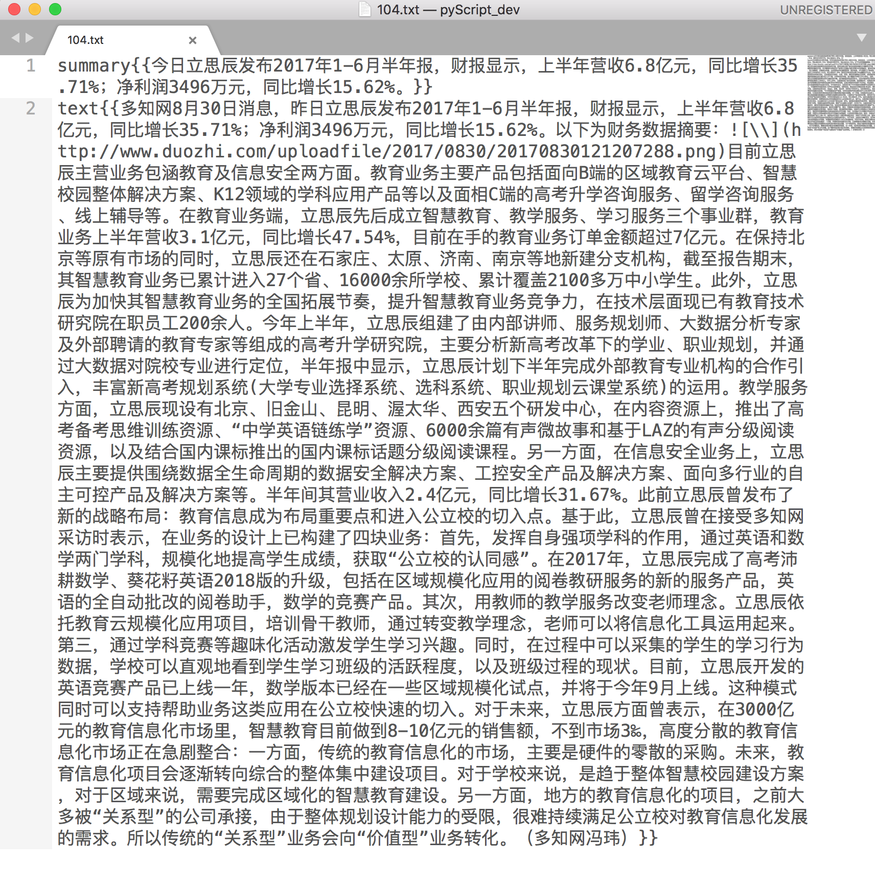

# chinese_abstractive_corpus

## 语料名称

教育培训行业抽象式自动摘要中文语料库

## 语料简介

自动文摘分为两种：

1. 抽取式

2. 抽象式

语料库收集了教育培训行业主流垂直媒体的历史文章（截止到2018年6月5日）大约24500条数据集。主要是为训练抽象式模型而整理，每条数据有summary(摘要)和text(正文)，两个字段，Summary字段均为作者标注。

压缩包大约 60 MB，解压后大约 150 MB。

格式如下：

summary{{...}}

text{{...}}

关于和抽象式自动文摘更多研究成果可参考：http://www.abigailsee.com/2017/04/16/taming-rnns-for-better-summarization.html

作者对两种文摘方式做了深入对比，并且提供了实验结论。

## 关于训练集和测试集

并未明确划分训练集和测试集合，请使用者根据自己的实际情况按照比例划分

## 作者联系方式

wechat : wonderfulcorporation
