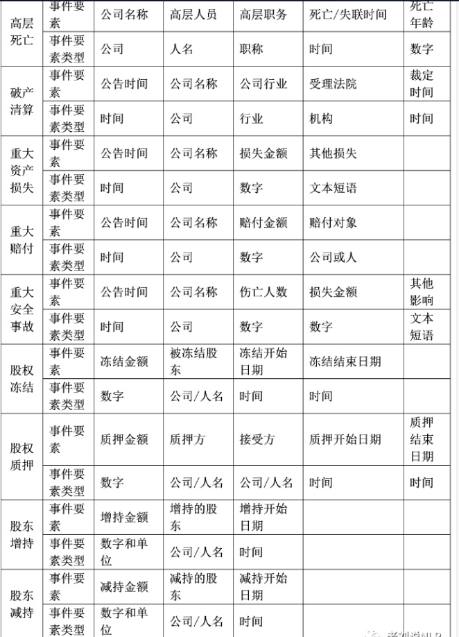
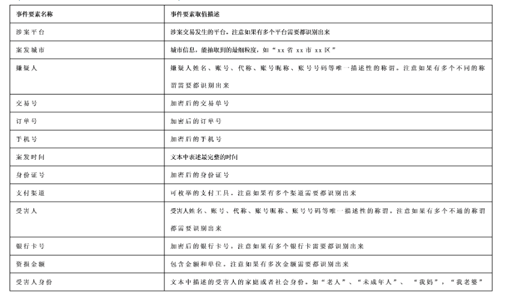
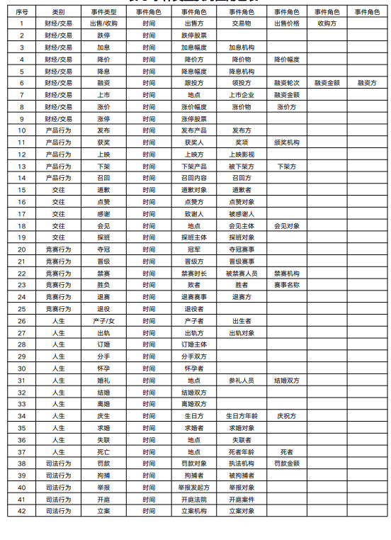
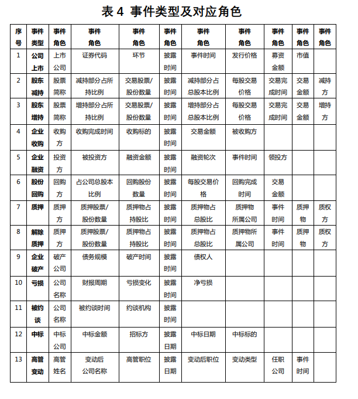
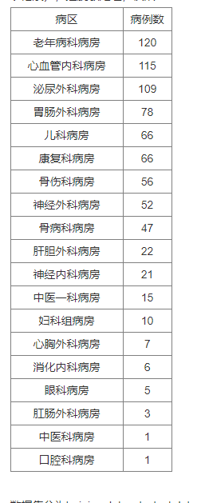

# 【关于 NLP 语料】那些你不知道的事

## 八、对话语料

### 8.1 对话语料介绍

语料名称 | 语料数量 | 语料来源说明 | 语料特点 | 语料样例 | 是否已分词
---|---|---|---|---|---
chatterbot | 560 | 开源项目 | 按类型分类，质量较高  | Q:你会开心的 A:幸福不是真正的可预测的情绪。 | 否
douban（豆瓣多轮） | 352W | 来自北航和微软的paper, 开源项目 | 噪音相对较少，原本是多轮（平均7.6轮）  | Q:烟台 十一 哪 好玩 A:哪 都 好玩 · · · · | 是
ptt（PTT八卦语料） | 77W（v1版本42W） | 开源项目，台湾PTT论坛八卦版 | 繁体，语料较生活化，有噪音  | Q:为什么乡民总是欺负国高中生呢QQ	A:如果以为选好科系就会变成比尔盖兹那不如退学吧  | 否
qingyun（青云语料） | 10W | 某聊天机器人交流群 | 相对不错，生活化  | Q:看来你很爱钱 	 A:噢是吗？那么你也差不多了 | 否
subtitle（电视剧对白语料） | 274W | 开源项目，来自爬取的电影和美剧的字幕 | 有一些噪音，对白不一定是严谨的对话，原本是多轮（平均5.3轮）  | Q:京戏里头的人都是不自由的	A:他们让人拿笼子给套起来了了 | 否
tieba（贴吧论坛回帖语料） | 232W | 偶然找到的 | 多轮，有噪音  | Q:前排，鲁迷们都起床了吧	A:标题说助攻，但是看了那球，真是活生生的讽刺了 | 否
weibo（微博语料） | 443W | 来自华为的paper | 仍有一些噪音  | Q:北京的小纯洁们，周日见。#硬汉摆拍清纯照# A:嗷嗷大湿的左手在干嘛，看着小纯洁撸么。 | 否
xiaohuangji（小黄鸡语料） | 45W | 原人人网项目语料 | 有一些不雅对话，少量噪音 | Q:你谈过恋爱么	A:谈过，哎，别提了，伤心..。 | 否

语料名称 | 语料原始URL（即出处，尊重原始版权） 
---|---
chatterbot | https://github.com/gunthercox/chatterbot-corpus/tree/master/chatterbot_corpus/data/chinese
douban（豆瓣多轮） | https://github.com/MarkWuNLP/MultiTurnResponseSelection 
ptt（PTT八卦语料）| https://github.com/zake7749/Gossiping-Chinese-Corpus 
qingyun（青云语料） | 无 
subtitle（电视剧对白语料） | https://github.com/fateleak/dgk_lost_conv 
tieba（贴吧论坛回帖语料）  | https://pan.baidu.com/s/1mUknfwy1nhSM7XzH8xi7gQ 密码:i4si 
weibo（微博语料）  | 61.93.89.94/Noah_NRM_Data/ 
xiaohuangji（小黄鸡语料） | https://github.com/candlewill/Dialog_Corpus 

### 8.2 对话语料下载

1. 百度网盘链接: https://pan.baidu.com/s/17rIIkhQN2ZNULOGvfE2OWQ  密码: iani

> 因为一些原因，百度网盘的链接不包含PTT语料，请自行下载放在相应目录

2. Google Drive  https://drive.google.com/file/d/1So-m83NdUHexfjJ912rQ4GItdLvnmJMD/view?usp=sharing


## 七、文本匹配数据

### 7.1 afqmc数据集

总样本数为：38650，其中，匹配样本个数为：11911，不匹配样本个数为：26739

### 7.2 ccks2018_task3 数据集

总样本数为：100000，其中，匹配样本个数为：50000，不匹配样本个数为：50000

### 7.3 chip2019数据集

总样本数为：20000，其中，匹配样本个数为：10000，不匹配样本个数为：10000

### 7.4 COVID-19数据集

总样本数为：10749，其中，匹配样本个数为：4301，不匹配样本个数为：6448

### 7.5 diac2019数据集

总样本数为：100298，其中，匹配样本个数为：38446，不匹配样本个数为：61852

### 7.6 gaiic2021_task3数据集

总样本数为：177173，其中，匹配样本个数为：54805，不匹配样本个数为：122368

### 7.7 lcqmc数据集

总样本数为：260068，其中，匹配样本个数为：149226，不匹配样本个数为：110842

### 7.8 pawsx数据集

总样本数为：53401，其中，匹配样本个数为：23576，不匹配样本个数为：29825

### 7.9 ths2021数据集

总样本数为：41756，其中，匹配样本个数为：10478，不匹配样本个数为：31278

### 7.10 xf2021数据集

总样本数为：5000，其中，匹配样本个数为：2892，不匹配样本个数为：2108

### 7.11 sohu_2021数据集

总样本数为：69578，其中，匹配样本个数为：18714，不匹配样本个数为：50864

### 7.12 cmnli数据集

总样本数为：404024，其中，匹配样本个数为：134889，不匹配样本个数为：269135

### 7.13 csnli数据集

总样本数为：564339，其中，匹配样本个数为：188518，不匹配样本个数为：375821

### 7.14 ocnli数据集

总样本数为：53387，其中，匹配样本个数为：17726，不匹配样本个数为：35661

### 7.15 cstsb数据集

总样本数为：4473，其中，匹配样本个数为：401，不匹配样本个数为：4072

### 7.16 pku数据集

总样本数为：509832，其中，匹配样本个数为：509832，不匹配样本个数为：0


### 参考

- [中文文本匹配数据集整理](https://github.com/liucongg/NLPDataSet)


## 六、文本摘要数据

### 6.4 nlpcc 自动摘要英文语料库

```s
{
  "version": "0.0.1",
  "data":
  [
      {
          "title": "知情人透露章子怡怀孕后,父母很高兴。章母已开始悉心照料。据悉,预产期大概是12月底",
          "content": "四海网讯,近日,有媒体报道称:章子怡真怀孕了!报道还援引知情人士消息称,“章子怡怀孕大概四五个月,预产期是年底前后,现在已经不接工作了。”这到底是怎么回事?消息是真是假?针对此消息,23日晚8时30分,华西都市报记者迅速联系上了与章子怡家里关系极好的知情人士,这位人士向华西都市报记者证实说:“子怡这次确实怀孕了。她已经36岁了,也该怀孕了。章子怡怀上汪峰的孩子后,子怡的父母亲十分高兴。子怡的母亲,已开始悉心照料女儿了。子怡的预产期大概是今年12月底。”当晚9时,华西都市报记者为了求证章子怡怀孕消息,又电话联系章子怡的亲哥哥章子男,但电话通了,一直没有人接听。有关章子怡怀孕的新闻自从2013年9月份章子怡和汪峰恋情以来,就被传N遍了!不过,时间跨入2015年,事情却发生着微妙的变化。2015年3月21日,章子怡担任制片人的电影《从天儿降》开机,在开机发布会上几张合影,让网友又燃起了好奇心:“章子怡真的怀孕了吗?”但后据证实,章子怡的“大肚照”只是影片宣传的噱头。过了四个月的7月22日,《太平轮》新一轮宣传,章子怡又被发现状态不佳,不时深呼吸,不自觉想捂住肚子,又觉得不妥。然后在8月的一天,章子怡和朋友吃饭,在酒店门口被风行工作室拍到了,疑似有孕在身!今年7月11日,汪峰本来在上海要举行演唱会,后来因为台风“灿鸿”取消了。而消息人士称,汪峰原来打算在演唱会上当着章子怡的面宣布重大消息,而且章子怡已经赴上海准备参加演唱会了,怎知遇到台风,只好延期,相信9月26日的演唱会应该还会有惊喜大白天下吧。"
      },...
  ]
}
```

### 6.3 SQuAD 自动摘要英文语料库

```s
  {"data": [{"title": "Super_Bowl_50", "paragraphs": [{"context": "Super Bowl 50 was an American football game to determine the champion of the National Football League (NFL) for the 2015 season. The American Football Conference (AFC) champion Denver Broncos defeated the National Football Conference (NFC) champion Carolina Panthers 24\u201310 to earn their third Super Bowl title. The game was played on February 7, 2016, at Levi's Stadium in the San Francisco Bay Area at Santa Clara, California. As this was the 50th Super Bowl, the league emphasized the \"golden anniversary\" with various gold-themed initiatives, as well as temporarily suspending the tradition of naming each Super Bowl game with Roman numerals (under which the game would have been known as \"Super Bowl L\"), so that the logo could prominently feature the Arabic numerals 50.", "qas": [{"answers": [{"answer_start": 177, "text": "Denver Broncos"}, {"answer_start": 177, "text": "Denver Broncos"}, {"answer_start": 177, "text": "Denver Broncos"}], "question": "Which NFL team represented the AFC at Super Bowl 50?", "id": "56be4db0acb8001400a502ec"}, {"answers": [{"answer_start": 249, "text": "Carolina Panthers"}, 
  ...
}

```

### 6.2 lcsts 生成式自自动摘要中文语料库

- article.txt

```s
  新华社受权于18日全文播发修改后的《中华人民共和国立法法》，修改后的立法法分为“总则”“法律”“行政法规”“地方性法规、自治条例和单行条例、规章”“适用与备案审查”“附则”等6章，共计105条。
  一辆小轿车，一名女司机，竟造成9死24伤。日前，深圳市交警局对事故进行通报：从目前证据看，事故系司机超速行驶且操作不当导致。目前24名伤员已有6名治愈出院，其余正接受治疗，预计事故赔偿费或超一千万元。
  1月18日，习近平总书记对政法工作作出重要指示：2014年，政法战线各项工作特别是改革工作取得新成效。新形势下，希望全国政法机关主动适应新形势，为公正司法和提高执法司法公信力提供有力制度保障。
  针对央视3·15晚会曝光的电信行业乱象，工信部在公告中表示，将严查央视3·15晚会曝光通信违规违法行为。工信部称，已约谈三大运营商有关负责人，并连夜责成三大运营商和所在省通信管理局进行调查，依法依规严肃处理。
  ...
```

- summary.txt

```s
  修改后的立法法全文公布
  深圳机场9死24伤续：司机全责赔偿或超千万
  孟建柱：主动适应形势新变化提高政法机关服务大局的能力
  工信部约谈三大运营商严查通信违规
  ...
```

### 6.1 教育培训行业抽象式自动摘要中文语料库

自动文摘分为两种：

1. 抽取式
2. 抽象式

语料库收集了教育培训行业主流垂直媒体的历史文章（截止到2018年6月5日）大约24500条数据集。主要是为训练抽象式模型而整理，每条数据有summary(摘要)和text(正文)，两个字段，Summary字段均为作者标注。

压缩包大约 60 MB，解压后大约 150 MB。


格式如下：

summary{{...}}

text{{...}}


## 五、事件抽取数据集

- [数据资源：事件图谱构建中常用事件抽取、因果事件关系数据集的总结与思考](https://mp.weixin.qq.com/s/feobmsEHINwM-UZbHVzq2w)

### 5.1 ACE事件抽取数据集

- 介绍：ACE是当前事件抽取评测中最富盛名的包括多个评测任务，由NIST举办，从2000开始举办至2008年，后被KBP会议继承。
- 时间：
- 字段说明：
  - 包括生命、移动、联系、冲突、商务、交易、人事、司法共8大类事件类型。每个类别下分有二级的小类事件和33+1种子类型，例如，生命包括出生、结婚、离婚、伤害、死亡四种事件，商务事件包括机构合并、破产声明、机构成立、机构终止等事件类型。
  - 该评测将事件的论元角色类型进行了定义，如人物、地点、卖家、买家、价格、赠与者、起点、终点等共35种论元角色类型。
  - 该评测还定义出了共6类属性信息，包括类型（Type）、子类（Subtype）、模态（Modality）、倾向性（Polarity）、普遍性（Genercity）和时态（Tense）。
- 数据集：包括529个训练文件、30个验证文件以及40个测试文件
- 地址：  https://github.com/nlpcl-lab/ace2005-preprocessing
- 数据格式

```s
  [
      {
      "sentence": "Earlier documents in the case have included embarrassing details about perks Welch received as part of his retirement package from GE at a time when corporate scandals were sparking outrage.",
      "golden-entity-mentions": [
        {
          "text": "Welch",
          "entity-type": "PER:Individual",
          "head": {
            "text": "Welch",
            "start": 11,
            "end": 12
          },
          "entity_id": "APW_ENG_20030325.0786-E24-38",
          "start": 11,
          "end": 12
        },
        {
          "text": "his",
          "entity-type": "PER:Individual",
          "head": {
            "text": "his",
            "start": 16,
            "end": 17
          },
          "entity_id": "APW_ENG_20030325.0786-E24-39",
          "start": 16,
          "end": 17
        },
        {
          "text": "GE",
          "entity-type": "ORG:Commercial",
          "head": {
            "text": "GE",
            "start": 20,
            "end": 21
          },
          "entity_id": "APW_ENG_20030325.0786-E26-40",
          "start": 20,
          "end": 21
        }
      ],
      "golden-event-mentions": [
        {
          "trigger": {
            "text": "retirement",
            "start": 17,
            "end": 18
          },
          "arguments": [
            {
              "role": "Person",
              "entity-type": "PER:Individual",
              "text": "Welch",
              "start": 11,
              "end": 12
            },
            {
              "role": "Entity",
              "entity-type": "ORG:Commercial",
              "text": "GE",
              "start": 20,
              "end": 21
            }
          ],
          "event_type": "Personnel:End-Position"
        }
      ],
      "stanford-colcc": [
        "ROOT/dep=6/gov=-1",
        "amod/dep=0/gov=1",
        "nsubj/dep=1/gov=6",
        "case/dep=2/gov=4",
        "det/dep=3/gov=4",
        "nmod:in/dep=4/gov=1",
        "aux/dep=5/gov=6",
        "amod/dep=7/gov=8",
        "dobj/dep=8/gov=6",
        "case/dep=9/gov=10",
        "nmod:about/dep=10/gov=6",
        "nsubj/dep=11/gov=12",
        "acl:relcl/dep=12/gov=10",
        "case/dep=13/gov=14",
        "nmod:as/dep=14/gov=12",
        "case/dep=15/gov=18",
        "nmod:poss/dep=16/gov=18",
        "compound/dep=17/gov=18",
        "nmod:of/dep=18/gov=14",
        "case/dep=19/gov=20",
        "nmod:from/dep=20/gov=12",
        "case/dep=21/gov=23",
        "det/dep=22/gov=23",
        "nmod:at/dep=23/gov=12",
        "advmod/dep=24/gov=28",
        "amod/dep=25/gov=26",
        "nsubj/dep=26/gov=28",
        "aux/dep=27/gov=28",
        "acl:relcl/dep=28/gov=23",
        "dobj/dep=29/gov=28",
        "punct/dep=30/gov=6"
      ],
      "words": [
        "Earlier",
        "documents",
        "in",
        "the",
        "case",
        "have",
        "included",
        "embarrassing",
        "details",
        "about",
        "perks",
        "Welch",
        "received",
        "as",
        "part",
        "of",
        "his",
        "retirement",
        "package",
        "from",
        "GE",
        "at",
        "a",
        "time",
        "when",
        "corporate",
        "scandals",
        "were",
        "sparking",
        "outrage",
        "."
      ],
      "pos-tags": [
        "JJR",
        "NNS",
        "IN",
        "DT",
        "NN",
        "VBP",
        "VBN",
        "JJ",
        "NNS",
        "IN",
        "NNS",
        "NNP",
        "VBD",
        "IN",
        "NN",
        "IN",
        "PRP$",
        "NN",
        "NN",
        "IN",
        "NNP",
        "IN",
        "DT",
        "NN",
        "WRB",
        "JJ",
        "NNS",
        "VBD",
        "VBG",
        "NN",
        "."
      ],
      "lemma": [
        "earlier",
        "document",
        "in",
        "the",
        "case",
        "have",
        "include",
        "embarrassing",
        "detail",
        "about",
        "perk",
        "Welch",
        "receive",
        "as",
        "part",
        "of",
        "he",
        "retirement",
        "package",
        "from",
        "GE",
        "at",
        "a",
        "time",
        "when",
        "corporate",
        "scandal",
        "be",
        "spark",
        "outrage",
        "."
      ],
      "parse": "(ROOT\n  (S\n    (NP\n      (NP (JJR Earlier) (NNS documents))\n      (PP (IN in)\n        (NP (DT the) (NN case))))\n    (VP (VBP have)\n      (VP (VBN included)\n        (NP (JJ embarrassing) (NNS details))\n        (PP (IN about)\n          (NP\n            (NP (NNS perks))\n            (SBAR\n              (S\n                (NP (NNP Welch))\n                (VP (VBD received)\n                  (PP (IN as)\n                    (NP\n                      (NP (NN part))\n                      (PP (IN of)\n                        (NP (PRP$ his) (NN retirement) (NN package)))))\n                  (PP (IN from)\n                    (NP (NNP GE)))\n                  (PP (IN at)\n                    (NP\n                      (NP (DT a) (NN time))\n                      (SBAR\n                        (WHADVP (WRB when))\n                        (S\n                          (NP (JJ corporate) (NNS scandals))\n                          (VP (VBD were)\n                            (VP (VBG sparking)\n                              (NP (NN outrage)))))))))))))))\n    (. .)))"
    }
  ]
    ...
```

### 5.2 医疗事件抽取数据集

- 介绍：给定主实体为肿瘤的电子病历文本数据，定义肿瘤事件的若干属性，如肿瘤大小，肿瘤原发部位等，识别并抽取事件及属性，进行文本结构化。
- 时间：
- 字段说明：

| 事件论元角色色 | 示例 |
| ---- | ---- |
| 事件主实体 | 事件发生所属的实体 |
| 原发部位 | 某种疾病最先发生于的组织或者器官 |
| 病灶大小 | 原发部位的大小 |
| 转移部位 | 某种疾病从最先发生的组织或者器官转移到的其他组织或器官 |

- 数据集： 
  - 1400条标注数据
  - 1300条非标注数据
  - 863个实体词表
- 地址：  
- 数据格式

```s

```

### 5.3 CCKS2020金融领域小样本迁移事件抽取数据集

- 介绍：从金融领域新闻资讯句子中，抽取事件知识，并将大样本下训练的模型跨类迁移到小样本的其他事件类型上。
- 时间：
- 字段说明：涵盖九大类事件类型，包括质押、股份股权转让、投资、起诉和高管减持、收购、担保、中标、签署合同和判决，每类事件所对应的事件论元存在差异。

| 事件类型 | 事件论元 |
| ---- | ---- |
| 起诉 | 原告公司、原告个人、被告公司、被告个人、起诉日期 |
| 质押 | 质押公司、质押人、质权公司、质权人、质押物、质押日期、质押金额、质押数量、质押比例 |
| 股份股权 | 股份股权转让公司、股份股权转让人、受转让公司、受转让人、股份股权转让物、转让日期、转让交易金额、转让数量、转让比例、标的公司 |
| 投资 | 发起投资的组织或单位(投资方) 、被投资的组织或单位(被投资方)、投资金额、日期 |
| 减持 | 减持方、被减持方、减持方的职务、日期、减持的股份占个人股份百分比、减持的股份占公司股份的百分比 |
| 收购 | 收购公司、收购方、被收购公司、收购方式、收购日期、收购金额、收购股份数量、收购股份比例 |
| 中标 | 中标方、招标方、中标金额、中标日期 |
| 签署合同 | 发起合同签署的组织或单位、发起合同签署的自然人、接受合同签署的组织或单位、接受合同签署的自然人、成交额、日期 |
| 判决 | 裁判单位 (法院) 、原告 (个人) 、原告(公司) 、被告 (个人)、被告 (公司) 、判决日期、判决金额 |

- 数据集： 
  - 训练集包含初始事件类型的训练集，数据规模为7000左右，还提供包含需要迁移的五个事件类型的训练集，其中收购、判决两个事件训练数量约各200条，其余三个事件约各100条。
- 地址：   https://www.biendata.xyz/competition/ccks_2020_3/
- 数据格式

```s
{
    "id": "id字符串",
    "content": "文本内容"
    "events": [
    {
            "type": "事件类型",
            "mentions": [
                {
                    "word":"事件元素",
                    "span": [起始位置, 终止位置],    //两个元素，分别为起始终止位置
                    "role": "trigger"
                },
                {
                    "word":"事件元素",
                    "span":[起始位置, 终止位置],   //两个元素，分别为起始和终止位置
                    "role": "sub",
                },
                ......
            ]
        },
        {
            "type": "事件类型",
            ......
        }
    ]
}
```

### 5.4 CCKS2020金融领域小样本迁移事件抽取数据集

- 介绍：在给定文本抽取其中所有的事件类型集合，以及每个事件类型的事件主体，主体实体类型为公司名称或人名或机构名称。
- 时间：2020
- 字段说明：来自金融领域的新闻、公告，一个文本可能有多个事件类型或者同一事件类型有多个事件主体，对事件类型集合和事件主体集合进行了标注。
- 数据集： 5000条训练样本、1000条验证集以及1000条测试集
- 地址：   https://www.biendata.xyz/competition/ccks_2020_4_2/data/
- 数据格式

```s

```

### 5.5 CCKS2020金融领域的篇章级事件抽取数据集

- 介绍：来源于互联网上的新闻文本，上市公司发布的公告文本。
- 时间：2020
- 字段说明：9大类事件类型，包括财务造假、偿付能力不足、高层失联/去世、企业破产、重大资损、重大赔付、重大事故、股权冻结、股权质押、增持、减持。每类事件类型定义出了其事件论元，如事件类型“破产清算”，包括“发布公告时间”、“破产清算的公司”、“受理法院”、“公司所属行业”、“裁定时间”



- 数据集： 2万条训练集、1千条验证集以及1000条测试集
- 地址：   https://www.biendata.xyz/competition/ccks_2020_4_1/data/
- 数据格式

训练集每行 1 列，JSON 格式，格式为：

```s
{“content”:”XXX”,”doc_id”:”XXX”,”events”:[{“eventElement1”:”xxx”,”eventElement2”:”xxx”},{“eventElement1”:”yyy”,”eventElement2”:”yyy”}]}，
```

验证集每行 1 列，JSON 格式，格式为：

```s
{“content”:”XXX”,”doc_id”:”XXX”}。
```

### 5.6 CCKS2021金融领域篇章级事件抽取数据集

- 介绍：从给定的长文本以及事件类型中，抽取对应的事件的13个要素，包括涉案平台、嫌疑人、交易号、订单号等。
- 时间：2021
- 字段说明：9大类事件类型，包括财务造假、偿付能力不足、高层失联/去世、企业破产、重大资损、重大赔付、重大事故、股权冻结、股权质押、增持、减持。每类事件类型定义出了其事件论元，如事件类型“破产清算”，包括“发布公告时间”、“破产清算的公司”、“受理法院”、“公司所属行业”、“裁定时间”



- 数据集： 5.5千条左右的文本及其所标注的三个事件类型以及每个文本标注的事件要素，和1千条左右的验证文本及其所标注的三个事件类型。训练集以json格式，包含“text”、“level1”、“level2”、“level3”分别表示文本和三个事件类型，包含“attributes”表示训练集中事件的要素，注意同一个要素可能有多个取值，需要都识别出来。验证集以json格式，“text”、“level1”、“level2”、“level3”分别表示文本和三个事件类型
- 地址：   https://www.biendata.xyz/competition/ccks_2021_task6_1/
- 数据格式

```s
输入：{“text_id”:”123456”, “text”:“王某新认识一个网友小刘,聊了一会之后了解了一下情况就很自来熟一样,过了几天小刘说肚子疼上医院要软件打五百块钱给她,没过多久脚又被行李箱砸伤又问王某要了八百，之后联系不上”,”level1”:” 欺诈风险”,”level2”:” 冒充身份类”,”level3”:” 好友/领导/婚恋交友”}
输出：{“text_id”:”123456”, “attribute”:[{“type”:”支付渠道”,”entity”:”软件”, “start”:47,”end”:48},{“type”:”资损金额”,”entity”:”五百块钱”, “start”:50,”end”:53},{“type”:”资损金额”,”entity”:”八百”, “start”:75,”end”:76},{“type”:”嫌疑人”,”entity”:”小刘”, “start”:9,”end”:10},{“type”:”受害人”,”entity”:”王某”, “start”:0,”end”:1}]}
```

### 5.7 DuEE-Fin 句子级事件抽取

- 介绍：对于给定的自然语言句子，根据预先指定的事件类型和论元角色，识别句子中所有目标事件类型的事件，并根据相应的论元角色集合抽取事件所对应的论元。其中目标事件类型 (event_type) 和论元角色 (role) 限定了抽取的范围，例如 (event_type：胜负，role：时间，胜者，败者，赛事名称)、(event_type：夺冠，role：夺冠事件，夺冠赛事，冠军)。
- 时间：2021
- 字段说明：



- 数据集： 包含65个事件类型的1.7万个具有事件信息的句子（2万个事件）。事件类型根据百度风云榜的热点榜单选取确定，具有较强的代表性。65个事件类型中不仅包含「结婚」、「辞职」、「地震」等传统事件抽取评测中常见的事件类型，还包含了「点赞」等极具时代特征的事件类型。
- 地址：   https://aistudio.baidu.com/aistudio/competition/detail/65/0/task-definition
- 数据格式

```s
句子级事件抽取输入/输出：

输入：包含事件信息的一个或多个连续完整句子。
Input: One or multiple consecutive and complete sentences containing event information.

输出：属于预先定义的事件类型、论元角色的事件论元。
Output: Event arguments with corresponding argument roles and event types.

输入示例：

{
   "text":"历经4小时51分钟的体力、意志力鏖战，北京时间9月9日上午纳达尔在亚瑟·阿什球场，以7比5、6比3、5比7、4比6和6比4击败赛会5号种子俄罗斯球员梅德韦杰夫，夺得了2019年美国网球公开赛男单冠军。",
   "id":"6a10824fe9c7b2aa776aa7e3de35d45d"
}
输出示例：

{
    "id":"6a10824fe9c7b2aa776aa7e3de35d45d",
    "event_list":[
        {
            "event_type":"竞赛行为-胜负",
            "arguments":[
                {
                    "role":"时间",
                    "argument":"北京时间9月9日上午"
                },
                {
                    "role":"胜者",
                    "argument":"纳达尔"
                },
                {
                    "role":"败者",
                    "argument":"5号种子俄罗斯球员梅德韦杰夫"
                },
                {
                    "role":"赛事名称",
                    "argument":"2019年美国网球公开赛"
                }
            ]
        },
        {
            "event_type":"竞赛行为-夺冠",
            "arguments":[
                {
                    "role":"时间",
                    "argument":"北京时间9月9日上午"
                },
                {
                    "role":"夺冠赛事",
                    "argument":"2019年美国网球公开赛"
                },
                {
                    "role":"冠军",
                    "argument":"纳达尔"
                }
            ]
        }
    ]
}
```


### 5.8 DuEE-Fin篇章级事件抽取数据集

- 介绍：事件抽取任务，其任务形式与前一任务基本相同。但与前一任务不同的是，该任务将输入的待抽取文本片段从句子级升级为篇章级，同时将待抽取的事件类型限定为金融领域。
- 时间：2021
- 字段说明：



- 数据集： 含13个事件类型的1.17万个篇章，同时存在部分非目标篇章作为负样例
- 地址：   https://aistudio.baidu.com/aistudio/competition/detail/65/0/task-definition
- 数据格式

```s
输入：经过处理后的篇章内容，包含标题和处理后的正文。
Input: Processed content of a document, including the title and the body.

输出：属于预先定义的事件类型、论文角色的事件论元。
Output: Event arguments with corresponding argument roles and event types.

输入示例：

{
    "text":"【亿邦动力讯】9月21日消息，“卡方科技”今日宣布获得数千万元B轮融资，由广发信德领投，老股东华盖资本跟投，由义柏资本担任独家财务顾问。卡方科技以算法交易执行切入量化交易领域，拥有自主知识产权的交易服务平台ATGO，为客户提供算法交易策略和量化投资的解决方案。本轮融资将用于进一步的研发投入及人才引进。",
    "title":"定位算法交易服务商“卡方科技”获数千万元B轮融资",
    "id":"6a10824fe9c7b2aa776aa7e3de35d45c"
}
输出示例：

{
    "id":"6a10824fe9c7b2aa776aa7e3de35d45c",
    "event_list":[
        {
            "event_type": "企业融资",
            "arguments":[
                {
                    "role": "投资方",
                    "argument": "广发信德"
                },
                {
                    "role": "投资方",
                    "argument": "华盖资本"
                },
                {
                    "role": "被投资方",
                    "argument": "卡方科技"
                },
                {
                    "role": "融资轮次",
                    "argument": "B"
                },
                {
                    "role": "融资金额",
                    "argument": "数千万元"
                },
                {
                    "role": "事件时间",
                    "argument": "9月21日"
                },
                {
                    "role": "披露时间",
                    "argument": "9月21日"
                }
            ]
        }
    ]
}
```

### 5.9 科大讯飞开放域事件抽取数据集

- 介绍：从通用新闻文本中抽取事件触发词、事件论元以及事件属性。 在传统的事件定义中，事件由事件触发词( Trigger) 和描述事件结构的元素 (Argument)构成。事件触发词标识着事件的发生。事件论元为事件主体(Subject)、客体(Object)、时间(Time)、地点(Location)等，是表达事件重要信息的载体。
- 时间：2021
- 字段说明：


- 数据集： 
  - 该数据集中事件要素抽取数据集提供了6958条中文句子、9644条提取结果，包括训练集共5758条句子，测试集共1200条句子。
  - 事件属性抽取数据集提供了3335条中文句子，及其3384条提取结果，包括训练集：共2456条句子，测试集：共1200条句子
- 地址：  http://challenge.xfyun.cn/topic/info?type=hotspot
- 数据格式

```s

```

### 5.10 CCKS2021通用细粒度事件检测数据集

- 介绍：通用细粒度事件检测任务，对于给定的一组英文纯文本文档和文档中的候选触发词，识别出其中的所有事件触发词并分类出对应的事件类别。
- 时间：2021
- 字段说明：包含十万余个事件实例的大规模数据集，覆盖了168类通用域事件类型
- 数据集： 训练集包含2913篇文档，验证集包含710篇文档。
- 地址：  https://www.biendata.xyz/competition/ccks_2021_maven/data/
- 数据格式

```s
{
    "id": '6b2e8c050e30872e49c2f46edb4ac044', //文档id字符串
    "title": 'Selma to Montgomery marches'， //文档标题
    "content": [ //文档内容，每个元素为一个句子
            {
                "sentence":"...", //句子的纯文本内容
                "tokens": ["...", "..."] //分词后的句子的单词序列
        }
    ],
    "events":[ //标注出的事件的List，每一个元素为一个事件（可能含有多个触发词）
            {
                    "id": '75343904ec49aefe12c5749edadb7802', //事件id
                    "type": 'Arranging', //事件类型
                    "type_id": 70, //事件类型的数字id
                    "mention":[ //事件触发词的List，每个元素为一个触发词
                        {
                              "id": "2db165c25298aefb682cba50c9327e4f", //触发词id
                              "trigger_word": "organized", //触发词内容
                              "sent_id": 1, //触发词的句子序号，从0开始
                              "offset": [3, 4],//触发词在单词序列中的位置，两个元素分别为起始位置（含）和结束位置（不含），从0开始
                          }
                          ]
            },
    ],
    "negative_triggers":[//非事件触发词的候选触发词（负样本），格式同上
        {
            "id": "46348f4078ae8460df4916d03573b7de",
                "trigger_word": "desire",
                "sent_id": 1,
                "offset": [10, 11],
        },
    ]
}
```

### 5.11 面向金融领域的篇章级事件因果关系抽取

- 介绍：通以国务院颁布的《国家突发公共事件总体应急预案》的分类体系，涵盖了地震、火灾、交通事故、恐怖袭击和食物中毒共5类事件类型。
- 时间：2021
- 字段说明：Event、Denoter、Time、Location、Participant、Object等类型。
- 数据集： 包括332篇文章
- 地址：  https://codechina.csdn.net/mirrors/shijiebei2009/CEC-Corpus
- 数据格式

```s

```

### 5.12 CEC事件抽取数据集

- 介绍：面向金融领域的篇章级事件因果关系抽取是ccks2021的一个评测额任务，该任务旨在给定一段描述因果或影响关系的文本，从文本中抽取原因事件的表示和结果事件的表示，其中事件的表示包括事件类型和事件的三个要素：影响地域、产品、行业。
- 时间：2021
- 字段说明：来自金融领域的公开新闻、报道。每条标注数据中，标注reason_type、reason_product、reason_region、result_region、result_industry、result_type、reason_industry、result_product共7类信息。
- 数据集： 包括7000条标注数据、1000条验证数据以及1000条测试数据。
- 地址：  https://codechina.csdn.net/mirrors/shijiebei2009/CEC-Corpus
- 数据格式

```s
{"text_id": "1291633", "text": "铁矿：中长期，今年铁矿供需格局明显改善，巴西矿难及飓风对发运的影响，导致铁矿石全年供应走低", "result": [{"reason_type": "台风", "reason_product": "", "reason_region": "巴西", "result_region": "", "result_industry": "", "result_type": "供给减少", "reason_industry": "", "result_product": "铁矿石"}]}
{"text_id": "1855814", "text": "炼焦煤市场进入传统旺季，国内供给收缩叠加澳洲煤进口限制，钢厂压缩成本增加焦煤使用，促焦煤格持续上涨，首推低估值焦煤股平煤股份、阳泉煤业和西山煤电###炼焦煤市场持续向好，国内供给收缩叠加澳洲煤进口限制，钢厂压缩成本增加焦煤使用，促焦煤格持续上涨，首推低估值焦煤股平煤股份、阳泉煤业和西山煤电###而钢铁方面，预计受春季基建拉动影响，建筑钢材市场需求旺盛，同时伴随焦煤需求旺季到来，进一步推动钢厂补库存，看好未来2月底3月初焦煤格上涨###焦煤：今日焦煤表现强势，在下游焦企提涨过程僵持运行下，焦煤的上涨更加顺畅，主要由于目前焦化厂利润高位运行，开工率不断上升，对焦煤采购量加大，焦煤场销售情况火爆，多出煤矿供不应求，市场看涨情绪较为浓重，多数跟随市场开始上调价格###焦煤需求旺盛促使焦煤价格上涨，但考虑到近期焦炭格持续走弱，焦企利润受到相应挤压，后续焦企开工积极性或将有所降低，焦煤价格继续上行空间不大###短期由于动力煤供应紧张，部分可转做动力煤的配焦煤种需求增加，库存下降，出现小幅提价###炼焦煤市场有望企稳回升，国内供给收缩叠加澳洲煤进口受限，钢厂压缩成本增加焦煤使用，促焦煤格持续上涨，首推低估值国企改革焦煤股标的平煤股份、阳泉煤业和西山煤电###2010年10月以来，钢材综合价格指数持续回升，从而为焦煤提价打开空间，我们预计2011年粗钢产量料增长逾6%至纪录高位，由于焦煤的稀缺性，钢铁产能的提升将给焦煤价格提供强有力的支撑，焦煤需求旺季即将到来，未来焦煤格再次上涨（1月份已有过一次提价）将是大概率事件", "result": [{"reason_type": "需求增加", "reason_product": "焦煤", "reason_region": "", "result_region": "", "result_industry": "", "result_type": "市场价格提升", "reason_industry": "", "result_product": "焦煤"}]}
...
```

### 5.13 SemEval/SCIF句子级因果事件关系数据集

- 介绍：将因果关系当成是一种事件关系，那么与上述事件类似，SCIF-2019通过修订和扩展SemEval2010-task8提出的因果数据集，针对SemEval的缺陷和不足，将一因一果扩展到多重因果关系、词与短语等。
- 时间：2021
- 字段说明：
- 数据集： 包括具有因果关系的有1270句，没有因果关系有3966句。
- 地址：  https://alt.qcri.org/semeval2018/index.php?id=tasks
- 数据格式

```s
输入：
[Bacteria] and [comedonal debris] cause [acne pimples] or [pustules]

输出：
[Cause-Effect([Bacteria], [acne pimples])、
Cause-Effect([Bacteria], [pustules])、
Cause-Effect([comedonal debris], [pustules])、
Cause-Effect([comedonal debris], [acne pimples])]
...
```

### 5.14 其他事件抽取相关数据集

- [事件抽取相关数据集整理](https://blog.csdn.net/carrie_0307/article/details/121822637)

## 四、文本分类

### 4.8 带情感标注 amazon  【 yf_amazon 】

- 介绍：豆瓣电影 情感/观点/评论 倾向性分析
- 时间：
- 字段说明

| 字段 | 说明 |
| ---- | ---- |
| productId | 产品 id (从 0 开始，连续编号) |
| name | 产品名称 |
| catIds | 类别 id（从 0 开始，连续编号，从左到右依次表示一级类目、二级类目、三级类目） |

- 数据集：52 万件商品，1100 多个类目，142 万用户，720 万条评论/评分数据
- 地址： https://github.com/SophonPlus/ChineseNlpCorpus/blob/master/datasets/yf_amazon/intro.ipynb
- 数据格式

```s
	productId	name	catIds
331420	331420	欧意金狐狸 女式 皮手套 QT602	802,143,996
130945	130945	YESO TOT 中性 单肩包/斜挎包 均码 9411	1111,864,781
179886	179886	李斯特论柏辽兹与舒曼	832,552,337
    ...
```

### 4.7 带情感标注 餐馆名称  【 yf_dianping 】

- 介绍：餐馆名称 情感/观点/评论 倾向性分析
- 时间：
- 字段说明

| 字段 | 说明 |
| ---- | ---- |
| restId | 餐馆 id (从 0 开始，连续编号) |
| name | 餐馆名称 |

- 数据集：24 万家餐馆，54 万用户，440 万条评论/评分数据
- 地址： https://github.com/SophonPlus/ChineseNlpCorpus/blob/master/datasets/yf_dianping/intro.ipynb
- 数据格式

```s
  restId	name
  210902	210902	NaN
  124832	124832	NaN
  26766	26766	香锅制造(新苏天地店)
  91754	91754	NaN
    ...
```

### 4.6 带情感标注 豆瓣电影  【 dmsc_v2 】

- 介绍：豆瓣电影 情感/观点/评论 倾向性分析
- 时间：
- 字段说明

| 字段 | 说明 |
| ---- | ---- |
| movieId | 电影 id (从 0 开始，连续编号) |
| title | 英文名称 |
| title_cn | 中文名称 |

- 数据集：28 部电影，超 70 万 用户，超 200 万条 评分/评论 数据
- 地址： https://github.com/SophonPlus/ChineseNlpCorpus/blob/master/datasets/dmsc_v2/intro.ipynb
- 数据格式

```s
  movieId	title	title_cn
  0	0	Avengers Age of Ultron	复仇者联盟2
  1	1	Big Fish and Begonia	大鱼海棠
  2	2	Captain America Civil War	美国队长3
  3	3	Chinese Zodiac	十二生肖
    ...
```

### 4.5 带情感标注 新浪微博  【simplifyweibo_4_moods 】

- 介绍：情感/观点/评论 倾向性分析
- 时间：
- 字段说明

| 字段 | 说明 |
| ---- | ---- |
| label | 0 喜悦，1 愤怒，2 厌恶，3 低落 |
| review | 微博内容 |

- 数据集：36 万多条，带情感标注 新浪微博，包含 4 种情感，其中喜悦约 20 万条，愤怒、厌恶、低落各约 5 万条
- 地址： https://github.com/SophonPlus/ChineseNlpCorpus/blob/master/datasets/simplifyweibo_4_moods/intro.ipynb
- 数据格式

```s
  	  	label	review
  62050	0	太过分了@Rexzhenghao //@Janie_Zhang:招行最近负面新闻越来越多呀...
  68263	0	希望你?得好?我本＂?肥血?史＂[晕][哈哈]@Pete三姑父
  81472	0	有点想参加????[偷?]想安排下时间再决定[抓狂]//@黑晶晶crystal: @细腿大羽...
    ...
```

### 4.4 带情感标注 新浪微博  【weibo_senti_100k 】

- 介绍：带情感标注 新浪微博
- 时间：
- 字段说明

| 字段 | 说明 |
| ---- | ---- |
| label | 1 表示正向评论，0 表示负向评论 |
| review | 微博内容 |

- 数据集：10 万多条，带情感标注 新浪微博，正负向评论约各 5 万条
- 地址： https://github.com/SophonPlus/ChineseNlpCorpus/blob/master/datasets/weibo_senti_100k/intro.ipynb
- 数据格式

```s
  	  	label	review
  62050	0	太过分了@Rexzhenghao //@Janie_Zhang:招行最近负面新闻越来越多呀...
  68263	0	希望你?得好?我本＂?肥血?史＂[晕][哈哈]@Pete三姑父
  81472	0	有点想参加????[偷?]想安排下时间再决定[抓狂]//@黑晶晶crystal: @细腿大羽...
    ...
```

### 4.3 情感/观点/评论 倾向性分析  【online_shopping_10_cats】

- 介绍：情感/观点/评论 倾向性分析
- 时间：
- 字段说明

| 字段 | 说明 |
| ---- | ---- |
| cat | 类别：包括 书籍、平板、手机、水果、洗发水、热水器、蒙牛、衣服、计算机、酒店 |
| label | 1 表示正向评论，0 表示负向评论 |
| review | 评论内容 |

- 数据集：10 个类别（书籍、平板、手机、水果、洗发水、热水器、蒙牛、衣服、计算机、酒店），共 6 万多条评论数据，正、负向评论各约 3 万条
- 地址： https://github.com/SophonPlus/ChineseNlpCorpus/blob/master/datasets/online_shopping_10_cats/intro.ipynb
- 数据格式

```s
  	  	cat	label	review
  11194	平板	0	什么玩意。刚用一天，就充不上电，开不开机，返厂老麻烦，
  17794	水果	1	买了几次了，价格实惠，口感不错，保鲜好！
  29529	洗发水	1	挺值得购买的，有包装买回去送家人，毛巾质量不错。小块的可以拿来当擦手帕。
    ...
```

### 4.2 外卖平台收集的用户评价 【waimai_10k】

- 介绍：外卖平台收集的用户评价
- 时间：
- 字段说明

| 字段 | 说明 |
| ---- | ---- |
| label | 1 表示正向评论，0 表示负向评论 |
| review | 评论内容 |

- 数据集：正向 4000 条，负向 约 8000 条
- 地址： https://github.com/SophonPlus/ChineseNlpCorpus/tree/master/datasets/waimai_10k
- 数据格式

```s
  label,review
  1,很快，好吃，味道足，量大
  1,没有送水没有送水没有送水
  1,非常快，态度好。
  1,方便，快捷，味道可口，快递给力
  1,菜味道很棒！送餐很及时！
  1,今天师傅是不是手抖了，微辣格外辣！
    ...
```

### 4.1 酒店评论数据 【ChnSentiCorp_htl_all】

- 介绍：酒店评论数据
- 时间：
- 字段说明

| 字段 | 说明 |
| ---- | ---- |
| label | 1 表示正向评论，0 表示负向评论 |
| review | 评论内容 |

- 数据集：7000 多条酒店评论数据，5000 多条正向评论，2000 多条负向评论
- 地址： https://github.com/SophonPlus/ChineseNlpCorpus/raw/master/datasets/ChnSentiCorp_htl_all/ChnSentiCorp_htl_all.csv
- 数据格式

```s
  	  label	review
  5612	0	房间小得无法想象,建议个子大的不要选择,一般的睡觉脚也伸不直.房间不超过10平方,彩电是14...
  7321	0	我们一家人带孩子去过“五.一”，在协程网上挑了半天才选中的酒店，但看来还是错了。1.酒店除了...
  3870	1	周六到西山去采橘子,路过这家酒店的时候就觉得应该不错的,采好橘子回来天也晚了,就临时决定住在...
    ...
```

## 三、问答数据

### 3.1 电信问答数据

- 介绍：电信问答数据
- 时间：
- 字段说明

| 字段 | 说明 |
| ---- | ---- |
| title | 标题 |
| question | 问题（可为空） |
| reply| 每个问题的内容 |
| is_best| 是否是最佳答案 |

- 数据集：15.6 万条电信问答数据
- 地址： 百度云盘 全部文件>数据集>问答语料>电信问答数据
- 数据格式

```s
  title	question	reply	is_best
  129754	红米no##4x	NaN	可以，	0
  15843	为什么不能同时用两个电信卡	NaN	您好不可以的，目前推出的手机都是不能同时支持两张电信手机卡的，即使是全网通手机也只能在其中的...	1
  23985	电信181、177、133哪个号段好？	NaN	133的	0
  72065	华*荣耀7x和魅蓝note6哪个好	NaN	荣耀畅玩7X很不错，性价比很高，以下是手机的配置：1、外观方面：荣耀畅玩7X采用5.93英寸...	1
  11843	p8青春版电信版多少钱	NaN	您好，这款手机价格参考如下	1
  3280	华为di####00叫什么	华为di####00叫什么	DI####00是华为畅享6S全网通版。华为畅享6S性价比高,是一款很不错的手机。电信新出流...	1
    ...
```

### 3.2 保险行业问答数据

- 介绍：8000 多条保险行业问答数据
- 时间：
- 字段说明

| 字段 | 说明 |
| ---- | ---- |
| title | 问题的标题 |
| question | 问题内容（可为空） |
| reply| 回复内容 |
| is_best| 是否为页面上显示的最佳回答 |

- 数据集：8000 多条保险行业问答数据
- 地址： 百度云盘 全部文件>数据集>问答语料>保险行业问答数据
- 数据格式

```s
  title	question	reply	is_best
  6733	五险两金和五险一金有什么区别	单位招聘，独立待遇中有一项是五险两金。有些单位是五险一金，还有些五险两金。然而我刚毕业小白，...	五险一金是指：医疗保险，生育保险，工伤保险，失业保险和养老保险，还有住房公积金。五险两金指的...	0
  7580	户口不在本地如何办医疗保险	户口不在本地如何办医疗保险	户口不在本地可以办理医保，通常都是以单位名义进行办理。医疗保险分两种办理方式，一种是单位办理...	1
  6310	酒精含量百分之二十八保险公司理赔吗？	NaN	不会赔	0
  5843	我买的二手车，车险都没过户，怎么交保险	NaN	要看保险合同了，有的是指定被保险人的，如果你出了险，保险公司是不理赔的。建议尽快去过户，或者...	0
    ...
```

### 3.3 农行知道

- 介绍：4 万条农业银行问答数据，包括用户提问、网友回答、最佳回答
- 时间：
- 字段说明

| 字段 | 说明 |
| ---- | ---- |
| title | 问题的标题 |
| question | 问题内容（可为空） |
| reply| 回复内容 |
| is_best| 是否为页面上显示的最佳回答 |

- 数据集： 4万 条农业银行问答数据
- 地址： https://pan.baidu.com/s/1n-jT9SKkt6cwI_PjCd7i_g
- 数据格式

```s
  	title	question	reply	is_best
  31655	广东农行转账到江苏农行，几天可以到账？1月4日晚上10点多转的！	NaN	这么久还没有到账的话，建议查询一下是否被退回了，如果未退回的话，需要联系银行查询原因。	0
  20349	惠水哪里有小额贷款的，而且抵押的东西能方	NaN	留vx..	0
  20303	想问一下重庆分行的体检通知还有第二批吗	NaN	若客户申请的是农行招聘，则可以参考以下信息：1、请登录农行官网，在“关于农行”栏目下选择点击...
    ...
```

### 3.4 联通问答数据

- 介绍：20.3 万条联通问答数据，包括用户提问、网友回答、最佳回答
- 时间：
- 字段说明


| 字段 | 说明 |
| ---- | ---- |
| title | 问题的标题 |
| question | 问题内容（可为空） |
| reply | 回复内容 |
| is_best | 是否为页面上显示的最佳回答 |

- 数据集： 20.3万 条联通问答数据
- 地址： https://pan.baidu.com/s/1oYi9SfbXpnvreJYGV837Nw
- 数据格式

```s
  	    	title	question	reply	is_best
  104525	拖欠联通话费会有利息出现吗？	NaN	应该没有	0
  116168	5S日版为什么插移动卡可以用.联通卡就不读卡	NaN	苹果手机卡贴分为移动和联通的，说明卡贴支持移动卡，不支持联通卡，主要是网络制式决定的。联通网...	1
  154475	联通空中号激活了也不能打电话是怎么回事	联通空中号激活了也不能打电话是怎么回事	手机已激活却无法接打电话的常见原因及解决方法如下：【1】检查手机是否欠费停机，建议缴费充值；...	1
  153069	联通48元送2g活动本月月租到底算不算进去？	NaN	算
    ...
```

### 3.5 保险知道

- 介绍：58.8 万条保险行业问答数据，包括用户提问、网友回答、最佳回答
- 时间：
- 字段说明

| 字段 | 说明 |
| ---- | ---- |
| title | 问题的标题 |
| question | 问题内容（可为空） |
| reply | 回复内容 |
| is_best | 是否为页面上显示的最佳回答 |

- 数据集： 8000 多条保险行业问答数据
- 地址： https://pan.baidu.com/s/1cgYeIrJHAgb8D33H09Zc5w
- 数据格式

```s
  	title	question	reply	is_best
  6733	五险两金和五险一金有什么区别	单位招聘，独立待遇中有一项是五险两金。有些单位是五险一金，还有些五险两金。然而我刚毕业小白，...	五险一金是指：医疗保险，生育保险，工伤保险，失业保险和养老保险，还有住房公积金。五险两金指的...	0
  7580	户口不在本地如何办医疗保险	户口不在本地如何办医疗保险	户口不在本地可以办理医保，通常都是以单位名义进行办理。医疗保险分两种办理方式，一种是单位办理...	1
  6310	酒精含量百分之二十八保险公司理赔吗？	NaN	不会赔
    ...
```

### 3.6 金融行业问答数据

- 介绍：77 万条金融行业问答数据，包括用户提问、网友回答、最佳回答
- 地址： https://www.heywhale.com/mw/dataset/5e9588f8e7ec38002d0331b1/content
- 字段说明

| 字段 | 说明 |
| ---- | ---- |
| title | 问题的标题 |
| question | 问题内容（可为空） |
| reply | 回复内容 |
| is_best | 是否为页面上显示的最佳回答 |

- 数据格式

```s
title	question	reply	is_best
壹方水榭可以用深*的公积金贷款吗，壹方水榭二套房		由于各城市相关政策有所不同，具体您所在当地是否有开展公积金贷款业务，以及相关业务规定，您可以直接与当地网点个贷部门联系确认!	0
了多久能放款，为什么迟迟不放款		我行贷款如您提交申请资料齐全审批大约15个工作日左右，因为中间涉及评估、办理抵押登记等环节，每个客户情况会有差异；贷款具体的放款时间、审核状态、办理进度、能否取消等相关信息，请您直接联系经办网点或贷款客户经理确认。	0
...
```


## 一、命名实体识别

### 1.1 MSRA-NER实体数据集

- 介绍：由微软亚洲研究院标注的新闻领域的实体识别数据集，也是SIGNAN backoff 2006的实体识别任务的数据集之一。
- 时间：2016
- 实体类型：LOC(地名), ORG(机构名), PER(人名)
- 数据集：训练集46364个句子，验证集4365个句子
- 地址： https://github.com/GuocaiL/nlp_corpus/tree/main/open_ner_data/MSRA
- 数据格式

```s
    {"text": "当希望工程救助的百万儿童成长起来，科教兴国蔚然成风时，今天有收藏价值的书你没买，明日就叫你悔不当初！", "entity_list": []}
    {"text": "藏书本来就是所有传统收藏门类中的第一大户，只是我们结束温饱的时间太短而已。", "entity_list": []}
    {"text": "因有关日寇在京掠夺文物详情，藏界较为重视，也是我们收藏北京史料中的要件之一。", "entity_list": [{"entity_index": {"begin": 3, "end": 4}, "entity_type": "LOC", "entity": "日"}, {"entity_index": {"begin": 6, "end": 7}, "entity_type": "LOC", "entity": "京"}, {"entity_index": {"begin": 27, "end": 29}, "entity_type": "LOC", "entity": "北京"}]}
    ...
```

### 1.2 人民日报实体数据集

- 介绍：以1998年人民日报语料为对象，由北京大学计算语言学研究所和富士通研究开发中心有限公司共同制作的标注语料库。
- 实体类型：LOC(地名), ORG(机构名), PER(人名)
- 数据集：19359条数据集
- 地址： https://github.com/GuocaiL/nlp_corpus/tree/main/open_ner_data/people_daily
- 数据格式

```s
    {"text": "迈向充满希望的新世纪——一九九八年新年讲话(附图片1张)", "entity_list": [{"entity_index": {"begin": 12, "end": 19}, "entity_type": "DATE", "entity": "一九九八年新年"}]}
    {"text": "中共中央总书记、国家主席江泽民", "entity_list": [{"entity_index": {"begin": 0, "end": 4}, "entity_type": "ORG", "entity": "中共中央"}, {"entity_index": {"begin": 12, "end": 15}, "entity_type": "PERSON", "entity": "江泽民"}]}
    ...
```

### 1.3 新浪微博实体数据集

- 介绍：根据新浪微博2013年11月至2014年12月间历史数据筛选过滤生成，包含1890条微博消息，基于LDC2014的DEFT ERE的标注标准进行标注。
- 时间：2014
- 实体类型：地名、人名、机构名、行政区名，并且每个类别可细分为特指（NAM，如“张三”标签为“PER.NAM”）和泛指（NOM，如“男人”标签为“PER.NOM”）。
- 数据集：包括1890条微博消息，发布于2015年。包括1350条训练集、270条验证集、270条测试集。
- 地址：  https://github.com/GuocaiL/nlp_corpus/tree/main/open_ner_data/weibo
- 数据格式

```s
    {"text": "科技全方位资讯智能，快捷的汽车生活需要有三屏一云爱你", "entity_list": []}
    {"text": "对，输给一个女人，的成绩。失望", "entity_list": []}
    {"text": "今天下午起来看到外面的太阳。。。。我第一反应竟然是强烈的想回家泪想我们一起在嘉鱼个时候了。。。。有好多好多的话想对你说李巾凡想要瘦瘦瘦成李帆我是想切开云朵的心", "entity_list": [{"entity_index": {"begin": 38, "end": 39}, "entity_type": "LOC", "entity": "嘉"}, {"entity_index": {"begin": 59, "end": 62}, "entity_type": "PER", "entity": "李巾凡"}, {"entity_index": {"begin": 68, "end": 70}, "entity_type": "PER", "entity": "李帆"}]}
    ...
```

### 1.4 CLUENER细粒度实体数据集

- 介绍：根据清华大学开源的文本分类数据集THUCNEWS，进行筛选过滤、实体标注生成，原数据来源于Sina News RSS。
- 时间：2020
- 实体类型：组织(organization)、人名(name)、地址(address)、公司(company)、政府(government)、书籍(book)、游戏(game)、电影(movie)、职位(position)、景点(scene)等10个实体类别，且实体类别分布较为均衡。
- 数据集：训练集10748个句子，验证集1343个句子
- 地址：  https://github.com/GuocaiL/nlp_corpus/tree/main/open_ner_data/cluener_public
- 数据格式

```s
    {"text": "浙商银行企业信贷部叶老桂博士则从另一个角度对五道门槛进行了解读。叶老桂认为，对目前国内商业银行而言，", "entity_list": [{"entity_type": "name", "entity": "叶老桂", "entity_index": {"begin": 9, "end": 12}}, {"entity_type": "company", "entity": "浙商银行", "entity_index": {"begin": 0, "end": 4}}]}
    {"text": "生生不息CSOL生化狂潮让你填弹狂扫", "entity_list": [{"entity_type": "game", "entity": "CSOL", "entity_index": {"begin": 4, "end": 8}}]}
    ...
```

### 1.5 Yidu-S4K医疗命名实体识别数据集

- 介绍：源自CCKS2019评测任务一，即“面向中文电子病历的命名实体识别”的数据集。
- 时间：2019
- 实体类型：实验室检验、影像检查、手术、疾病和诊断、药物、解剖部位共6类实体类型。
- 数据集：1000条训练集、379条测试集
- 地址：  https://github.com/GuocaiL/nlp_corpus/tree/main/open_ner_data/yidu-s4k
- 数据格式

```s
    {"text": "，患者3月前因“直肠癌”于在我院于全麻上行直肠癌根治术（DIXON术），手术过程顺利，术后给予抗感染及营养支持治疗，患者恢复好，切口愈合良好。，术后病理示：直肠腺癌（中低度分化），浸润溃疡型，面积3.5*2CM，侵达外膜。双端切线另送“近端”、“远端”及环周底部切除面未查见癌。肠壁一站（10个）、中间组（8个）淋巴结未查见癌。，免疫组化染色示：ERCC1弥漫（+）、TS少部分弱（+）、SYN（-）、CGA（-）。术后查无化疗禁忌后给予3周期化疗，，方案为：奥沙利铂150MG D1，亚叶酸钙0.3G+替加氟1.0G D2-D6，同时给与升白细胞、护肝、止吐、免疫增强治疗，患者副反应轻。院外期间患者一般情况好，无恶心，无腹痛腹胀胀不适，无现患者为行复查及化疗再次来院就诊，门诊以“直肠癌术后”收入院。   近期患者精神可，饮食可，大便正常，小便正常，近期体重无明显变化。", "entity_list": [{"entity_index": {"begin": 8, "end": 11}, "entity_type": "疾病和诊断", "entity": "直肠癌"}, {"entity_index": {"begin": 21, "end": 35}, "entity_type": "手术", "entity": "直肠癌根治术（DIXON术）"}, {"entity_index": {"begin": 78, "end": 95}, "entity_type": "疾病和诊断", "entity": "直肠腺癌（中低度分化），浸润溃疡型"}, {"entity_index": {"begin": 139, "end": 159}, "entity_type": "解剖部位", "entity": "肠壁一站（10个）、中间组（8个）淋巴结"}, {"entity_index": {"begin": 230, "end": 234}, "entity_type": "药物", "entity": "奥沙利铂"}, {"entity_index": {"begin": 243, "end": 247}, "entity_type": "药物", "entity": "亚叶酸钙"}, {"entity_index": {"begin": 252, "end": 255}, "entity_type": "药物", "entity": "替加氟"}, {"entity_index": {"begin": 276, "end": 277}, "entity_type": "解剖部位", "entity": "肝"}, {"entity_index": {"begin": 312, "end": 313}, "entity_type": "解剖部位", "entity": "腹"}, {"entity_index": {"begin": 314, "end": 315}, "entity_type": "解剖部位", "entity": "腹"}, {"entity_index": {"begin": 342, "end": 347}, "entity_type": "疾病和诊断", "entity": "直肠癌术后"}]}
    ...
```

### 1.6 面向试验鉴定的实体数据集

- 介绍：面向试验鉴定的命名实体数据集是由军事科学院系统工程研究院在CCKS 2020中组织的一个评测。
- 时间：2020
- 实体类型：试验要素(如：RS-24弹道导弹、SPY-1D相控阵雷达)、性能指标(如测量精度、圆概率偏差、失效距离)、系统组成(如中波红外导引头、助推器、整流罩)、任务场景(如法国海军、导弹预警、恐怖袭击)四大类。
- 数据集：400篇的标注文档
- 地址：   https://www.biendata.xyz/competition/ccks_2020_8/
- 数据格式

> 输入：
```s
美国洛马公司在新墨西哥州白沙导弹靶场，完成“微型碰撞杀伤”拦截弹重新设计后的第二次飞行试验，进一步检验了拦截弹的敏捷性和气动性能，标志着其成熟度进一步提升。“微型碰撞杀伤”拦截弹采取直接碰撞杀伤技术，主要用于提高美国陆军应对火箭弹威胁的能力。
```

> 输出：
```s
{
"begin_pos":21,"end_pos":31,"试验要素"
"begin_pos":56,"end_pos":58,"性能指标"
"begin_pos":60,"end_pos":63,"性能指标"
"begin_pos":91,"end_pos":98,"系统组成"
"begin_pos":106,"end_pos":109,"任务场景"
"begin_pos":112, "end_pos":116,"任务场景"
}
```

### 1.7 BosonNLP实体数据集

- 介绍：玻森数据提供的命名实体识别数据，采用UTF-8进行编码
- 时间：2020
- 实体类型：时间、地点、人名、组织名、公司名、产品名
- 数据集：2000段落
- 地址：   https://github.com/GuocaiL/nlp_corpus/tree/main/open_ner_data/boson
- 数据格式

```s
    {"text": "高勇：男，中国国籍，无境外居留权，", "entity_list": [{"entity_index": {"begin": 0, "end": 2}, "entity_type": "NAME", "entity": "高勇"}, {"entity_index": {"begin": 5, "end": 9}, "entity_type": "CONT", "entity": "中国国籍"}]}
    {"text": "1966年出生，汉族，中共党员，本科学历，工程师、美国项目管理协会注册会员（PMIMember）、注册项目管理专家（PMP）、项目经理。", "entity_list": [{"entity_index": {"begin": 8, "end": 10}, "entity_type": "RACE", "entity": "汉族"}, {"entity_index": {"begin": 11, "end": 15}, "entity_type": "TITLE", "entity": "中共党员"}, {"entity_index": {"begin": 16, "end": 20}, "entity_type": "EDU", "entity": "本科学历"}, {"entity_index": {"begin": 21, "end": 24}, "entity_type": "TITLE", "entity": "工程师"}, {"entity_index": {"begin": 25, "end": 33}, "entity_type": "ORG", "entity": "美国项目管理协会"}, {"entity_index": {"begin": 33, "end": 37}, "entity_type": "TITLE", "entity": "注册会员"}, {"entity_index": {"begin": 38, "end": 47}, "entity_type": "TITLE", "entity": "PMIMember"}, {"entity_index": {"begin": 49, "end": 57}, "entity_type": "TITLE", "entity": "注册项目管理专家"}, {"entity_index": {"begin": 58, "end": 61}, "entity_type": "TITLE", "entity": "PMP"}, {"entity_index": {"begin": 63, "end": 67}, "entity_type": "TITLE", "entity": "项目经理"}]}
    ...
```

### 1.8 影视音乐书籍实体数据集

- 介绍：影视音乐书籍实体数据集
- 时间：
- 实体类型：影视、音乐、书籍
- 数据集：大约10000条，具体包括7814条训练集、977条验证集以及978条测试集。
- 地址：   https://github.com/GuocaiL/nlp_corpus/tree/main/open_ner_data/video_music_book_datasets
- 数据格式

```s
    {"text": "我个人前一段看过求无欲的诡案组系列，剧情不错，主要是人物特点表现的很好，人物性格很大众化", "entity_list": [{"entity_index": {"begin": 12, "end": 15}, "entity_type": "boo", "entity": "诡案组"}]}
    {"text": "本人也比较喜欢看仙侠小说，推荐几个我个人爱看的：、绝世武魂、绝世武神、追鬼龙王之极品强少、万古武帝、", "entity_list": [{"entity_index": {"begin": 25, "end": 29}, "entity_type": "boo", "entity": "绝世武魂"}, {"entity_index": {"begin": 30, "end": 34}, "entity_type": "boo", "entity": "绝世武神"}, {"entity_index": {"begin": 35, "end": 44}, "entity_type": "boo", "entity": "追鬼龙王之极品强少"}, {"entity_index": {"begin": 45, "end": 49}, "entity_type": "boo", "entity": "万古武帝"}]}
    ...
```

### 1.9 中文电子病历实体数据集

- 介绍：目前现存公开的中文电子病历标注数据十分稀缺，为了推动CNER系统在中文临床文本上的表现， CCKS在2017、2018、2019、2020都组织了面向中文电子病历的命名实体识别评测任务。

#### 1.9.1 CCKS2017数据集

- 时间：2017
- 实体类型：症状和体征、检查和检验、疾病和诊断、治疗、身体部位



- 数据集：训练集包括300个医疗记录，测试集包含100个医疗记录
- 地址：   https://www.biendata.xyz/competition/CCKS2017_2/
- 数据格式

```s
  患者无明显胸闷，无胸痛，偶有头痛，无头晕，无心悸、气短，无恶心、呕吐，饮食可，睡眠及二便正常。查体：BP：140/90mmHg，口唇无发绀，双肺呼吸音清，未闻及干湿性啰音，心界不大，心率70次/分，律齐，各瓣膜未闻及病理性杂音，腹软，无压痛，无反跳痛及肌紧张，肝脾肋下未触及，肠鸣音正常。双下肢无水肿。神经系统查体：神清，言语不清，查体合作，额纹对称，双侧瞳孔正大等圆，对光反射灵敏。双侧鼻唇沟无变浅，伸舌居中，示齿口角不偏。右侧上肢肌力Ⅲ级，右侧下肢肌力Ⅲ级，肌张力减低，左侧上肢肌力Ⅴ级，左侧下肢肌Ⅴ级，肌张力正常，双侧肱二三头肌腱及跟膝腱反射正常存在，双侧巴氏征阴性。
  ...
```

#### 1.9.2 CCKS2018数据集

- 时间：2018
- 实体类型：解剖部位、症状描述、独立症状、药物、手术
- 数据集：训练集包括600个医疗记录，测试集包含400个医疗记录
- 地址：  https://www.biendata.xyz/competition/CCKS2018_1
- 百度云盘地址：[百度云盘](https://pan.baidu.com/share/init?surl=FfvhPd06iVX2CGS_VV3XOg) ( 提取码：ypqh )
- 数据格式

```s
1,
2,
...
64,
65,
66,乙状结肠 10  14  解剖部位;乙状结肠癌根治术   32  40  手术;乙状结肠 74  78  解剖部位;肠壁 138 140 解剖部位;淋巴结    149 152 解剖部位;淋巴结    160 163 解剖部位;奥沙利铂   264 268 药物;亚叶酸钙 277 281 药物;氟尿嘧啶 286 290 药物;肝    312 313 解剖部位;吐  315 316 独立症状;恶心 344 346 独立症状;腹  348 349 解剖部位;痛  349 350 症状描述;腹  350 351 解剖部位;胀  351 352 症状描述;不适 352 354 症状描述;乙状结肠   388 392 解剖部位;
67,直肠   9   11  解剖部位;直肠癌DIXON手术 17  27  手术;直肠   67  69  解剖部位;横结肠造口术 79  85  手术;直肠   128 130 解剖部位;神经 144 146 解剖部位;肠壁 193 195 解剖部位;淋巴结    263 266 解剖部位;奥沙利铂   392 396 药物;氟尿嘧啶 404 408 药物;亚叶酸钙 420 424 药物;肝    438 439 解剖部位;胃  441 442 解剖部位;吐  444 445 独立症状;发热 486 488 独立症状;畏寒 488 490 独立症状;恶心 492 494 独立症状;呕吐 494 496 独立症状;咳嗽 498 500 独立症状;胸  500 501 解剖部位;闷  501 502 症状描述;腹  504 505 解剖部位;胀  505 506 症状描述;腹  506 507 解剖部位;泻  507 508 症状描述;腹  510 511 解剖部位;痛  511 512 症状描述;直肠 555 557 解剖部位;
68,上腹   18  20  解剖部位;不适 20  22  症状描述;腹  25  26  解剖部位;痛  26  27  症状描述;嗳气 35  37  独立症状;反酸 39  41  独立症状;腹  42  43  解剖部位;胀  43  44  症状描述;恶心 45  47  独立症状;呕吐 48  50  独立症状;黑便 51  53  独立症状;胃  78  79  解剖部位;胃窦小弯侧  83  88  解剖部位;胃角 117 119 解剖部位;胃窦 121 123 解剖部位;胃  176 177 解剖部位;胃角 182 184 解剖部位;胃角 210 212 解剖部位;胃癌根治术  251 256 手术;胃    267 268 解剖部位;淋巴结    281 284 解剖部位;多西他赛   333 337 药物;S-1  338 341 药物;
...
```

#### 1.9.3 CCKS2019数据集

- 时间：2019
- 实体类型：疾病和诊断、检查、检验、手术、药物、解剖部位
- 数据集：训练集包括1000个医疗记录，测试集包含379个医疗记录
- 地址：  https://github.com/GuocaiL/nlp_corpus/tree/main/open_ner_data/2020_ccks_ner
- 数据格式

```s
    {"originalText": "，患者3月前因“直肠癌”于在我院于全麻上行直肠癌根治术（DIXON术），手术过程顺利，术后给予抗感染及营养支持治疗，患者恢复好，切口愈合良好。，术后病理示：直肠腺癌（中低度分化），浸润溃疡型，面积3.5*2CM，侵达外膜。双端切线另送“近端”、“远端”及环周底部切除面未查见癌。肠壁一站（10个）、中间组（8个）淋巴结未查见癌。，免疫组化染色示：ERCC1弥漫（+）、TS少部分弱（+）、SYN（-）、CGA（-）。术后查无化疗禁忌后给予3周期化疗，，方案为：奥沙利铂150MG D1，亚叶酸钙0.3G+替加氟1.0G D2-D6，同时给与升白细胞、护肝、止吐、免疫增强治疗，患者副反应轻。院外期间患者一般情况好，无恶心，无腹痛腹胀胀不适，无现患者为行复查及化疗再次来院就诊，门诊以“直肠癌术后”收入院。   近期患者精神可，饮食可，大便正常，小便正常，近期体重无明显变化。", "entities": [{"label_type": "疾病和诊断", "overlap": 0, "start_pos": 8, "end_pos": 11}, {"label_type": "手术", "overlap": 0, "start_pos": 21, "end_pos": 35}, {"label_type": "疾病和诊断", "overlap": 0, "start_pos": 78, "end_pos": 95}, {"label_type": "解剖部位", "overlap": 0, "start_pos": 139, "end_pos": 159}, {"end_pos": 234, "label_type": "药物", "overlap": 0, "start_pos": 230}, {"end_pos": 247, "label_type": "药物", "overlap": 0, "start_pos": 243}, {"end_pos": 255, "label_type": "药物", "overlap": 0, "start_pos": 252}, {"label_type": "解剖部位", "overlap": 0, "start_pos": 276, "end_pos": 277}, {"label_type": "解剖部位", "overlap": 0, "start_pos": 312, "end_pos": 313}, {"label_type": "解剖部位", "overlap": 0, "start_pos": 314, "end_pos": 315}, {"label_type": "疾病和诊断", "overlap": 0, "start_pos": 342, "end_pos": 347}]}
    ...
```

#### 1.9.4 CCKS2020数据集

- 时间：2020
- 实体类型：疾病和诊断、检查、检验、手术、药物、解剖部位
- 数据集：训练集包括1050个医疗记录
- 地址：  https://www.biendata.xyz/competition/ccks_2020_2_1/
- 数据格式

```s
    对儿童SARST细胞亚群的研究表明，与成人SARS相比，儿童细胞下降不明显，证明上述推测成立。|||3    9    bod|||19    24    dis|||
    研究证实，细胞减少与肺内病变程度及肺内炎性病变吸收程度密切相关。|||10    10    bod|||10    13    sym|||17    17    bod|||17    22    sym|||
    ...
```

### 1.10 中文电子简历实体数据集

- 介绍：根据新浪财经网关于上市公司的高级经理人的简历摘要数据，进行筛选过滤和人工标注生成的，建于2018年。
- 时间：2018
- 实体类型：人名、国籍、籍贯、种族、专业、学位、机构、职称
- 数据集：3821条训练集、463条验证集、477条测试集
- 地址：   https://github.com/GuocaiL/nlp_corpus/tree/main/open_ner_data/ResumeNER
- 数据格式

```s
    {"text": "高勇：男，中国国籍，无境外居留权，", "entity_list": [{"entity_index": {"begin": 0, "end": 2}, "entity_type": "NAME", "entity": "高勇"}, {"entity_index": {"begin": 5, "end": 9}, "entity_type": "CONT", "entity": "中国国籍"}]}
    {"text": "1966年出生，汉族，中共党员，本科学历，工程师、美国项目管理协会注册会员（PMIMember）、注册项目管理专家（PMP）、项目经理。", "entity_list": [{"entity_index": {"begin": 8, "end": 10}, "entity_type": "RACE", "entity": "汉族"}, {"entity_index": {"begin": 11, "end": 15}, "entity_type": "TITLE", "entity": "中共党员"}, {"entity_index": {"begin": 16, "end": 20}, "entity_type": "EDU", "entity": "本科学历"}, {"entity_index": {"begin": 21, "end": 24}, "entity_type": "TITLE", "entity": "工程师"}, {"entity_index": {"begin": 25, "end": 33}, "entity_type": "ORG", "entity": "美国项目管理协会"}, {"entity_index": {"begin": 33, "end": 37}, "entity_type": "TITLE", "entity": "注册会员"}, {"entity_index": {"begin": 38, "end": 47}, "entity_type": "TITLE", "entity": "PMIMember"}, {"entity_index": {"begin": 49, "end": 57}, "entity_type": "TITLE", "entity": "注册项目管理专家"}, {"entity_index": {"begin": 58, "end": 61}, "entity_type": "TITLE", "entity": "PMP"}, {"entity_index": {"begin": 63, "end": 67}, "entity_type": "TITLE", "entity": "项目经理"}]}
    ...
```

### 1.11 CoNLL 2003数据集

- 介绍：1393篇英语新闻文章和909篇德语新闻文章
- 时间：2013
- 实体类型：LOC、ORG、PER、MISC
- 数据集：1393篇英语新闻文章和909篇德语新闻文章
- 地址：   https://www.clips.uantwerpen.be/conll2003/ner/
- 数据格式

```s
   U.N.         NNP  I-NP  I-ORG 
   official     NN   I-NP  O 
   Ekeus        NNP  I-NP  I-PER 
   heads        VBZ  I-VP  O 
   for          IN   I-PP  O 
   Baghdad      NNP  I-NP  I-LOC 
   .            .    O     O 
```

### 1.12 OntoNotes5.0 数据集

- 介绍：1745k英语、900k中文和300k阿拉伯语文本数据组成，来源于电话对话、新闻通讯社、广播新闻、广播对话和博客
- 时间：2013
- 实体类型：PERSON、ORGANIZATION和LOCATION等18个类别
- 数据集：1393篇英语新闻文章和909篇德语新闻文章
- 地址：    https://catalog.ldc.upenn.edu/ldc2013t19
- 数据格式

```s

```

### 1.13 CMeEE

- 介绍：数据集全称是Chinese Medical Entity Extraction，由“北京大学”、“郑州大学”、“鹏城实验室”和“哈尔滨工业大学（深圳）”联合提供，这是一个标准的NER识别任务
- 时间：2013
- 实体类型：疾病(dis)，临床表现(sym)，药物(dru)，医疗设备(equ)，医疗程序(pro)，身体(bod)，医学检验项目(ite)，微生物类(mic)，科室(dep)
- 数据集：
- 地址：    https://tianchi.aliyun.com/specials/promotion/2021chinesemedicalnlpleaderboardchallenge
- 数据格式

```s
[
  {
    "text": "（5）房室结消融和起搏器植入作为反复发作或难治性心房内折返性心动过速的替代疗法。",
    "entities": [
      {
        "start_idx": 3,
        "end_idx": 7,
        "type": "pro",
        "entity": "房室结消融"
      },
      {
        "start_idx": 9,
        "end_idx": 13,
        "type": "pro",
        "entity": "起搏器植入"
      },
      {
        "start_idx": 16,
        "end_idx": 33,
        "type": "dis",
        "entity": "反复发作或难治性心房内折返性心动过速"
      }
    ]
  },...
]
```

### 1.15 中药说明书实体识别数据集（“万创杯”中医药天池大数据竞赛）

- 介绍：疫情催化下，人工智能正在持续助力中医药传承创新加速发展，其中中医用药知识体系沉淀挖掘是一个基础工作。通过挖掘中药说明书构建中药合理用药的知识图谱，将为中医规范诊疗奠定较好基础。挑战旨在通过抽取中药药品说明书中的关键信息，中医药药品知识库的目标。
- 时间：2020-11-12
- 实体类型：
  - 药品(DRUG):中药名称，指在中医理论指导下，用于预防、治疗、诊断疾病并具有康复与保健作用的物质。中药主要来源于天然药及其加工品，包括植物药、动物药、矿物药及部分化学、生物制品类药物。例子: 六味地黄丸、逍遥散
  - 药物成分(DRUG_INGREDIENT): 中药组成成分，指中药复方中所含有的所有与该复方临床应用目的密切相关的药理活性成分。例子:当归、人参、枸杞
  - 疾病(DISEASE): 疾病名称，指人体在一定原因的损害性作用下，因自稳调节紊乱而发生的异常生命活动过程，是特定的异常病理情形，而且会影响生物体的部分或是所有器官。通常解释为“身体病况”（medical condition），而且伴随着特定的症状及医学征象。例子：高血压、心绞痛、糖尿病
  - 症状(SYMPTOM): 指疾病过程中机体内的一系列机能、代谢和形态结构异常变化所引起的病人主观上的异常感觉或某些客观病态改变。例子_：头晕、心悸、小腹胀痛_
  - 证候(SYNDROME): 中医学专用术语，概括为一系列有相互关联的症状总称，即通过望、闻、问、切四诊所获知的疾病过程中表现在整体层次上的机体反应状态及其运动、变化，简称证或者候，是指不同症状和体征的综合表现，单一的症状和体征无法表现一个完整的证候。 例子：血瘀、气滞、气血不足、气血两虚
  - 疾病分组(DISEASE_GROUP): 疾病涉及有人体组织部位的疾病名称的统称概念，非某项具体医学疾病。例子：肾病、肝病、肺病
  - 食物(FOOD):指能够满足机体正常生理和生化能量需求，并能延续正常寿命的物质。对人体而言，能够满足人的正常生活活动需求并利于寿命延长的物质称之为食物。例子：苹果、茶、木耳、萝卜
  - 食物分组(FOOD_GROUP): 中医中饮食养生中，将食物分为寒热温凉四性，同时中医药禁忌中对于具有某类共同属性食物的统称，记为食物分组。例子：油腻食物、辛辣食物、凉性食物
  - 人群(PERSON_GROUP): 中医药的适用及禁忌范围内相关特定人群。例子：孕妇、经期妇女、儿童、青春期少女
  - 药品分组(DRUG_GROUP): 具有某一类共同属性的药品类统称概念，非某项具体药品名。例子：止咳药、退烧药
  - 药物剂型(DRUG_DOSAGE): 药物在供给临床使用前，均必须制成适合于医疗和预防应用的形式，成为药物剂型。例子：浓缩丸、水蜜丸、糖衣片
  - 药物性味(DRUG_TASTE): 药品的性质和气味。例子：味甘、酸涩、气凉
  - 中药功效(DRUG_EFFICACY): 药品的主治功能和效果的统称，例子：滋阴补肾、去瘀生新、活血化瘀
- 数据集：
- 地址：    https://tianchi.aliyun.com/competition/entrance/531824/introduction
- 数据格式

```s
{"text": " 口服，一次6克，一日2-3次。  用于子宫寒冷，月经量少子宫寒冷，月经量少、后错，痛经  尚不明确。  1.忌食生冷食物。2.感冒时不宜服用。患有其他疾病者，应在医师指导下服用。3.平素月经正常，突然出现月经过少，或经期错后，或阴道不规则出血，或带下伴阴痒，或赤带者应去医院就诊。4.治疗痛经，宜在经前3～5天开始服药，连服1周。如有生育要求，应在医师指导下服用。5.服药后痛经不减轻，或重度痛经者，应到医院诊治。6.服药2周症状无缓解，应去医院就诊。7.对本品过敏者禁用，过敏体质者慎用。8.本品性状发生改变时禁止使用。9.请将本品放在儿童不能接触的地方。10.如正在使用其他药品，使用本品前请咨询医师或药师。  云南腾药制药股份有限公司  补气养血，调经止带。用于气血凝滞，子宫寒冷，月经量少、后错，痛经，白带量多，小腹下坠，不思饮食 6g*9袋  非处方药物（甲类）  如与其他药物同时使用可能会发生药物相互作用，详情请咨询医师或药师。 ", "entity_list": [{"entity_index": {"begin": 25, "end": 29}, "entity_type": "症状", "entity": "月经量少"}, {"entity_index": {"begin": 29, "end": 33}, "entity_type": "症状", "entity": "子宫寒冷"}, {"entity_index": {"begin": 42, "end": 44}, "entity_type": "症状", "entity": "痛经"}, {"entity_index": {"begin": 57, "end": 59}, "entity_type": "食物分组", "entity": "生冷"}, {"entity_index": {"begin": 103, "end": 107}, "entity_type": "症状", "entity": "月经过少"}, {"entity_index": {"begin": 109, "end": 113}, "entity_type": "症状", "entity": "经期错后"}, {"entity_index": {"begin": 115, "end": 122}, "entity_type": "症状", "entity": "阴道不规则出血"}, {"entity_index": {"begin": 124, "end": 129}, "entity_type": "症状", "entity": "带下伴阴痒"}, {"entity_index": {"begin": 131, "end": 133}, "entity_type": "症状", "entity": "赤带"}, {"entity_index": {"begin": 143, "end": 147}, "entity_type": "中药功效", "entity": "治疗痛经"}, {"entity_index": {"begin": 188, "end": 193}, "entity_type": "症状", "entity": "痛经不减轻"}, {"entity_index": {"begin": 195, "end": 199}, "entity_type": "症状", "entity": "重度痛经"}, {"entity_index": {"begin": 232, "end": 235}, "entity_type": "人群", "entity": "过敏者"}, {"entity_index": {"begin": 270, "end": 272}, "entity_type": "人群", "entity": "儿童"}, {"entity_index": {"begin": 323, "end": 327}, "entity_type": "中药功效", "entity": "补气养血"}, {"entity_index": {"begin": 328, "end": 332}, "entity_type": "中药功效", "entity": "调经止带"}, {"entity_index": {"begin": 335, "end": 339}, "entity_type": "症状", "entity": "气血凝滞"}, {"entity_index": {"begin": 340, "end": 344}, "entity_type": "症状", "entity": "子宫寒冷"}, {"entity_index": {"begin": 345, "end": 349}, "entity_type": "症状", "entity": "月经量少"}, {"entity_index": {"begin": 353, "end": 355}, "entity_type": "症状", "entity": "痛经"}, {"entity_index": {"begin": 356, "end": 360}, "entity_type": "症状", "entity": "白带量多"}, {"entity_index": {"begin": 361, "end": 365}, "entity_type": "症状", "entity": "小腹下坠"}]}
...
```


## 二、实体关系抽取数据集

### 2.11 CMeIE

- 介绍：数据集全称是Chinese Medical Information Extraction，与CMeEE的数据提供方一样。这是一个关系抽取任务，共包括53类关系类型（具体类型参加官网介绍），从关系种类数量来看，这是一个比较难的任务。这个任务与传统的关系抽取任务有两处不同： 1. 预测阶段并没有事先给出要判定的实体，输入就是原始的文本，因此选手需要同时处理实体识别和关系抽取，可以看作是一个端对端的关系抽取任务；2. 训练数据中的实体并没有给出具体的下标，如果一个实体在句子中多次出现，难点是无法得知关系中的实体具体是指哪一次出现的实体。
- 时间：2020
- 实体关系类型：53_schema
- 数据集：14,339 training set data, 3,585 validation set data, 4,482 test set data
- 地址：      https://tianchi.aliyun.com/dataset/dataDetail?dataId=95414&lang=en-us
- 数据格式

```s
{  
  "text": "慢性胰腺炎@ ###低剂量放射 自1964年起，有几项病例系列报道称外照射 (5-50Gy) 可以有效改善慢性胰腺炎患者的疼痛症状。慢性胰腺炎@从概念上讲，外照射可以起到抗炎和止痛作用，并且已经开始被用于非肿瘤性疼痛的治疗。", 
  "spo_list": [ 
    { 
      "predicate": "放射治疗", 
      "subject": "慢性胰腺炎", 
      "subject_type": "疾病", 
      "object": { "@value": "外照射" }, 
      "object_type": { "@value": "其他治疗" } 
    }, 
    { 
      "predicate": "放射治疗", 
      "subject": "非肿瘤性疼痛", 
      "subject_type": "疾病", 
      "object": { "@value": "外照射" }, 
      "object_type": { "@value": "其他治疗" } 
      }
    }
  ] 
}
```

> 53_schemas.json
```s
{"subject_type": "疾病", "predicate": "预防", "object_type": "其他"}
{"subject_type": "疾病", "predicate": "阶段", "object_type": "其他"}
{"subject_type": "疾病", "predicate": "就诊科室", "object_type": "其他"}
{"subject_type": "其他", "predicate": "同义词", "object_type": "其他"}
{"subject_type": "疾病", "predicate": "辅助治疗", "object_type": "其他治疗"}
...
```

### 2.10 DocRED文档级实体关系数据集

- 介绍：基于维基百科的文档级关系抽取数据集
- 时间：2019
- 实体关系类型：命名实体提及、核心参考信息、句内和句间关系以及支持证据。关系类型涉及科学、艺术、时间、个人生活在内的96种Wikidata关系类型。
- 数据集：在5053个维基百科文档上进行标注，包含132375个实体和56354个关系事实。
- 地址：      https://github.com/thunlp/DocRED
- 数据格式

```s
{
  'title',
  'sents':     [
                  [word in sent 0],
                  [word in sent 1]
               ]
  'vertexSet': [
                  [
                    { 'name': mention_name, 
                      'sent_id': mention in which sentence, 
                      'pos': postion of mention in a sentence, 
                      'type': NER_type}
                    {anthor mention}
                  ], 
                  [anthoer entity]
                ]
  'labels':   [
                {
                  'h': idx of head entity in vertexSet,
                  't': idx of tail entity in vertexSet,
                  'r': relation,
                  'evidence': evidence sentences' id
                }
              ]
}
```

### 2.9 Chinese Literature Text文档级实体关系数据集

- 介绍：面向中文文学的一个实体关系数据集
- 时间：2019
- 实体关系类型：物体、人名、地名、时间名、容量名、组织和摘要共7类实体，位于、部分、家庭、概括、社会、拥有、使用、制造、邻接等9类实体关系
- 数据集：共计726篇文章，29096句话，超过100000个字符。训练集695篇，验证集58篇、测试集84篇。
- 地址：      https://github.com/lancopku/Chinese-Literature-NER-RE-Dataset
- 数据格式

> ner train.txt
```s
记 O
得 O
小 B_Time
时 I_Time
候 I_Time
， O
妈 B_Person
妈 I_Person
说 O
起 O
哪 O
个 O
典 O
型 O
败 B_Person
家 I_Person
子 I_Person
形 O
象 O
， O
挂 O
在 O
嘴 O
边 O
的 O
就 O
是 O
那 B_Person
人 I_Person
吃 O
喝 O
嫖 O
赌 O
瘾 O
五 O
毒 O
俱 O
全 O
。 O
...
```

> relation_extraction

> txt
```s
清明是人们祭扫先人，怀念追思的日子。正如宋代诗人高翥所云“南北山头多墓田，清明祭扫各纷然。纸灰飞作白蝴蝶，泪血染成红杜鹃
”。凡清明之时，总是屡屡哀思涌上心头，对母亲怀念的情愫越发细腻绵长。
...
```

> ann
```s
T1	Person-Name 20 26	宋代诗人高翥
T2	Person-Pronoun 108 109	我
...
```

### 2.8 人物实体关系数据集

- 介绍：CCKS2019中的一个层级关系分类任务
- 时间：2019
- 实体关系类型：三大类(亲属关系、社交关系、师生关系)，四中类(配偶、血亲、姻亲、友谊）、35小类(现夫、前妻)种关系类型
- 数据集：3841条验证集、287351条训练集以及77092条测试集句子
- 地址：     https://github.com/SUDA-HLT/IPRE
- 数据格式

> bag_relation_train.txt
```s
TRAIN_BAG_ID_000001	金泰熙	金东	TRAIN_SENT_ID_000001	0
TRAIN_BAG_ID_000002	辛文山	林散之	TRAIN_SENT_ID_000002	0
...
```

> bag_relation_train.txt
```s
TRAIN_SENT_ID_000001	0
TRAIN_SENT_ID_000002	0
...
```


> sent_train_1.txt
```s
TRAIN_SENT_ID_000001	金泰熙	金东	韩国 梦想 演唱会 第十届 2004 年 : MC : 金泰熙 ， 金东 万
TRAIN_SENT_ID_000002	辛文山	林散之	林散之 先生 等 当代 名家 对 辛文山 先生 的 书法 均 有 精辟 的 点评 ， 对 书法 爱好者 自学 书法 有 较 高 的 参考价值 。
...
```

> schema.json
```s
NA	0
人物关系/亲属关系/配偶/丈夫/现夫	1
人物关系/亲属关系/配偶/丈夫/前夫	2
人物关系/亲属关系/配偶/丈夫/未婚夫	3
...
```

### 2.7 COAE2016实体关系数据集

- 介绍：CAOE2016 task3任务中用到的一个关系数据集
- 时间：2016
- 实体关系类型：关系类别包括出生日期、出生地、毕业院校、配偶、子女、高管、员工数、创始人、总部、其他共十类关系。
- 数据集：包含988个训练数据和483个测试数据
- 地址：   NRE\chinese
- 数据格式

> 训练数据
> schema.json
```s
{'NA': 0, '/人物/其它/职业': 1, '/人物/组织/毕业于': 2, '/人物/其它/民族': 3, '/地点/地点/毗邻': 4, '/人物/地点/出生地': 5, '/人物/地点/国籍': 6, '/人物/组织/属于': 7, '/人物/人物/家庭成员': 8, '/组织/组织/周边': 9, '/组织/地点/位于': 10, '/地点/地点/包含': 11, '/地点/组织/景点': 12, '/地点/人物/相关人物': 13, '/地点/地点/首都': 14, '/组织/人物/校长': 15, '/组织/人物/创始人': 16, '/地点/其它/气候': 17, '/组织/人物/领导人': 18, '/组织/人物/拥有者': 19, '/地点/地点/位于': 20, '/人物/人物/社交关系': 21, '/人物/地点/居住地': 22}
```

### 2.6 DuIE2.0实体关系数据集

- 介绍：业界规模最大的基于schema的中文关系抽取数据集，来自百度百科、百度贴吧和百度信息流文本。
- 时间：2020
- 实体关系类型：包含超过43万三元组数据、21万中文句子及48个预定义的关系类型。
- 数据集：包括171135个训练集、21055个测试数据，外加80184条混淆数据。
- 地址：    https://github.com/PaddlePaddle/PaddleNLP/tree/develop/examples/information_extraction/DuIE
- 数据格式

> 训练数据
```s
    {"text": "吴宗宪遭服务生种族歧视, 他气呛: 我买下美国都行!艺人狄莺与孙鹏18岁的独子孙安佐赴美国读高中，没想到短短不到半年竟闹出校园安全事件被捕，因为美国正处于校园枪击案频传的敏感时机，加上国外种族歧视严重，外界对于孙安佐的情况感到不乐观 吴宗宪今（30）日录影前谈到美国民情，直言国外种族歧视严重，他甚至还被一名墨西哥裔的服务生看不起，让吴宗宪气到喊：「我是吃不起是不是", "spo_list": [{"predicate": "父亲", "object_type": {"@value": "人物"}, "subject_type": "人物", "object": {"@value": "孙鹏"}, "subject": "孙安佐"}, {"predicate": "母亲", "object_type": {"@value": "人物"}, "subject_type": "人物", "object": {"@value": "狄莺"}, "subject": "孙安佐"}, {"predicate": "丈夫", "object_type": {"@value": "人物"}, "subject_type": "人物", "object": {"@value": "孙鹏"}, "subject": "狄莺"}, {"predicate": "妻子", "object_type": {"@value": "人物"}, "subject_type": "人物", "object": {"@value": "狄莺"}, "subject": "孙鹏"}]}
    ...
```

> schema.json
```s
    {"object_type": {"@value": "学校"}, "predicate": "毕业院校", "subject_type": "人物"}
    {"object_type": {"@value": "人物"}, "predicate": "嘉宾", "subject_type": "电视综艺"}
    {"object_type": {"inWork": "影视作品", "@value": "人物"}, "predicate": "配音", "subject_type": "娱乐人物"}
    {"object_type": {"@value": "歌曲"}, "predicate": "主题曲", "subject_type": "影视作品"}
    {"object_type": {"@value": "人物"}, "predicate": "代言人", "subject_type": "企业/品牌"}
    {"object_type": {"@value": "音乐专辑"}, "predicate": "所属专辑", "subject_type": "歌曲"}
    {"object_type": {"@value": "人物"}, "predicate": "父亲", "subject_type": "人物"}
    {"object_type": {"@value": "人物"}, "predicate": "作者", "subject_type": "图书作品"}
    {"object_type": {"inArea": "地点", "@value": "Date"}, "predicate": "上映时间", "subject_type": "影视作品"}
    {"object_type": {"@value": "人物"}, "predicate": "母亲", "subject_type": "人物"}
    {"object_type": {"@value": "Text"}, "predicate": "专业代码", "subject_type": "学科专业"}
    {"object_type": {"@value": "Number"}, "predicate": "占地面积", "subject_type": "机构"}
    {"object_type": {"@value": "Text"}, "predicate": "邮政编码", "subject_type": "行政区"}
    {"object_type": {"inArea": "地点", "@value": "Number"}, "predicate": "票房", "subject_type": "影视作品"}
    {"object_type": {"@value": "Number"}, "predicate": "注册资本", "subject_type": "企业"}
    {"object_type": {"@value": "人物"}, "predicate": "主角", "subject_type": "文学作品"}
    {"object_type": {"@value": "人物"}, "predicate": "妻子", "subject_type": "人物"}
    {"object_type": {"@value": "人物"}, "predicate": "编剧", "subject_type": "影视作品"}
    {"object_type": {"@value": "气候"}, "predicate": "气候", "subject_type": "行政区"}
    {"object_type": {"@value": "人物"}, "predicate": "歌手", "subject_type": "歌曲"}
    {"object_type": {"inWork": "作品", "onDate": "Date", "@value": "奖项", "period": "Number"}, "predicate": "获奖", "subject_type": "娱乐人物"}
    {"object_type": {"@value": "人物"}, "predicate": "校长", "subject_type": "学校"}
    {"object_type": {"@value": "人物"}, "predicate": "创始人", "subject_type": "企业"}
    {"object_type": {"@value": "城市"}, "predicate": "首都", "subject_type": "国家"}
    {"object_type": {"@value": "人物"}, "predicate": "丈夫", "subject_type": "人物"}
    {"object_type": {"@value": "Text"}, "predicate": "朝代", "subject_type": "历史人物"}
    {"object_type": {"inWork": "影视作品", "@value": "人物"}, "predicate": "饰演", "subject_type": "娱乐人物"}
    {"object_type": {"@value": "Number"}, "predicate": "面积", "subject_type": "行政区"}
    {"object_type": {"@value": "地点"}, "predicate": "总部地点", "subject_type": "企业"}
    {"object_type": {"@value": "地点"}, "predicate": "祖籍", "subject_type": "人物"}
    {"object_type": {"@value": "Number"}, "predicate": "人口数量", "subject_type": "行政区"}
    {"object_type": {"@value": "人物"}, "predicate": "制片人", "subject_type": "影视作品"}
    {"object_type": {"@value": "Number"}, "predicate": "修业年限", "subject_type": "学科专业"}
    {"object_type": {"@value": "城市"}, "predicate": "所在城市", "subject_type": "景点"}
    {"object_type": {"@value": "人物"}, "predicate": "董事长", "subject_type": "企业"}
    {"object_type": {"@value": "人物"}, "predicate": "作词", "subject_type": "歌曲"}
    {"object_type": {"@value": "作品"}, "predicate": "改编自", "subject_type": "影视作品"}
    {"object_type": {"@value": "企业"}, "predicate": "出品公司", "subject_type": "影视作品"}
    {"object_type": {"@value": "人物"}, "predicate": "导演", "subject_type": "影视作品"}
    {"object_type": {"@value": "人物"}, "predicate": "作曲", "subject_type": "歌曲"}
    {"object_type": {"@value": "人物"}, "predicate": "主演", "subject_type": "影视作品"}
    {"object_type": {"@value": "人物"}, "predicate": "主持人", "subject_type": "电视综艺"}
    {"object_type": {"@value": "Date"}, "predicate": "成立日期", "subject_type": "机构"}
    {"object_type": {"@value": "Text"}, "predicate": "简称", "subject_type": "机构"}
    {"object_type": {"@value": "Number"}, "predicate": "海拔", "subject_type": "地点"}
    {"object_type": {"@value": "Text"}, "predicate": "号", "subject_type": "历史人物"}
    {"object_type": {"@value": "国家"}, "predicate": "国籍", "subject_type": "人物"}
    {"object_type": {"@value": "语言"}, "predicate": "官方语言", "subject_type": "国家"}
```

### 2.5 NYT10实体关系数据集

- 介绍：在基于远程监督的关系抽取任务上最常用的数据集，由NYT corpus 在2010年基于Freebase远程监督得到的
- 时间：2010
- 实体关系类型：founders、place_of_birth在内的53种关系（包括一种NA），存在一定的噪声。

```s
{
    "/location/fr_region/capital": 2, 
     "/location/cn_province/capital": 3, 
     "/location/in_state/administrative_capital": 4, 
     "/base/locations/countries/states_provinces_within": 5, 
     "/sports/sports_team_location/teams": 53, 
     "/business/company/founders": 6, 
     "/film/film_festival/location": 52, 
     "/people/person/place_of_birth": 8, 
     "/people/deceased_person/place_of_death": 9, 
     "/location/it_region/capital": 10, 
     "/people/family/members": 11, 
     "/people/profession/people_with_this_profession": 14, 
     "/people/ethnicity/people": 54, 
     "/location/neighborhood/neighborhood_of": 1, 
     "NA": 0, 
     "/location/in_state/legislative_capital": 16, 
     "/sports/sports_team/location": 17, 
     "/location/in_state/judicial_capital": 19, 
     "/business/company_advisor/companies_advised": 20, 
     "/people/family/country": 21, 
     "/location/country/capital": 47, 
     "/business/company/place_founded": 23, 
     "/location/administrative_division/country": 24, 
     "/people/person/place_lived": 36, 
     "/people/ethnicity/included_in_group": 25, 
     "/business/company/industry": 56, 
     "/location/br_state/capital": 15, 
     "/location/location/contains": 48, 
     "/location/province/capital": 27, 
     "/people/person/nationality": 28, 
     "/business/person/company": 29, 
     "/business/shopping_center_owner/shopping_centers_owned": 30, 
     "/business/company/advisors": 31, 
     "/business/shopping_center/owner": 32, 
     "/location/country/languages_spoken": 7, 
     "/people/deceased_person/place_of_burial": 34, 
     "/location/us_county/county_seat": 13, 
     "/people/ethnicity/geographic_distribution": 35, 
     "/people/person/religion": 18, 
     "/business/company/major_shareholders": 37, 
     "/broadcast/producer/location": 38, 
     "/location/us_state/capital": 12, 
     "/broadcast/content/location": 39, 
     "/business/company_shareholder/major_shareholder_of": 55, 
     "/business/business_location/parent_company": 40, 
     "/film/film/featured_film_locations": 42, 
     "/people/place_of_interment/interred_here": 43, 
     "/location/de_state/capital": 44, 
     "/people/person/profession": 45, 
     "/business/company/locations": 46, 
     "/time/event/locations": 22, 
     "/location/mx_state/capital": 26, 
     "/people/person/ethnicity": 33, 
     "/location/country/administrative_divisions": 49, 
     "/people/person/children": 50, 
     "/film/film_location/featured_in_films": 51, 
     "/location/jp_prefecture/capital": 41, 
     "/people/ethnicity/includes_groups": 57
}
```

- 数据集：466876条训练集、55167条验证集以及172448条测试集。
- 地址：    https://github.com/thunlp/OpenNRE/blob/master/benchmark/download_nyt10.sh
- 数据格式

```s
{"text": "She also oversaw the refinancing of the state Superfund law ; the creation of a plan for decontaminating heavily polluted Onondaga Lake , near Syracuse ; the acquisition of hundreds of thousands of acres of Adirondack woodlands ; and the imposition of tough new acid rain rules .", "relation": "/location/location/contains", "h": {"id": "m.071cn", "name": "Syracuse", "pos": [143, 151]}, "t": {"id": "m.02_v74", "name": "Onondaga Lake", "pos": [122, 135]}}
{"text": "More than 2.5 million cubic yards of contaminated mud will be dredged from Onondaga Lake , near Syracuse , under a consent decree between the state and Honeywell International that was announced yesterday .", "relation": "/location/location/contains", "h": {"id": "m.071cn", "name": "Syracuse", "pos": [96, 104]}, "t": {"id": "m.02_v74", "name": "Onondaga Lake", "pos": [75, 88]}}
...
```

### 2.4 Wiki80实体关系数据集

- 介绍：从数据集FewRel上提取的一个关系数据集
- 时间：
- 实体关系类型：包含location、part of、follows等80种关系，每种关系个数均为700，共56000个样本。

```s
{
     "place served by transport hub": 0, 
      "mountain range": 1, 
      "religion": 2, 
      "participating team": 3, 
      "contains administrative territorial entity": 4, 
      "head of government": 5, 
      "country of citizenship": 6, 
      "original network": 7, 
      "heritage designation": 8, 
      "performer": 9, 
      "participant of": 10, 
      "position held": 11, 
      "has part": 12, 
      "location of formation": 13, 
      "located on terrain feature": 14, 
      "architect": 15, 
      "country of origin": 16, 
      "publisher": 17, 
      "director": 18, 
      "father": 19, 
      "developer": 20, 
      "military branch": 21, 
      "mouth of the watercourse": 22, 
      "nominated for": 23, 
      "movement": 24, 
      "successful candidate": 25, 
      "followed by": 26, 
      "manufacturer": 27, 
      "instance of": 28, 
      "after a work by": 29, 
      "member of political party": 30, 
      "licensed to broadcast to": 31, 
      "headquarters location": 32, 
      "sibling": 33, 
      "instrument": 34, 
      "country": 35, 
      "occupation": 36, 
      "residence": 37, 
      "work location": 38, 
      "subsidiary": 39, 
      "participant": 40, 
      "operator": 41, 
      "characters": 42, 
      "occupant": 43, 
      "genre": 44, 
      "operating system": 45, 
      "owned by": 46, 
      "platform": 47, 
      "tributary": 48, 
      "winner": 49, 
      "said to be the same as": 50, 
      "composer": 51, 
      "league": 52, 
      "record label": 53, 
      "distributor": 54, 
      "screenwriter": 55, 
      "sports season of league or competition": 56, 
      "taxon rank": 57, 
      "location": 58, 
      "field of work": 59, 
      "language of work or name": 60, 
      "applies to jurisdiction": 61, 
      "notable work": 62, 
      "located in the administrative territorial entity": 63, 
      "crosses": 64, 
      "original language of film or TV show": 65, 
      "competition class": 66, 
      "part of": 67, 
      "sport": 68, 
      "constellation": 69, 
      "position played on team / speciality": 70, 
      "located in or next to body of water": 71, 
      "voice type": 72, 
      "follows": 73, 
      "spouse": 74, 
      "military rank": 75, 
      "mother": 76, 
      "member of": 77, 
      "child": 78, 
      "main subject": 79
}
```

- 数据集：50400条训练集、5600条验证集
- 地址：   https://github.com/thunlp/OpenNRE/blob/master/benchmark/download_wiki80.sh
- 数据格式

```s
  {"token": ["Merpati", "flight", "106", "departed", "Jakarta", "(", "CGK", ")", "on", "a", "domestic", "flight", "to", "Tanjung", "Pandan", "(", "TJQ", ")", "."], "h": {"name": "tjq", "id": "Q1331049", "pos": [16, 17]}, "t": {"name": "tanjung pandan", "id": "Q3056359", "pos": [13, 15]}, "relation": "place served by transport hub"}
  {"token": ["The", "name", "was", "at", "one", "point", "changed", "to", "Nottingham", "East", "Midlands", "Airport", "so", "as", "to", "include", "the", "name", "of", "the", "city", "that", "is", "supposedly", "most", "internationally", "recognisable", ",", "mainly", "due", "to", "the", "Robin", "Hood", "legend", "."], "h": {"name": "east midlands airport", "id": "Q8977", "pos": [9, 12]}, "t": {"name": "nottingham", "id": "Q41262", "pos": [8, 9]}, "relation": "place served by transport hub"}
  ...
```

### 2.3 FewRel实体关系数据集

- 介绍：清华大学于2018年发布的精标注关系抽取数据集，是当前规模最大的中文实体关系数据集
- 时间：2018
- 实体关系类型：100个关系类别、70,000个关系实例

```s
  {
    "P931": 0, 
    "P4552": 1, 
    "P140": 2, 
    "P1923": 3, 
    "P150": 4, 
    "P6": 5, 
    "P27": 6, 
    "P449": 7, 
    "P1435": 8, 
    "P175": 9, 
    "P1344": 10, 
    "P39": 11, 
    "P527": 12, 
    "P740": 13, 
    "P706": 14, 
    "P84": 15, 
    "P495": 16, 
    "P123": 17, 
    "P57": 18, 
    "P22": 19, 
    "P178": 20, 
    "P241": 21, 
    "P403": 22, 
    "P1411": 23, 
    "P135": 24, 
    "P991": 25, 
    "P156": 26, 
    "P176": 27, 
    "P31": 28, 
    "P1877": 29, 
    "P102": 30, 
    "P1408": 31, 
    "P159": 32, 
    "P3373": 33, 
    "P1303": 34, 
    "P17": 35, 
    "P106": 36, 
    "P551": 37, 
    "P937": 38, 
    "P355": 39, 
    "P710": 40, 
    "P137": 41, 
    "P674": 42, 
    "P466": 43, 
    "P136": 44, 
    "P306": 45, 
    "P127": 46, 
    "P400": 47, 
    "P974": 48, 
    "P1346": 49, 
    "P460": 50, 
    "P86": 51, 
    "P118": 52, 
    "P264": 53, 
    "P750": 54, 
    "P58": 55, 
    "P3450": 56, 
    "P105": 57, 
    "P276": 58, 
    "P101": 59, 
    "P407": 60, 
    "P1001": 61, 
    "P800": 62, 
    "P131": 63
}
```

- 数据集：每句的平均长度为24.99，一共出现 124,577 个不同的单词/符号。
- 地址：  https://github.com/thunlp/OpenNRE/blob/master/benchmark/download_fewrel.sh
- 数据格式

```s
  {"token": ["Merpati", "flight", "106", "departed", "Jakarta", "(", "CGK", ")", "on", "a", "domestic", "flight", "to", "Tanjung", "Pandan", "(", "TJQ", ")", "."], "h": {"name": "tjq", "id": "Q1331049", "pos": [16, 17]}, "t": {"name": "tanjung pandan", "id": "Q3056359", "pos": [13, 15]}, "relation": "P931"}
  {"token": ["The", "name", "was", "at", "one", "point", "changed", "to", "Nottingham", "East", "Midlands", "Airport", "so", "as", "to", "include", "the", "name", "of", "the", "city", "that", "is", "supposedly", "most", "internationally", "recognisable", ",", "mainly", "due", "to", "the", "Robin", "Hood", "legend", "."], "h": {"name": "east midlands airport", "id": "Q8977", "pos": [9, 12]}, "t": {"name": "nottingham", "id": "Q41262", "pos": [8, 9]}, "relation": "P931"}
  ...
```

### 2.2 SemEval实体关系数据集

- 介绍：2010年国际语义评测大会中Task8任务所使用的数据集
- 时间：2010
- 实体关系类型：Cause-Effect(因果关系)、Instrument-Agency(操作、使用关系)、Product-Producer(产品-生产者关系)、 Content-Container(空间包含关系)、Entity-Origin(起源关系)、Entity-Destination(导向关系)、 Component-Whole(组件-整体关系)、Member-Collection(成员-集合关系)、Message-Topic(主题关系)等10类关系。

```s
  {
    "Component-Whole(e2,e1)": 0, 
    "Other": 1, 
    "Instrument-Agency(e2,e1)": 2, 
    "Member-Collection(e1,e2)": 3, 
    "Cause-Effect(e2,e1)": 4, 
    "Entity-Destination(e1,e2)": 5, 
    "Content-Container(e1,e2)": 6, 
    "Message-Topic(e1,e2)": 7, 
    "Product-Producer(e2,e1)": 8, 
    "Member-Collection(e2,e1)": 9, 
    "Entity-Origin(e1,e2)": 10, 
    "Cause-Effect(e1,e2)": 11, 
    "Component-Whole(e1,e2)": 12, 
    "Message-Topic(e2,e1)": 13, 
    "Product-Producer(e1,e2)": 14, 
    "Entity-Origin(e2,e1)": 15, 
    "Content-Container(e2,e1)": 16, 
    "Instrument-Agency(e1,e2)": 17, 
    "Entity-Destination(e2,e1)": 18
} 
```

- 数据集：8000个训练样本，2717个测试样本
- 地址：  https://github.com/thunlp/OpenNRE/blob/master/benchmark/download_semeval.sh
- 数据格式

```s
  {"token": ["the", "original", "play", "was", "filled", "with", "very", "topical", "humor", ",", "so", "the", "director", "felt", "free", "to", "add", "current", "topical", "humor", "to", "the", "script", "."], "h": {"name": "play", "pos": [2, 3]}, "t": {"name": "humor", "pos": [8, 9]}, "relation": "Component-Whole(e2,e1)"}
  {"token": ["the", "crane", "arm", "raises", ",", "swivels", ",", "and", "extends", "to", "a", "maximum", "length", "of", "11", "''", "inches", ",", "just", "like", "our", "own", "poe", "ghostal", "."], "h": {"name": "crane", "pos": [1, 2]}, "t": {"name": "arm", "pos": [2, 3]}, "relation": "Component-Whole(e2,e1)"}
  ...
```

### 2.1 ACE实体关系数据集

- 介绍：包括英语，阿拉伯语和中文三部分数据，分成广播新闻和新闻专线两部分
- 时间：2005
- 实体关系类型：ART、Gen-affiliation在内的6种关系类型，Employment、Founder、Ownership在内的额18种子关系类型。
- 数据集：451个文档和5 702个关系实例。ACE2005中文数据集包括633个文档、307991个字符
- 地址：     https://catalog.ldc.upenn.edu/byproject
- 数据格式

```s

```

## 参考

1. [数据资源：常用12类实体识别、10类关系抽取数据集的梳理与思考](https://mp.weixin.qq.com/s/fjRcDANDGMFh9eH_YyO03w)