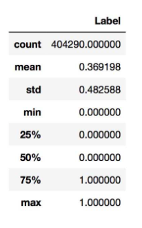
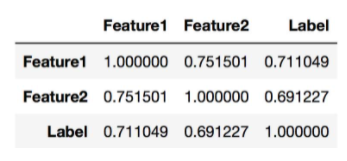
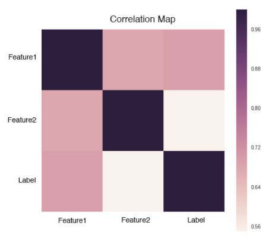
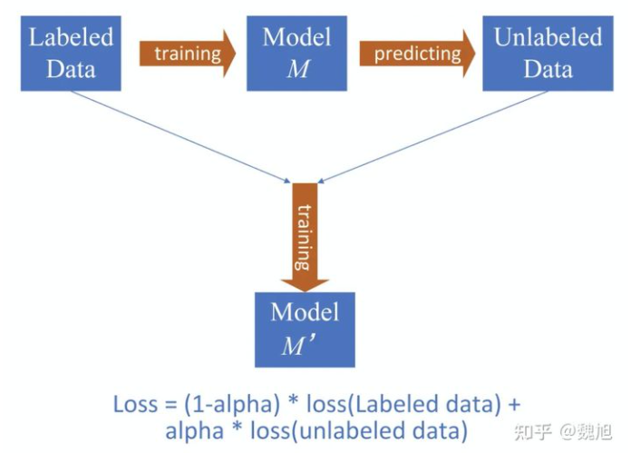

# 【关于 NLP 比赛 trick】那些你不知道的事

> 作者：魏旭
>
> 原文地址：https://zhuanlan.zhihu.com/p/371198818
> 
> 论文学习项目地址：https://github.com/km1994/nlp_paper_study
> 
> 《NLP 百面百搭》地址：https://github.com/km1994/NLP-Interview-Notes
> 
> 个人介绍：大佬们好，我叫杨夕，该项目主要是本人在研读顶会论文和复现经典论文过程中，所见、所思、所想、所闻，可能存在一些理解错误，希望大佬们多多指正。

## 【[NLP 竞赛经验总结-2021](https://zhuanlan.zhihu.com/p/371198818)】

> 经验来源： Blog阅读，小布助手竞赛，百科事件|关系抽取竞赛

- 目录：
  - 数据增强
  - 数据清洗
  - 对抗训练+混合精度
  - 多模型融合
  - 半监督训练

现在的NLP竞赛，基本都会使用BERT，各种体量的BERT确实效果会很好，建议使用HuggingFace的transformers包，调用和调试都很方便。

### 一、题目解读

### 二、数据分析(Data Exploration)

所谓数据挖掘，当然是要从数据中去挖掘我们想要的东西，我们需要通过人为地去分析数据，才可以发现数据中存在的问题和特征。我们需要在观察数据的过程中思考以下几个问题：

1. 数据应该怎么清洗和处理才是合理的？
2. 根据数据的类型可以挖掘怎样的特征？
3. 数据中的哪些特征会对标签的预测有帮助？

#### 2.1 统计分析

对于数值类变量(Numerical Variable)，我们可以得到min，max，mean，meduim，std等统计量，用pandas可以方便地完成，结果如下：

从上图中可以观察Label是否均衡，如果不均衡则需要进行over sample少数类，或者down sample多数类。我们还可以统计Numerical Variable之间的相关系数，用pandas就可以轻松获得相关系数矩阵：

#### 2.2 可视化

人是视觉动物，更容易接受图形化的表示，因此可以将一些统计信息通过图表的形式展示出来，方便我们观察和发现。比如用直方图展示问句的频数：

或者绘制相关系数矩阵:

### 三、数据预处理(Data Preprocessing)

刚拿到手的数据会出现噪声，缺失，脏乱等现象，我们需要对数据进行清洗与加工，从而方便进行后续的工作。针对不同类型的变量，会有不同的清洗和处理方法：

1. 对于数值型变量(Numerical Variable)，需要处理离群点，缺失值，异常值等情况。
2. 对于类别型变量(Categorical Variable)，可以转化为one-hot编码。
3. 文本数据是较难处理的数据类型，文本中会有垃圾字符，错别字(词)，数学公式，不统一单位和日期格式等。我们还需要处理标点符号，分词，去停用词，对于英文文本可能还要词性还原(lemmatize)，抽取词干(stem)等等。

### 四、数据增强

数据增强一直是提升算法效果最有效的武器，根据任务特征，构建不同的增强数据集，能有效提升模型效果。

这是一个NLP数据增强的github(https://github.com/makcedward/nlpaug)，不要每次提到数据增强，想到的都是简单的EDA。除了EDA，目前基于BERT等算法的数据增强，效果也十分出色，不仅仅是在工程应用中出色。此外，数据增强还需要根据任务特色和数据质量开动脑子，错误的数据增强方法不仅不能提高模型效果，反而适得其反。

这边也给出NLP数据增强的一些理论介绍，建议阅读（需翻墙）。

此外，通常对于增强的数据，需要给一个小于1的权重，区别于真实数据。数据增强也能很好的缓解数据不均衡的问题。

### 五、训练参数调整

如果模型设置是正确的，没有出现过拟合的情况，那么通常调节如下几个参数能提高模型精度。

- Epoch：模型训练轮数，让模型充分训练需要的，也有使用early stop的，同样的道理，但是epoch不宜过高，否- 则会对训练集过拟合。如果训练|测试数据集高度相似，可以设置高的Epoch。Epoch需要根据训练数据量，数据质量设置，一般5，7，12等，皆可。
- Batch Size： 越大越好，根据你的GPU，尽量完全充分的利用GPU。
- Max Sequence Length：文本的最大长度。需要统计数据的长度来设置，因为缩减了文本的最大长度，相当于对于单卡可以使用更大的Batch Size。

### 六、对抗训练+混合精度

#### 6.1 对抗训练

在比赛中，我们通常采用对抗训练缓解模型鲁棒性差的问题，提升模型鲁棒性和泛化能力。

对抗训练通过引入噪声来完成，和CV直接对像素点进行扰动不一样，在NLP中我们一般是通过一些embedding层添加微小扰动来进行对抗学习。根据添加的方法，一般我们使用Fast Gradient Method (FGM)和Projected Gradient Descent (PGD)。这是一篇介绍FGM 和 PGD的景点文章，也有代码实现。

其实在引入对抗训练后（无论是FGM，还是PGD），都会大大的增长模型训练的时长，其实也就是变相的降低了模型的训练效率，也会影响到模型训练结果。所以我们一般使用对抗训练的时候，会使用混合精度训练来提升训练效率。

#### 6.2 混合精度 -fp16

因为采用对抗训练会降低计算效率（GPU充足的大佬可以跳过），我们会采用混合精度训练优化训练耗时，同时也提升训练精度。

混合精度训练，会对数据使用FP16做存储和乘法来加速模型训练，同时使用FP32做累加避免舍入误差。当然，混合精度训练还有一些其他操作，主要思想是在训练过程中，利用尽量少的数据精度损失，提升数据训练效率。正好弥补对抗训练引入的训练效率的丢失，所以通常两者混合使用。当然，有充分GPU的土豪，可以不考虑。

### 七、多模型融合

模型验证(Validation)
在Test Data的标签未知的情况下，我们需要自己构造测试数据来验证模型的泛化能力，因此把Train Data分割成Train Set和Valid Set两部分，Train Set用于训练，Valid Set用于验证。

#### 7.1 简单分割

将Train Data按一定方法分成两份，比如随机取其中70%的数据作为Train Set，剩下30%作为Valid Set，每次都固定地用这两份数据分别训练模型和验证模型。这种做法的缺点很明显，它没有用到整个训练数据，所以验证效果会有偏差。通常只会在训练数据很多，模型训练速度较慢的时候使用。

#### 7.2 交叉验证

交叉验证是将整个训练数据随机分成K份，训练K个模型，每次取其中的K-1份作为Train Set，留出1份作为Valid Set，因此也叫做K-fold。至于这个K，你想取多少都可以，但一般选在3～10之间。我们可以用K个模型得分的mean和std，来评判模型得好坏（mean体现模型的能力，std体现模型是否容易过拟合），并且用K-fold的验证结果通常会比较可靠。

如果数据出现Label不均衡情况，可以使用Stratified K-fold，这样得到的Train Set和Test Set的Label比例是大致相同。

### 八、多模型融合

多模型融合可以算是一个放之四海而皆准的比赛准则，虽然多用于比赛，线上受限于预测时间，CPU|GPU并行化等因素而不好用。但比赛基本都用。

通常，差异化越大的模型，最终融合结果越好，使用log权重会让模型融合和效果更优。

### 九、半监督训练

思想很简单，用训练数据获得模型M，然后利用模型预测无监督数据得到模型打标的数据，然后再用 labeled data + model labeled data 进行混合数据的训练，获得新的模型M'。和增强数据一样，我们给model labeled data一个可训练(也可以按经验固定，我一般取0.5-0.8)的权重α，效果会更好！PS：图不是我画的，网上找的。

## 参考资料

1. [新手入门 Kaggle NLP类比赛总结](https://zhuanlan.zhihu.com/p/109992475)
2. [分分钟带你杀入Kaggle Top 1%](https://zhuanlan.zhihu.com/p/27424282)
3. [文本分类上分微调技巧实战](https://mp.weixin.qq.com/s/CDIeTz6ETpdQEzjdeBW93g)

