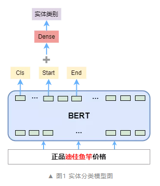
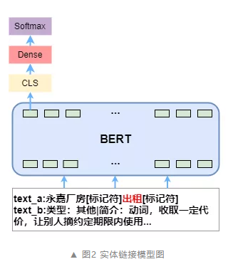
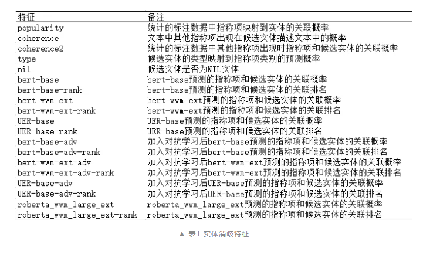
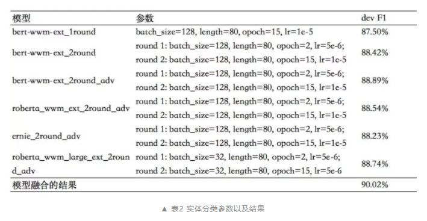
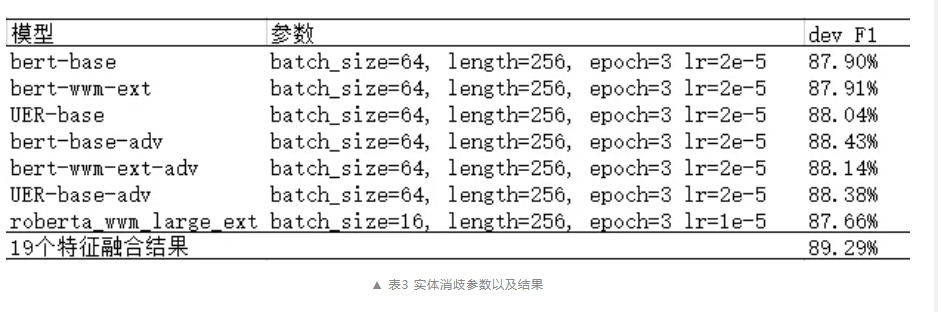

# 小米知识图谱团队CCKS 2020实体链指比赛冠军方案

- [小米知识图谱团队CCKS 2020实体链指比赛冠军方案](#小米知识图谱团队ccks-2020实体链指比赛冠军方案)
  - [一、方案简介](#一方案简介)
  - [二、方案具体介绍](#二方案具体介绍)
    - [2.1 指称项分类](#21-指称项分类)
    - [2.2 候选实体获取](#22-候选实体获取)
    - [2.3 实体消歧](#23-实体消歧)
      - [2.3.1 实体消歧思路](#231-实体消歧思路)
      - [2.3.2 多方位的特征因子抽取](#232-多方位的特征因子抽取)
      - [2.3.3 其他特征](#233-其他特征)
  - [三、比赛结果](#三比赛结果)
  - [四、 总结与讨论](#四-总结与讨论)
  - [参考](#参考)

## 一、方案简介

- 方法：设计的多因子融合实体链指模型
- 思路：

1. 首先采用了预训练的 BERT 来对短文本中的指称项进行类别预测，利用预测的类型构建一个 NIL 实体，和其他候选构成完备候选实体集；
2. 然后对每一个候选实体进行多方位的特征因子抽取，利用一个多层感知机将多个特征因子融合打分；
3. 最后根据每一个候选实体和文本的关联分数进行排序，选择分数最高的候选实体作为实体消歧预测结果。

## 二、方案具体介绍

### 2.1 指称项分类

- 思路：

1. 模型输入：输入数据文本，指称项的起始位置。经过 BERT 模型编码；
2. embedding 拼接：取 CLS 位置的特征向量、指称项开始和结束位置对应的特征向量，三个向量拼接；
3. 模型输出：经过全连接层，最后 Softmax 激活得到指称项的类别概率分布。



- 优化主要改进的点:

1. 二次训练：
   1. 动机：训练集合中非 NIL 部分的分类数据与 NIL 的分布不同，直接与 NIL 部分的数据一起训练会导致模型整体预测 NIL 实体的准确率下降，而直接用 NIL 部分的数据训练则有些训练数据较少的类会训练的不充分。
   2. 方法：采用二次训练的方法，第一次的时候使用了训练集中非 NIL 的部分，训练两个 Epoch，然后再在这个基础上去训练 NIL 部分。
2. 对抗学习：对抗训练是对抗防御的一种，它构造了一些对抗样本加入到原数据集中，希望增强模型对对抗样本的鲁棒性。我们在模型训练的时候加入了对抗学习，所使用的对抗学习方法是 Fast Gradient Method（FGM） [5]。
3. 模型融合：本次使用了 4 个 BERT 预训练模型。模型融合的方法是使用多折的方法训练了一个基于 MLP 的分类模型。

### 2.2 候选实体获取

- 思路：

1. 利用实体的 Alias 字段生成 Mention 和实体的映射表，实体的 Alias 的属性值即为该实体的 Mention，包含该 Mention 的所有实体组成候选实体集合。
2. 在候选实体获取时，从 Mention 和实体的映射表中，取出该 Mention 的候选实体集合，然后指称项的类别构成的 NIL 实体组成完备候选实体集。这样组成的完备候选实体集中，必有一个正确的实体和文本中的指称项关联。
3. 训练时，指称项的类别来自标注文本中 Kb_id 对应的实体类型，预测时，指称项的类别由 3.1 部分描述的指称项分类模块预测得到。
4. 对完备候选实体集中的实体属性进行拼接，处理成实体的描述文本。由于 Type 字段，义项描述和摘要字段的信息重要且占比较大，描述文本中都按照 Type、义项描述、摘要和 Data 中其他 Predicate、Object 对的顺序进行拼接。

> 举例说明：文本"永嘉厂房出租"中“出租”对应的候选实体 Id 和描述文本为

```s
    [
        [
            "211585", "类型：其他|简介：动词，收取一定的代价，让别人在约定期限内使用|外文名：rental|拼音：chū zū|解释：交纳租税|中文名：出租|举例：出租图书|日本語：レンタル|标签：非娱乐作品、娱乐作品、小说作品、语言、电影、字词"
        ], 
        [
            "304417", "类型：车辆|描述：辞源释义|简介：出租车，供人临时雇佣的汽车，多按里程或时间收费，也叫出租车|外文名：Taxi、 Cab、 Hackies|粤语：的士|台湾名：计程车|拼音：chūzūchē|中文名：出租车|新加坡名：德士|标签：交通工具、社会、生活"
        ], 
        [
            "NIL_Other", "类型：其他|描述：未知实体"
        ]
    ]
```

> 其中“211585”和“304417”为检索到的候选实体集合，NIL_Work 为生成的候选实体，一起组成了“出租”在该文本下的完备候选实体集。

### 2.3 实体消歧

- 问题定位：二分类问题

#### 2.3.1 实体消歧思路

1. 对每一个候选实体进行**多方位的特征因子抽取**，将这些特征因子利用一个多层感知机模型进行融合打分，预测每一个候选实体和指称项的关联分数；
2. 最后对这些分数进行排序，由于我们在候选实体获取阶段，构建的是完备候选实体集，那么必有一个正确候选实体，所以在排序后选择 Top1 即可作为指称项的关联实体。

#### 2.3.2 多方位的特征因子抽取

- 上下文相关特征：
  - 指称项和候选实体的关联概率计算【关键作用】
  - 多个指称项之间的关联概率计算
- 上下文无关特征：
  - 实体的流行度
  - 实体的类型

> **指称项和候选实体的关联概率和语义相似度计算的区别**在于需要指明文本中待消歧的指称项。我们利用标记符在文本中直接标记出指称项的位置，指明待消歧的指称项。输入文本和候选实体描述文本，在文本的指称项开始和结束位置添加标记符，经过 BERT 模型编码，取 CLS 位置的特征向量，经过全连接层，最后 Softmax 激活得到文本中指称项和候选实体之间的相关性。



#### 2.3.3 其他特征

在实体消歧模块也尝试加入对抗学习来提高模型的鲁棒性，其中对抗学习的方法是 FGM。不同的 BERT 预训练模型抽取的特征不同，为了丰富特征，本模块采用了 19 个特征因子来从不同方面刻画指称项和候选实体的相关性。



特征因子融合的方法是使用多折的方法训练了一个 MLP 的模型。将所有数据集分成 n 份，不重复地每次取其中一份做测试集，用其他四份做训练集训练模型，训练得到 n 个模型。预测时，取 n 个模型的预测结果的平均值，作为预测结果。

## 三、比赛结果

指称项分类模型训练中使用二次训练的方法 F1 提升了约 1%，使用对抗学习 F1 提升了约 0.5%，模型融合后在 Dev 数据上 F1 值达到了 90.02%。



实体消歧模型共抽取了 19 个特征因子，使用多折的方法训练了一个 MLP 的模型对这些特征因子进行融合，融合后在 Dev 数据上 F1 值达到了 89.29%。



## 四、 总结与讨论

本文对实体链指消歧做了一些探索。利用指称项类型预测，构建 NIL_type 实体，解决无链接指代预测问题，同时利用 BERT、对抗学习、特征融合等训练方法极大地提高了实体消歧的准确率，获得了比赛的第一名以及创新奖，相关论文已被 CCKS 2020 收录。 

比赛也为小米的后续研究指明了方向。比如当前方法没有充分利用其它指称项的侯选实体信息，对其他指称项信息的利用仅仅停留在名称层面。另外，可以利用一些特征，先对候选实体进行一次排序，选择排序前几的候选实体进行下一步的消歧，这样分层消歧在候选实体过多的情况下不仅可以提高准确率，还能提高消歧效率。


## 参考

1. [小米知识图谱团队斩获CCKS 2020实体链指比赛冠军](https://mp.weixin.qq.com/s/4s9j-u2607Uo9y3psPeFBg)
2. Ganea O E, Hofmann T. Deep joint entity disambiguation with local neural attention[J]. arXiv preprint arXiv:1704.04920, 2017.
3. Le P, Titov I. Improving entity linking by modeling latent relations between mentions[J]. arXiv preprint arXiv:1804.10637, 2018.
4. Raiman J, Raiman O. Deeptype: multilingual entity linking by neural type system evolution[J]. arXiv preprint arXiv:1802.01021, 2018.
5. Sil A, Kundu G, Florian R, et al. Neural cross-lingual entity linking[J]. arXiv preprint arXiv:1712.01813, 2017.
6. Goodfellow, Ian J, Shlens, Jonathon, and Szegedy, Christian. Explaining and harnessing adversarial examples.International Conference on Learning Representations(ICLR), 2015.

