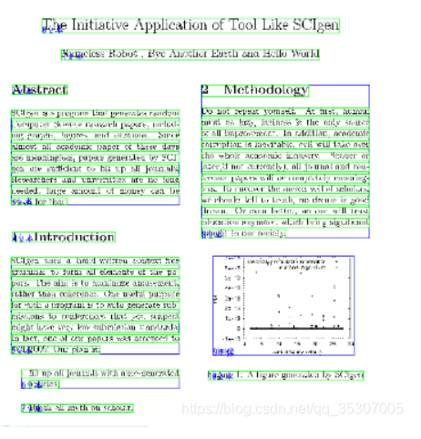
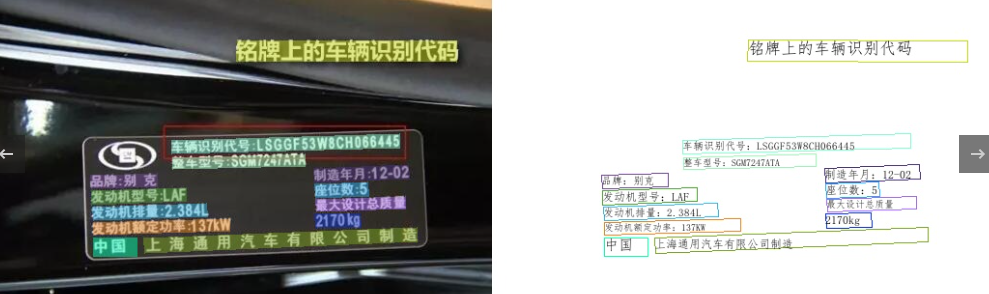
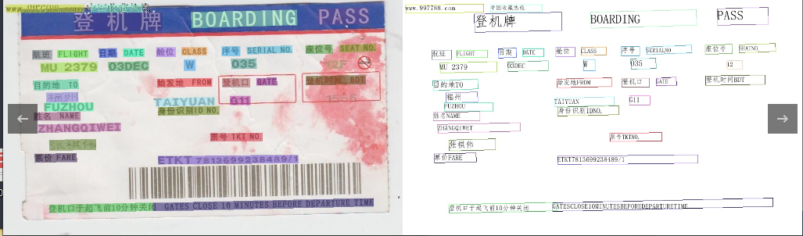
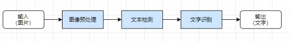
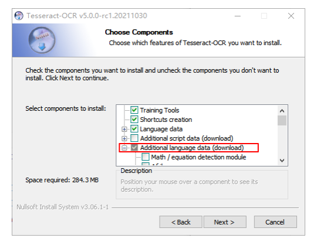
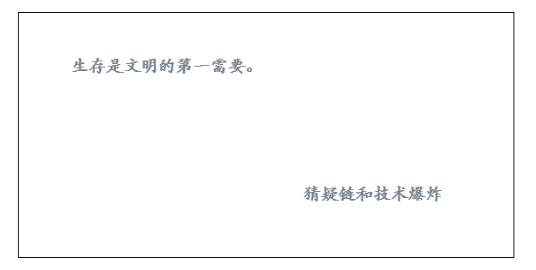
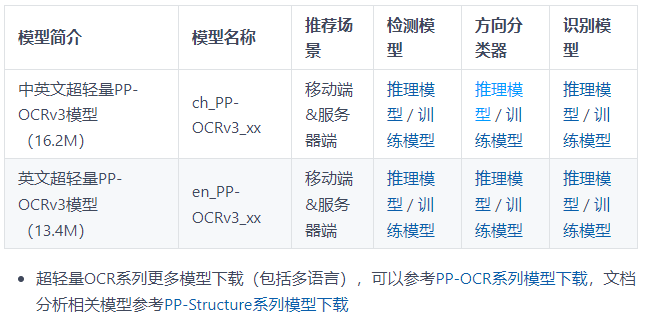
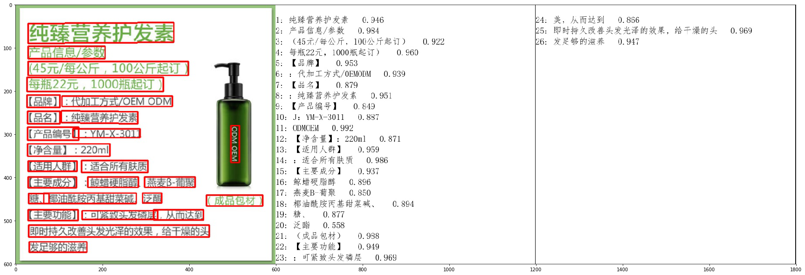

# 【关于 OCR 光学字符识别】 那些你不知道的事

> 作者：杨夕
> 
> 项目地址：https://github.com/km1994/nlp_paper_study
> 
> NLP 面经地址：https://github.com/km1994/NLP-Interview-Notes
> 
> 推荐系统 百面百搭：https://github.com/km1994/RES-Interview-Notes
> 
> 个人介绍：大佬们好，我叫杨夕，该项目主要是本人在研读顶会论文和复现经典论文过程中，所见、所思、所想、所闻，可能存在一些理解错误，希望大佬们多多指正。

## 一、什么是 OCR？

光学字符识别（Optical Character Recognition, OCR）是指对文本资料的图像文件进行分析识别处理，获取文字及版面信息的过程。亦即将图像中的文字进行识别，并以文本的形式返回。

OCR的分类:

1. 印刷体识别
  
- 介绍：印刷体大多都是规则的字体，这些字体都是计算机生成再通过打印技术印刷到纸上；
- 存在问题：在印刷过程中字体很有可能变得断裂或者墨水粘连，使得OCR识别异常困难



2. 手写体识别

- 介绍：人手写文字；
- 存在问题：因为人类手写的字往往带有个人特色，每个人写字的风格基本不一样，虽然人类可以读懂你写的文字，但是机器缺很难


## 二、OCR 应用场景？

OCR的应用场景 可以分为两种：

1. 识别特定场景的专用OCR
   1. 应用：证件识别、车牌识别


> 车辆识别代码


> 机票识别

2. 识别多种场景的通用OCR
   1. 应用：场景不固定；
   2. 难度：由于通用图片的场景不固定，文字布局多样，因此难度更高；

## 三、OCR 技术路线是怎么样？

OCR 技术路线 可以 分为以下 技术路线：



### 3.1 图像预处理

1. 动机：常见图片存在 文字布局多样，扭曲，模糊，光线不均和等问题，如果不做处理，直接使用，容易丢失大量有效信息，从而导致 识别效果低下；
2. 常用的图像预处理：几何变换（透视、扭曲、旋转等）、畸变校正、去除模糊、图像增强和光线校正等；
3. 采用的 图像预处理方法：
  
- 传统 OCR 图像预处理方法：
  - 介绍：基于数字图像处理和传统机器学习等方法对图像进行处理和特征提取；
  - 常用方法：HoG
  - 优点：有利于增强简单场景的文本信息；
  - 缺点：对于图像模糊、扭曲等问题鲁棒性很差，对于复杂场景泛化能力不佳；
- 基于 深度学习 OCR 图像预处理方法：
  - 介绍：使用基于深度学习的神经网络作为特征提取手段；
  - 常用方法：基于CNN的神经网络
  - 优点：CNN强大的学习能力，配合大量的数据可以增强特征提取的鲁棒性，面临模糊、扭曲、畸变、复杂背景和光线不清等图像问题均可以表现良好的鲁棒性；
  - 缺点：需要大量标注数据；

### 3.2 文字检测

1. 动机：常见的图片 不仅 包含 有用的文字，还存在 大量的背景信息，这些背景信息 对于 模型容易存在误导作用；
2. 介绍：文字检测即检测文本的所在位置和范围及其布局，即 识别哪里有文字，文字的范围有多大 等问题；
3. 采用的 图像预处理方法：Faster R-CNN、FCN、RRPN、TextBoxes、DMPNet、CTPN、SegLink 等；

### 3.3 文本识别

1. 动机：虽然 知道 图片中文字的具体位置，但是 如何知道这些文字是什么呢？
2. 介绍：在文本检测的基础上，对文本内容进行识别，将图像中的文本信息转化为文本信息；
3. 采用的 图像预处理方法：CNN+Softmax、CNN+RNN+CTC、CNN+RNN+Attention 等；
   
## 四、OCR 识别库 有哪些？

### 4.1 pytesseract

1. 介绍：pytesseract是基于Python的OCR工具， 底层使用的是Google的Tesseract-OCR 引擎，支持识别图片中的文字，支持jpeg, png, gif, bmp, tiff等图片格式。本文介绍如何使用pytesseract 实现图片文字识别。
2. 环境配置

- Python 3.6+
- PIL库
- 安装Google Tesseract OCR
- 系统：windows/mac/linux，我的系统是Windows10

3. 安装

- 安装Google Tesseract

> Tesseract 下载地址
```s
    Tesseract OCR github地址：https://github.com/tesseract-ocr/tesseract
    Windows Tesseract下载地址：https://digi.bib.uni-mannheim.de/tesseract/
    Mac和Linux安装方法参考：https://tesseract-ocr.github.io/tessdoc/Installation.html
```

> Tesseract 安装(记得下载 中文语言包)



> Tesseract 配置

安装完成后，添加到环境变量PATH中

> 测试 是否安装成功

```s
$ tesseract
Usage:
  tesseract --help | --help-extra | --version
  tesseract --list-langs
  tesseract imagename outputbase [options...] [configfile...]

OCR options:
  -l LANG[+LANG]        Specify language(s) used for OCR.
NOTE: These options must occur before any configfile.

Single options:
  --help                Show this help message.
  --help-extra          Show extra help for advanced users.
  --version             Show version information.
  --list-langs          List available languages for tesseract engine.
```

- 安装 pytesseract

> Tesseract 下载地址
```s
    Python tesseract：https://github.com/madmaze/pytesseract
```

> pip安装pytesseract
```s
    $pip install Pillow
    $pip install pytesseract
```

- pytesseract 使用

先准备一张包含英文字符的图片，下面的代码实现提取图片中的中文和英文字符，并识别为字符串：



```s
import pytesseract
try:
    from PIL import Image
except ImportError:
    import Image

# 列出支持的语言
print(pytesseract.get_languages(config=''))

print(pytesseract.image_to_string(Image.open('test.png'), lang='chi_sim+eng'))
>>>
生 63 211 80 227 0
存 81 209 118 227 0
是 122 211 139 226 0
文 126 200 154 231 0
明 142 210 157 226 0
的 162 209 197 227 0
第 200 217 218 219 0
一 221 209 236 226 0
需 217 200 253 231 0
要 239 209 259 226 0
。 260 211 266 216 0
猜 325 64 364 82 0
疑 364 64 481 82 0
链 373 54 393 86 0
和 383 54 403 86 0
技 403 54 435 86 0
术 419 54 451 86 0
爆 441 54 477 86 0
炸 469 54 485 86 0

##############################
level	page_num	block_num	par_num	line_num	word_num	left	top	width	height	conf	text
1	1	0	0	0	0	0	0	566	279	-1	
2	1	1	0	0	0	63	52	203	18	-1	
3	1	1	1	0	0	63	52	203	18	-1	
4	1	1	1	1	0	63	52	203	18	-1	
5	1	1	1	1	1	63	52	55	18	96	生存
5	1	1	1	1	2	122	53	17	15	96	是
5	1	1	1	1	3	126	48	31	31	96	文明
5	1	1	1	1	4	162	52	35	18	96	的
5	1	1	1	1	5	200	60	18	2	91	第
5	1	1	1	1	6	221	53	15	17	93	一
5	1	1	1	1	7	217	48	42	31	93	需要
5	1	1	1	1	8	260	63	6	5	91	。
2	1	2	0	0	0	325	197	156	18	-1	
3	1	2	1	0	0	325	197	156	18	-1	
4	1	2	1	1	0	325	197	156	18	-1	
5	1	2	1	1	1	325	197	156	18	94	猜疑
5	1	2	1	1	2	373	193	20	32	77	链
5	1	2	1	1	3	383	193	20	32	92	和
5	1	2	1	1	4	403	193	48	32	96	技术
5	1	2	1	1	5	441	193	44	32	94	爆炸
```

### 4.2 PaddleOCR

#### 4.2.1 PaddleOCR 介绍

PaddleOCR是百度开源的一款基于深度学习的ocr识别库，对中文的识别精度相当不错，可以应付绝大多数的文字提取需求。

#### 4.2.2 PaddleOCR 预训练权重 介绍

- 关于预训练权重，PaddleOCR 官网根据提供权重文件大小分为两类：
  - 一类为轻量级，（检测+分类+识别）三类权重加起来大小一共才 9.4 M，适用于手机端和服务器部署；
  - 另一类（检测+分类+识别）三类权重内存加起来一共 143.4 MB ，适用于服务器部署；
无论模型是否轻量级，识别效果都能与商业效果相比，在本期教程中将选用轻量级权重用于测试；



#### 4.2.3 PaddleOCR 环境介绍

```s
    PaddlePaddle 2.0.0
    Python 3.7
    glibc 2.23
    cuDNN 7.6+(GPU)
```

#### 4.2.4 PaddleOCR 使用

1. 新建环境

```s
    $ conda create -n paddle38 python=3.8
```

2. 安装paddlepaddle-gpu

```s
    $ pip install paddlepaddle-gpu
```

3. PaddleOCR 使用

```s
import os
import csv
import time
from paddleocr import PaddleOCR, draw_ocr
 
# Paddleocr目前支持中英文、英文、法语、德语、韩语、日语，可以通过修改lang参数进行切换
# 参数依次为`ch`, `en`, `french`, `german`, `korean`, `japan`。
ocr = PaddleOCR(use_angle_cls=True, use_gpu=True, lang="ch")  # need to run only once to download and load model into memory
# 选择你要识别的图片路径
def test_ocr(img_path):
    result = ocr.ocr(img_path, cls=True)
    OCR_result = []
    for line in result:
        OCR_result.append(line[1][0])
    res = ' '.join(OCR_result)
    print(res)
    return res
 
if __name__ == '__main__':
    """
    读取filepath下的所有jpg文件，图片识别之后存入save_file中，加上识别每张图片的时间
    """
    save_file = 'result_1223.csv'
    filePath = 'pics/'
    paths = os.listdir(filePath)
    with open(save_file, 'w', encoding='utf-8',newline='') as save_f:
        writer = csv.writer(save_f)
        # 先写入columns_name
        writer.writerow(["url", "paddle_ocr", "ocr_time"])
        for i in paths:
            a = time.time()
            img_path = f'{filePath}{i}'
            baidu_res = test_ocr(img_path)
            b1 = time.time() - a
            line = [i, baidu_res, b1]
            # 写入多行用writerows
            writer.writerow(line)
```

4. PaddleOCR 识别结果



#### 4.2.5 PaddleOCR 安装过程中问题列表

1. 问题一：Microsoft Visual C++ 14.0 is required. Get it with "Microsoft Visual C++ Build Tools": http://landinghub.visualstudio.com/visual-cpp-build-tools

- 问题介绍

```s
    error: Microsoft Visual C++ 14.0 is required. Get it with "Microsoft Visual C++ Build Tools": http://landinghub.visualstudio.com/visual-cpp-build-tools
```

- 【解决】：python_Levenshtein‑0.12.0‑cp36‑cp36m‑win_amd64.whl

下载地址：https://www.lfd.uci.edu/~gohlke/pythonlibs/

```s
    pip install C:\Users\IMMOTOR\Desktop\python_Levenshtein-0.12.0-cp36-cp36m-win_amd64.whl
```

2. 问题二：Could not find a version that satisfies the requirement fasttext==0.9.1 (from paddleocr) (from versions: )No matching distribution found for fasttext==0.9.1 (from paddleocr)

```s
Could not find a version that satisfies the requirement fasttext==0.9.1 (from paddleocr) (from versions: )No matching distribution found for fasttext==0.9.1 (from paddleocr)
```

- 【解决】：安装之，pip install fasttext==0.9.1

3. 问题三：升级jinja2:

```s
pip install Jinja2 --upgrade
```

4. 问题四：No module named 'paddle'

```s
    ModuleNotFoundError: No module named 'paddle'
```

- 【解决】：python -m pip install paddlepaddle -i https://mirror.baidu.com/pypi/simple

5. 问题五：xlrd.biffh.XLRDError: Excel xlsx file

```s
    pip uninstall xlrd
    pip install xlrd==1.2.0
```

5. 问题五：paddleOCR识别速度过慢

python paddleocr 增加识别速度的方法

切记长度不要超过960px

- 【解决】：

> 模型压缩 enable_mkldnn=True,use_tensorrt=True,use_angle_cls=False
```s
    ocr = PaddleOCR(enable_mkldnn=True,use_tensorrt=True,use_angle_cls=False,use_gpu= False)
    text=ocr.ocr(img_name) #打开图片文件
```

## 参考

1. [OCR技术简介](https://zhuanlan.zhihu.com/p/45376274)
2. [【OCR技术系列一】光学字符识别技术介绍](https://cloud.tencent.com/developer/article/1182633)
3. [适合小白的几个入门级Python ocr识别库](https://blog.csdn.net/qq_38017966/article/details/118724459)
4. [Python OCR工具pytesseract详解](https://blog.csdn.net/u010698107/article/details/121736386)
5. [PaddleOCR](https://gitee.com/paddlepaddle/PaddleOCR)
6. [PaddleOCR详解](https://www.cnblogs.com/xiaoxia722/p/14627482.html)
7. [十分钟掌握PaddleOCR使用](https://aistudio.baidu.com/aistudio/projectdetail/467229)