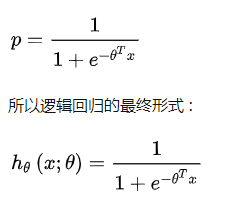

# LR vs GBDT

## 目录

- [LR vs GBDT](#lr-vs-gbdt)
  - [目录](#目录)
  - [从机器学习三要素的角度](#从机器学习三要素的角度)
    - [从模型角度](#从模型角度)
    - [从策略角度](#从策略角度)
      - [从 Loss 角度](#从-loss-角度)
      - [从 特征空间 角度](#从-特征空间-角度)
      - [从 正则 角度](#从-正则-角度)
    - [算法](#算法)
  - [从特征的角度](#从特征的角度)
    - [特征组合](#特征组合)
    - [特特征的稀疏性](#特特征的稀疏性)
  - [数据假设不同](#数据假设不同)
    - [LR](#lr)
    - [GBDT](#gbdt)
  - [参考](#参考)

## 从机器学习三要素的角度

### 从模型角度

- 相同点：
  - 监督学习；
  - 判别模型；
  - 直接对数据的分布建模；
  - 不尝试挖掘隐含变量；
- 不同点：
  - Logistic Regression：
    - 线性模型；
    - 分类器：线性分类器；
    - VC 维度： d+1;
  - GBDT:
    - 非线性模型;
    - boosting 模型，可以无限分类，具有无限逼近样本 VC 维的特点；
    - VC 维度：远远大于 d+1；

### 从策略角度

 Loss(经验风险最小化) + 正则(结构风险最小化) 

#### 从 Loss 角度

- Logistic Regression：
  - 输出： y = 1 的概率；
  - Loss 损失函数：交叉熵；
  - 准则：最大熵原理，“为了追求最小分类误差，追求最大熵 Loss”;
  - 本质：分类器算法，而且对数据的噪声具有高斯假设；
- GBDT：
  - 基分类器：CART，其无论是处理分类还是回归均是将采用回归拟合（将分类问题通过 softmax 转换为回归问题），用当前轮 CART 树拟合前一轮目标函数与实际值的负梯度 ht = -g;
  - 本质：回归算法；

> 也正是因为 GBDT 采用的 CART 树模型作为基分类器进行负梯度拟合，其是一种对特征样本空间进行划分的策略，不能使用 SGD 等梯度优化算法，而是 CART 树自身的节点分裂策略：均方差(回归) 也带来了算法上的不同； GBDT 损失函数值得是前一轮拟合模型与实际值的差异，而树节点内部分裂的特征选择则是固定为 CART 的均方差，目标损失函数可以自定义，当前轮 CART 树旨在拟合负梯度。

#### 从 特征空间 角度

- Logistic Regression：
  - 特征的线性组合求交叉熵的最小化，也就是对特征的线性组合做 logistic，使得Logistic Regression会在特征空间中做线性分界面，适用于分类任务；
- GBDT:
  - 采用 CART 树作为基分类器，其每轮树的特征拟合都是对特征空间做平行于坐标轴的空间分割，所以自带特征选择和可解释性，GBDT 即可处理分类问题也可解决回归问题，只是其统一采用回归思路进行求解（试想，如果不将分类转换为回归问题，GBDT 每轮目标函数旨在拟合上一轮组合模型的负梯度，分类信息无法求梯度，故而依旧是采用 softmax 转换为回归问题进行求解）;

- 相关知识
  - 线性分类器：
    - 感知器准则函数：
      - 原理：以使错分类样本到分界面距离之和最小为原则；
      - 优点：通过错分类样本提供的信息对分类器函数进行修正，这种准则是人工神经元网络多层感知器的基础；
    - SVM：
      - 基本思想：在两类线性可分条件下，所设计的分类器界面使两类之间的间隔为最大；
      - 基本出发点：使期望泛化风险尽可能小。（使用核函数可解决非线性问题）
    - Fisher 准则【线性判别分析（LDA）】：
      - 介绍：将所有样本投影到一条原点出发的直线，使得同类样本距离尽可能小，不同类样本距离尽可能大，具体为最大化“广义瑞利商”；
      - 特点：两类样本一般类内密集，类间分离；
      - 方式：寻找线性分类器最佳的法线向量方向，使两类样本在该方向上的投影满足类内尽可能密集，类间尽可能分开。这种度量通过类内离散矩阵 Sw 和类间离散矩阵 Sb 实现。

#### 从 正则 角度

- Logistic Regression：
  - 方式：采用一种约束参数稀疏的方式；  
    - L2 正则整体约束权重系数的均方和，使得权重分布更均匀；
    - L1 正则则是约束权重系数绝对值和，其自带特征选择特性；  - 
- GBDT:
  - 弱算法的个数T，就是迭代T轮。T的大小就影响着算法的复杂度;
  - 步长（Shrinkage）在每一轮迭代中，原来采用 $Ft(x) = F_{t-1}(x) + \alpha_{t}h_{t}(x;wt)$ 进行更新，可以加入步长v，使得一次不更新那么多：

- 区别：
  -  LR 采用对特征系数进行整体的限定；
  - GBDT 采用迭代的误差控制本轮参数的增长；

> XGBoost的正则是在 GBDT 的基础上又添加了是一棵树里面节点的个数，以及每个树叶子节点上面输出分数的 L2 模平方。

### 算法

- Logistic Regression 
  - 若采用 SGB, Momentum, SGD with Nesterov Acceleration 等算法，只用到了一阶导数信息，
  - 若用 AdaGrad, AdaDelta / RMSProp, Adam, Nadam, 牛顿法则用到了二阶导数信息，
- GBDT 直接拟合上一轮组合函数的特梯度，只用到了一阶倒数信息，XGBoost 则是用到了二阶导数信息。

## 从特征的角度

###  特征组合

-  LR 特征选择方法：不具有特征组合的能力，只是一次性地寻求最大化熵的过程，对每一维的特征都假设独立，因此只具备对已有特征空间进行分割的能力，更不会对特征空间进行升维（特征组合）
- GBDT 特征选择方法：采用最小化均方损失来寻找分裂特征及对应分裂点，所以自动会在当前根据特征 A 分裂的子树下寻求其他能使负梯度最小的其他特征 B，这样就自动具备寻求好的特征组合的性能，因此也能给出哪些特征比较重要（根据该特征被选作分裂特征的次数）。

###  特特征的稀疏性

- Logistic Regression不具有特征组合的能力，并假设特征各个维度独立，因此只具有线性分界面，实际应用中，多数特征之间有相关性，只有维度特别大的稀疏数据中特征才会近似独立，所以适合应用在特征稀疏的数据上；
- GBDT：其更适合处理稠密特征，如 GBDT+LR 的Facebook论文中，对于连续型特征导入 GBDT 做特征组合来代替一部分手工特征工程，而对于 ID 类特征的做法往往是 one-hot 之后直接传入 LR，或者先 hash，再 one-hot 传入树中进行特征工程，而目前的主流做法是直接 one-hot + embedding 来将高维稀疏特征压缩为低纬稠密特征，也进一步引入了语意信息，有利于特征的表达。

## 数据假设不同

### LR

- 第一个假设：假设数据服从伯努利分布。

伯努利分布有一个简单的例子是抛硬币，抛中为正面的概率是 p,抛中为负面的概率是 1−p。在逻辑回归这个模型里面是假设 $h_{theta}$ 为样本为正的概率， $1-h_{theta}$ 为样本为负的概率。那么整个模型可以描述为:

- 第二个假设：假设样本为正的概率是 :

- 第三个假设：噪声是高斯分布的

### GBDT

未对数据做出上述假设。

## 参考

1. [GBDT 与 LR 区别总结](https://zhuanlan.zhihu.com/p/60952744)
