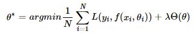
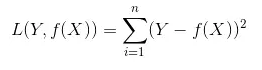
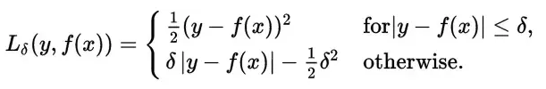
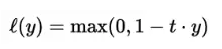
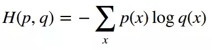
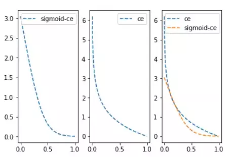

# 【关于 Tensorflow 损失函数】 那些你不知道的事

> 作者：杨夕
> 
> 项目地址：https://github.com/km1994/nlp_paper_study
> 
> 个人介绍：大佬们好，我叫杨夕，该项目主要是本人在研读顶会论文和复现经典论文过程中，所见、所思、所想、所闻，可能存在一些理解错误，希望大佬们多多指正。

## 目录


## 一、动机

在 机器学习训练过程中，需要 计算模型的预测值和真实值之间的 差距，以衡量 模型的训练效果。 所以就有了 损失函数 (loss function)。

## 二、什么是损失函数？

在 机器学习训练过程中，loss function（损失函数）也称 cost function（代价函数）

- 作用：用来计算预测值和真实值的差距，然后以loss function的最小值作为目标函数进行反向传播迭代计算模型中的参数，这个让loss function的值不断变小的过程称为优化。

## 三、目标函数、损失函数、代价函数之间的关系与区别？

- 关系：损失函数(loss funciton)<代价函数(cost function)<目标函数(object function)
- 差别：
  - 损失函数(loss funciton): 单体，针对**单个训练样本**而言的, 也就是算一个样本的误差；
  - 代价函数(cost function): 总体，定义在**整个训练集**上的, 就是所有训练样本误差总和的平均, 也就是损失函数总和的平均；
  - 目标函数(object function): 更泛化的术语，您在训练期间优化的任何功能的最笼统的术语，机器学习的每个算法中都会有一个目标函数, 算法的求解过程是通过对这个目标函数优化的过程

## 四、损失函数的类别

- 类别：
  - 经验风险损失函数：预测结果和实际结果的差别；
  - 结构风险损失函数：经验风险损失函数加上正则项
- 举例介绍：
> 对于 N 个样本的样本集为 (X,Y) = (xi,yi) ，则损失函数为：



> 注：
> 前面的均值项表示经验风险函数，$L$表示损失函数；
> 后面的是正则化项(regularizer)或者惩罚项(penalty term), yi,i∈[1,N]为样本$i$的真实值，f(xi),i∈[1,N]为样本i的预测值， f()为分类或者回归函数。λ为正则项超参数, 常用的正则化方法包括：L1正则和L2正则

### 4.1 回归模型的损失函数

- 目标：预测连续因变量
- 定义预测结果（-1至1的等差序列）、目标结果（目标值为0），代码如下：

```s
    import tensorflow as tf
    sess=tf.Session()
    y_pred=tf.linspace(-1., 1., 100)
    y_target=tf.constant(0.)
```

#### （1）L1正则损失函数（即绝对值损失函数）

- 介绍：对预测值与目标值的差值求绝对值
- 公式如下：


- 代码

```s
    loss_l1_vals=tf.abs(y_pred-y_target)
    loss_l1_out=sess.run(loss_l1_vals)
    >>>
    array([1.        , 0.97979796, 0.959596  , 0.93939394, 0.9191919 ,
       0.8989899 , 0.8787879 , 0.85858583, 0.83838385, 0.8181818 ,
       0.79797983, 0.7777778 , 0.75757575, 0.7373737 , 0.7171717 ,
       0.6969697 , 0.6767677 , 0.65656567, 0.6363636 , 0.6161616 ,
       0.5959596 , 0.57575756, 0.5555556 , 0.53535354, 0.5151515 ,
       0.49494952, 0.47474748, 0.45454544, 0.43434346, 0.41414142,
       0.39393938, 0.3737374 , 0.35353535, 0.3333333 , 0.31313133,
       0.2929293 , 0.27272725, 0.25252527, 0.23232323, 0.21212119,
       0.19191921, 0.17171717, 0.15151513, 0.13131315, 0.1111111 ,
       0.09090906, 0.07070708, 0.05050504, 0.030303  , 0.01010102,
       0.01010096, 0.030303  , 0.05050504, 0.07070708, 0.09090912,
       0.11111116, 0.13131309, 0.15151513, 0.17171717, 0.19191921,
       0.21212125, 0.23232329, 0.2525252 , 0.27272725, 0.2929293 ,
       0.31313133, 0.33333337, 0.3535353 , 0.37373734, 0.39393938,
       0.41414142, 0.43434346, 0.4545455 , 0.47474742, 0.49494946,
       0.5151515 , 0.53535354, 0.5555556 , 0.5757576 , 0.59595954,
       0.6161616 , 0.6363636 , 0.65656567, 0.6767677 , 0.69696975,
       0.71717167, 0.7373737 , 0.75757575, 0.7777778 , 0.79797983,
       0.8181819 , 0.8383838 , 0.85858583, 0.8787879 , 0.8989899 ,
       0.91919196, 0.939394  , 0.9595959 , 0.97979796, 1.        ],
      dtype=float32)
```
- 问题：L1正则损失函数在目标值附近不平滑，会导致模型不能很好地收敛。

#### （2）L2正则损失函数（即欧拉损失函数）

- 介绍：预测值与目标值差值的平方和；
- 公式如下：



- 代码：

```s
    loss_l2_vals=tf.square(y_pred - y_target)
    loss_l2_out=sess.run(loss_l2_vals)
    >>>
    array([1.00000000e+00, 9.60004032e-01, 9.20824468e-01, 8.82460952e-01,
       8.44913721e-01, 8.08182895e-01, 7.72268116e-01, 7.37169623e-01,
       7.02887475e-01, 6.69421494e-01, 6.36771798e-01, 6.04938269e-01,
       5.73921025e-01, 5.43720007e-01, 5.14335275e-01, 4.85766739e-01,
       4.58014518e-01, 4.31078464e-01, 4.04958665e-01, 3.79655093e-01,
       3.55167836e-01, 3.31496775e-01, 3.08642000e-01, 2.86603421e-01,
       2.65381068e-01, 2.44975030e-01, 2.25385174e-01, 2.06611559e-01,
       1.88654244e-01, 1.71513110e-01, 1.55188233e-01, 1.39679641e-01,
       1.24987245e-01, 1.11111097e-01, 9.80512276e-02, 8.58075693e-02,
       7.43801519e-02, 6.37690127e-02, 5.39740846e-02, 4.49953973e-02,
       3.68329808e-02, 2.94867847e-02, 2.29568332e-02, 1.72431413e-02,
       1.23456772e-02, 8.26445781e-03, 4.99949139e-03, 2.55075935e-03,
       9.18271893e-04, 1.02030615e-04, 1.02029408e-04, 9.18271893e-04,
       2.55075935e-03, 4.99949139e-03, 8.26446898e-03, 1.23456912e-02,
       1.72431264e-02, 2.29568332e-02, 2.94867847e-02, 3.68329808e-02,
       4.49954234e-02, 5.39741106e-02, 6.37689829e-02, 7.43801519e-02,
       8.58075693e-02, 9.80512276e-02, 1.11111134e-01, 1.24987207e-01,
       1.39679596e-01, 1.55188233e-01, 1.71513110e-01, 1.88654244e-01,
       2.06611603e-01, 2.25385115e-01, 2.44974971e-01, 2.65381068e-01,
       2.86603421e-01, 3.08642000e-01, 3.31496835e-01, 3.55167776e-01,
       3.79655093e-01, 4.04958665e-01, 4.31078464e-01, 4.58014518e-01,
       4.85766828e-01, 5.14335215e-01, 5.43720007e-01, 5.73921025e-01,
       6.04938269e-01, 6.36771798e-01, 6.69421554e-01, 7.02887356e-01,
       7.37169623e-01, 7.72268116e-01, 8.08182895e-01, 8.44913840e-01,
       8.82461071e-01, 9.20824349e-01, 9.60004032e-01, 1.00000000e+00],
      dtype=float32)
```

#### （3）均方误差（MSE, mean squared error）

- 介绍：对L2取平均值；
- 公式如下：


- 代码：

```s
    loss_mse_vals= tf.reduce.mean(tf.square(y_pred - y_target))
    loss_mse_out = sess.run(loss_mse_vals)
```
- 优点：L2正则损失函数在目标值附近有很好的曲度，离目标越近收敛越慢，是非常有用的损失函数。

#### （4）Pseudo-Huber 损失函数

- 介绍：用于回归问题，它是分段函数
- 公式：



> 从这个公式可以看出当残差（预测值与目标值的差值，即y-f(x) ）很小的时候，损失函数为L2范数，残差大的时候，为L1范数的线性函数

### 4.2 分类模型的损失函数

- 目标：用于评估预测分类结果，重新定义预测值（-3至5的等差序列）和目标值（目标值为1）

#### （1）Hinge损失函数

- 常用于二分类问题，主要用来评估向量机算法，但有时也用来评估神经网络算法
- 公式如下：



- 代码

```s
    loss_hinge_vals = tf.maximum(0., 1. -tf.mul(y_target, y_pred))
    loss_hinge_out = sess.run(loss_hinge_vals)
```

#### （2）两类交叉熵（Cross-entropy）损失函数

- 介绍：来自于信息论，是分类问题中使用广泛的损失函数。交叉熵刻画了两个概率分布之间的距离，当两个概率分布越接近时，它们的交叉熵也就越小，给定两个概率分布p和q
- 公式



#### （3）Sigmoid交叉熵损失函数

- 介绍：与上面的两类交叉熵类似，只是将预测值y_pred值通过sigmoid函数进行转换，再计算交叉熵损失
- 代码

```s
    loss_sce_vals=tf.nn.sigmoid_cross_entropy_with_logits(labels=y_pred, logits=y_targets)
    loss_sce_out=sess.run(loss_sce_vals)
    loss_sce_out
    >>>
    array([ 4.3132615 ,  4.2324533 ,  4.1516457 ,  4.0708375 ,  3.9900293 ,
        3.9092214 ,  3.8284132 ,  3.747605  ,  3.6667972 ,  3.585989  ,
        3.505181  ,  3.424373  ,  3.3435647 ,  3.2627566 ,  3.1819487 ,
        3.1011405 ,  3.0203326 ,  2.9395244 ,  2.8587162 ,  2.777908  ,
        2.6971002 ,  2.616292  ,  2.535484  ,  2.454676  ,  2.3738678 ,
        2.2930598 ,  2.2122517 ,  2.1314435 ,  2.0506356 ,  1.9698274 ,
        1.8890193 ,  1.8082113 ,  1.7274032 ,  1.646595  ,  1.5657871 ,
        1.4849789 ,  1.4041708 ,  1.3233628 ,  1.2425547 ,  1.1617465 ,
        1.0809386 ,  1.0001304 ,  0.91932225,  0.8385143 ,  0.75770617,
        0.676898  ,  0.5960901 ,  0.5152819 ,  0.43447372,  0.3536658 ,
        0.27285787,  0.19204971,  0.11124155,  0.03043339, -0.05037478,
       -0.13118294, -0.21199062, -0.2927988 , -0.37360695, -0.4544151 ,
       -0.53522325, -0.6160314 , -0.6968391 , -0.77764726, -0.8584554 ,
       -0.9392636 , -1.0200717 , -1.1008794 , -1.1816876 , -1.2624958 ,
       -1.3433039 , -1.4241121 , -1.5049202 , -1.5857279 , -1.6665361 ,
       -1.7473443 , -1.8281524 , -1.9089606 , -1.9897687 , -2.0705764 ,
       -2.1513846 , -2.2321928 , -2.313001  , -2.393809  , -2.4746172 ,
       -2.555425  , -2.636233  , -2.7170413 , -2.7978494 , -2.8786576 ,
       -2.9594657 , -3.0402734 , -3.1210816 , -3.2018898 , -3.282698  ,
       -3.363506  , -3.4443142 , -3.525122  , -3.60593   , -3.6867383 ],
      dtype=float32)

```

- 解释：由于sigmoid函数会将输入值变小很多，从而平滑了预测值，使得sigmoid交叉熵在预测值离目标值比较远时，其损失的增长没有那么的陡峭。与两类交叉熵的比较图如下：



#### （4）加权交叉熵损失函数

- 介绍：Sigmoid交叉熵损失函数的加权，是对正目标的加权。
- 代码：

```s
    weight = tf.constant(0.5)
    loss_wce_vals = tf.nn.weighted_cross_entropy_with_logits(y_pred, y_targets, weight)
    loss_wce_out = sess.run(loss_wce_vals)
    >>>
    array([ 4.7831545 ,  4.689689  ,  4.5962243 ,  4.502759  ,  4.4092937 ,
        4.315829  ,  4.2223635 ,  4.128898  ,  4.0354333 ,  3.9419682 ,
        3.848503  ,  3.755038  ,  3.661573  ,  3.5681076 ,  3.4746428 ,
        3.3811774 ,  3.2877126 ,  3.1942472 ,  3.1007822 ,  3.0073168 ,
        2.913852  ,  2.8203866 ,  2.7269218 ,  2.6334565 ,  2.5399914 ,
        2.4465265 ,  2.3530612 ,  2.2595959 ,  2.166131  ,  2.072666  ,
        1.9792006 ,  1.8857356 ,  1.7922704 ,  1.6988052 ,  1.6053402 ,
        1.5118752 ,  1.4184098 ,  1.324945  ,  1.2314798 ,  1.1380146 ,
        1.0445496 ,  0.9510844 ,  0.85761917,  0.7641542 ,  0.670689  ,
        0.5772238 ,  0.48375884,  0.3902936 ,  0.2968284 ,  0.20336346,
        0.10989852,  0.01643331, -0.0770319 , -0.17049712, -0.26396233,
       -0.35742754, -0.4508922 , -0.5443574 , -0.6378226 , -0.73128784,
       -0.82475305, -0.91821826, -1.011683  , -1.1051482 , -1.1986134 ,
       -1.2920786 , -1.3855438 , -1.4790084 , -1.5724736 , -1.6659389 ,
       -1.7594041 , -1.8528693 , -1.9463346 , -2.0397992 , -2.1332645 ,
       -2.2267296 , -2.3201947 , -2.41366   , -2.5071254 , -2.60059   ,
       -2.694055  , -2.7875204 , -2.8809855 , -2.9744508 , -3.067916  ,
       -3.1613808 , -3.2548459 , -3.3483112 , -3.4417763 , -3.5352416 ,
       -3.6287067 , -3.7221713 , -3.8156366 , -3.909102  , -4.0025673 ,
       -4.096032  , -4.1894975 , -4.2829623 , -4.376427  , -4.4698925 ],
      dtype=float32)
```

#### （5）Softmax交叉熵损失函数

- 介绍：作用于非归一化的输出结果，只针对单个目标分类计算损失。通过softmax函数将输出结果转化成概率分布，从而便于输入到交叉熵里面进行计算（交叉熵要求输入为概率）
- softmax定义如下：


- 结合前面的交叉熵定义公式，则Softmax交叉熵损失函数公式如下：


- 代码

```s
    y_pred=tf.constant([[1., -3., 10.]])
    y_target=tf.constant([[0.1, 0.02, 0.88]])
    loss_sce_vals=tf.nn.softmax_cross_entropy_with_logits(labels=y_pred, logits=y_target)
    loss_sce_out=sess.run(loss_sce_vals)
```

#### (6) SparseCategoricalCrossentropy vs sparse_categorical_crossentropy

- 共同点：将数字编码转化为 one-hot 编码 格式，然后 对 one-hot 编码格式数据 （真实标签值）与预测出的标签值使用交叉熵损失函数
- 区别：
  - 定义
    - tf.keras.losses.SparseCategoricalCrossentropy (from_logits=False, reduction=losses_utils.ReductionV2.AUTO, name='sparse_categorical_crossentropy')
    - tf.keras.losses.sparse_categorical_crossentropy(y_true, y_pred, from_logits=False, axis=-1)

- 代码

```s
import tensorflow as tf
import numpy as np
init = tf.global_variables_initializer()
sess=tf.Session()
sess.run(init)
y_true = tf.constant([1, 2])
y_pred = tf.constant([[0.05, 0.95, 0], [0.1, 0.8, 0.1]])
loss = tf.reduce_mean(tf.keras.losses.sparse_categorical_crossentropy(y_true, y_pred))
scce = tf.keras.losses.SparseCategoricalCrossentropy()

```

## 五、总结


- 在实际使用中
  - 对于回归问题经常会使用MSE均方误差（L2取平均）计算损失
  - 对于分类问题经常会使用Sigmoid交叉熵损失函数。


## 参考

1. [【AI实战】快速掌握TensorFlow（四）：损失函数](https://my.oschina.net/u/876354/blog/1940819)
2. [常见的损失函数(loss function)总结](https://zhuanlan.zhihu.com/p/58883095)