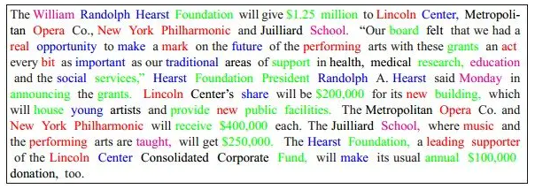
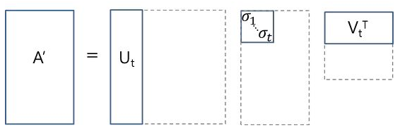
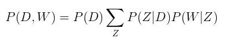

# 主题模型串串烧

> 作者：杨夕
> 
> github: https://github.com/km1994/nlp_paper_study

## 前言

主题模型在机器学习和自然语言处理等领域是用来在一系列文档中发现抽象主题的一种统计模型。直观来讲，如果一篇文章有一个中心思想，那么一些特定词语会更频繁的出现。比方说，如果一篇文章是在讲狗的，那「狗」和「骨头」等词出现的频率会高些。如果一篇文章是在讲猫的，那「猫」和「鱼」等词出现的频率会高些。而有些词例如「这个」、「和」大概在两篇文章中出现的频率会大致相等。但真实的情况是，一篇文章通常包含多种主题，而且每个主题所占比例各不相同。因此，如果一篇文章 10% 和猫有关，90% 和狗有关，那么和狗相关的关键字出现的次数大概会是和猫相关的关键字出现次数的 9 倍。一个主题模型试图用数学框架来体现文档的这种特点。主题模型自动分析每个文档，统计文档内的词语，根据统计的信息来断定当前文档含有哪些主题，以及每个主题所占的比例各为多少。主题模型最初是运用于自然语言处理相关方向，但目前已经延伸至生物信息学等其它领域。

## 介绍

- 主题模型所基于的假设
  - 每个文档包含多个主题；
  - 每个主题包含多个单词；
- 动机：
  - 对于一篇 文档，其语义一般 是由 文档中 一些隐变量或潜在变量 所决定；
  - 这些 隐变量或潜在变量 塑造 了 文档 所包含的含义；
  - 这些 隐变量或潜在变量 能够 提高 主题聚类 或 文本分类 的 效果；
- 也就是本章所要研究的内容 ———— 主题
- 举例
  - 以 如何 生成 文档 为例：
  - 可以分为以下步骤：
    - 1. 列出 几个 主题；
    - 2. 以一定概率选择主题；
    - 3. 以一定概率选择这个主题 所包含的词汇；
    - 4. 将这些 词汇 组合 成 一篇文章
  - 如下图所示（其中不同颜色的词语分别对应上图中的不同主题下的词）
  

## 类别

### LSA 

- 核心思想：
  - 将 文档-术语矩阵 分解成 相互独立 的 文档-主题矩阵 和 主题-术语矩阵
- 步骤：
  - 1. 生成 文档-术语矩阵
    - 如果在词汇表中给出 m 个文档和 n 个单词，我们可以构造一个 m×n 的矩阵 A，其中每行代表一个文档，每列代表一个单词；
    - 方法：
      - one-hot
      - TF-idf:
        - 用 tf-idf 得分代替文档-术语矩阵中的原始计数。tf-idf，即词频-逆文本频率指数，为文档 i 中的术语 j 分配了相应的权重
        - 
  - 2. 获取 潜在 主题：一旦拥有文档-术语矩阵 A，我们就可以开始思考潜在主题
- 问题
  - one-hot 问题：
    - 问题：在实际操作中，原始计数的效果不是很好，因为它们**无法考虑文档中每个词的权重**
  - TF-idf 问题：
    - 问题：A 极有可能非常稀疏、噪声很大，并且在很多维度上非常冗余
- 方法改进：
  - 利用 SVD（奇异值分解）降维
    - 介绍：将任意矩阵 M 分解为三个独立矩阵的乘积，如公式 1 所示；
    - $$M=U*S*V (公式 1)$$
    - > S 是矩阵 M 奇异值的对角矩阵;
    - 方法：截断 SVD 的降维方式是：选择奇异值中最大的 t 个数，且只保留矩阵 U 和 V 的前 t 列。在这种情况下，t 是一个超参数，我们可以根据想要查找的主题数量进行选择和调整
    - 
    - 
      - $ U∈ℝ^（m⨉t）$ 是我们的文档-主题矩阵;
      - $V∈ℝ^（n⨉t）$ 则成为我们的术语-主题矩阵;
      - 在矩阵 U 和 V 中，每一列对应于我们 t 个主题当中的一个
      - 在 U 中，行表示按主题表达的文档向量；
      - 在 V 中，行代表按主题表达的术语向量;
  - 应用余弦相似度等度量来评估以下指标:
    - 不同文档的相似度;
    - 不同单词的相似度;
    - 术语（或「queries」）与文档的相似度（当我们想要检索与查询最相关的段落，即进行信息检索时，这一点将非常有用）
- LSA 优点
  - 快速且高效
- LSA 缺点
  - 缺乏可解释的嵌入（我们并不知道主题是什么，其成分可能积极或消极，这一点是随机的）
  - 需要大量的文件和词汇来获得准确的结果
  - 表征效率低

## PLSA （概率潜在语义分析）

- 动机
  - 针对 LSA 存在的三个问题
- 解决方法
  - 采取概率方法替代 SVD 以解决问题
- 核心思想
  - 找到一个潜在主题的概率模型，该模型可以生成我们在文档-术语矩阵中观察到的数据。特别是，我们需要一个模型 $P(D,W)$，使得对于任何文档 d 和单词 w，$P(d,w)$ 能对应于文档-术语矩阵中的那个条目。
- 假设
  - 每个文档由多个主题组成；
  - 每个主题由多个单词组成；
  - 概率自旋
    - 给定文档 d，主题 z 以 P(z|d) 的概率出现在该文档中；
    - 给定主题 z，单词 w 以 P(w|z) 的概率从主题 z 中提取出来

- 从形式上看，一个给定的文档和单词同时出现的联合概率是：

- 解释：
  - 等式右边告诉我们理解某个文档的可能性有多大；
  - 然后，根据该文档主题的分布情况，在该文档中找到某个单词的可能性有多大
  
> P(D) 可以直接由我们的语料库确定;
> P(Z|D) 和 P(W|Z) 利用了多项式分布建模，并且可以使用期望最大化算法（EM）进行训练。EM 无需进行算法的完整数学处理，而是一种基于未观测潜变量（此处指主题）的模型找到最可能的参数估值的方法。

- P(D,W) 可以利用不同的的 3 个参数等效地参数化：

- 通过将模型看作一个生成过程来理解这种等价性
  - 在第一个参数化过程中，我们从概率为 P(d) 的文档开始;
  - 然后用 P(z|d) 生成主题;
  - 最后用 P(w|z) 生成单词。

- 这个新参数化方法非常有趣，因为我们可以发现 pLSA 模型和 LSA 模型之间存在一个直接的平行对应关系：

> 主题 P(Z) 的概率对应于奇异主题概率的对角矩阵;
> 给定主题 P(D|Z) 的文档概率对应于文档-主题矩阵 U;
> 给定主题 P(W|Z) 的单词概率对应于术语-主题矩阵 V。

- 问题：
  - 因为我们没有参数来给 P(D) 建模，所以不知道如何为新文档分配概率
  - pLSA 的参数数量随着我们拥有的文档数线性增长，因此容易出现过度拟合问题

## 参考文档

一文读懂如何用LSA、PSLA、LDA和lda2vec进行主题建模：https://zhuanlan.zhihu.com/p/37873878

主题模型：https://www.jiqizhixin.com/graph/technologies/e49b21d8-935a-4da6-910d-504c79b9785f

我是这样一步步理解--主题模型(Topic Model)、LDA(案例代码)：https://juejin.im/post/6844903901343432718

一文详解LDA主题模型：https://zhuanlan.zhihu.com/p/31470216