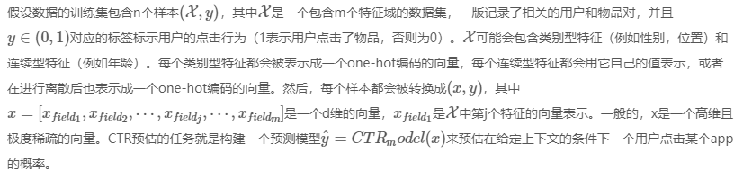
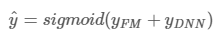
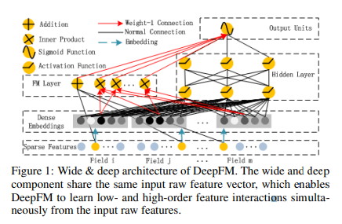

# DeepFM: A Factorization-Machine based Neural Network for CTR Prediction

## 摘要

Learning sophisticated feature interactions behind user behaviors is critical in maximizing CTR for recommender systems. Despite great progress, existing methods seem to have a strong bias towards low- or high-order interactions, or require expertise feature engineering. In this paper, we show that it is possible to derive an end-to-end learning model that emphasizes both low- and high- order feature interactions. The proposed model, DeepFM, combines the power of factorization machines for recommendation and deep learning for feature learning in a new neural network architecture. Compared to the latest Wide & Deep model from Google, DeepFM has a shared input to its “wide” and “deep” parts, with no need of feature engineering besides raw features. Comprehensive experiments are conducted to demonstrate the effectiveness and efficiency of DeepFM over the existing models for CTR prediction, on both benchmark data and commercial data.

对于推荐系统中的最大化CTR来说，学习那些用户行为背后的复杂而精确的特征交叉项是至关重要的。尽管有很大的提升，但是方法似乎在低阶或者高阶的交差项上带有很强的偏置项，又或者会要求专业性的特征工程。在这篇文章，我们会展示可以构造出一个端到端的学习模型，特别是对于低阶和高阶的交叉项的学习。DeepFM，提出的这个模型联合了因式分解机的推荐能力和一个新的神经网络结构在特征方面的深度学习能力。相比于Google提出的最新的Wide & Deep模型，DeepFM的“wide”和“deep”部分有一个共享输入层，并且除了最原始的特征不需要额外的特征工程。综合性的实验结果证明了DeepFM相比于其他的CTR模型在基础数据及和商业数据集上都有着更好的效果和效率。

## 介绍

- 点击率(CTR)预测
  - 估计用户对某个商业项目进行点击的概率
- 目标
  - 最大化点击次数，所以返回给用户的项目可以按照估计出的CTR进行排序

## 举例

- 发现用户常常在用餐时间下载外卖类app，这就是一种二阶的交互信息：app应用类别和时间，这类的二阶交互信息可以用以 CTR 预估；
- 男性青少年偏爱射击类和角色扮演游戏，这表明了这个三阶的交叉项：包含了性别，年龄和app的应用类别，也是有助于 CTR

## 动机

- 特征之间的交互信息
  - 容易理解的特征交叉项可以有专业的人设计出来（例如上述举例的）；
  - 大多数的特征交互项是隐藏于数据背后且难以利用先验知识发现的（例如啤酒与尿布的案例，是通过通过数据的而不是专家发现的），这种是仅可以通过机器学习字段捕获的；
  - 基于对于一些易理解的交互项来说，它们看上去也不像转接能够构造出来的，特别是在特征数量特别庞大的时候
- 线性模型
  - 问题：
    - 缺少学习特征交叉项的能力，所以一般是在后期手动方式添加特征之间的交互项；
    - 难以泛化到高阶特征；
    - 难以应付训练集中较少或者尚未出现的特征
- 因子分解机(FM)
  - 介绍：通过隐向量的内积表现特征之间的交叉项
  - 优点：
    - FM可以构建高阶的特征交叉项
  - 问题：
    - 在实际中考虑到构建特征之间更高阶的关系会更加复杂，所以一般只采用2阶
- 深度学习方法
  - 基于CNN的模型：
    - 问题：只能处理相邻特征；
  - 基于RNN的模型
    - 问题：由于天然的序列依赖特性更适于CTR领域
  - Factorization-machine supported Neural Network (FNN)
    - 介绍：该模型用FM进行预训练，再输入到DNN
    - 问题：受限于FM
  - Product-based Neural Network (PNN)
    - 介绍：在嵌入层和全连接层之间引入一个product 层来表示特征之间的相互作用
  - 混合网络结构：Wide & Deep模型
    - 介绍：融合了一个线性模型（wide）和深度学习模型。在这个模型中，两个部分wide part和deep part分别需要两个不同的输入；
    - 问题：wide part需要依赖专家的特征工程。
- 动机总结：
  - 现有模型偏向于低或高阶特征交互；
  - 依赖于特征工程；

## 论文思路

证明了可以构建一个学习模型，它是可以通过端到端的方式学习到所有阶数的特征交叉项。

- 贡献：
  - 提出了一个新的神经网络模型DeepFM，它是结合了FM和深度神经网络（DNN）的结构。它既可以像FM一样构建低阶的特征交叉项也可以像DNN一样拟合高阶的特特征交叉项。而不像Wide & Deep模型，DeepFM可以在无需任何特征工程的条件下进行端到端的训练；
  - 对DeepFM在基础数据集和商业数据集上都进行了评估，结果表明了它相对于目前已存在的CTR预估模型有一致性的提升效果

## 方法介绍

- 目标：学习高阶和低阶的特征交叉项
- 提出了基于神经网络的因式分解机（DeepFM）。如图1所示，DeepFM由两部分组成，FM部分和deep部分，二者共享同一输入层。对于特征$i$，一个标量$w_i$作为权重来表示其一阶的重要性，一个潜在的向量$V_i$用来衡量它与其他特征的交叉项的重要性。$V_i$被喂入FM部分取构建2阶的特征交叉项，同时也被喂入深度部分取构建高阶的特征交叉项。所有的参数，包括$w_i$，$V_i$和网络参数$(W^(l),b^(l))$都在合并的模型中进行联合训练的：

- 注：
  -  :预测的CTR
  - $y_FM$ : FM部分的输出结果
  - $y_DNN$ : 深度部分的输出结果

## 参考

1. [原始论文：DeepFM:A Factorization-Machine based Neural Network for CTR Prediction](https://arxiv.org/pdf/1703.04247.pdf)
2. [DeepFM A Factorization-Machine based Neural Network for CTR Prediction (论文解析)](https://www.xiemingzhao.com/posts/4bbfbe93.html)