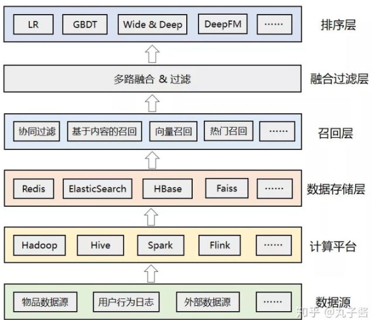
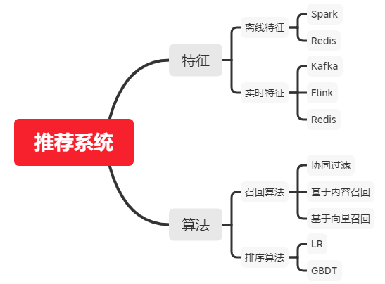

# 【关于 推荐系统】 那些你不知道的事

> 作者：杨夕
> 
> 项目地址：https://github.com/km1994/nlp_paper_study
> 
> 个人介绍：大佬们好，我叫杨夕，该项目主要是本人在研读顶会论文和复现经典论文过程中，所见、所思、所想、所闻，可能存在一些理解错误，希望大佬们多多指正。

## 目录

## 什么是推荐系统？

“啤酒与尿布” 的故事相信很多人都听过，年轻爸爸去超市购买尿布时，经常会买点啤酒犒劳自己。因此，沃尔玛将这两种商品进行了捆绑销售，最终获得了更好的销量。

这个故事背后的理论依据就是 “推荐算法”，因为尿布和啤酒经常出现在同一个购物车中，那么向购买尿布的年轻爸爸推荐啤酒确实有一定道理。

## 推荐系统到底解决的是什么问题？

- 问题：信息过载，如何 从 从众多信息中找到用户感兴趣的信息？
- 价值：精准推荐解决了用户痛点，提升了用户体验，最终便能留住用户。

## 推荐系统 的 流程是什么？

- 本质：信息过滤系统；
- 流程：召回->排序->重排序
- 目标：每个环节逐层过滤，最终从海量的物料库中筛选出几十个用户可能感兴趣的物品推荐给用户

## 推荐系统 的 应用场景？

- 场景：
  - 资讯类：今日头条、腾讯新闻等
  - 电商类：淘宝、京东、拼多多、亚马逊等
  - 娱乐类：抖音、快手、爱奇艺等
  - 生活服务类：美团、大众点评、携程等
  - 社交类：微信、陌陌、脉脉等
- 按类别分类：
  - 基于用户维度的推荐：根据用户的历史行为和兴趣进行推荐，比如淘宝首页的猜你喜欢、抖音的首页推荐等；
  - 基于物品维度的推荐：根据用户当前浏览的标的物进行推荐，比如打开京东APP的商品详情页，会推荐和主商品相关的商品给你；

## 推荐系统 与 搜索、广告 的 异同？

- 搜索：有明确的搜索意图，**搜索出来的结果和用户的搜索词相关**；
- 推荐：**不具有目的性，依赖用户的历史行为和画像数据进行个性化推荐**；
- 广告：借助搜索和推荐技术实现广告的精准投放，可以将广告理解成搜索推荐的一种应用场景，技术方案更复杂，涉及到智能预算控制、广告竞价等；

## 推荐系统 整体架构？

- 数据源：推荐算法所依赖的各种数据源，包括物品数据、用户数据、行为日志、其他可利用的业务数据、甚至公司外部的数据。
- 计算平台：负责对底层的各种异构数据进行清洗、加工，离线计算和实时计算。
- 数据存储层：存储计算平台处理后的数据，根据需要可落地到不同的存储系统中，比如Redis中可以存储用户特征和用户画像数据，ES中可以用来索引物品数据，Faiss中可以存储用户或者物品的embedding向量等。
- 召回层：包括各种推荐策略或者算法，比如经典的协同过滤，基于内容的召回，基于向量的召回，用于托底的热门推荐等。为了应对线上高并发的流量，召回结果通常会预计算好，建立好倒排索引后存入缓存中。
- 融合过滤层：触发多路召回，由于召回层的每个召回源都会返回一个候选集，因此这一层需要进行融合和过滤。
- 排序层：利用机器学习或者深度学习模型，以及更丰富的特征进行重排序，筛选出更小、更精准的推荐集合返回给上层业务。

## 推荐系统 核心部分？

- 核心部分
  - 特征：由于数据量大，通常采用大数据的离线和实时处理技术，像Spark、Flink等，然后将计算结果保存在Redis或者其他存储系统中（比如HBase、MongoDB或者ES），供召回和排序模块使用；
  - 算法：
    - 召回算法：从海量数据中快速获取一批候选数据，要求是快和尽可能的准。这一层通常有丰富的策略和算法，用来确保多样性，为了更好的推荐效果，某些算法也会做成近实时的
    - 排序算法：对多路召回的候选集进行精细化排序。它会利用物品、用户以及它们之间的交叉特征，然后通过复杂的机器学习或者深度学习模型进行打分排序，这一层的特点是计算复杂但是结果更精准

