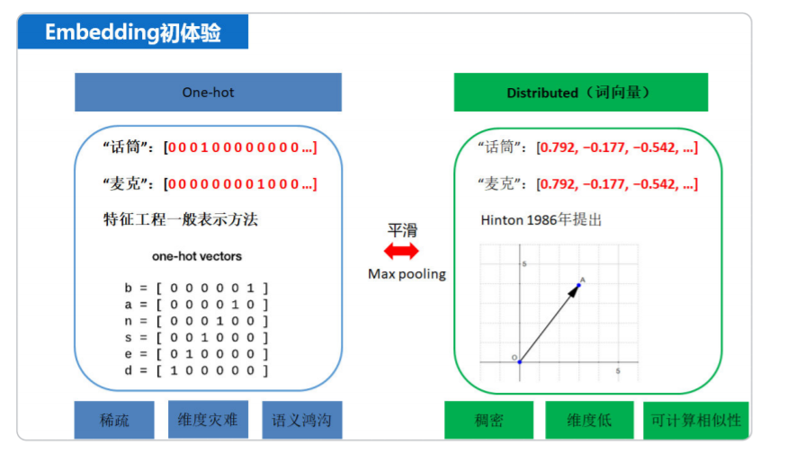

# 【关于 embedding 召回】那些你不知道的事

> 笔者：杨夕
>
> 项目地址：https://github.com/km1994/nlp_paper_study
> 
> 个人介绍：大佬们好，我叫杨夕，该项目主要是本人在研读顶会论文和复现经典论文过程中，所见、所思、所想、所闻，可能存在一些理解错误，希望大佬们多多指正。

## 整体框架图

## 动机

1. 多路召回问题

## 介绍

- 介绍：是将稀疏的向量(如one-hot编码)表示转换成稠密的向量

> 直观的显示了one-hot编码和Embedding表示的区别于联系，即Embedding相当于是对one-hot做了平滑，而onehot相当于是对Embedding做了max-pooling。

## 常见的Embedding技术有哪些？

1. text embedding：
   1. 目前使用最多的embedding技术，对于文本特征可以直接使用该技术
2. 非 text embedding
   1. 方法：对于非文本的id类特征，可以先将其转化成id序列再使用textembedding的技术获取id的embedding再做召回。
   2. 类型：
      1. image embedding
      2. graph embedding

