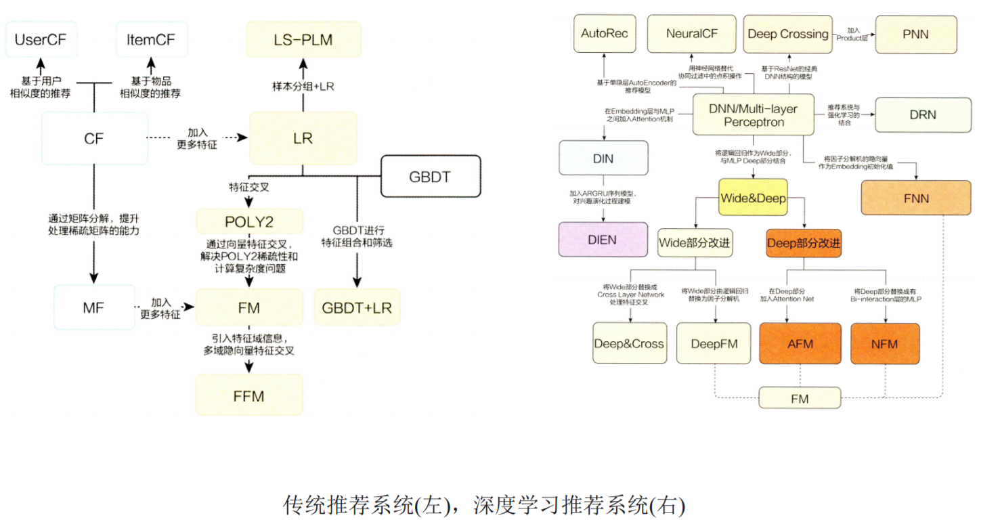

# 【关于 Wide&Deep】那些你不知道的事

> 笔者：杨夕
>
> 项目地址：https://github.com/km1994/nlp_paper_study
> 
> 个人介绍：大佬们好，我叫杨夕，该项目主要是本人在研读顶会论文和复现经典论文过程中，所见、所思、所想、所闻，可能存在一些理解错误，希望大佬们多多指正。

## 整体框架图

## 点击率预估

### 动机

在 网页广告推荐是，有时需要对 广告点击 的概率 进行预测。

### 介绍

- 点击率预估：对每次广告点击情况作出预测，可以输出点击或者不点击；
- pClick：也可以输出该次点击的概率；

### 点击率预估模型需要做什么？

- 点击率预估问题 -> 一个二分类的问题
- 机器学习中的解决方案：使用逻辑回归作为模型的输出，其输出的就是一个概率值，我们可以将机器学习输出的这个概率值认为是某个用户点击某个广告的概率。

### 点击率预估与推荐算法有什么不同？

- 广告点击率预估：需要得到某个用户对某个广告的点击率，然后结合广告的出价用于排序；
- 推荐算法：很多大多数情况下只需要得到一个最优的推荐次序，即TopN推荐的问题。当然也可以利用广告的点击率来排序，作为广告的推荐。

## FM 问题

- 当query-item矩阵是稀疏并且是high-rank的时候（比如user有特殊的爱好，或item比较小众），很难非常效率的学习出低维度的表示。这种情况下，大部分的query-item都没有什么关系。但是dense embedding会导致几乎所有的query-item预测值都是非0的，这就导致了推荐过度泛化，会推荐一些不那么相关的物品。相反，简单的linear model却可以通过cross-product transformation来记住这些exception rules，cross-product transformation是什么意思后面再提。

## Wide&Deep 操作流程

* **Retrieval **：利用机器学习模型和一些人为定义的规则，来返回最匹配当前Query的一个小的items集合，这个集合就是最终的推荐列表的候选集。

* **Ranking**：
  * 收集更细致的用户特征，如：
    - User features（年龄、性别、语言、民族等）
    - Contextual features(上下文特征：设备，时间等)
    - Impression features（展示特征：app age、app的历史统计信息等）
  * 将特征分别传入Wide和Deep**一起做训练**。在训练的时候，根据最终的loss计算出gradient，反向传播到Wide和Deep两部分中，分别训练自己的参数（wide组件只需要填补deep组件的不足就行了，所以需要比较少的cross-product feature transformations，而不是full-size wide Model）
    * 训练方法是用mini-batch stochastic optimization。
    * Wide组件是用FTRL（Follow-the-regularized-leader） + L1正则化学习。
    * Deep组件是用AdaGrad来学习。
  * 训练完之后推荐TopN

所以wide&deep模型尽管在模型结构上非常的简单，但是如果想要很好的使用wide&deep模型的话，还是要深入理解业务，确定wide部分使用哪部分特征，deep部分使用哪些特征，以及wide部分的交叉特征应该如何去选择

