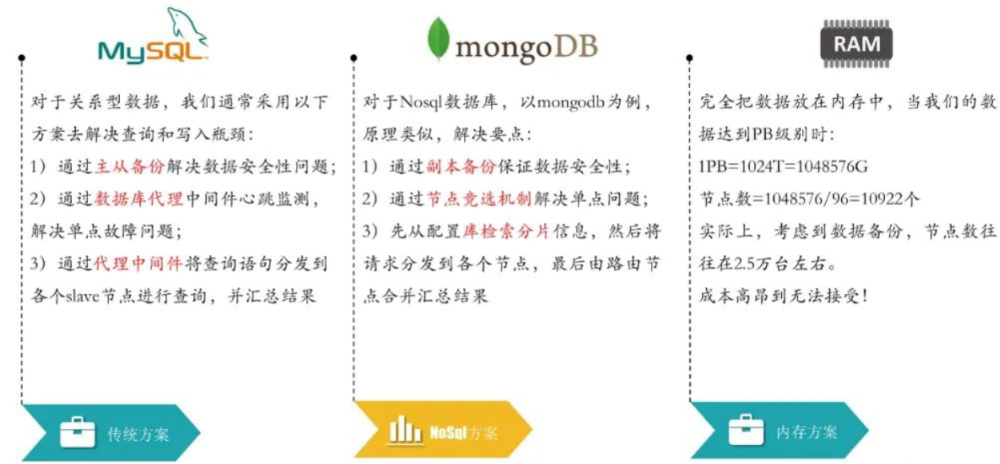
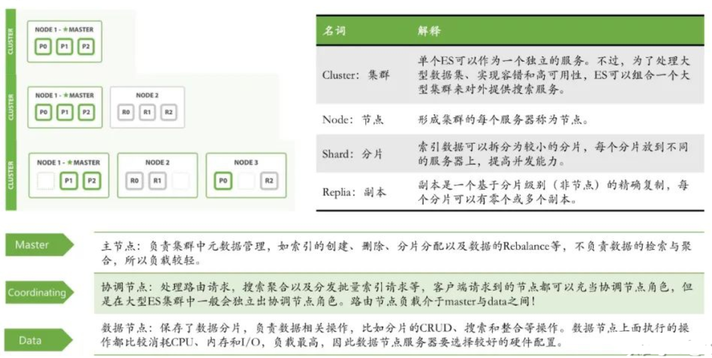
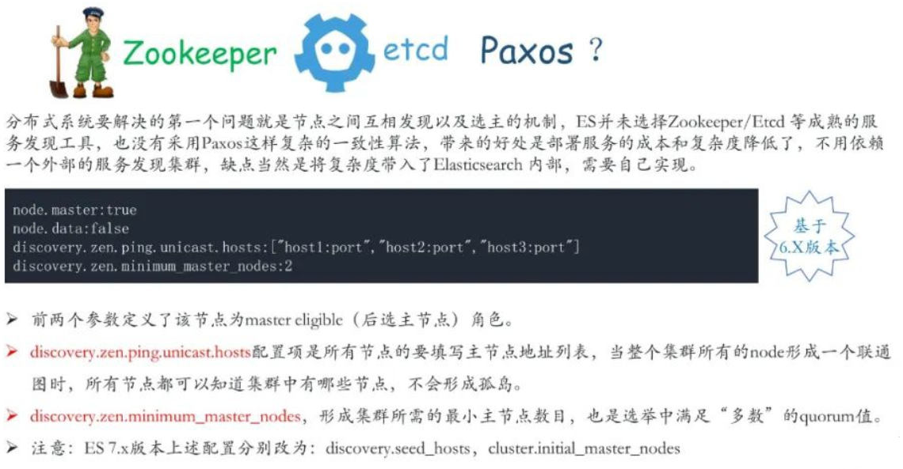
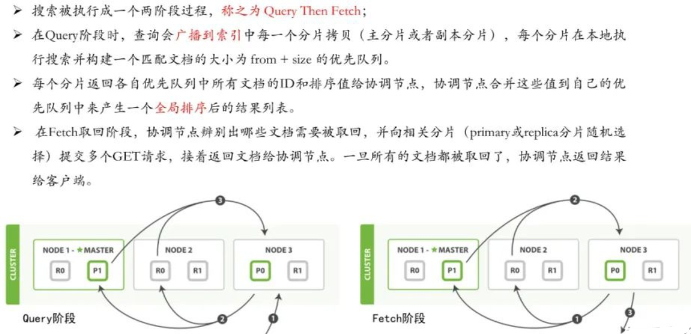
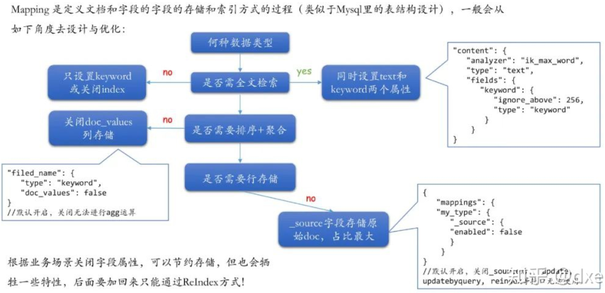
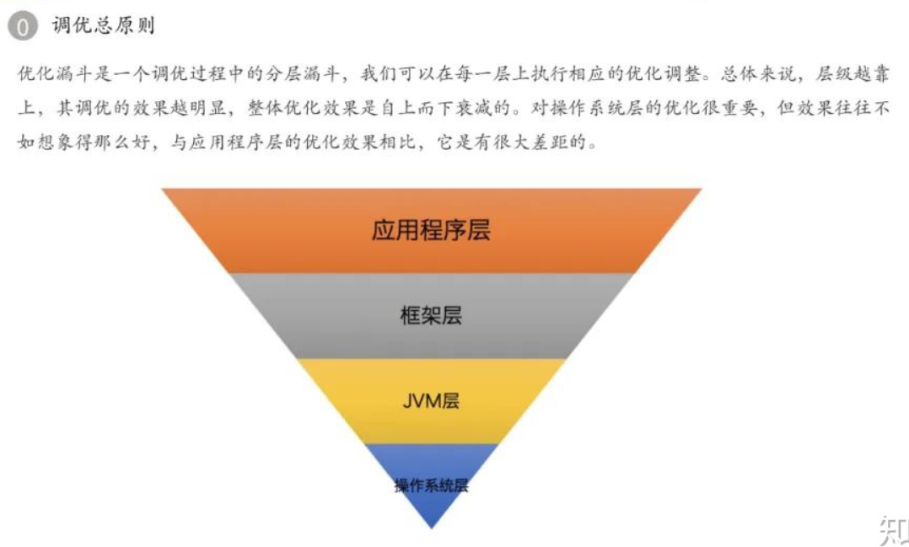
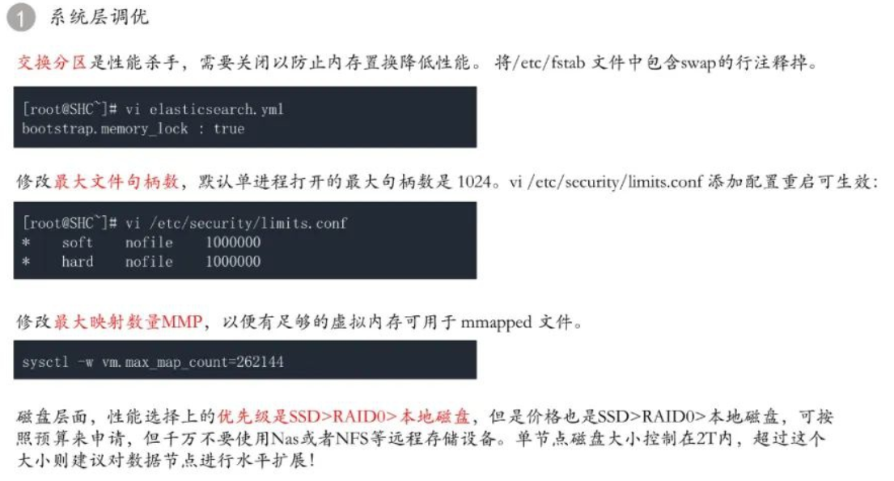
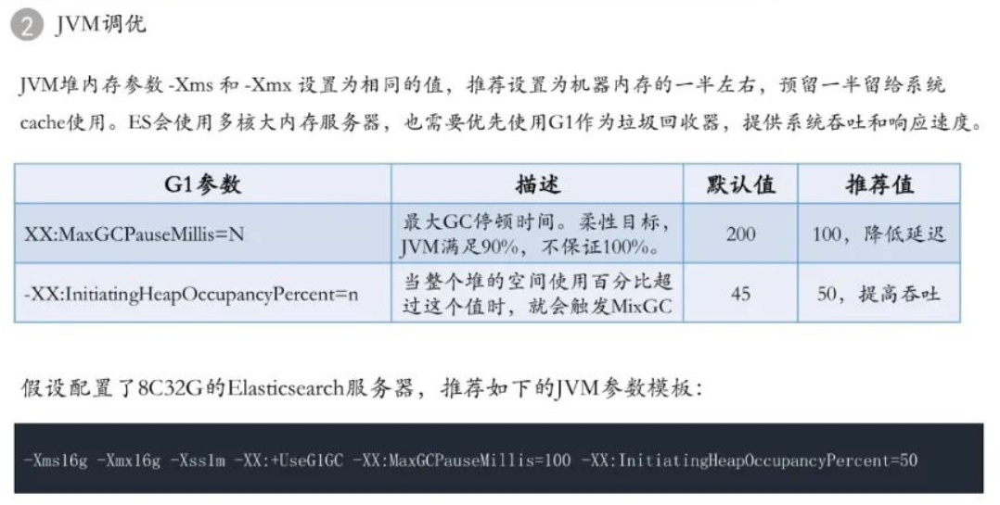
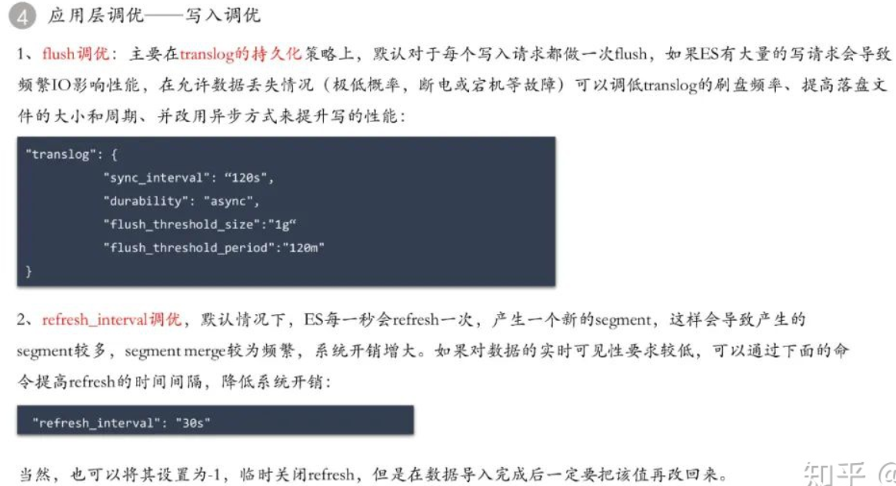
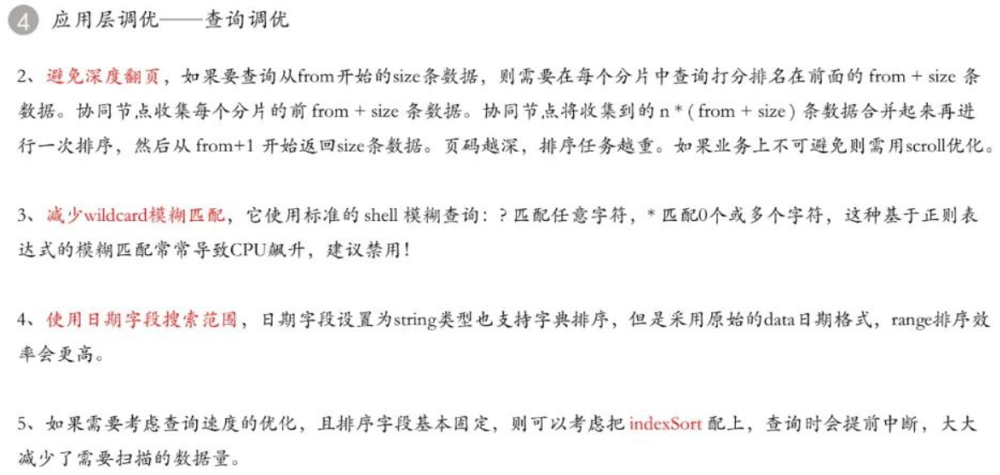

# ElasticSearch架构解析与最佳实践

> 转载博文地址：https://zhuanlan.zhihu.com/p/157964955
> 
> 转载人：杨夕
> 
> github: https://github.com/km1994/nlp_paper_study

## 问题目录

1. 大规模数据检索需要解决什么问题？
2. 传统 数据库 的 不同解决方案是什么？
3. ElasticSearch 是什么？
4. ES 数据分层结构是什么？
5. Lucene 如何构建 index ———— 新建文档？ 
6. Lucene 如何构建 index ———— segment 段？ 
7. Lucene 如何构建 index ———— 持久化变更？ 
8. Lucene 如何构建 index ———— 段合并？ 
9. Lucene 与 MySQL 内核比较？
10. ES 的 基础知识学习？
11. ES 如何 进行 主节点配置 和 选举？
12. ES 如何 写数据？
13. ES 如何 搜索数据？
14. ES 集群规划 ———— 资源规划？
15. ES 集群规划 ———— 资源规划实战？  
16. ES 集群规划 ———— 角色规划？  
17. ES 集群规划 ———— 索引设计？  
18. ES 集群规划 ———— 分片与副本？ 
19. ES 数据建模 ———— Mapping 模板？ 
20. ES 开发与部署建议？
21. ES 性能调优？

## 问题

### 1. 大规模数据检索需要解决什么问题？

当数据量超过 GB 或 TB 以上时，我们做系统架构需要考虑的问题：

1. 用什么数据库存储？（MySQL、Oracle、Postgre、MongoDB、Hbase...）
2. 如何解决单点故障？（LVS、F5、A10、Zookeeper、MQ...）
3. 如何保证数据 安全性？ (热备、冷备、异地多活)
4. 如何解决检索难题？（数据库代理中间间：mysql-proxy、Cobar、MaxScale...）
5. 如何解决统计分析问题？（离线、近实时）

### 2. 传统 数据库 的 不同解决方案是什么？

### 3. ElasticSearch 是什么？

### 4. ES 数据分层结构是什么？

### 5. Lucene 如何构建 index ？

### 6. Lucene 如何构建 index ———— segment 段？

### 7. Lucene 如何构建 index ———— 持久化变更？

### 8. Lucene 如何构建 index ———— 段合并？ 

### 9. Lucene 与 MySQL 内核比较？

### 10. ES 的 基础知识学习？

### 11. ES 如何 进行 主节点配置 和 选举？

### 12. ES 如何 写数据？

### 13. Es 如何 搜索数据？

### 14. ES 集群规划 ———— 资源规划？

### 15. ES 集群规划 ———— 资源规划实战？  

### 16. ES 集群规划 ———— 角色规划？

### 17. ES 集群规划 ———— 索引设计？

### 18. ES 集群规划 ———— 分片与副本？

### 19. ES 数据建模 ———— Mapping 模板？

### 20. ES 开发与部署建议？

### 21. ES 性能调优？

## 推荐阅读文章：

- elastic.guide. 分片内部原理
- Quintessence Anx. Elasticsearch Performance Tuning
- 进击的辣条. Elasticsearch由浅入深（二）ES基础分布式架构、横向扩容、容错机制
- 铭毅天下. Elasticsearch 索引设计实战指南
- 至尊宝.将 ELASTICSEARCH 写入速度优化到极限
- 腾讯云. Elasticsearch调优实践
- Morningchen.腾讯技术工程. Elasticsearch调优实践
- 黄华.千台 ElasticSearch 集群在腾讯的优化实践
- 李海亮.Elasticsearch搜索引擎性能调优看懂这一篇就够了
- Jolestar.Elasticsearch 架构以及源码概览

## 推荐Elasticsearch专栏：

- Elastic官网. Elasticsearch权威指南  https://www.elastic.co/guide/cn/elasticsearch/guide/current/preface.html
- 铭毅天下. 死磕 Elasticsearch 方法论认知清单 https://mp.weixin.qq.com/s/SuUCMZnYA1UN1w9NBotfaw
- 东天里的冬天. ElasticSearch教程——汇总篇 https://blog.csdn.net/gwd1154978352/article/details/82781731
- 进击的辣条. ElasticSearch专栏 http://www.cnblogs.com/wyt007/category/1523944.html

