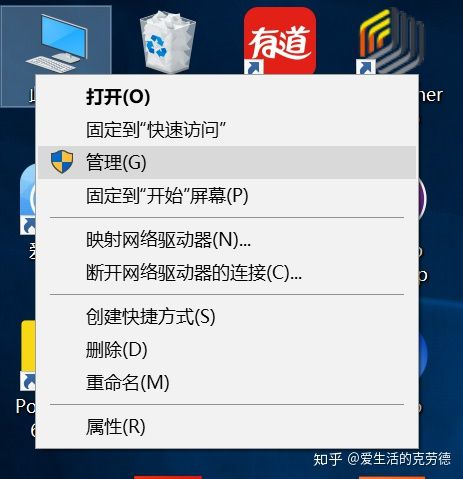
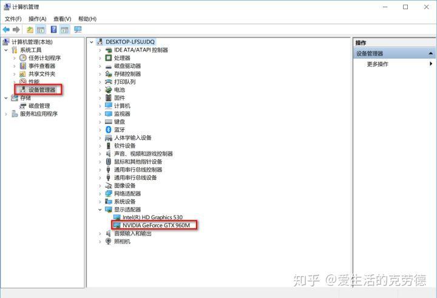
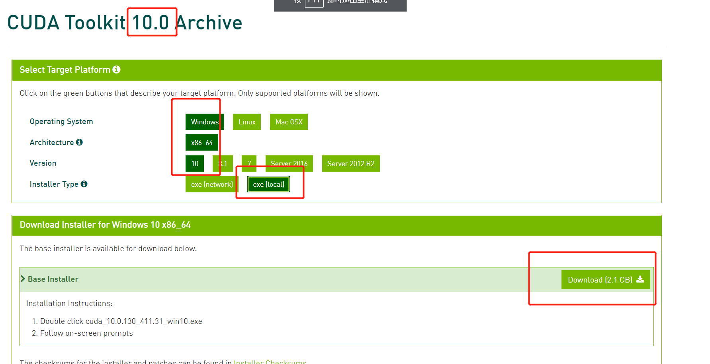
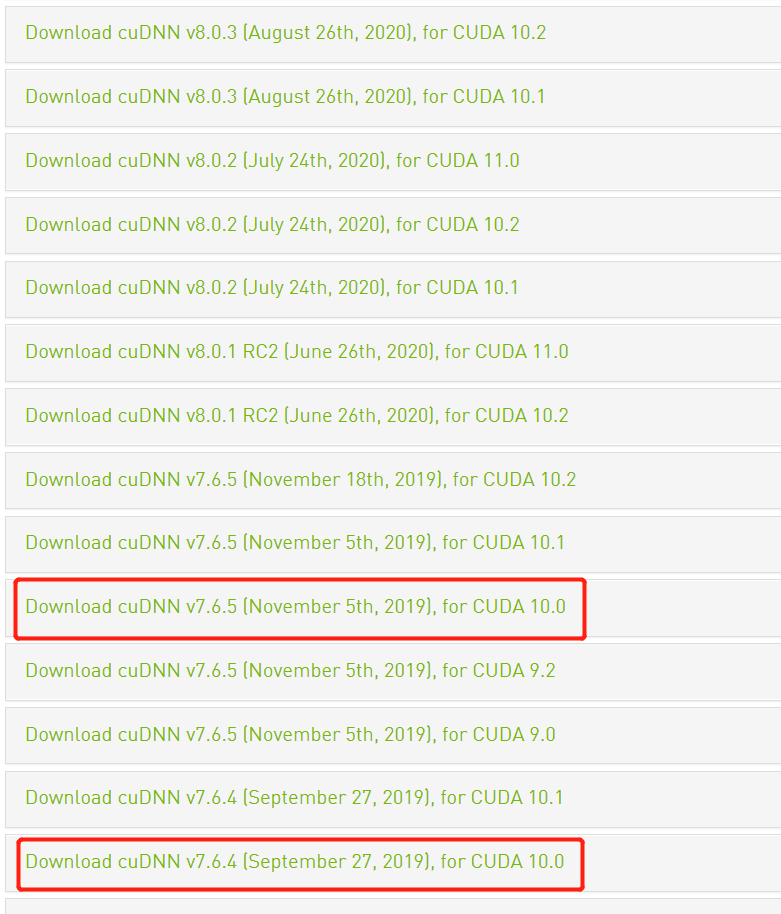

# 【关于 win10 安装 cuda】 那些你不知道的事

> 作者：杨夕
> 
> 项目地址：https://github.com/km1994/nlp_paper_study
> 
> 个人介绍：大佬们好，我叫杨夕，该项目主要是本人在研读顶会论文和复现经典论文过程中，所见、所思、所想、所闻，可能存在一些理解错误，希望大佬们多多指正。

## 目录


## 一、准备篇

### 1. 安装ANACONDA

安装 anaconda 软件这部分 由于晚上教程教程，而且属于直男操作，本教程将不错介绍。

### 2. 查看机器是否支持

- step 1：查看电脑 GPU 型号
  




- step 2：查看电脑 GPU 型号 是否支持 cuda

用谷歌搜索“你的GPU型号+SPECIFICATION”，在官网查它是否支持CUDA


## 二、安装篇

### 1. 安装 CUDA

#### 1.1 查看 tensorflow 每个版本 对应的 CUDA


> 查询地址：https://www.tensorflow.org/install/source_windows

#### 1.2 安装 CUDA 【因为我要安装 tf15，所以我安装的是 CUDA 10】

- step 1：下载对应版本
  
> 地址：CUDA Toolkit Archive：https://developer.nvidia.com/cuda-toolkit-archive


> 安装版本


- step 2：安装完成之后，测试版本

安装好后，打开anaconda的terminal输入

```s
    nvcc -V
```

进行测试，如果显示如下，证明你安装成功了。


### 2. 安装cuDNN

在 【[cuDNN Archive](https://developer.nvidia.com/rdp/cudnn-archive)】官网下载对应版本的 cudnn，只要后面 是 CUDA 10 的就行



解压“cudnn-9.0-windows10-x64-v7.zip”，将一下三个文件夹，拷贝到CUDA安装的根目录下。


这样CUDA Toolkit 9.0 和 cuDnn 7.0就已经安装了，下面要进行环境变量的配置。

配置环境变量
将下面四个路径加入到环境变量中，注意要换成自己的安装路径。

> C:\Program Files\NVIDIA GPU Computing Toolkit\CUDA\v9.0
> 
> C:\Program Files\NVIDIA GPU Computing Toolkit\CUDA\v9.0\bin
> 
> C:\Program Files\NVIDIA GPU Computing Toolkit\CUDA\v9.0\lib\x64
> 
> C:\Program Files\NVIDIA GPU Computing Toolkit\CUDA\v9.0\libnvvp

到此，全部的安装步骤都已经完成，这回我们测试一下。

### 3. 安装显卡驱动

- step 1：命令行中使用 nvidia-smi 查看驱动是否安装成功

> 安装成功效果
```s
> nvidia-smi
Sun Nov 22 10:48:59 2020
+-----------------------------------------------------------------------------+
| NVIDIA-SMI 442.50       Driver Version: 442.50       CUDA Version: 10.2     |
|-------------------------------+----------------------+----------------------+
| GPU  Name            TCC/WDDM | Bus-Id        Disp.A | Volatile Uncorr. ECC |
| Fan  Temp  Perf  Pwr:Usage/Cap|         Memory-Usage | GPU-Util  Compute M. |
|===============================+======================+======================|
|   0  GeForce 940MX      WDDM  | 00000000:01:00.0 Off |                  N/A |
| N/A   65C    P0    N/A /  N/A |    181MiB /  2048MiB |      0%      Default |
+-------------------------------+----------------------+----------------------+

+-----------------------------------------------------------------------------+
| Processes:                                                       GPU Memory |
|  GPU       PID   Type   Process name                             Usage      |
|=============================================================================|
|    0     12308    C+G   ...xperience\NVIDIA GeForce Experience.exe N/A      |
|    0     13904      C   ...rogrom\python\python\python3\python.exe N/A      |
+-----------------------------------------------------------------------------+
```

> nvidia-smi显示连接驱动失败，重新安装nvidia驱动，使用360驱动大师安装较新的驱动

> ps： 这一步很关键，如果驱动安装出问题，最后将导致 tensorflow 调用不到 cuda，出现问题如下：

```s
Q：tensorflow/stream_executor/cuda/cuda_driver.cc:318] failed call to cuInit: CUDA_ERROR_UNKNOWN: unknown error
```

## 三、测试篇

运行如下代码

```s
import tensorflow as tf
tf.test.gpu_device_name()
from tensorflow.python.client import device_lib
device_lib.list_local_devices()
```
对应效果

```s
> python .\demo.py
2020-11-22 10:47:14.883875: I tensorflow/stream_executor/platform/default/dso_loader.cc:44] Successfully opened dynamic library cudart64_100.dll
2020-11-22 10:47:22.491417: I tensorflow/core/platform/cpu_feature_guard.cc:142] Your CPU supports instructions that this TensorFlow binary was not compiled to use: AVX2
2020-11-22 10:47:22.501069: I tensorflow/stream_executor/platform/default/dso_loader.cc:44] Successfully opened dynamic library nvcuda.dll
2020-11-22 10:47:22.639237: I tensorflow/core/common_runtime/gpu/gpu_device.cc:1618] Found device 0 with properties:
name: GeForce 940MX major: 5 minor: 0 memoryClockRate(GHz): 0.8605
pciBusID: 0000:01:00.0
2020-11-22 10:47:22.665240: I tensorflow/stream_executor/platform/default/dso_loader.cc:44] Successfully opened dynamic library cudart64_100.dll
2020-11-22 10:47:22.713024: I tensorflow/stream_executor/platform/default/dso_loader.cc:44] Successfully opened dynamic library cublas64_100.dll
2020-11-22 10:47:22.744315: I tensorflow/stream_executor/platform/default/dso_loader.cc:44] Successfully opened dynamic library cufft64_100.dll
2020-11-22 10:47:22.758282: I tensorflow/stream_executor/platform/default/dso_loader.cc:44] Successfully opened dynamic library curand64_100.dll
2020-11-22 10:47:22.802031: I tensorflow/stream_executor/platform/default/dso_loader.cc:44] Successfully opened dynamic library cusolver64_100.dll
2020-11-22 10:47:22.833934: I tensorflow/stream_executor/platform/default/dso_loader.cc:44] Successfully opened dynamic library cusparse64_100.dll
2020-11-22 10:47:22.919199: I tensorflow/stream_executor/platform/default/dso_loader.cc:44] Successfully opened dynamic library cudnn64_7.dll
2020-11-22 10:47:22.965876: I tensorflow/core/common_runtime/gpu/gpu_device.cc:1746] Adding visible gpu devices: 0
2020-11-22 10:53:44.572639: I tensorflow/core/common_runtime/gpu/gpu_device.cc:1159] Device interconnect StreamExecutor with strength 1 edge matrix:
2020-11-22 11:25:47.772172: I tensorflow/core/common_runtime/gpu/gpu_device.cc:1165]      0
2020-11-22 11:25:47.776664: I tensorflow/core/common_runtime/gpu/gpu_device.cc:1178] 0:   N
2020-11-22 11:25:48.375709: I tensorflow/core/common_runtime/gpu/gpu_device.cc:1304] Created TensorFlow device (/device:GPU:0 with 1380 MB memory) -> physical GPU (device: 0, name: GeForce 940MX, pci bus id: 0000:01:00.0, compute capability: 5.0)
2020-11-22 11:25:48.483353: I tensorflow/core/common_runtime/gpu/gpu_device.cc:1618] Found device 0 with properties:
name: GeForce 940MX major: 5 minor: 0 memoryClockRate(GHz): 0.8605
pciBusID: 0000:01:00.0
2020-11-22 11:25:48.495446: I tensorflow/stream_executor/platform/default/dso_loader.cc:44] Successfully opened dynamic library cudart64_100.dll
2020-11-22 11:25:48.501628: I tensorflow/stream_executor/platform/default/dso_loader.cc:44] Successfully opened dynamic library cublas64_100.dll
2020-11-22 11:25:48.510227: I tensorflow/stream_executor/platform/default/dso_loader.cc:44] Successfully opened dynamic library cufft64_100.dll
2020-11-22 11:25:48.515818: I tensorflow/stream_executor/platform/default/dso_loader.cc:44] Successfully opened dynamic library curand64_100.dll
2020-11-22 11:25:48.521897: I tensorflow/stream_executor/platform/default/dso_loader.cc:44] Successfully opened dynamic library cusolver64_100.dll
2020-11-22 11:25:48.529051: I tensorflow/stream_executor/platform/default/dso_loader.cc:44] Successfully opened dynamic library cusparse64_100.dll
2020-11-22 11:25:48.534523: I tensorflow/stream_executor/platform/default/dso_loader.cc:44] Successfully opened dynamic library cudnn64_7.dll
2020-11-22 11:25:48.543715: I tensorflow/core/common_runtime/gpu/gpu_device.cc:1746] Adding visible gpu devices: 0
2020-11-22 11:25:48.548243: I tensorflow/core/common_runtime/gpu/gpu_device.cc:1159] Device interconnect StreamExecutor with strength 1 edge matrix:
2020-11-22 11:25:48.553785: I tensorflow/core/common_runtime/gpu/gpu_device.cc:1165]      0
2020-11-22 11:25:48.559110: I tensorflow/core/common_runtime/gpu/gpu_device.cc:1178] 0:   N
2020-11-22 11:25:48.563841: I tensorflow/core/common_runtime/gpu/gpu_device.cc:1304] Created TensorFlow device (/device:GPU:0 with 1380 MB memory) -> physical GPU (device: 0, name: GeForce 940MX, pci bus id: 0000:01:00.0, compute capability: 5.0)
```
> 命令行中使用 nvidia-smi 查看驱动是否安装成功

> 安装成功效果
```s
> nvidia-smi
Sun Nov 22 10:48:59 2020
+-----------------------------------------------------------------------------+
| NVIDIA-SMI 442.50       Driver Version: 442.50       CUDA Version: 10.2     |
|-------------------------------+----------------------+----------------------+
| GPU  Name            TCC/WDDM | Bus-Id        Disp.A | Volatile Uncorr. ECC |
| Fan  Temp  Perf  Pwr:Usage/Cap|         Memory-Usage | GPU-Util  Compute M. |
|===============================+======================+======================|
|   0  GeForce 940MX      WDDM  | 00000000:01:00.0 Off |                  N/A |
| N/A   65C    P0    N/A /  N/A |    181MiB /  2048MiB |      0%      Default |
+-------------------------------+----------------------+----------------------+

+-----------------------------------------------------------------------------+
| Processes:                                                       GPU Memory |
|  GPU       PID   Type   Process name                             Usage      |
|=============================================================================|
|    0     12308    C+G   ...xperience\NVIDIA GeForce Experience.exe N/A      |
|    0     13904      C   ...rogrom\python\python\python3\python.exe N/A      |
+-----------------------------------------------------------------------------+
```

## 四、参考资料

1. [Win10 Anaconda下TensorFlow-GPU环境搭建详细教程（包含CUDA+cuDNN安装过程）](https://www.cnblogs.com/guoyaohua/p/9265268.html)
2. [查看tensorflow是否支持GPU，以及测试程序](https://blog.csdn.net/renhaofan/article/details/81987728)
3. [WIN10安装TENSORFLOW（GPU版本）详解（超详细，从零开始）](https://zhuanlan.zhihu.com/p/37086409)
4. [TensorFlow 2.0 Alpha的初步尝试：安装及填坑小记](https://zhuanlan.zhihu.com/p/61296818)
5. [win10+TensorFlow安装教程](https://www.it610.com/article/1170282090525167616.htm)
