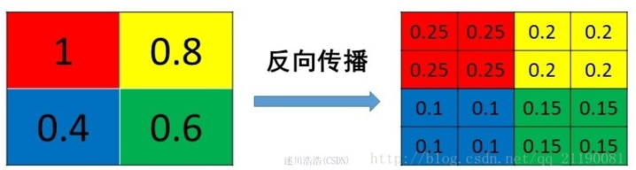
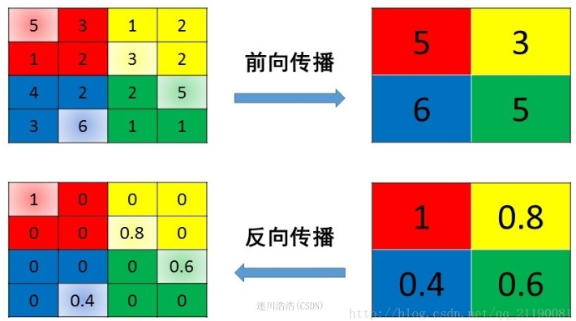

# 【关于 DL 面试】那些你不知道的事 

> 作者：杨夕
> 
> 项目地址：https://github.com/km1994/nlp_paper_study
> 
> 个人介绍：大佬们好，我叫杨夕，该项目主要是本人在研读顶会论文和复现经典论文过程中，所见、所思、所想、所闻，可能存在一些理解错误，希望大佬们多多指正。

## 目录

- [【关于 DL 面试】那些你不知道的事](#关于-dl-面试那些你不知道的事)
  - [目录](#目录)
  - [一、CNN 篇](#一cnn-篇)
    - [1.1 卷积篇](#11-卷积篇)
    - [1.2 池化篇](#12-池化篇)
      - [1.2.1 池化层 反向传播 是什么样的？](#121-池化层-反向传播-是什么样的)
      - [1.2.2 mean pooling 池化层 反向传播 是什么样的？](#122-mean-pooling-池化层-反向传播-是什么样的)
      - [1.2.3 max pooling 池化层 反向传播 是什么样的？](#123-max-pooling-池化层-反向传播-是什么样的)
  - [参考](#参考)

## 一、CNN 篇

### 1.1 卷积篇

### 1.2 池化篇

#### 1.2.1 池化层 反向传播 是什么样的？

- 动机：由于 Pooling 操作容易改变 feature map 的 尺寸大小，使得 Pooling 层不可导；
- 举例说明：假定 2*2 的 池化，会生成 2*2*2*2 = 16 个梯度，即梯度无法传递到对应的位置；
- 方法：将一个像素的loss (梯度) 传递给4个像素，且需要保证传递的 loss （梯度）总和不变。

#### 1.2.2 mean pooling 池化层 反向传播 是什么样的？

- mean pooling 前向传播介绍：将 patch 中的值求平均来做 pooling;
- mean pooling 反向传播介绍：将值的梯度均等分为 n*n 份 分配给上一层，以保证 池化 前后 梯度之和保存不变；

#### 1.2.3 max pooling 池化层 反向传播 是什么样的？

- max pooling 前向传播介绍：将 patch 中的值取 max 来做 pooling 结果 传递给下一层;
- max pooling 反向传播介绍：把梯度直接传给前一层 值最大的一个像素，而其他像素不接受梯度，也就是为0；

## 参考

1. [池化层（pooling）的反向传播是怎么实现的](https://blog.csdn.net/Jason_yyz/article/details/80003271)

