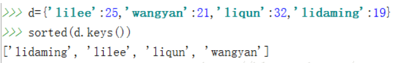
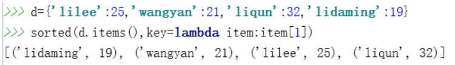

# 【关于 python 】 的那些你不知道的事


> 作者：杨夕
> 
> 项目地址：https://github.com/km1994/nlp_paper_study
> 
> 个人介绍：大佬们好，我叫杨夕，该项目主要是本人在研读顶会论文和复现经典论文过程中，所见、所思、所想、所闻，可能存在一些理解错误，希望大佬们多多指正。

## 目录

- [【关于 python 】 的那些你不知道的事](#关于-python--的那些你不知道的事)
  - [目录](#目录)
  - [*args 和 **kwargs的用法](#args-和-kwargs的用法)
    - [动机](#动机)
    - [用途](#用途)
    - [*args](#args)
    - [**kwargs](#kwargs)
    - [对比 *args 与 **kwargs](#对比-args-与-kwargs)
    - [参考资料](#参考资料)
  - [装饰器](#装饰器)
    - [装饰器基本介绍](#装饰器基本介绍)
    - [实践](#实践)
    - [参考资料](#参考资料-1)
  - [Python垃圾回收（GC）](#python垃圾回收gc)
    - [垃圾回收算法](#垃圾回收算法)
    - [引用计数（主要）](#引用计数主要)
    - [标记-清除](#标记-清除)
    - [分代回收](#分代回收)
    - [参考](#参考)
  - [python的sorted函数对字典按key排序和按value排序](#python的sorted函数对字典按key排序和按value排序)
    - [介绍](#介绍)
    - [举例](#举例)
    - [参考](#参考-1)


## *args 和 **kwargs的用法

### 动机

对于一些编写的函数，可能预先并不知道, 函数使用者会传递多少个参数给你, 所以在这个场景下使用这两个关键字。
### 用途

*args 和 **kwargs 主要用于函数定义。 你可以将不定数量的参数传递给一个函数；

### *args
- 介绍：用来发送一个非键值对的可变数量的参数列表给一个函数；
- 举例
```s
def test_var_args(f_arg, *argv):
    print("first normal arg:", f_arg)
    for arg in argv:
        print("another arg through *argv:", arg)

test_var_args('yasoob', 'python', 'eggs', 'test')

# output
first normal arg: yasoob
another arg through *argv: python
another arg through *argv: eggs
another arg through *argv: test

```

### **kwargs
- 介绍：允许你将不定长度的键值对, 作为参数传递给一个函数。 如果你想要在一个函数里处理带名字的参数, 你应该使用kwargs;
- 举例：
```s
def greet_me(**kwargs):
    for key, value in kwargs.items():
        print("{0} == {1}".format(key, value))

# output
>>> greet_me(name="yasoob")
name == yasoob

```
### 对比 *args 与 **kwargs

```s
def test_args_kwargs(arg1, arg2, arg3):
    print("arg1:", arg1)
    print("arg2:", arg2)
    print("arg3:", arg3)

```
> 使用 *args
```s
>>> args = ("two", 3, 5)
>>> test_args_kwargs(*args)
arg1: two
arg2: 3
arg3: 5
```

> 使用 **kwargs
```s
>>> kwargs = {"arg3": 3, "arg2": "two", "arg1": 5}
>>> test_args_kwargs(**kwargs)
arg1: 5
arg2: two
arg3: 3
```
### 参考资料
1. *args 和 **kwargs的用法 : https://www.jianshu.com/p/d993b2a88e73

## 装饰器

### 装饰器基本介绍

- 装饰器本质：一个 Python 函数或类；
- 作用：可以让其他函数或类在不需要做任何代码修改的前提下增加额外功能，装饰器的返回值也是一个函数/类对象。
- 使用场景：经常用于有切面需求的场景，比如：插入日志、性能测试、事务处理、缓存、权限校验等场景，装饰器是解决这类问题的绝佳设计。
- 优点：有了装饰器，我们就可以抽离出大量与函数功能本身无关的雷同代码到装饰器中并继续重用。概括的讲，装饰器的作用就是为已经存在的对象添加额外的功能。

### 实践

> 简单装饰器
```s
def use_logging(func):

    def wrapper():
        logging.warn("%s is running" % func.__name__)
        return func()   # 把 foo 当做参数传递进来时，执行func()就相当于执行foo()
    return wrapper

def foo():
    print('i am foo')

foo = use_logging(foo)  # 因为装饰器 use_logging(foo) 返回的时函数对象 wrapper，这条语句相当于  foo = wrapper
foo()                   # 执行foo()就相当于执行 wrapper()
```
> @ 语法糖
```s
def use_logging(func):

    def wrapper():
        logging.warn("%s is running" % func.__name__)
        return func()
    return wrapper

@use_logging
def foo():
    print("i am foo")

foo()
```
> 带参数的装饰器
```s
# 功能：加载数据
def loadData(filename):
    '''
        功能：加载数据
        input:
            filename   String 文件名称 
        return:
            data       List    数据列表
    '''
    data = []
    with open(filename,"r",encoding="utf-8") as f:
        line = f.readline().replace("\n","")
        while line:
            data.append(line)
            line = f.readline().replace("\n","")
    return data

# 功能：装饰器 之 数据采样
def simpleData(func):
    '''
        功能：装饰器 之 数据采样
    '''
    def wrapper(*args):
        dataList = func(*args)
        rate = 0.05
        dataListLen = len(dataList)
        if dataListLen>100000:
            rate = 0.001
        elif dataListLen>10000:
            rate = 0.01
        elif dataListLen>1000:
            rate = 0.05
        elif dataListLen>100:
            rate = 0.1
        else:
            rate =1
        shuffle(dataList)
        simpleDataList =dataList[:int(rate*len(dataList))]
        return dataList,simpleDataList
    return wrapper

# 使用
dataList,simpleDataList = simpleData(loadData)(f"{basePath}{name}.txt")

```

### 参考资料

1. 理解 Python 装饰器看这一篇就够了:https://foofish.net/python-decorator.html

## Python垃圾回收（GC）

### 垃圾回收算法

- 引用计数
- 标记-清除
- 分代回收

### 引用计数（主要）

- 核心：每一个对象的核心就是一个结构体PyObject，它的内部有一个引用计数器（ob_refcnt）

```s
 typedef struct_object {
    int ob_refcnt;
    struct_typeobject *ob_type;
} PyObject;
```
- 介绍：在Python中每一个对象的核心就是一个结构体PyObject，它的内部有一个引用计数器（ob_refcnt）。程序在运行的过程中会实时的更新ob_refcnt的值，来反映引用当前对象的名称数量。当某对象的引用计数值为0,那么它的内存就会被立即释放掉。
- 以下情况是导致引用计数加一的情况:
    - 对象被创建，例如a=2
    - 对象被引用，b=a
    - 对象被作为参数，传入到一个函数中
    - 对象作为一个元素，存储在容器中
- 下面的情况则会导致引用计数减一:
  - 对象别名被显示销毁 del
  - 对象别名被赋予新的对象
  - 一个对象离开他的作用域
  - 对象所在的容器被销毁或者是从容器中删除对象

- 优点：如高效、实现逻辑简单、具备实时性，一旦一个对象的引用计数归零，内存就直接释放了。不用像其他机制等到特定时机。将垃圾回收随机分配到运行的阶段，处理回收内存的时间分摊到了平时，正常程序的运行比较平稳。
- 缺点：
  - 逻辑简单，但实现有些麻烦。每个对象需要分配单独的空间来统计引用计数，这无形中加大的空间的负担，并且需要对引用计数进行维护，在维护的时候很容易会出错。
  - 在一些场景下，可能会比较慢。正常来说垃圾回收会比较平稳运行，但是当需要释放一个大的对象时，比如字典，需要对引用的所有对象循环嵌套调用，从而可能会花费比较长的时间。
  - 循环引用。这将是引用计数的致命伤，引用计数对此是无解的，因此必须要使用其它的垃圾回收算法对其进行补充。

```s
a=[1,2]
b=[2,3]
a.append(b)
b.append(a)
DEL a
DEL b
```
> 说实话感觉还有点像死锁的问题，这种问题出现在可以循环的结构中List Dict Object等等，如上代码a、b间的引用都为1，而a、b被引用的对象删除后都各自减去1（所以他们各自的引用计数还是1），这时候就尴尬了啊，都是1就有了免死金牌（一直是1不会变化了）。这样的情况单单靠引用计数就无法解决了。

### 标记-清除

- 动机：用来解决循环引用的问题的只有容器对象才会出现引用循环，比如列表、字典、类、元组。 
- 思路：
  - A）标记阶段，遍历所有的对象，如果是可达的（reachable），也就是还有对象引用它，那么就标记该对象为可达；
  - B）清除阶段，再次遍历对象，如果发现某个对象没有标记为可达，则就将其回收。
- 指针：
  - root链表(root object)
  - unreachable链表

> 情况一
```s
    a=[1,3]
    b=[2,4]
    a.append(b)
    b.append(a)
    del a
    del b
```
> 对于情景A，原来再未执行DEL语句的时候，a,b的引用计数都为2（init+append=2），但是在DEL执行完以后，a,b引用次数互相减1。a,b陷入循环引用的圈子中，然后标记-清除算法开始出来做事，找到其中一端a,开始拆这个a,b的引用环（我们从A出发，因为它有一个对B的引用，则将B的引用计数减1；然后顺着引用达到B，因为B有一个对A的引用，同样将A的引用减1，这样，就完成了循环引用对象间环摘除。），去掉以后发现，a,b循环引用变为了0，所以a,b就被处理到unreachable链表中直接被做掉。

> 情况二
```s
    a=[1,3]
    b=[2,4]
    a.append(b)
    b.append(a)
    del a
```
> 对于情景B,简单一看那b取环后引用计数还为1，但是a取环，就为0了。这个时候a已经进入unreachable链表中，已经被判为死刑了，但是这个时候，root链表中有b。如果a被做掉，那世界上还有什么正义... ，在root链表中的b会被进行引用检测引用了a，如果a被做掉了，那么b就...凉凉，一审完事，二审a无罪，所以被拉到了root链表中。

### 分代回收

- 垃圾回收=垃圾检测+释放。
- 动机：对于程序，存在一定比例的内存块的生存周期比较短；而剩下的内存块，生存周期会比较长，甚至会从程序开始一直持续到程序结束。生存期较短对象的比例通常在 80%～90% 之间，这种思想简单点说就是：对象存在时间越长，越可能不是垃圾，应该越少去收集。这样在执行标记-清除算法时可以有效减小遍历的对象数，从而提高垃圾回收的速度。
- 三代（generation 0,1,2）：
  - 0代表幼年对象，
  - 1代表青年对象，
  - 2代表老年对象
- 根据弱代假说（越年轻的对象越容易死掉，老的对象通常会存活更久。）
- 新生的对象被放入0代，如果该对象在第0代的一次gc垃圾回收中活了下来，那么它就被放到第1代里面（它就升级了）。如果第1代里面的对象在第1代的一次gc垃圾回收中活了下来，它就被放到第2代里面。 

### 参考

1. [Python垃圾回收（GC）三层心法,你了解到第几层？](https://juejin.im/post/6844903629556547598)
2.  [Python垃圾回收机制！非常实用](https://zhuanlan.zhihu.com/p/83251959)

## python的sorted函数对字典按key排序和按value排序

### 介绍
- sorted 函数
  - 表达式：sorted(iterable,key,reverse)
  - 参数：
    - iterable表示可以迭代的对象，例如可以是dict.items()、dict.keys()等；
    - key是一个函数，用来选取参与比较的元素；
    - reverse则是用来指定排序是倒序还是顺序，reverse=true则是倒序，reverse=false时则是顺序，默认时reverse=false。

### 举例

- 按key值对字典排序



> 直接使用sorted(d.keys())就能按key值对字典排序，这里是按照顺序对key值排序的，如果想按照倒序排序的话，则只要将reverse置为true即可。

- sorted函数按value值对字典排序



> d.items()实际上是将d转换为可迭代对象，迭代对象的元素为（‘lilee’,25）、（‘wangyan’,21）、（‘liqun’,32）、（‘lidaming’,19），items()方法将字典的元素转化为了元组，而这里key参数对应的lambda表达式的意思则是选取元组中的第二个元素作为比较参数（如果写作key=lambda item:item[0]的话则是选取第一个元素作为比较对象，也就是key值作为比较对象。lambda x:y中x表示输出参数，y表示lambda函数的返回值），所以采用这种方法可以对字典的value进行排序。注意排序后的返回值是一个list，而原字典中的名值对被转换为了list中的元组。

### 参考

1. [python的sorted函数对字典按key排序和按value排序](https://blog.csdn.net/tangtanghao511/article/details/47810729)

