# 【关于 AI 面试】那些你不知道的事 

> 作者：杨夕
> 
> 项目地址：https://github.com/km1994/nlp_paper_study
> 
> 个人介绍：大佬们好，我叫杨夕，该项目主要是本人在研读顶会论文和复现经典论文过程中，所见、所思、所想、所闻，可能存在一些理解错误，希望大佬们多多指正。

## 目录

- [【关于 AI 面试】那些你不知道的事](#关于-ai-面试那些你不知道的事)
  - [目录](#目录)
  - [一、基础算法篇](#一基础算法篇)
    - [1.1.1. 二分查找递归 和 非递归的时间复杂度 和 空间复杂度](#111-二分查找递归-和-非递归的时间复杂度-和-空间复杂度)
    - [1.1.2. 稳定和非稳定排序算法](#112-稳定和非稳定排序算法)
  - [二、机器算法优化篇](#二机器算法优化篇)
    - [1.2.1. 如何判断过拟合，欠拟合，怎么防止过拟合，欠拟合？](#121-如何判断过拟合欠拟合怎么防止过拟合欠拟合)
    - [1.2.2. 欠拟合 和 过拟合 的解决方法](#122-欠拟合-和-过拟合-的解决方法)
      - [1.2.2.1. 解决 欠拟合 的方法](#1221-解决-欠拟合-的方法)
      - [1.2.2.2. 解决过拟合 的方法](#1222-解决过拟合-的方法)
    - [1.2.3. 正则化](#123-正则化)
      - [1.2.3.1. 什么是正则化](#1231-什么是正则化)
      - [1.2.3.2. L0、L1、L2 介绍及区别？](#1232-l0l1l2-介绍及区别)
      - [1.2.3.3. Dropout 介绍？](#1233-dropout-介绍)
    - [1.2.4. 归一化](#124-归一化)
      - [1.2.4.1. 为什么要归一化](#1241-为什么要归一化)
      - [1.2.4.2. 归一化 有 哪些方法？](#1242-归一化-有-哪些方法)
      - [1.2.4.3. 归一化 各方法 特点？](#1243-归一化-各方法-特点)
      - [1.2.4.4. 归一化 的 意义？](#1244-归一化-的-意义)
      - [1.2.4.5. 哪些机器学习算法 需要做 归一化？](#1245-哪些机器学习算法-需要做-归一化)
      - [1.2.4.6. 哪些机器学习算法 不需要做 归一化？](#1246-哪些机器学习算法-不需要做-归一化)
    - [1.2.5 Normalization，BN/LN/WN [3]](#125-normalizationbnlnwn-3)
      - [1.2.5.1 动机](#1251-动机)
        - [1.2.5.1.1 独立同分布（independent and identically distributed）与白化](#12511-独立同分布independent-and-identically-distributed与白化)
        - [1.2.5.1.2 （ Internal Covariate Shift，ICS）](#12512--internal-covariate-shiftics)
      - [1.2.5.2 Normalization 的通用框架与基本思想](#1252-normalization-的通用框架与基本思想)
      - [1.2.5.3 主流 Normalization 方法梳理](#1253-主流-normalization-方法梳理)
        - [1.2.5.3.1 Batch Normalization —— 纵向规范化](#12531-batch-normalization--纵向规范化)
        - [1.2.5.3.2 Layer Normalization —— 横向规范化](#12532-layer-normalization--横向规范化)
        - [1.2.5.3.3 Weight Normalization —— 参数规范化 [3]](#12533-weight-normalization--参数规范化-3)
        - [1.2.5.3.4 Cosine Normalization —— 余弦规范化 [3]](#12534-cosine-normalization--余弦规范化-3)
      - [1.2.5.4 主流 Normalization 方法为什么有效？](#1254-主流-normalization-方法为什么有效)
    - [1.2.6 激活函数 [4]](#126-激活函数-4)
      - [1.2.6.1 深度模型中为什么要使用 激活函数？](#1261-深度模型中为什么要使用-激活函数)
      - [1.2.6.2 激活函数有哪些？](#1262-激活函数有哪些)
        - [1.2.6.2.1 sigmoid](#12621-sigmoid)
        - [1.2.6.2.2 tanh](#12622-tanh)
        - [1.2.6.2.3 relu](#12623-relu)
        - [1.2.6.2.4 Leaky ReLU函数（PReLU）](#12624-leaky-relu函数prelu)
      - [1.2.6.2 激活函数有什么用？](#1262-激活函数有什么用)
  - [三、机器算法篇](#三机器算法篇)
    - [3.1 什么是支持向量机（support vector machine，SVM）？](#31-什么是支持向量机support-vector-machinesvm)
      - [3.1.1 支持向量机（support vector machine，SVM）的原理？](#311-支持向量机support-vector-machinesvm的原理)
    - [3.1.2 用一到两句话说一下SVM是如何用于分类的？](#312-用一到两句话说一下svm是如何用于分类的)
    - [3.2 逻辑回归（Logistic Regression） 是什么？](#32-逻辑回归logistic-regression-是什么)
      - [3.2.1 逻辑回归（Logistic Regression） 的原理是什么？](#321-逻辑回归logistic-regression-的原理是什么)
  - [四、集成学习算法篇](#四集成学习算法篇)
    - [4.1 介绍篇](#41-介绍篇)
      - [4.1.1 集成学习的基本思想是什么？](#411-集成学习的基本思想是什么)
      - [4.1.2 集成学习为什么有效？](#412-集成学习为什么有效)
    - [4.2 Boosting 篇](#42-boosting-篇)
      - [4.2.1 用一句话概括 Boosting？](#421-用一句话概括-boosting)
      - [4.2.2 Boosting 的特点是什么？](#422-boosting-的特点是什么)
      - [4.2.3 Boosting 的基本思想是什么？](#423-boosting-的基本思想是什么)
      - [4.2.4 Boosting 的特点是什么？](#424-boosting-的特点是什么)
      - [4.2.5 GBDT 是什么？](#425-gbdt-是什么)
      - [4.2.6 Xgboost 是什么？](#426-xgboost-是什么)
    - [4.3 Bagging 篇](#43-bagging-篇)
      - [4.3.1 用一句话概括 Bagging？](#431-用一句话概括-bagging)
      - [4.3.2 Bagging 的特点是什么？](#432-bagging-的特点是什么)
      - [4.2.3 Bagging 的基本思想是什么？](#423-bagging-的基本思想是什么)
      - [4.3.4 Bagging 的基分类器如何选择？](#434-bagging-的基分类器如何选择)
      - [4.3.5 Bagging 的优点 是什么？](#435-bagging-的优点-是什么)
      - [4.3.6 Bagging 的特点是什么？](#436-bagging-的特点是什么)
      - [4.3.7 随机森林 是什么？](#437-随机森林-是什么)
    - [4.4 Stacking 篇](#44-stacking-篇)
      - [4.4.1 用一句话概括 Stacking ？](#441-用一句话概括-stacking-)
      - [4.4.2 Stacking 的特点是什么？](#442-stacking-的特点是什么)
      - [4.4.3 Stacking 的基本思路是什么？](#443-stacking-的基本思路是什么)
  - [参考](#参考)

## 一、基础算法篇

### 1.1.1. 二分查找递归 和 非递归的时间复杂度 和 空间复杂度

1. 递归
   
- 时间复杂度：O(logN)
- 空间复杂度：O(logN)
  

2. 非递归

- 时间复杂度：O(logN)
- 空间复杂度：O(1)

### 1.1.2. 稳定和非稳定排序算法

<table>
    <tr>
        <td></td>
        <td>稳定</td>
        <td>非稳定</td>
    </tr>
    <tr>
        <td>特点</td>
        <td>通俗地讲就是能保证排序前2个相等的数其在序列的前后位置顺序和排序后它们两个的前后位置顺序相同。在简单形式化一下，如果Ai = Aj，Ai原来在位置前，排序后Ai还是要在Aj位置前。</td>
        <td>相反</td>
    </tr>
    <tr>
        <td>算法</td>
        <td>冒泡排序、插入排序、归并排序、基数排序</td>
        <td>选择排序、快速排序、希尔排序、堆排序</td>
    </tr>
</table>

## 二、机器算法优化篇

### 1.2.1. 如何判断过拟合，欠拟合，怎么防止过拟合，欠拟合？

(1) 欠拟合问题及解决方法

- 问题表现：高偏差
  - 当训练集和测试集的误差收敛但却很高时，为高偏差;
  - 当偏差很高，训练集和验证集的准确率都很低，很可能是欠拟合；
- 解决方法：增加模型参数：
  - 构建更多特征；
  - 减少正则项；
- 举例：小学生学习 高等数学

(2) 过拟合问题及解决方法

- 问题表现：高方差
  - 当训练集和测试集的误差之间有大的差距时，为高方差；
  - 当方差很高，训练集和验证集的准确率相差太多，应该是过拟合
- 解决方法：
  - 增加训练集；
  - 减低模型复杂度；
  - 增加正则项；
  - 通过特征选择减少特征数；
- 举例：应试能力很强，实际应用能力很差。擅长背诵知识，却不懂得灵活利用知识

### 1.2.2. 欠拟合 和 过拟合 的解决方法

#### 1.2.2.1. 解决 欠拟合 的方法

1. 增加新特征，可以考虑加入进特征组合、高次特征，来增大假设空间;
2. 尝试非线性模型，比如核SVM 、决策树、DNN等模型;
3. 如果有正则项可以较小正则项参数 $\lambda$;
4. Boosting ,Boosting 往往会有较小的 Bias，比如 Gradient Boosting 等.

#### 1.2.2.2. 解决过拟合 的方法

1. 交叉检验，通过交叉检验得到较优的模型参数;
2. 特征选择，减少特征数或使用较少的特征组合，对于按区间离散化的特征，增大划分的区间;
3. 正则化，常用的有 L1、L2 正则。而且 L1正则还可以自动进行特征选择;
4. 如果有正则项则可以考虑增大正则项参数 $\lambda$;
5. 数据集扩增，增加训练数据可以有限的避免过拟合;
6. Bagging ,将多个弱学习器Bagging 一下效果会好很多，比如随机森林等；
7. 早停策略。本质上是交叉验证策略，选择合适的训练次数，避免训练的网络过度拟合训练数据；
8. DropOut策略。所谓的Dropout指的是在用前向传播算法和反向传播算法训练DNN模型时，一批数据迭代时，随机的从全连接DNN网络中去掉一部分隐藏层的神经元。　在对训练集中的一批数据进行训练时，我们随机去掉一部分隐藏层的神经元，并用去掉隐藏层的神经元的网络来拟合我们的一批训练数据。使用基于dropout的正则化比基于bagging的正则化简单，这显而易见，当然天下没有免费的午餐，由于dropout会将原始数据分批迭代，因此原始数据集最好较大，否则模型可能会欠拟合。

### 1.2.3. 正则化

#### 1.2.3.1. 什么是正则化

正则化方法是指**在进行目标函数或代价函数优化时，在目标函数或代价函数后面加上一个正则项**，一般有L1正则与L2正则等。

#### 1.2.3.2. L0、L1、L2 介绍及区别？

(1) L0 

- 介绍：指向量中非 0 的元素的个数，希望参数中的大部分元素是 0，希望参数是稀疏的
- 缺点：难以优化
  
(2) L1 （稀疏规则算子 Lasso regularization）

- 介绍：指 向量中各元素绝对值之和，是 L0 正则项的最优凸近似；
- 优点：
  - 比 L0 容易优化求解，L0存在NP难问题，所以 使用 较多；
  - L1范数是L0范数的最优凸近似；
- 参数稀疏 的 优点：
  - 特征选择：通过将无用特征所对应的权重设为0，以去除无用特征；
  - 可解释性：因为无用特征的权重对应权重都为0，所以只需要介绍权重不为 0 的特征；

(3) L2 （岭回归 Ridge Regression 或者 权重衰减 Weight Decay）

- 介绍：指 向量各元素的平方和然后求平方根
- 作用：防止过拟合问题
- 优点：
  - 防止过拟合，提升模型泛化能力；
  - 有助于处理 condition number不好的情况下矩阵求逆很困难的问题

(4) L1 vs L2

<table>
    <tr>
        <td></td>
        <td>L1</td>
        <td>L2</td>
    </tr>
    <tr>
        <td>目标</td>
        <td>绝对值最小化</td>
        <td>平方值最小化</td>
    </tr>
    <tr>
        <td>下降速度</td>
        <td>以绝对值函数方式下降，较快</td>
        <td>以二次函数函数方式下降，较慢</td>
    </tr>
    <tr>
        <td>规则化的代价函数</td>
        <td>图 1 </td>
        <td>图 2 </td>
    </tr>
    <tr>
        <td>最优解是 w1 和 w2 的取值</td>
        <td>L1在和每个坐标轴相交的地方都有“角”出现，而目标函数的测地线除非位置摆得非常好，大部分时候都会在角的地方相交。注意到在角的位置就会产生稀疏性，例如图中的相交点就有w1=0，而更高维的时候（想象一下三维的L1-ball 是什么样的？）除了角点以外，还有很多边的轮廓也是既有很大的概率成为第一次相交的地方，又会产生稀疏性 </td>
        <td>因为没有角，所以第一次相交的地方出现在具有稀疏性的位置的概率就变得非常小了。这就从直观上来解释了为什么L1-regularization 能产生稀疏性，而L2-regularization 不行的原因了 </td>
    </tr>
    <tr>
        <td>总结</td>
        <td>L1 会趋向于产生少量的特征，而其他的特征都是0 </td>
        <td>L2 会选择更多的特征，这些特征都会接近于0 </td>
    </tr>
    <tr>
        <td>特点</td>
        <td>Lasso在特征选择时候非常有用 </td>
        <td>Ridge就只是一种规则化而已 </td>
    </tr>
    <tr>
        <td>使用选择方面</td>
        <td>特征多，但是其作用的特征少的情况【自动选择特征】 </td>
        <td>特征中起作用的特征多的情况 </td>
    </tr>
    <tr>
        <td>分布类型</td>
        <td>拉普拉斯分布 </td>
        <td>高斯分布 </td>
    </tr>
</table>

> 图 1

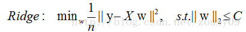
> 图 2

> 图 3
> 
> 将模型空间限制在w的一个L1-ball 中。为了便于可视化，我们考虑两维的情况，在(w1, w2)平面上可以画出目标函数的等高线，而约束条件则成为平面上半径为C的一个 norm ball 。等高线与 norm ball 首次相交的地方就是最优解：

#### 1.2.3.3. Dropout 介绍？

- 方式：Dropout 通过 修改ANN中隐藏层的神经元个数 来 防止过拟合
- 操作：训练时，随机删除一些隐藏层神经元，即让他们以一定概率不工作
  

> s1：在训练开始时，随机得删除一些（可以设定为一半，也可以为1/3，1/4等）隐藏层神经元，即认为这些神经元不存在，同时保持输入层与输出层神经元的个数不变;
> s2：然后按照BP学习算法对ANN中的参数进行学习更新（虚线连接的单元不更新，因为认为这些神经元被临时删除了）。这样一次迭代更新便完成了。下一次迭代中，同样随机删除一些神经元，与上次不一样，做随机选择。这样一直进行瑕疵，直至训练结束。

- 原因：由于每一轮都相当于在一个 新的 子网络上训练。那么最终得到的模型便是 无数个 子网络 共同训练 的成果，效果自然会更好

### 1.2.4. 归一化

#### 1.2.4.1. 为什么要归一化

因为 每一列 数据的量纲不同，导致 数据分布区间存在差异。（人的身高可以是 180cm，也可以是 1.8m，这两个虽然表示意义相同，但是由于单位的不同，导致 机器学习在计算过程中也容易出现差异，所以就需要对数据进行归一化）。

#### 1.2.4.2. 归一化 有 哪些方法？

- 线性比例变换法：

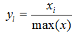

- 极差变换法：

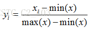

- 0 均值标准化（z-score 方法）：

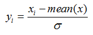

#### 1.2.4.3. 归一化 各方法 特点？

- 线性比例变换法 and 极差变换法
  - 特点：将原始数据线性化的方法转换到[0 1]的范围，该方法实现对原始数据的等比例缩放。通过利用变量取值的最大值和最小值（或者最大值）将原始数据转换为界于某一特定范围的数据，从而消除量纲和数量级影响，改变变量在分析中的权重来解决不同度量的问题。由于极值化方法在对变量无量纲化过程中仅仅与该变量的最大值和最小值这两个极端值有关，而与其他取值无关，这使得该方法在改变各变量权重时过分依赖两个极端取值。
- 0 均值标准化（z-score 方法）
  - 特点：即每一变量值与其平均值之差除以该变量的标准差。虽然该方法在无量纲化过程中利用了所有的数据信息，但是该方法在无量纲化后不仅使得转换后的各变量均值相同，且标准差也相同，即无量纲化的同时还消除了各变量在变异程度上的差异，从而转换后的各变量在聚类分析中的重要性程度是同等看待的。而实际分析中，经常根据各变量在不同单位间取值的差异程度大小来决定其在分析中的重要性程度，差异程度大的其分析权重也相对较大。

#### 1.2.4.4. 归一化 的 意义？

每个维度都是去量纲化的，避免了不同量纲的选取对距离计算产生的巨大影响。

#### 1.2.4.5. 哪些机器学习算法 需要做 归一化？

- 机器学习算法算法：
  - 基于距离计算的模型：KNN；
  - 通过梯度下降法求解的模型：线性回归、逻辑回归、支持向量机、神经网络

#### 1.2.4.6. 哪些机器学习算法 不需要做 归一化？

- 机器学习算法算法：
  - 树形模型：决策树、随机森林(Random Forest)
- 为什么：
  - 原因1：因为它们不关心变量的值，而是关心变量的分布和变量之间的条件概率；
  - 原因2：因为数值缩放不影响分裂点位置，对树模型的结构不造成影响。按照特征值进行排序的，排序的顺序不变，那么所属的分支以及分裂点就不会有不同。而且，树模型是不能进行梯度下降的，因为构建树模型（回归树）寻找最优点时是通过寻找最优分裂点完成的，因此树模型是阶跃的，阶跃点是不可导的，并且求导没意义，也就不需要归一化。

### 1.2.5 Normalization，BN/LN/WN [3]

#### 1.2.5.1 动机

##### 1.2.5.1.1 独立同分布（independent and identically distributed）与白化

- 独立同分布
  - 为什么？
    - 独立同分布的数据可以简化常规机器学习模型的训练、提升机器学习模型的预测能力
  - 相关性：
    - 强相关：Naive Bayes 模型就建立在特征彼此独立的基础之
    - 弱相关：Logistic Regression 和 神经网络 则在非独立的特征数据上依然可以训练出很好的模型
- 白化【数据预处理步骤】
  - 作用：
    - 去除特征间的相关性 -> 独立；
    - 使所有特征具有相同的均值和方差 -> 同分布

##### 1.2.5.1.2 （ Internal Covariate Shift，ICS）

- 动机：深度神经网络涉及到很多层的叠加，而每一层的参数更新会导致上层的输入数据分布发生变化，通过层层叠加，高层的输入分布变化会非常剧烈，这就使得高层需要不断去重新适应底层的参数更新。为了训好模型，我们需要非常谨慎地去设定学习率、初始化权重、以及尽可能细致的参数更新策略。
- 模型训练对于数据的一个假设：“源空间（source domain）和目标空间（target domain）的数据分布（distribution）是一致的”。如果不一致，那么就出现了新的机器学习问题，如 transfer learning / domain adaptation 等。而 covariate shift 就是分布不一致假设之下的一个分支问题，它是指源空间和目标空间的条件概率是一致的，但是其边缘概率不同；
- ICS 【每个神经元的输入数据不再是“独立同分布”】导致的后果：
  - 上层参数需要不断适应新的输入数据分布，降低学习速度;
  - 下层输入的变化可能趋向于变大或者变小，导致上层落入饱和区，使得学习过早停止;
  - 每层的更新都会影响到其它层，因此每层的参数更新策略需要尽可能的谨慎;

#### 1.2.5.2 Normalization 的通用框架与基本思想

- 前言

假设 神经元的输入：

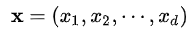

输出的结果：

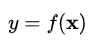

- ICS 问题： X 的 分布可能相差很大
- 解决方法一：
  -  方法：对每一层的数据做白化操作
  -  问题：成本高，因为要保证 白化操作是可微的

- 基本思想：在将 x 送给神经元之前，先对其做平移和伸缩变换， 将 x 的分布规范化成在固定区间范围的标准分布;
- 变换框架：

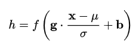

> 参数介绍： 
> μ：平移参数 
> δ：缩放参数 

- 步骤：
1. 对 x 进行 shift 和 scale 变换

> 得到的数据符合均值为 0、方差为 1 的标准分布

2.  b 是再平移参数（re-shift parameter）， g 是再缩放参数（re-scale parameter）,将 上一步得到的 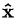 进一步变换为

> 得到的数据符合均值为 b 、方差为 $g^2$ 的分布

#### 1.2.5.3 主流 Normalization 方法梳理

##### 1.2.5.3.1 Batch Normalization —— 纵向规范化

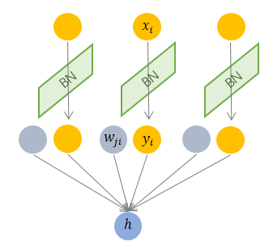

- 方式：针对单个神经元进行，利用网络训练时一个 mini-batch 的数据来计算该神经元 $x_i$ 的均值和方差,因而称为 Batch Normalization。

> 其中 M 是 mini-batch 的大小。

- 存在问题：
  - BN 独立地规范化每一个输入维度 $x_i$ ，但规范化的参数是一个 mini-batch 的一阶统计量和二阶统计量。这就要求 每一个 mini-batch 的统计量是整体统计量的近似估计，或者说每一个 mini-batch 彼此之间，以及和整体数据，都应该是近似同分布的。分布差距较小的 mini-batch 可以看做是为规范化操作和模型训练引入了噪声，可以增加模型的鲁棒性；但如果每个 mini-batch的原始分布差别很大，那么不同 mini-batch 的数据将会进行不一样的数据变换，这就增加了模型训练的难度。
  - 由于 BN 需要在运行过程中统计每个 mini-batch 的一阶统计量和二阶统计量，因此不适用于 动态的网络结构 和 RNN 网络

- 适用的场景是：每个 mini-batch 比较大，数据分布比较接近。在进行训练之前，要做好充分的 shuffle. 否则效果会差很多。

##### 1.2.5.3.2 Layer Normalization —— 横向规范化

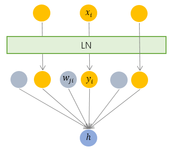

- 方式：综合考虑一层所有维度的输入，计算该层的平均输入值和输入方差，然后用同一个规范化操作来转换各个维度的输入。

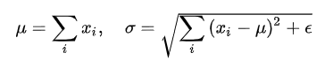

> 其中 i 枚举了该层所有的输入神经元。对应到标准公式中，四大参数 μ, δ, g, b 均为标量（BN中是向量），所有输入共享一个规范化变换。

- 优点：LN 针对单个训练样本进行，不依赖于其他数据，因此可以避免 BN 中受 mini-batch 数据分布影响的问题，可以用于 小mini-batch场景、动态网络场景和 RNN，特别是自然语言处理领域。此外，LN 不需要保存 mini-batch 的均值和方差，节省了额外的存储空间。
- LN vs BN ：BN 的转换是针对单个神经元可训练的——不同神经元的输入经过再平移和再缩放后分布在不同的区间，而 LN 对于一整层的神经元训练得到同一个转换——所有的输入都在同一个区间范围内。如果不同输入特征不属于相似的类别（比如颜色和大小），那么 LN 的处理可能会降低模型的表达能力。

##### 1.2.5.3.3 Weight Normalization —— 参数规范化 [3]

##### 1.2.5.3.4 Cosine Normalization —— 余弦规范化 [3]

#### 1.2.5.4 主流 Normalization 方法为什么有效？

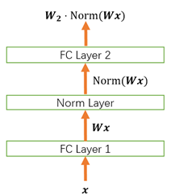

1. Normalization 的权重伸缩不变性
   
- 介绍：权重 W 按照常量 λ 进行伸缩时，得到的规范化后的值保持不变

> 其中：W' = λW

- 原因：当权重 W 伸缩时，对应的均值和标准差均等比例伸缩，分子分母相抵。

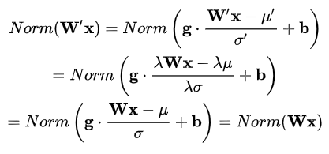

- 优点：
  - 权重伸缩不变性可以有效地提高反向传播的效率

> 注：因此，权重的伸缩变化不会影响反向梯度的 Jacobian 矩阵，因此也就对反向传播没有影响，避免了反向传播时因为权重过大或过小导致的梯度消失或梯度爆炸问题，从而加速了神经网络的训练。

  - 权重伸缩不变性还具有参数正则化的效果，可以使用更高的学习率。

> 因此，下层的权重值越大，其梯度就越小。这样，参数的变化就越稳定，相当于实现了参数正则化的效果，避免参数的大幅震荡，提高网络的泛化性能。

2. Normalization 的数据伸缩不变性

- 介绍：当数据 x 按照常量 λ 进行伸缩时，得到的规范化后的值保持不变

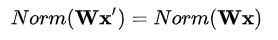

> 注：x'= λx

- 优点：
  - 数据伸缩不变性可以有效地减少梯度弥散，简化对学习率的选择

对于某一层神经元 ：

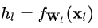

可得：

每一层神经元的输出依赖于底下各层的计算结果。如果没有正则化，当下层输入发生伸缩变化时，经过层层传递，可能会导致数据发生剧烈的膨胀或者弥散，从而也导致了反向计算时的梯度爆炸或梯度弥散。

加入 Normalization 之后，不论底层的数据如何变化，对于某一层神经元 而言，其输入 $x_i$ 永远保持标准的分布，这就使得高层的训练更加简单。从梯度的计算公式来看：

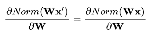

数据的伸缩变化也不会影响到对该层的权重参数更新，使得训练过程更加鲁棒，简化了对学习率的选择。

### 1.2.6 激活函数 [4]

#### 1.2.6.1 深度模型中为什么要使用 激活函数？

1. 数据角度：由于数据是线性不可分的，如果采用线性化，那么需要复杂的线性组合去逼近问题，因此需要非线性变换对数据分布进行重新映射；
2. 线性模型的表达力问题：提供网络的非线性建模能力。如果没有激活函数，那么该网络仅能够表达线性映射，此时即便有再多的隐藏层，其整个网络跟单层神经网络也是等价的。因此也可以认为，只有加入了激活函数之后，深度神经网络才具备了分层的非线性映射学习能力；

#### 1.2.6.2 激活函数有哪些？

##### 1.2.6.2.1 sigmoid

- 介绍：能够把输入的连续实值变换为0和1之间的输出，特别的，如果是非常大的负数，那么输出就是0；如果是非常大的正数，输出就是1；
- 公式

- 图像

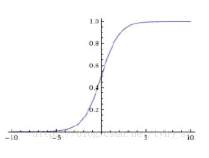

- 缺点：
  - 1) 在深度神经网络中梯度反向传递时导致梯度爆炸和梯度消失，其中梯度爆炸发生的概率非常小，而梯度消失发生的概率比较大；
  - 2)output 不是0均值（即zero-centered）；
  - 3)幂函数耗时

##### 1.2.6.2.2 tanh

- 介绍：解决 非 0 均值 问题；
- 函数：

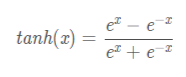
- 函数及其导数的图像

- 缺点：
  - 1) 在深度神经网络中梯度反向传递时导致梯度爆炸和梯度消失，其中梯度爆炸发生的概率非常小，而梯度消失发生的概率比较大；
  - 2)幂函数耗时

##### 1.2.6.2.3 relu

- 特点：
  - 决了gradient vanishing问题 (在正区间)；
  - 计算速度非常快，只需要判断输入是否大于0；
  - 收敛速度远快于sigmoid和tanh；
- 函数：

- 函数及其导数的图像

- 缺点：
  - 1) ReLU的输出不是zero-centered；
  - 2) Dead ReLU Problem，指的是某些神经元可能永远不会被激活，导致相应的参数永远不能被更新；

##### 1.2.6.2.4 Leaky ReLU函数（PReLU）

- 介绍：人们为了解决Dead ReLU Problem，提出了将ReLU的前半段设为αx 而非0，通常α = 0.01 。另外一种直观的想法是基于参数的方法。
- 特点：
  - 不会有Dead ReLU问题
- 函数：

- 函数及其导数的图像

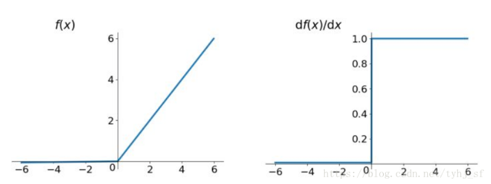

#### 1.2.6.2 激活函数有什么用？

引入非线性因素

##  三、机器算法篇

### 3.1 什么是支持向量机（support vector machine，SVM）？

#### 3.1.1 支持向量机（support vector machine，SVM）的原理？

- 介绍：支持向量机，因其英文名为support vector machine，故一般简称SVM；
- 类型：一种二类分类模型；
- 基本模型定义：特征空间上的间隔最大的线性分类器，其学习策略便是间隔最大化，最终可转化为一个凸二次规划问题的求解。
- 非线性分类器 原理：核函数
- 学习策略：间隔最大化。可形式化为一个求解凸二次规划的问题，也等价于正则化的合页损失函数的最小化问题；
- 学习算法：求解凸二次规划的最优化算法
- 目标：求解能够正确划分训练数据集并且几何间隔最大的分离超平面

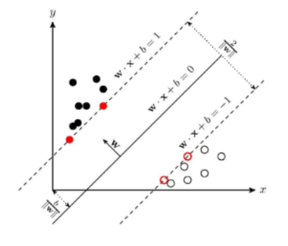

### 3.1.2 用一到两句话说一下SVM是如何用于分类的？

支持向量机(SVM)是一种二分类模型，其基本模型是定义在特征空间上的间隔最大化的线性分类器。

### 3.2 逻辑回归（Logistic Regression） 是什么？

#### 3.2.1 逻辑回归（Logistic Regression） 的原理是什么？

##  四、集成学习算法篇

### 4.1 介绍篇

#### 4.1.1 集成学习的基本思想是什么？

结合多个学习器组合成一个性能更好的学习器

#### 4.1.2 集成学习为什么有效？

不同的模型通常会在测试集上产生不同的误差；如果成员的误差是独立的，集成模型将显著地比其成员表现更好。

### 4.2 Boosting 篇

#### 4.2.1 用一句话概括 Boosting？

Boosting 应用 迭代式学习 的方式进行学习

#### 4.2.2 Boosting 的特点是什么？

Boosting 分类器间存在依赖关系，基学习器之间存在依赖关系，新的学习器需要根据上一个学习器生成。

#### 4.2.3 Boosting 的基本思想是什么？

- s1：先从初始训练集训练一个基学习器；初始训练集中各样本的权重是相同的；
- s2：根据上一个基学习器的表现，调整样本权重，使分类错误的样本得到更多的关注；
- s3：基于调整后的样本分布，训练下一个基学习器；
- s4：测试时，对各基学习器加权得到最终结果；

#### 4.2.4 Boosting 的特点是什么？

每次学习都会使用全部训练样本

####  4.2.5 GBDT 是什么？

- 思想：每一棵树学习的是之前所有树的整体预测和标签的误差；
- 举例说明：假如有个人30岁，我们首先用20岁去拟合，发现损失有10岁，这时我们用6岁去拟合剩下的损失，发现差距还有4岁，第三轮我们用3岁拟合剩下的差距，差距就只有一岁了。如果我们的迭代轮数还没有完，可以继续迭代下面，每一轮迭代，拟合的岁数误差都会减小。

####  4.2.6 Xgboost 是什么？

- 思想：不断地添加树，不断地进行特征分裂来生长一棵树，每次添加一个树，其实是学习一个新函数，去拟合上次预测的残差。当我们训练完成得到k棵树，我们要预测一个样本的分数，其实就是根据这个样本的特征，在每棵树中会落到对应的一个叶子节点，每个叶子节点就对应一个分数，最后只需要将每棵树对应的分数加起来就是该样本的预测值。

### 4.3 Bagging 篇

#### 4.3.1 用一句话概括 Bagging？

Bagging 应用 基于并行策略 的方式进行学习

#### 4.3.2 Bagging 的特点是什么？

基学习器之间不存在依赖关系，可同时生成.

#### 4.2.3 Bagging 的基本思想是什么？

- s1：利用自助采样法对训练集随机采样，重复进行 T 次;
- s2：基于每个采样集训练一个基学习器，并得到 T 个基学习器；
- s3：预测时，集体**投票决策****。

#### 4.3.4 Bagging 的基分类器如何选择？

所用基分类器最好本身对样本分布较为敏感（不稳定性）

#### 4.3.5 Bagging 的优点 是什么？

集成后分类器方差比基分类器的小

#### 4.3.6 Bagging 的特点是什么？

- 训练每个基学习器时只使用一部分样本；
- 偏好不稳定的学习器作为基学习器。所谓不稳定的学习器，指的是对样本分布较为敏感的学习器

#### 4.3.7 随机森林 是什么？

- 思想：用随机的方式建立一个森林，森林里面有很多的决策树组成，随机森林的每一棵决策树之间是没有关联的。在得到森林之后，当有一个新的输 入样本进入的时候，就让森林中的每一棵决策树分别进行一下判断，对于分类算法，看看这个样本应该属于哪一类，然后看看哪一类被选择最多，就预测这个样本为那一类。对回归问题，计算k个模型的均值作为最后的结果。

### 4.4 Stacking 篇

#### 4.4.1 用一句话概括 Stacking ？

Stacking 应用 基于串行策略 的方式进行学习

#### 4.4.2 Stacking 的特点是什么？

初级学习器与次级学习器之间存在依赖关系，初学习器的输出作为次级学习器的输入

#### 4.4.3 Stacking 的基本思路是什么？

- s1：先从初始训练集训练 T 个不同的初级学习器;
- s2：利用每个初级学习器的输出构建一个次级数据集，该数据集依然使用初始数据集的标签；
- s3：根据新的数据集训练次级学习器；
- s4：多级学习器的构建过程类似；

## 参考

1. [机器学习面试150题：不只是考SVM xgboost 特征工程（1-50）](https://zhuanlan.zhihu.com/p/213774840)
2. [机器学习面试150题：不只是考SVM xgboost 特征工程（51-100）](https://zhuanlan.zhihu.com/p/217494137)
3. [详解深度学习中的Normalization，BN/LN/WN](https://zhuanlan.zhihu.com/p/33173246)
4. [常用激活函数（激励函数）理解与总结](https://blog.csdn.net/tyhj_sf/article/details/79932893)

