# 【关于 AAAI 】那些你不知道的事

- [【关于 AAAI 】那些你不知道的事](#关于-aaai-那些你不知道的事)
  - [一、AAAI 2020](#一aaai-2020)
    - [1.1 情感分析](#11-情感分析)
      - [【Learning Modality-Specific Representations with Self-Supervised Multi-Task Learning for Multimodal Sentiment Analysis (Self-MM)】 [github](https://github.com/thuiar/Self-MM)](#learning-modality-specific-representations-with-self-supervised-multi-task-learning-for-multimodal-sentiment-analysis-self-mm-github)
      - [【An Adaptive Hybrid Framework for Cross-Domain Aspect-Based Sentiment Analysis (AHF)】](#an-adaptive-hybrid-framework-for-cross-domain-aspect-based-sentiment-analysis-ahf)
      - [【Bridging Towers of Multi-Task Learning with a Gating Mechanism for Aspect-Based Sentiment Analysis and Sequential Metaphor Identification ()】](#bridging-towers-of-multi-task-learning-with-a-gating-mechanism-for-aspect-based-sentiment-analysis-and-sequential-metaphor-identification-)
      - [【Human-Level Interpretable Learning for Aspect-Based Sentiment Analysis ()】](#human-level-interpretable-learning-for-aspect-based-sentiment-analysis-)
      - [【A Joint Training Dual-MRC Framework for Aspect Based Sentiment Analysis ()】](#a-joint-training-dual-mrc-framework-for-aspect-based-sentiment-analysis-)
      - [【Quantum Cognitively Motivated Decision Fusion for Video Sentiment Analysis ()】](#quantum-cognitively-motivated-decision-fusion-for-video-sentiment-analysis-)
      - [【Context-Guided BERT for Targeted Aspect-Based Sentiment Analysis ()】](#context-guided-bert-for-targeted-aspect-based-sentiment-analysis-)
      - [【Segmentation of Tweets with URLs and its Applications to Sentiment Analysis ()】](#segmentation-of-tweets-with-urls-and-its-applications-to-sentiment-analysis-)
      - [【Segmentation of Tweets with URLs and its Applications to Sentiment Analysis ()】](#segmentation-of-tweets-with-urls-and-its-applications-to-sentiment-analysis--1)
    - [1.2 命名实体识别](#12-命名实体识别)
      - [【Multi-Modal Graph Fusion for Named Entity Recognition with Targeted Visual Guidance (UMGF)】](#multi-modal-graph-fusion-for-named-entity-recognition-with-targeted-visual-guidance-umgf)
      - [【CrossNER: Evaluating Cross-Domain Named Entity Recognition ()】 【[github](https://github.com/zliucr/CrossNER)】](#crossner-evaluating-cross-domain-named-entity-recognition--github)
      - [【A Supervised Multi-Head Self-Attention Network for Nested Named Entity Recognition ()】](#a-supervised-multi-head-self-attention-network-for-nested-named-entity-recognition-)
      - [【Nested Named Entity Recognition with Partially-Observed TreeCRFs (Partially-Observed-TreeCRFs)】 【[github](https://github.com/FranxYao/Partially-Observed-TreeCRFs)】](#nested-named-entity-recognition-with-partially-observed-treecrfs-partially-observed-treecrfs-github)
      - [【Continual Learning for Named Entity Recognition】 [***]](#continual-learning-for-named-entity-recognition-)
      - [【Knowledge-Aware Named Entity Recognition with Alleviating Heterogeneity】](#knowledge-aware-named-entity-recognition-with-alleviating-heterogeneity)
      - [【Denoising Distantly Supervised Named Entity Recognition via a Hypergeometric Probabilistic Model】](#denoising-distantly-supervised-named-entity-recognition-via-a-hypergeometric-probabilistic-model)
      - [【MTAAL: Multi-Task Adversarial Active Learning for Medical Named Entity Recognition and Normalization（MTAAL）】](#mtaal-multi-task-adversarial-active-learning-for-medical-named-entity-recognition-and-normalizationmtaal)
    - [1.3 关系抽取](#13-关系抽取)
      - [【FL-MSRE: A Few-Shot Learning Based Approach to Multimodal Social Relation Extraction（L-MSRE）】](#fl-msre-a-few-shot-learning-based-approach-to-multimodal-social-relation-extractionl-msre)
      - [【Multi-View Inference for Relation Extraction with Uncertain Knowledge】](#multi-view-inference-for-relation-extraction-with-uncertain-knowledge)
      - [【GDPNet: Refining Latent Multi-View Graph for Relation Extraction（GDPNet）】](#gdpnet-refining-latent-multi-view-graph-for-relation-extractiongdpnet)
      - [【Progressive Multi-Task Learning with Controlled information Flow for Joint Entity and Relation Extraction】](#progressive-multi-task-learning-with-controlled-information-flow-for-joint-entity-and-relation-extraction)
      - [【Curriculum-Meta Learning for Order-Robust Continual Relation Extraction】 【[github](https://github.com/wutong8023/AAAI_CML)】](#curriculum-meta-learning-for-order-robust-continual-relation-extraction-github)
      - [【Document-Level Relation Extraction with Reconstruction】](#document-level-relation-extraction-with-reconstruction)
      - [【Document-Level Relation Extraction with Adaptive Thresholding and Localized Context Pooling(ATLOP )】  【[github](https://github.com/wzhouad/ATLOP)】](#document-level-relation-extraction-with-adaptive-thresholding-and-localized-context-poolingatlop---github)
      - [【Entity Structure Within and Throughout: Modeling Mention Dependencies for Document Level Relation Extraction（SSAN）】  【[PaddlePaddle/Research](https://github.com/PaddlePaddle/Research/tree/master/KG/AAAI2021_SSAN)】 【[BenfengXu/SSAN](https://github.com/BenfengXu/SSAN)】](#entity-structure-within-and-throughout-modeling-mention-dependencies-for-document-level-relation-extractionssan--paddlepaddleresearch-benfengxussan)
      - [【Empower Distantly Supervised Relation Extraction with Collaborative Adversarial Training(  MULTICAST)】](#empower-distantly-supervised-relation-extraction-with-collaborative-adversarial-training--multicast)
      - [【Clinical Temporal Relation Extraction with Probabilistic Soft Logic Regularization and Global Inference（CTRL-PG）】  【[github](https://github.com/yuyanislearning/CTRL-PG)】](#clinical-temporal-relation-extraction-with-probabilistic-soft-logic-regularization-and-global-inferencectrl-pg--github)
      - [【A Unified Multi-Task Learning Framework for Joint Extraction of Entities and Relations】](#a-unified-multi-task-learning-framework-for-joint-extraction-of-entities-and-relations)
    - [1.4 事件抽取](#14-事件抽取)
      - [【A Unified Multi-Task Learning Framework for Joint Extraction of Entities and Relations】](#a-unified-multi-task-learning-framework-for-joint-extraction-of-entities-and-relations-1)
      - [【What the Role Is vs. What Plays the Role: Semi-Supervised Event Argument Extraction via Dual Question Answering（DualQA）】](#what-the-role-is-vs-what-plays-the-role-semi-supervised-event-argument-extraction-via-dual-question-answeringdualqa)
      - [【Span-Based Event Coreference Resolution】](#span-based-event-coreference-resolution)
    - [1.5 知识图谱](#15-知识图谱)
      - [【Dual Quaternion Knowledge Graph Embeddings(DualE)】](#dual-quaternion-knowledge-graph-embeddingsduale)
      - [【Type-Augmented Relation Prediction in Knowledge Graphs】](#type-augmented-relation-prediction-in-knowledge-graphs)
      - [【ChronoR: Rotation Based Temporal Knowledge Graph Embedding】](#chronor-rotation-based-temporal-knowledge-graph-embedding)
      - [【PASSLEAF: A Pool-Based Semi-Supervised Learning Framework for Uncertain Knowledge Graph Embedding】](#passleaf-a-pool-based-semi-supervised-learning-framework-for-uncertain-knowledge-graph-embedding)
      - [【KG-BART: Knowledge Graph-Augmented Bart for Generative Commonsense Reasoning】](#kg-bart-knowledge-graph-augmented-bart-for-generative-commonsense-reasoning)
      - [【Answering Complex Queries in Knowledge Graphs with Bidirectional Sequence Encoders】](#answering-complex-queries-in-knowledge-graphs-with-bidirectional-sequence-encoders)
      - [【其他】](#其他)
  - [参考](#参考)

## 一、AAAI 2020

### 1.1 情感分析

#### [【Learning Modality-Specific Representations with Self-Supervised Multi-Task Learning for Multimodal Sentiment Analysis (Self-MM)】](https://arxiv.org/abs/2102.04830) [github](https://github.com/thuiar/Self-MM)

- 作者：Wenmeng Yu, Hua Xu, Ziqi Yuan, Jiele Wu
- 机构：State Key Laboratory of Intelligent Technology and Systems, Department of Computer Science and Technology, Tsinghua University, Beijing, China
- 介绍：表示学习是多模态学习中一项重要且具有挑战性的任务。**有效的模态表示应该包含两部分特征：一致性和差异性。**
- 动机：由于统一的多模态注释，现有方法在捕获差异化信息方面受到限制。然而，额外的单模态注释是高时间和劳动力成本。
- 论文方法：
  - 设计了一个**基于自监督学习策略的标签生成模块来获得独立的单峰监督**。
  - 联合训练多模态和单模态任务，分别学习一致性和差异性。
  - 在训练阶段，设计了权重调整策略来平衡不同子任务之间的学习进度。即引导子任务专注于模态监督差异较大的样本。
- 实验结果：对三个公共多模态基线数据集进行了广泛的实验。实验结果验证了自动生成的单模态监督的可靠性和稳定性。在 MOSI 和 MOSEI 数据集上，我们的方法超越了当前最先进的方法。在 SIMS 数据集上，我们的方法实现了与人工注释的单峰标签相当的性能。

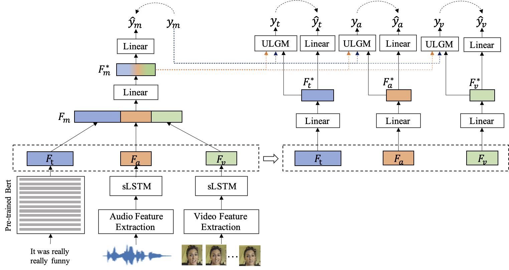

#### [【An Adaptive Hybrid Framework for Cross-Domain Aspect-Based Sentiment Analysis (AHF)】](https://www.aaai.org/AAAI21Papers/AAAI-2184.ZhouY.pdf) 

- 作者：Yan Zhou1,2, Fuqing Zhu1*, Pu Song1,2, Jizhong Han1, Tao Guo1, Songlin Hu1,2*
- 机构：Institute of Information Engineering, Chinese Academy of Sciences, Beijing, China2School of Cyber Security, University of Chinese Academy of Sciences, Beijing, China
- 介绍：基于跨域aspect的情感分析旨在利用源域中的有用知识来提取aspectterm并预测它们在目标域中的情感极性。最近，基于对抗性训练的方法已应用于此任务并取得了可喜的成果。在这些方法中，源数据和目标数据都被用来通过欺骗域鉴别器来学习域不变特征。
- 动机：任务分类器只对源数据进行训练，导致目标数据中的aspect和sentiment信息无法被任务分类器利用。
- 论文方法：提出了一种用于 Cross-Domain Aspect-Based 的情感分析的自适应混合框架（AHF）。我们将基于伪标签的半监督学习和对抗性训练集成到一个统一的网络中。因此，目标数据不仅可以通过域鉴别器的训练来对齐特征，还可以用于细化任务分类器。此外，我们设计了一个自适应平均教师作为我们网络的半监督部分，它可以减轻噪声伪标签对目标数据产生的影响。
- 实验结果：对四个公共数据集进行了实验，实验结果表明我们的框架明显优于最先进的方法

#### [【Bridging Towers of Multi-Task Learning with a Gating Mechanism for Aspect-Based Sentiment Analysis and Sequential Metaphor Identification ()】](hhttps://ojs.aaai.org/index.php/AAAI/article/view/17596) 

- 作者：Rui Mao
- 介绍：多任务学习（MTL）已广泛应用于自然语言处理。一个主要任务及其相关的辅助任务共享同一个编码器；因此，MTL 编码器可以学习主要任务和辅助任务之间的共享抽象信息。然后在共享编码器上使用特定于任务的塔来学习特定于任务的信息。以前的工作表明，在特定任务的塔之间交换信息会产生额外的收益。这被称为软参数共享 MTL。
- 论文方法：在本文中，我们提出了一种用于桥接 MTL 塔的新型门控机制。我们的方法 Aspect-Based 的情感分析和顺序隐喻识别任务进行评估。
- 实验结果：在两个任务上都可以产生比基线更好的性能。基于相同的 Transformer 主干，我们将我们的门控机制与其他信息转换机制进行了比较，例如十字绣、注意力和香草门控。实验表明，我们的方法也超越了这些基线。

#### [【Human-Level Interpretable Learning for Aspect-Based Sentiment Analysis ()】](https://www.aaai.org/AAAI21Papers/AAAI-5282.YadavR.pdf) 

- 作者：Rohan Kumar Yadav, Lei Jiao, Ole-Christoffer Granmo, Morten Goodwin
- 机构：Centre for Artificial Intelligence ResearchUniversity of Agder
- 论文方法：本文提出了一种 Aspect-Based 的情感分析 (ABSA) 的人类可解释学习方法，采用了最近引入的 Tsetlin 机器 (TM)。我们通过将复杂的位置相关文本语义转换为二进制形式，将所有特征映射到词袋 (BOW) 中来获得可解释性。对二进制形式的 BOW 进行编码，以便保留有关方面和上下文词的信息以进行情感分类。我们进一步采用 theBOW 作为 TM 的输入，从而能够学习命题逻辑中 Aspect-Based 的情感模式。
- 实验结果：为了评估可解释性和准确性，我们对来自 SemEval 2014 的两个广泛使用的 ABSA 数据集进行了实验：Restau-rant 14 和 Laptop 14。这些实验展示了每个相关特征如何参与包含相应方面上下文信息的连接从句词，展示了人类级别的可解释性。同时，获得的准确率与现有的神经网络模型相当，在 Restaurant 14 上达到了 78.02%，在 Laptop 14 上达到了 73.51%。

#### [【A Joint Training Dual-MRC Framework for Aspect Based Sentiment Analysis ()】](https://arxiv.org/abs/2101.00816) 

- 作者：Yue Mao, Yi Shen, Chao Yu, Longjun Cai
- 介绍：Aspect-Based 的情感分析 (ABSA) 涉及三个基本子任务：**aspect term extraction, opinion term extraction, and aspect-level sentiment classification**。早期的工作只专注于单独解决这些子任务之一。最近的一些工作侧重于解决两个子任务的组合，例如，aspect term extraction 以及 sentiment polarities or extracting the aspect and opinion terms pair-wisely。
- 动机：最近提出了三元组提取任务，即从句子中提取（方面项、意见项、情感极性）三元组。然而，以前的方法无法在统一的端到端框架中解决所有子任务。
- 论文方法：为 ABSA 提出了一个完整的解决方案。我们构建了两个机器阅读理解（MRC）问题，并通过联合训练两个共享参数的 BERT-MRC 模型来解决所有子任务。
- 实验结果：我们对这些子任务进行了实验，在几个基准数据集上的结果证明了我们提出的框架的有效性，它明显优于现有的最先进方法。

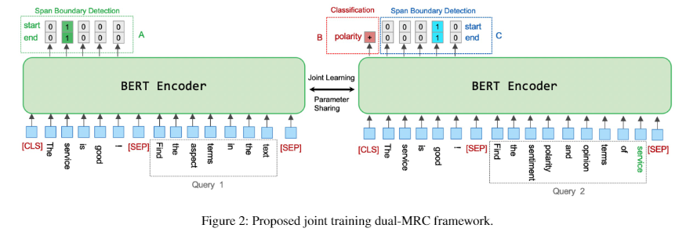

#### [【Quantum Cognitively Motivated Decision Fusion for Video Sentiment Analysis ()】](https://arxiv.org/abs/2101.04406) 

- 作者：Dimitris Gkoumas, Qiuchi Li, Shahram Dehdashti, Massimo Melucci, Yijun Yu, Dawei Song
- 介绍：视频情感分析作为一个决策过程本质上是复杂的，涉及来自多种模式的决策和由此引起的认知偏差的融合。
- 动机：受量子认知最新进展的启发，我们表明来自一种模态的情绪判断可能与来自另一种模态的判断不相容，即顺序很重要，它们不能联合测量以产生最终决定。因此，认知过程表现出经典概率理论无法捕捉到的“类量子”偏差。
- 方法：提出了一种全新的、量子认知驱动的融合策略，用于预测情绪判断。特别是，我们将话语表述为正面和负面情绪判断的量子叠加态，并将单模态分类器表述为互不相容的可观察量，在复值希尔伯特空间中，具有正运算符值度量。在两个基准数据集上的实验表明，我们的模型明显优于各种现有的决策级别和一系列最先进的内容级别融合方法。
- 结果还表明，不兼容的概念允许有效处理所有组合模式，包括那些被所有单模态分类器错误预测的极端情况。

#### [【Context-Guided BERT for Targeted Aspect-Based Sentiment Analysis ()】](https://arxiv.org/abs/2010.07523) 

- 作者：Zhengxuan Wu, Desmond C. Ong
- 介绍：Aspect-Based 的情感分析 (ABSA) 和有针对性的 ASBA (TABSA) 允许根据上下文从同一文本中对情感进行更细粒度的推断。例如，给定的文本可以有不同的目标（例如，邻里）和不同的 Aspect （例如，价格或安全），每个目标-Aspect 对关联不同的情绪。
- 论文方法：我们研究了向自注意力模型添加上下文是否可以提高 (T)ABSA 的性能。我们提出了上下文引导的 BERT (CG-BERT) 的两种变体，它们学习在不同的上下文中分配注意力。我们首先采用上下文感知 Transformer 来生成使用上下文引导的 softmax-attention 的 CG-BERT。接下来，我们提出了一种改进的 Quasi-Attention CG-BERT 模型，该模型学习支持减法注意力的组合注意力。
- 实验结果：我们在两个 (T)ABSA 数据集上使用预训练的 BERT 训练两个模型：SentiHood 和 SemEval-2014（任务 4）。我们的 QACG-BERT 模型具有最佳性能，这两种模型都取得了最新的最新结果。此外，我们还分析了我们提出的模型中上下文的影响。我们的工作为将上下文相关性添加到基于上下文的自然语言任务的预训练的基于自我注意的语言模型的效用提供了更多证据。

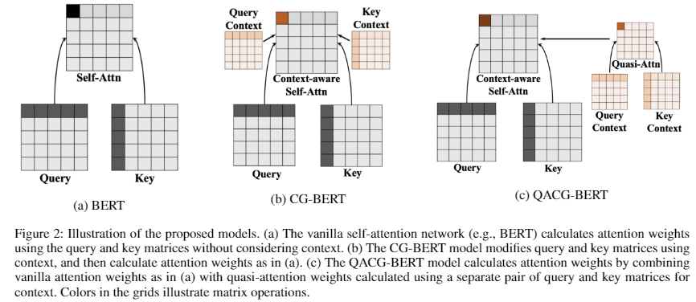

#### [【Segmentation of Tweets with URLs and its Applications to Sentiment Analysis ()】](https://ojs.aaai.org/index.php/AAAI/article/view/17480) 

- 作者：Weiyi Meng
- 介绍：在社交媒体平台中传播信息的一种重要方式是在用户帖子中包含指向外部来源的 URL。在 Twitter 中，我们估计每天大约 21% 的英语推文流包含 URL。
- 动机：我们注意到 NLP 工具很少尝试理解 URL 内容与推文中围绕它的文本之间的关系。
- 论文方法：研究了带有与 URL 指向的 Web 文档内容相关的 URL 的推文结构。我们确定了可能出现在带有 URL 的推文中的几个细分类别，例如网页的标题和用户的原始内容。我们在本文中的目标是：介绍、定义和分析带有 URL 的推文分割问题，开发一种有效的算法来解决它，并表明我们的解决方案可以有益于 Twitter 上的情感分析。我们还表明该问题是块编辑距离问题的一个实例，因此是一个 NP-hard 问题。

#### [【Segmentation of Tweets with URLs and its Applications to Sentiment Analysis ()】](https://www.aaai.org/AAAI21Papers/AAAI-10076.ZhouD.pdf) 

- 作者：Deyu Zhou1∗, Meng Zhang1, Linhai Zhang1, Yulan He2
- 介绍：通过引入用户信息以考虑每个人的偏好和语言使用，对用户生成内容的情感分析取得了显着进展。
- 动机：现有的大多数方法都忽略了数据稀疏问题，即一些用户的内容有限，模型无法捕捉用户的判别特征。
- 论文方法：为了解决这个问题，我们假设可以根据用户的评分偏差和评分一致性程度将用户分组在一起，并且可以利用从组中学到的知识来分析数据有限的用户。因此，本文提出了一种具有数据稀疏意识的神经分组情感分析模型。以用户为中心的文档表示是通过结合基于组的用户编码器生成的。此外，采用多任务学习框架对用户的评分偏差及其评分一致性程度进行联合建模。一项任务是 vanillapopulation 级别的情感分析，另一项任务是分组情感分析。
- 实验结果：在三个真实世界数据集上的实验结果表明，所提出的方法优于一些最先进的方法。此外，模型分析和案例研究证明了其对用户评分偏差和方差建模的有效性

### 1.2 命名实体识别

#### [【Multi-Modal Graph Fusion for Named Entity Recognition with Targeted Visual Guidance (UMGF)】](https://www.aaai.org/AAAI21Papers/AAAI-2753.ZhangD.pdf) 

- 作者：Dong Zhang,1Suzhong Wei,2Shoushan Li,1∗Hanqian Wu,2Qiaoming Zhu,1Guodong Zhou1
- 介绍：多模态命名实体识别 (MNER) 旨在发现自由文本中的命名实体，并将它们分类为带有图像的预定义类型。
- 动机：占主导地位的 MNER 模型并没有充分利用不同模态语义单元之间的细粒度语义对应关系，这有可能改进多模态表示学习。
- 论文方法： 提出了一种统一的多模态图融合（UMGF）方法。
  - 首先使用统一的多模态图来表示输入的句子和图像，该图捕获了多模态语义单元（单词和视觉对象）之间的各种语义关系。
  - 然后，我们堆叠多个基于图的多模态融合层，这些层迭代地执行语义交互以学习节点表示。
  - 最后，我们使用 CRF 解码器为每个单词和性能标记实现了基于注意力的多模态表示。
- 实验结果：在两个基准数据集上的实验证明了我们的 MNER 模型的优越性。

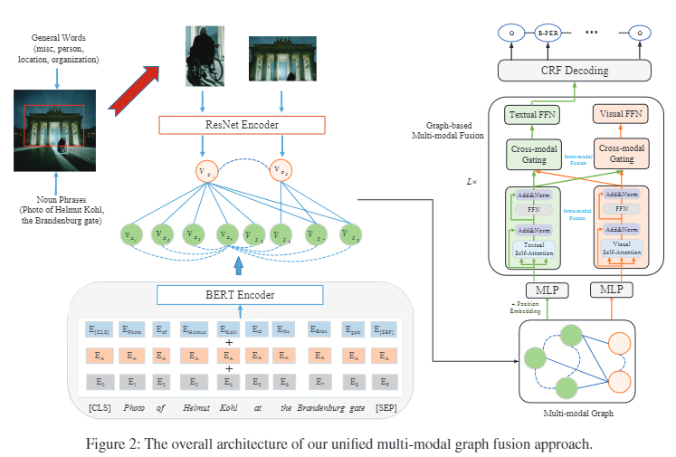

#### [【CrossNER: Evaluating Cross-Domain Named Entity Recognition ()】](https://arxiv.org/abs/2012.04373) 【[github](https://github.com/zliucr/CrossNER)】

- 作者：Zihan Liu, Yan Xu, Tiezheng Yu, Wenliang Dai, Ziwei Ji, Samuel Cahyawijaya, Andrea Madotto, Pascale Fung
- 介绍：跨域命名实体识别 (NER) 模型能够解决目标域中 NER 样本的稀缺问题。
- 动机：大多数现有的 NER 基准缺乏专门领域的实体类型或不关注某个领域，导致跨领域评估效率较低。
- 论文方法：引入了跨域 NER 数据集 (CrossNER)，这是一个完全标记的 NER 数据集合，跨越五个不同的域，具有针对不同域的专门实体类别。此外，我们还提供了一个领域相关的语料库，因为使用它来继续预训练语言模型（领域自适应预训练）对于领域适应是有效的。然后，我们进行了全面的实验，以探索利用不同级别的领域语料库和预训练策略对跨领域任务进行领域自适应预训练的有效性。
- 实验结果：结果表明，专注于包含领域专用实体的分数语料库并在领域自适应预训练中利用更具挑战性的预训练策略有利于 NER 域适应，并且我们提出的方法可以始终优于现有的跨域 NER 基线.尽管如此，实验也说明了这种跨域 NER 任务的挑战。我们希望我们的数据集和基线能够促进 NER 域适应领域的研究。

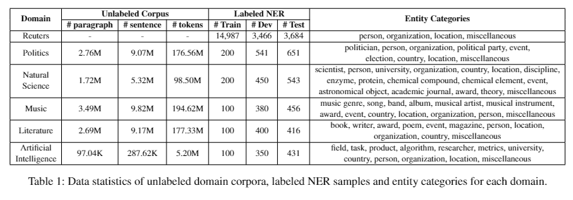

#### [【A Supervised Multi-Head Self-Attention Network for Nested Named Entity Recognition ()】](https://www.aaai.org/AAAI21Papers/AAAI-6288.XuY.pdf) 

- 作者：Yongxiu Xu,1Heyan Huang,2*Chong Feng,2Yue Hu1
- 介绍：近年来，研究人员对识别具有嵌套结构的重叠实体表现出越来越大的兴趣。
- 动机：大多数现有模型忽略了不同实体类型下单词之间的语义相关性。考虑到句子中的单词在不同的实体类型下扮演不同的角色，我们认为应该考虑句子中每个实体类型的成对单词的相关强度。
- 论文方法：将命名实体识别视为词对的多类分类，
  - 设计了一个简单的神经模型来处理这个问题。我们的模型应用有监督的多头自注意力机制，其中每个头对应一种实体类型，以构建每种类型的词级相关性。我们的模型可以根据相应类型下其头尾的相关强度灵活地预测跨度类型。
  - 通过多任务学习框架融合了实体边界检测和实体分类，可以捕获这两个任务之间的依赖关系。
- 实验结果：为了验证我们模型的性能，我们对嵌套和平面数据集进行了大量实验。实验结果表明，我们的模型在没有任何额外的 NLP 工具或人工注释的情况下，在多项任务上的表现优于之前的最先进方法

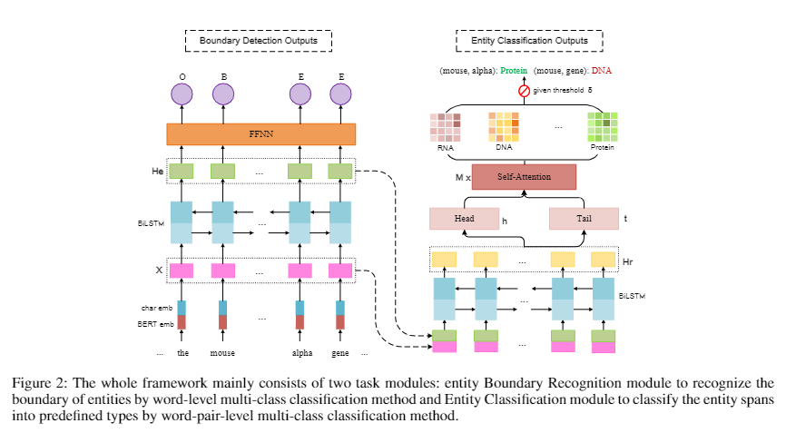

#### [【Nested Named Entity Recognition with Partially-Observed TreeCRFs (Partially-Observed-TreeCRFs)】](hhttps://arxiv.org/abs/2012.08478) 【[github](https://github.com/FranxYao/Partially-Observed-TreeCRFs)】

- 作者：Yao Fu, Chuanqi Tan, Mosha Chen, Songfang Huang, Fei Huang
- 介绍：命名实体识别 (NER) 是自然语言处理中一项经过充分研究的任务。
- 动机：广泛使用的序列标记框架很难检测具有嵌套结构的实体。
- 论文方法：
  - 将嵌套 NER 视为使用部分观察到的树进行选区解析，并使用部分观察到的 TreeCRF 对其进行建模。具体来说，将所有标记的实体跨度视为选区树中的观察节点，将其他跨度视为潜在节点。
  - 使用 TreeCRF，我们实现了一种统一的方式来联合建模观察到的和潜在的节点。
  - 为了计算部分边缘化的部分树的概率，提出了一种内部算法的变体，\textsc{Masked Inside} 算法，它支持不同节点的不同推理操作（对观察的评估、对潜在的边缘化和拒绝对于与观察到的节点不兼容的节点）具有高效的并行化实现，从而显着加快了训练和推理速度。
- 实验结果：在 ACE2004、ACE2005 数据集上达到了最先进的 (SOTA) F1 分数，并在 GENIA 数据集上显示出与 SOTA 模型相当的性能。

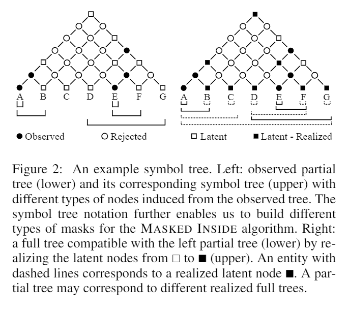

#### [【Continual Learning for Named Entity Recognition】](https://www.aaai.org/AAAI21Papers/AAAI-7791.MonaikulN.pdf) [***]

- 作者
- 介绍：命名实体识别 (NER) 是各种 NLP 应用程序中的一项重要任务。
- 动机：在许多现实世界的场景中（例如，语音助手）经常引入新的命名实体类型，需要重新训练 NER 模型以支持这些新的实体类型。当存储限制或安全问题重新限制对该数据的访问时，为新实体类型重新 标注 原始训练数据可能成本高昂甚至不可能，并且随着类型数量的增加，为所有实体注释新数据集变得不切实际且容易出错.
- 论文方法： 引入了一种新颖的持续学习方法，它需要仅针对新的实体类型 标注 新的训练材料。为了保留模型先前学到的现有知识，我们利用知识蒸馏（KD）框架，其中现有的 NER 模型充当新 NER 模型（即学生）的老师，该模型通过以下方式学习新的实体类型使用新的训练材料并通过在这个新训练集上模仿教师的输出来保留旧实体的知识。
- 实验结果：这种方法允许学生模型“逐步”学习识别新的实体类型，而不会忘记以前学习的实体类型。我们还提供了与多个强基线的比较，以证明我们的方法在不断更新 NER 模型方面是优越的

- AddNER

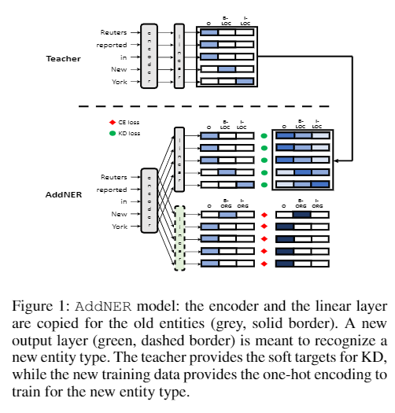

- ExtendNER

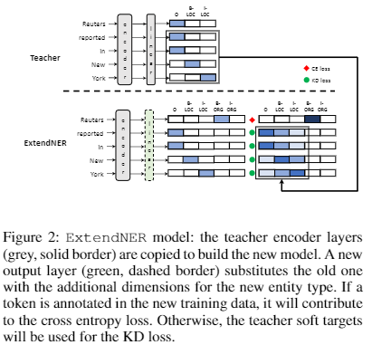

#### [【Knowledge-Aware Named Entity Recognition with Alleviating Heterogeneity】](https://www.aaai.org/AAAI21Papers/AAAI-9155.NieB.pdf) 

- 介绍：命名实体识别 (NER) 是许多下游 NLP 任务的基本且重要的研究课题，旨在检测非结构化文本中提到的命名实体 (NE) 并将其分类为预定义的类别。
- 动机：当涉及特定领域或时间演变的实体（例如医学术语或餐厅名称）时，仅从标记数据中学习是远远不够的。幸运的是，开源知识库 (KB)（例如 Wikidata 和 Freebase）包含在不同域中使用预定义类型手动标记的 NE，这可能有利于识别实体边界和更准确地识别实体类型。**特定领域的 NER 任务通常独立于当前 KB 的任务，因此不可避免地会表现出异质性问题，这使得原始 NER 和 KB 类型（例如PersoninNER 可能匹配Presidentin KB）之间的匹配不太可能，或者在不考虑特定领域知识的情况下引入了意外噪声（例如，在餐厅相关任务中，Bandin NER 应该映射到OutofEntityTypes）**。
- 论文方法：为了更好地合并和去噪知识库中丰富的知识，我们提出了一种新的知识库感知 NER 框架（KaNa），它利用类型异构知识来改进 NER。
  - 对于一个实体mention 以及一组从KBs 链接的候选实体，KaNa 首先使用一种类型投影机制，将mention 类型和实体类型映射到共享空间中，以同质化异构实体类型；
  - 然后，基于投影类型，噪声检测器以无监督的方式过滤掉某些不太自信的候选实体。
  - 最后，过滤后的提及实体对被注入到一个 NER 模型中作为一个图表来预测答案。
- 实验结果：证明了 KaNa 在来自不同领域的五个公共基准数据集上的最先进性能，平均超过强基线 1.33 个 F1 点

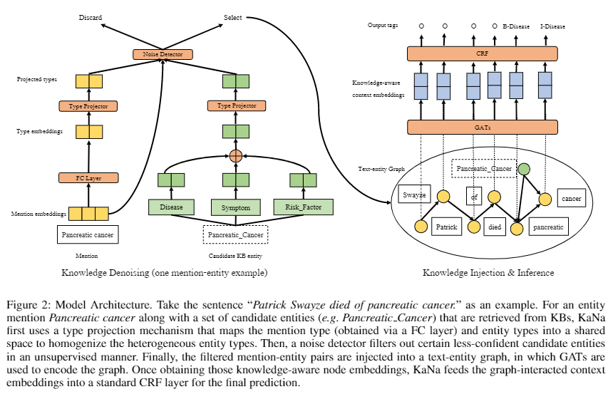

#### [【Denoising Distantly Supervised Named Entity Recognition via a Hypergeometric Probabilistic Model】](https://ojs.aaai.org/index.php/AAAI/article/view/17702) 

- 介绍：去噪是基于远程监督的命名实体识别的必要步骤。
- 动机：以前的去噪方法大多基于实例级置信度统计，忽略了不同数据集和实体类型上潜在噪声分布的多样性。这使得它们难以适应高噪声率设置。
- 论文方法：提出了超几何学习 (HGL)，这是一种用于远程监督 NER 的去噪算法，它同时考虑了噪声分布和实例级置信度。具体来说，在神经网络训练期间，我们自然地按照由噪声率参数化的超几何分布对每批中的噪声样本进行建模。然后，根据从先前训练步骤得出的标签置信度以及该采样批次中的噪声分布，将批次中的每个实例视为正确或有噪声的实例。
- 实验表明，HGL 可以有效地对从远程监督中检索到的弱标记数据进行去噪，从而对训练模型进行显着改进。

#### [【MTAAL: Multi-Task Adversarial Active Learning for Medical Named Entity Recognition and Normalization（MTAAL）】](https://www.aaai.org/AAAI21Papers/AAAI-10063.ZhouB.pdf) 

- 介绍：自动化医学命名实体识别和规范化是构建知识图谱和构建 QA 系统的基础。
- 动机：当涉及到医学文本时，标注 需要专业知识和专业精神的基础。现有方法利用主动学习来降低语料库注释的成本，以及多任务学习策略来对不同任务之间的相关性进行建模。然而，现有模型没有考虑针对不同任务和查询样本多样性的任务特定特征。
- 论文方法：提出了一种多任务对抗性主动学习模型，用于医学命名实体识别和归一化。在我们的模型中，对抗性学习保持了多任务学习模块和主动学习模块的有效性。任务鉴别器消除了不规则任务特定特征的影响。多样性判别器利用样本间的异质性来满足多样性约束。两个医学基准的实证结果证明了我们的模型对现有方法的有效性。

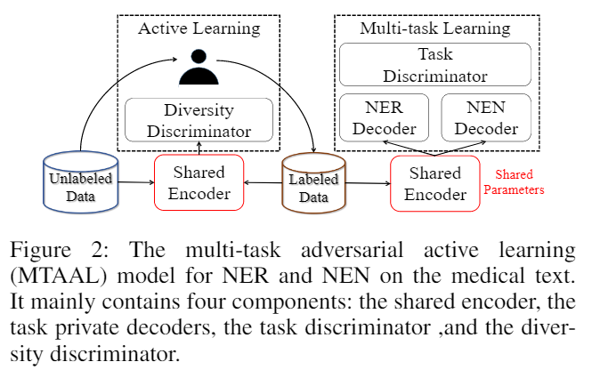

### 1.3 关系抽取

#### [【FL-MSRE: A Few-Shot Learning Based Approach to Multimodal Social Relation Extraction（L-MSRE）】](https://www.aaai.org/AAAI21Papers/AAAI-2215.WanH.pdf) 

- 介绍：社会关系抽取（简称SRE）旨在推断日常生活中两个人之间的社会关系，在现实中已被证明具有重要价值。
- 动机：现有的 SRE 方法**只考虑从文本或图像等单模态信息中提取社会关系，而忽略了多模态信息中的高耦合**。而且，以往的研究**忽视了社会关系分布的严重失衡**。
- 论文方法：提出了 FL-MSRE，这是一种基于少量学习的方法，用于从文本和面部图像中提取社会关系。据我们所知，这是第一次尝试同时利用文本和图像进行 SRE。考虑到多模态社会关系数据集的缺乏，本文提出了三个多模态数据集，标注了四个经典杰作和相应的电视剧。受 BERT 成功的启发，我们提出了一个基于强 BERT 的基线来仅从文本中提取社会关系。 经验表明，FL-MSRE 显着优于基线。这表明使用人脸图像有利于基于文本的 SRE。进一步的实验还表明，使用来自不同场景的两张人脸图像可以获得与来自同一场景的相似性能。这意味着FL-MSRE适用于范围广泛的SRE应用，其中关于不同人的面部图像只能从不同场景中收集。

#### [【Multi-View Inference for Relation Extraction with Uncertain Knowledge】](https://arxiv.org/abs/2104.13579) 

- 介绍：知识图谱 (KG) 被广泛用于促进关系提取 (RE) 任务。
- 动机：虽然大多数先前的 RE 方法都专注于利用确定性 KG，但不确定 KG 为每个关系实例分配置信度分数，可以提供关系事实的先验概率分布作为 RE 模型的宝贵外部知识。
- 论文方法：提出利用不确定知识来改进关系抽取。具体来说，我们将 ProBase，一个不确定的 KG，指示目标实体在多大程度上属于一个概念，到我们的 RE 架构中。然后，我们设计了一个新颖的多视图推理框架，以系统地整合三个视图中的本地上下文和全局知识：提及视图、实体视图和概念视图。
- 实验结果表明，我们的模型在句子级和文档级关系提取方面都取得了有竞争力的性能，这验证了引入不确定知识和我们设计的多视图推理框架的有效性。

#### [【GDPNet: Refining Latent Multi-View Graph for Relation Extraction（GDPNet）】](https://arxiv.org/abs/2012.06780)

- 介绍：关系提取（RE）是预测一段文本中提到的两个实体的关系类型，例如句子或对话。
- 动机：当给定的文本很长时，识别用于关系预测的指示词是很有挑战性的。 RE 任务的最新进展来自基于 BERT 的序列建模和基于图的序列中标记之间关系的建模。
- 论文方法：建议构建一个潜在的多视图图来捕获令牌之间的各种可能关系。然后我们细化这个图来选择重要的词进行关系预测。最后，将细化图的表示和基于 BERT 的序列表示连接起来以进行关系提取。具体来说，在我们提出的 GDPNet（高斯动态时间扭曲池化网络）中，我们利用高斯图生成器 (GGG) 来生成多视图图的边。然后通过动态时间扭曲池 (DTWPool) 对图形进行细化。
- 实验结果：在 DialogRE 和 TACRED 上，我们表明 GDPNet 在对话级 RE 上实现了最佳性能，并且在句子级 RE 上与最先进的性能相当。

#### [【Progressive Multi-Task Learning with Controlled information Flow for Joint Entity and Relation Extraction】](https://www.aaai.org/AAAI21Papers/AAAI-4619.SunK.pdf)

- 介绍：多任务学习在同时学习多个相关任务方面表现出良好的性能，并且已经提出了模型架构的变体，特别是对于监督分类问题。多任务学习的一个目标是提取一个良好的表征，该表征能够充分捕获每个学习任务的输出的相关输入部分。
- 动机：为了实现这一目标，本文基于观察到一些相关任务（实体识别和关系提取任务）的输出之间存在相关性
- 论文方法：设计了一个多任务学习架构，它们反映了需要从输入中提取的相关特征。 由于未观察到输出，我们提出的模型利用神经模型较低层的任务预测，在这项工作中也称为早期预测。但是我们控制早期预测的注入，以确保我们提取出良好的特定于任务的表示进行分类。我们将此模型称为具有显式交互（PMEI）的渐进式多任务学习模型。

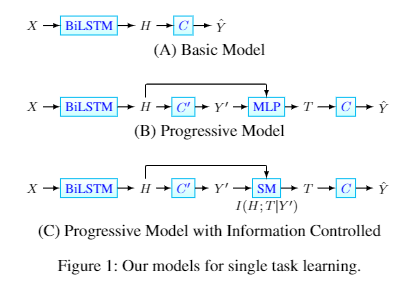

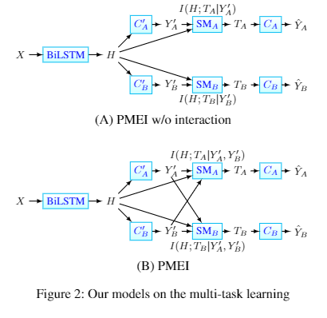

- 实验结果：在多个基准数据集上的大量实验在联合实体和关系提取任务上产生了最先进的结果

#### [【Curriculum-Meta Learning for Order-Robust Continual Relation Extraction】](https://arxiv.org/abs/2101.01926) 【[github](https://github.com/wutong8023/AAAI_CML)】

- 介绍：连续关系提取是一项重要的任务，它侧重于从非结构化文本中逐步提取新的事实。
- 动机：鉴于关系的先后到达顺序，这项任务容易面临两个严重的挑战，即**灾难性遗忘和顺序敏感性**。
- 论文方法：提出了一种新的课程元学习方法来解决连续关系提取中的上述两个挑战。
  - 将元学习和课程学习相结合，以快速使模型参数适应新任务，并减少先前任务对当前任务的干扰。
  - 通过关系的域和范围类型的分布设计了一种新颖的关系表示学习方法。这种表示被用来量化课程构建任务的难度。
  - 提出了新的基于难度的指标来定量测量给定模型的顺序敏感程度，
  - 提出了评估模型稳健性的新方法。
- 实验结果：在三个基准数据集上的综合实验表明，我们提出的方法优于最先进的技术。

#### [【Document-Level Relation Extraction with Reconstruction】](https://arxiv.org/abs/2012.11384) 

- 介绍：在文档级关系提取（DocRE）中，图结构通常用于对输入文档中的关系信息进行编码，以对每个实体对之间的关​​系类别进行分类，并且在过去几年中极大地推进了 DocRE 任务。
- 动机：无论这些实体对之间是否存在关系，学习到的图表示都可以通用地对所有实体对之间的关​​系信息进行建模。因此，那些没有关系的实体对分散了编码器-分类器 DocRE 对有关系的注意力，这可能会进一步阻碍 DocRE 的改进。
- 论文方法：为 DocRE 提出了一种新颖的编码器-分类器-重构器模型。重建器设法从图表示中重建真实路径依赖关系，以确保所提出的 DocRE 模型更加关注在训练中对具有关系的实体对进行编码。此外，在推理中将重构器作为关系指标来辅助关系分类，可以进一步提高DocRE模型的性能。
- 实验结果：在大规模 DocRE 数据集上的实验结果表明，所提出的模型可以显着提高基于强异构图的基线关系提取的准确性。

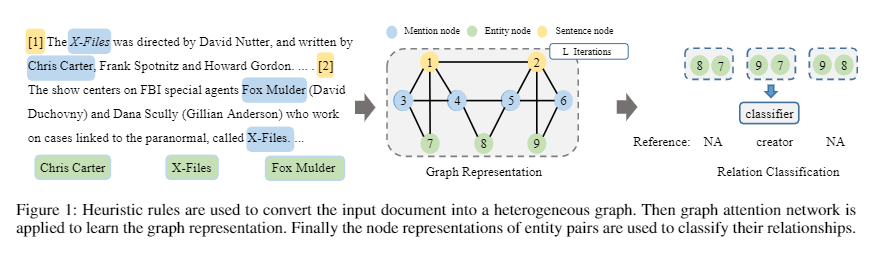

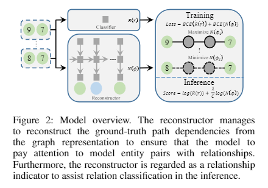

#### [【Document-Level Relation Extraction with Adaptive Thresholding and Localized Context Pooling(ATLOP )】](https://arxiv.org/abs/2010.11304)  【[github](https://github.com/wzhouad/ATLOP)】

- 动机：与其句子级对应物相比，文档级关系提取 (RE) 提出了新的挑战。**一个文档通常包含多个实体对，一个实体对在与多个可能关系相关联的文档中多次出现**。

- 论文方法：提出了两种新技术，**自适应阈值化和局部上下文池化**，以解决多标签和多实体问题。
  - 自适应阈值用可学习的实体相关阈值代替了先前工作中用于多标签分类的全局阈值。
  - 局部上下文池化直接将注意力从预先训练的语言模型转移到定位对确定关系有用的相关上下文。

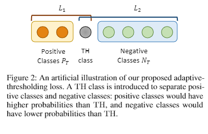

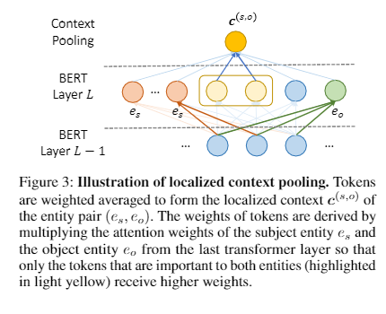

- 实验结果：在三个文档级 RE 基准数据集上进行了实验：DocRED，一个最近发布的大规模 RE 数据集，以及生物医学领域的两个数据集 CDR 和 GDA。我们的 ATLOP（自适应阈值和本地化上下文池）模型达到了 63.4 的 F1 分数，并且在 CDR 和 GDA 上也显着优于现有模型。

#### [【Entity Structure Within and Throughout: Modeling Mention Dependencies for Document Level Relation Extraction（SSAN）】](https://arxiv.org/abs/2102.10249)  【[PaddlePaddle/Research](https://github.com/PaddlePaddle/Research/tree/master/KG/AAAI2021_SSAN)】 【[BenfengXu/SSAN](https://github.com/BenfengXu/SSAN)】

- 介绍：实体作为关系抽取任务的基本要素，具有一定的结构。

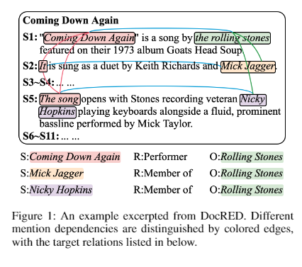

- 论文方法：在这项工作中，我们将这样的结构表述为提及对之间的独特依赖关系。然后我们提出了 SSAN，它在标准的自注意力机制和整个编码阶段中结合了这些结构依赖。具体来说，我们在每个自注意力构建块内设计了两个替代转换模块，以产生注意力偏差，从而自适应地调整其注意力流。

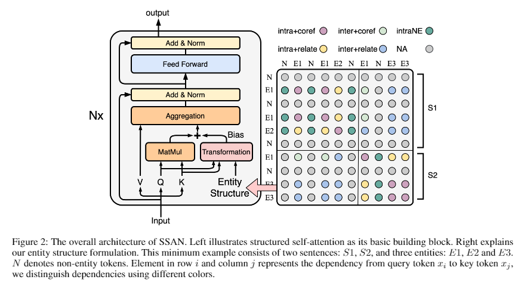

- 实验结果：实验证明了所提出的实体结构的有用性和 SSAN 的有效性。它显着优于竞争基线，在三个流行的文档级关系提取数据集上取得了最新的最新结果。我们进一步提供消融和可视化来展示实体结构如何指导模型以更好地提取关系。

#### [【Empower Distantly Supervised Relation Extraction with Collaborative Adversarial Training(  MULTICAST)】](https://www.aaai.org/AAAI21Papers/AAAI-9721.ChenT.pdf)  

- 介绍：随着远程监督 (DS) 关系提取 (RE) 的最新进展，利用多实例学习 (MIL) 从嘈杂的 DS 中提取高质量监督受到了极大的关注。
- 动机：在这里，我们超越标签噪声，确定 DS-MIL 的关键瓶颈在于其数据利用率低：由于 MIL 对高质量监督进行了细化，MIL 放弃了大量训练实例，**导致数据利用率低并阻碍模型训练来自有丰富的监督**。

- 论文方法：提出了协同对抗训练来提高数据利用率，在不同层次上协调虚拟对抗训练（VAT）和对抗训练（AT）。具体来说，由于 VAT 是无标签的，我们采用 instance-level VAT 来回收 MIL 放弃的实例。此外，我们在包级部署AT，以释放MIL 获得的高质量监督的全部潜力。
- 实验结果：我们提出的方法为先前的技术水平带来了持续的改进（~5 绝对 AUC 分数），这验证了数据利用问题的重要性和我们方法的有效性。

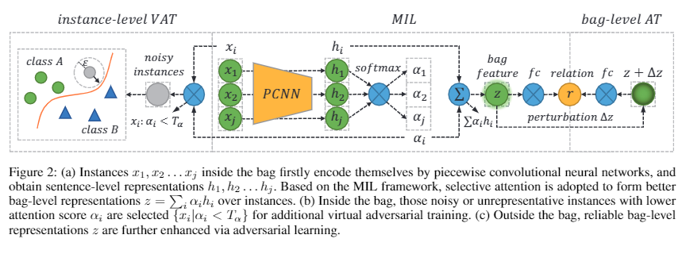

#### [【Clinical Temporal Relation Extraction with Probabilistic Soft Logic Regularization and Global Inference（CTRL-PG）】](https://www.aaai.org/AAAI21Papers/AAAI-9740.ZhouY.pdf)  【[github](https://github.com/yuyanislearning/CTRL-PG)】
 
- 介绍：医学界一直需要精确提取临床事件之间的时间关系。特别是，时间信息可以促进各种下游应用，例如病例报告检索和医学问答。
- 动机：现有方法要么需要昂贵的特征工程，要么无法对事件之间的全局关系依赖性进行建模。

> 来自典型的 CCR 文件的图表，具有三种常见的时间关系类型，“之前”、“之后”和“重叠”。Glucocortocoids 被描述为该患者的用药史，发生在 COVID-19 确诊之前并且抗体阳性。nasal congestion 与 a mild cough 之间存在“重叠”时间关系。我们将上述临床概念视为事件，而将一天后视为时间表达。事件与事件（E-E）、事件与时间表达（E-T）或时间表达与时间表达（T-T）之间可能存在时间关系。

- 论文方法：提出了具有概率软逻辑正则化和全局推理（CTRL-PG）的临床时间关系提取，这是一种在文档级别解决问题的新方法。

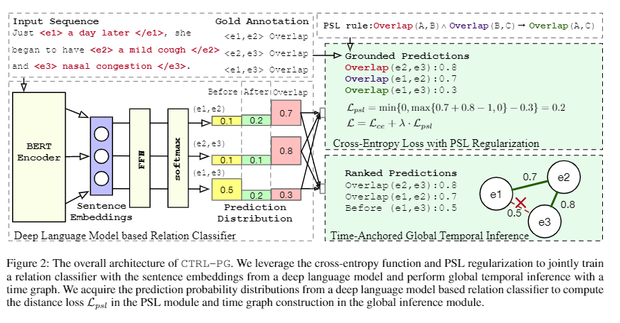

- 实验结果：在两个基准数据集 I2B2-2012 和 TB-Dense 上的大量实验表明，CTRL-PG 显着优于用于时间关系提取的基线方法

#### [【A Unified Multi-Task Learning Framework for Joint Extraction of Entities and Relations】](https://ojs.aaai.org/index.php/AAAI/article/view/17707)  

- 介绍：实体和关系的联合提取侧重于使用统一模型同时检测实体对及其关系。
- 动机：基于提取顺序，以前的工作主要通过关系最后、关系第一和关系中间的方式来解决这个任务。然而，这些方法仍然**存在模板依赖、非实体检测和非预定义关系预测问题**。
- 论文方法：提出了一个统一的多任务学习框架，将任务划分为三个相互作用的子任务。
  - 首先介绍了用于主题提取的类型注意方法，以明确提供先验类型信息。
  - 然后，提出了基于全局和局部语义组合的主题感知关系预测来选择有用的关系。
  - 第三，我们提出了一种基于问题生成的 QA 方法，用于对象提取以自动获取不同的查询。值得注意的是，我们的方法在不依赖于 NER 模型的情况下检测主题或对象，因此它能够处理非实体场景。
  - 最后通过参数共享将三个子任务集成为一个统一的模型。
- 实验结果：实验表明所提出的框架在两个基准数据集上的性能优于所有基线方法，并进一步在非预定义关系上取得了优异的性能。

### 1.4 事件抽取

#### [【A Unified Multi-Task Learning Framework for Joint Extraction of Entities and Relations】](https://arxiv.org/abs/2010.03009)  

- 介绍：跨语言关系和事件提取的最新进展使用具有通用依赖解析的图卷积网络 (GCN) 来学习与语言无关的句子表示，以便在一种语言上训练的模型可以应用于其他语言。
- 动机：GCN 很难对具有远程依赖关系的单词进行建模，或者在依赖关系树中没有直接连接。

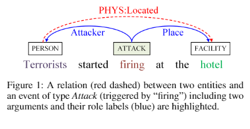

- 论文方法：利用自我注意机制，在该机制中我们明确地融合结构信息来学习具有不同句法距离的单词之间的依赖关系。我们引入了 GATE，一个 {\bf G}raph {\bf A}ttention {\bf T}ransformer {\bf E}ncoder，并测试其在关​​系和事件提取任务上的跨语言迁移能力。

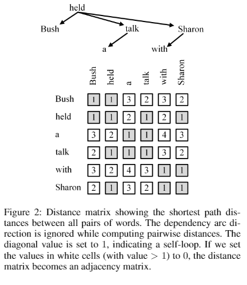

- 实验结果：我们在 ACE05 数据集上进行了实验，该数据集包括三种类型不同的语言：英语、中文和阿拉伯语。评估结果表明，GATE 大大优于最近提出的三种方法。我们的详细分析表明，由于依赖句法依赖，GATE 产生了健壮的表示，促进了跨语言的迁移。

#### [【What the Role Is vs. What Plays the Role: Semi-Supervised Event Argument Extraction via Dual Question Answering（DualQA）】](https://www.aaai.org/AAAI21Papers/AAAI-2635.ZhouY.pdf)  

- 动机：事件参数提取是事件提取中的一项基本任务，在资源匮乏的情况下变得尤其具有挑战性。
  - 从两个方面解决了资源匮乏情况下现有研究中的问题：
    - 从模型的角度来看，现有的方法总是存在参数共享不足的问题，没有考虑角色的语义，不利于处理稀疏数据。
    - 从数据的角度来看，现有的大多数方法都侧重于数据生成和数据增强。
  - 然而，这些方法严重依赖外部资源，创建比获取未标记数据更费力。

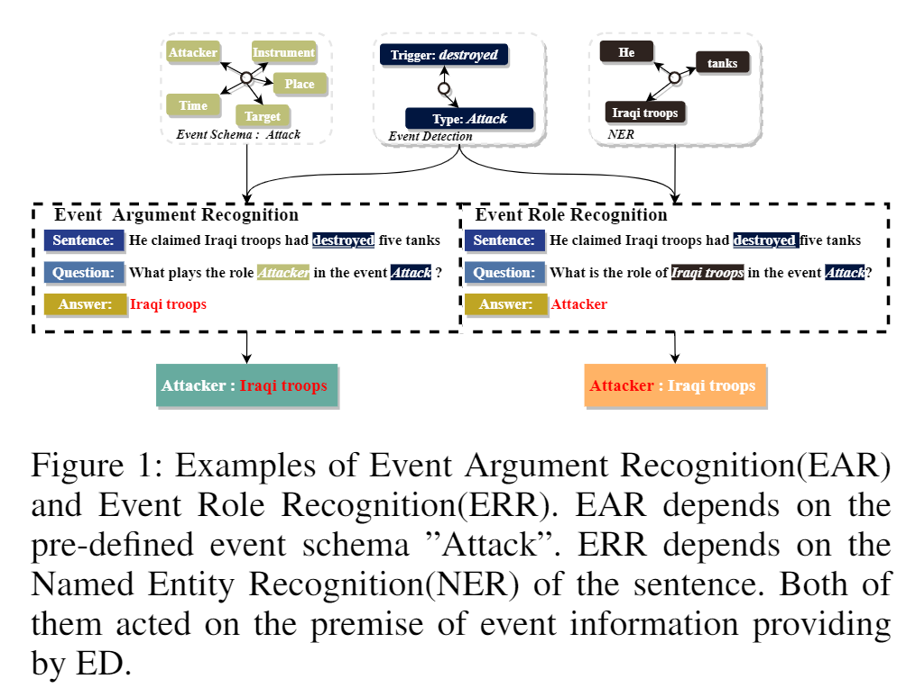

- 论文方法：提出了新框架 DualQA，该框架将事件参数提取任务建模为问答，以缓解数据稀疏问题，并利用事件参数识别的二元性，即询问“什么发挥作用”，以及事件角色认同即问“角色是什么”，相互提高。

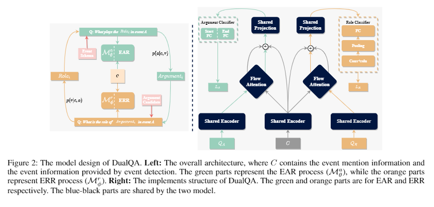

- 实验结果：在两个数据集上的实验结果证明了我们方法的有效性，尤其是在资源极其匮乏的情况下。

#### [【Span-Based Event Coreference Resolution】](https://www.aaai.org/AAAI21Papers/AAAI-9086.LJ.pdf)  

- 动机：受最近将基于跨度的模型成功应用于基于实体的信息提取任务的启发

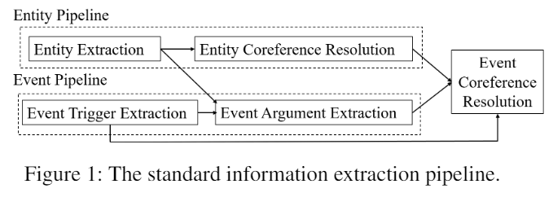

- 论文方法：研究了基于跨度的事件共指解决模型，特别关注是否
  - (1) 基于跨度的实体共指模型的成功可以扩展到事件共指；
  - (2) 跨任务一致性约束可用于指导基于跨度的事件共指模型的学习； 
  - (3) 自动计算实体共指信息有利于基于跨度的事件共指解析。

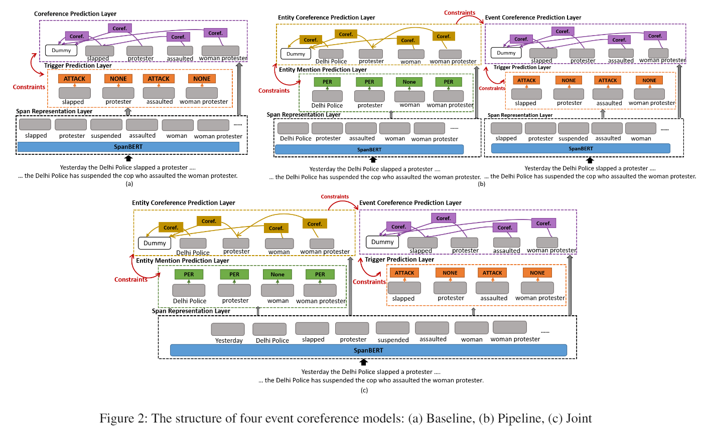

- 实验结果：两个标准评估数据集的实证结果为所有三个问题提供了肯定的答案

### 1.5 知识图谱

#### [【Dual Quaternion Knowledge Graph Embeddings(DualE)】](https://www.aaai.org/AAAI21Papers/AAAI-393.CaoZ.pdf) 

- 动机：在本文中，我们研究了在知识图中学习实体和关系表示的问题，用于链接预测任务。我们的想法是基于以下观察，即绝大多数相关工作仅将关系建模为单一的几何操作，例如平移或旋转，这限制了底层模型的表示能力，并且难以匹配现实中存在的复杂关系。世界数据集。
- 论文方法：为了包含更丰富的关系信息集，我们提出了一种称为双四元数知识图嵌入（DualE）的新方法，它将双四元数引入知识图嵌入中。具体来说，对偶四元数就像一个“复四元数”，它的实部和虚部都是四元数。 DualEli 的核心是基于双四元数的乘法的特定设计，它普遍将关系建模为一系列平移和旋转操作的组合。 

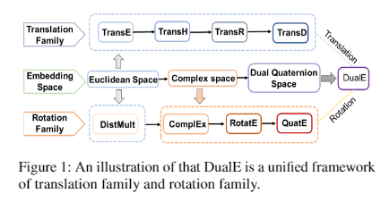

- DualE 的主要优点有三方面：
  - 1) 它是第一个在 3D 空间中同时包含基于旋转和基于平移的模型的统一框架；
  - 2) 它以更直观的物理和几何解释将嵌入空间扩展到双四元数空间；
  - 3)它满足关系表示学习的关键模式和多重关系模式。
- 实验结果：四个真实世界数据集的实验结果证明了我们 DualE 方法的有效性

#### [【Type-Augmented Relation Prediction in Knowledge Graphs】](https://www.aaai.org/AAAI21Papers/AAAI-393.CaoZ.pdf) 

- 动机：知识图谱（KG）对许多现实世界的应用程序都非常重要，但它们通常**以实体之间缺少关系的形式存在不完整的信息**。知识图谱补全（也称为关系预测）是在给定现有事实的情况下推断缺失事实的任务。大多数现有工作是通过最大化观察到的实例级三元组的可能性来提出的。然而，对于本体信息，如实体和关系的类型信息，关注度并不高。
- 论文方法：提出了一种类型增强关系预测（TaRP）方法，我们将类型信息和实例级信息应用于关系预测。特别地，类型信息和实例级信息分别被编码为关系的先验概率和似然，并按照贝叶斯规则进行组合。
- 实验结果：我们提出的 TaRP 方法在四个基准数据集上的性能明显优于最先进的方法：FB15K、FB15K-237、YAGO26K-906 和 DB111K-174。此外，我们表明 TaRP 显着提高了数据效率。更重要的是，从特定数据集提取的类型信息可以通过提出的 TaRP 模型很好地推广到其他数据集。

#### [【ChronoR: Rotation Based Temporal Knowledge Graph Embedding】](https://arxiv.org/abs/2103.10379)

- 介绍：尽管 Temporal Knowledge Graph 很重要并且很丰富，但当前的大部分研究都集中在静态图谱的推理上。
- 论文方法：在本文中，我们研究了 Temporal Knowledge Graph 推理的挑战性问题。特别是时间链接预测的任务。一般来说，由于数据的非平稳性、数据异质性及其复杂的时间依赖性，这是一项艰巨的任务。我们提出了时序旋转嵌入 (ChronoR)，这是一种用于学习实体、关系和时间表示的新模型。学习密集表示经常被用作对知识图谱进行推理的有效且通用的方法。所提出的模型学习了一个由关系和时间参数化的 k 维旋转变换，这样在使用旋转变换每个事实的头部实体后，它会落在其对应的尾部实体附近。通过使用高维旋转作为其变换算子，ChronoR 捕获了 Temporal Knowledge Graph 的时间和多关系特征之间的丰富交互。
- 实验结果： ChronoR 能够在用于 Temporal Knowledge Graph 链接预测的基准数据集上胜过许多最先进的方法。

#### [【PASSLEAF: A Pool-Based Semi-Supervised Learning Framework for Uncertain Knowledge Graph Embedding】](https://www.aaai.org/AAAI21Papers/AAAI-4255.ChenZM.pdf)

- 介绍：在本文中，我们研究了嵌入不确定知识图谱的问题，其中实体之间的每个关系都与置信度分数相关联。观察现有的嵌入方法可能会丢弃不确定性信息，仅包含特定类型的得分函数，或在训练中导致许多假阴性样本，
- 论文方法：提出了 PASSLEAF 框架来解决上述问题。 PASSLEAF由两部分组成：
  - 一个是可以结合不同类型的评分函数来预测关系置信度分数的模型；
  - 另一个是利用与估计置信度相关联的正负样本的半监督学习模型分数。
- 此外，PASSLEAF 利用样本池作为生成样本的中继来进一步增强半监督学习。
- 实验结果表明，我们提出的框架可以更好地学习嵌入，在置信度分数预测和尾部实体预测方面都具有更高的准确性。

#### [【KG-BART: Knowledge Graph-Augmented Bart for Generative Commonsense Reasoning】](https://arxiv.org/abs/2009.12677)

- 介绍：生成常识推理旨在使机器能够生成具有推理一组概念的能力的句子，这是文本生成的关键瓶颈。即使是最先进的预训练语言生成模型也很难完成这项任务，并且经常会产生令人难以置信和异常的句子。原因之一是他们很少考虑合并可以在常识概念之间提供丰富关系信息的知识图谱。

- 论文方法：为了提高文本生成的常识推理能力，
  - 提出了一种新的知识图增强预训练语言生成模型 KG-BART，它通过知识图包含概念的复杂关系，并产生更多逻辑和自然的句子作为输出。
  - KG-BART 可以利用图注意力来聚合丰富的概念语义，从而增强对未见概念集的模型泛化。

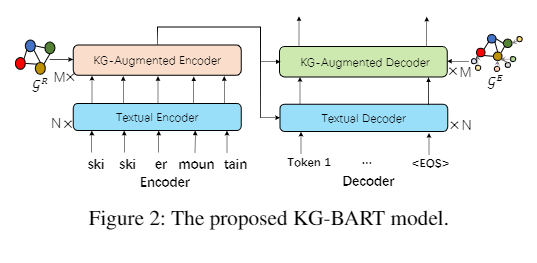

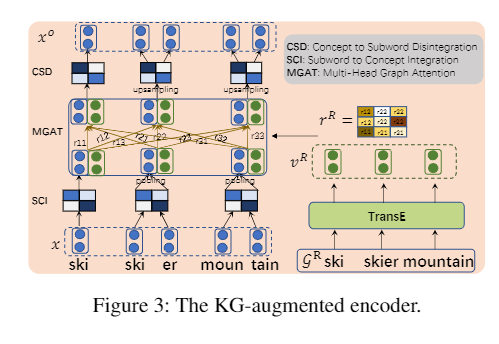

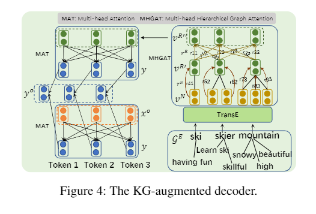

- 实验结果：在基准 CommonGen 数据集上的实验通过与几个强大的预训练语言生成模型进行比较来验证我们提出的方法的有效性，特别是 KG-BART 在 BLEU-3、4 方面的性能比 BART 高 5.80、4.60。此外，我们还表明我们的模型生成的上下文可以作为背景场景，使下游常识 QA 任务受益。

#### [【Answering Complex Queries in Knowledge Graphs with Bidirectional Sequence Encoders】](https://arxiv.org/abs/2004.02596)

- 动机：知识图谱 (KG) 的表示学习专注于回答简单的链接预测查询的问题。在这项工作中，我们解决了预测具有多个缺失实体的联合查询的答案的更雄心勃勃的挑战。
- 论文方法：提出了双向查询嵌入 (BIQE)，这是一种将联合查询嵌入基于双向注意机制的模型的方法。与之前的工作相反，双向自注意力可以捕获查询图的所有元素之间的交互。我们引入了一个新的数据集来预测联合查询的答案并进行实验，这些实验表明 BIQE 显着优于最先进的基线。

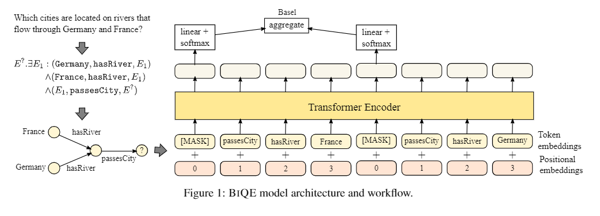

#### 【其他】

- GaussianPath: A Bayesian Multi-Hop Reasoning Framework for Knowledge Graph Reasoning
- Topology-Aware Correlations between Relations for Inductive Link Prediction in Knowledge Graphs
- Learning from History: Modeling Temporal Knowledge Graphs with Sequential Copy Generation Networks
- Neural Latent Space Model for Dynamic Networks and Temporal Knowledge Graphs
- Knowledge Graph Embeddings with Projective Transformations
- (Comet-) Atomic 2020: On Symbolic and Neural Commonsense Knowledge Graphs
- Randomized Generation of Adversary-Aware Fake Knowledge Graphs to Combat Intellectual Property Theft
- Dynamic Knowledge Graph Alignment
- Dynamic Neuro-Symbolic Knowledge Graph Construction for Zero-Shot Commonsense Question Answering

## 参考

1. [AAAI2021 | NLP所有方向论文列表（情感分析、句法、NER、对话/问答、关系抽取、KD等）](https://zhuanlan.zhihu.com/p/341934684)
2. [AAAI-­‐21  Accepted  Papers—Main  Technical  Track](https://aaai.org/Conferences/AAAI-21/wp-content/uploads/2020/12/AAAI-21_Accepted-Paper-List.Main_.Technical.Track_.pdf)