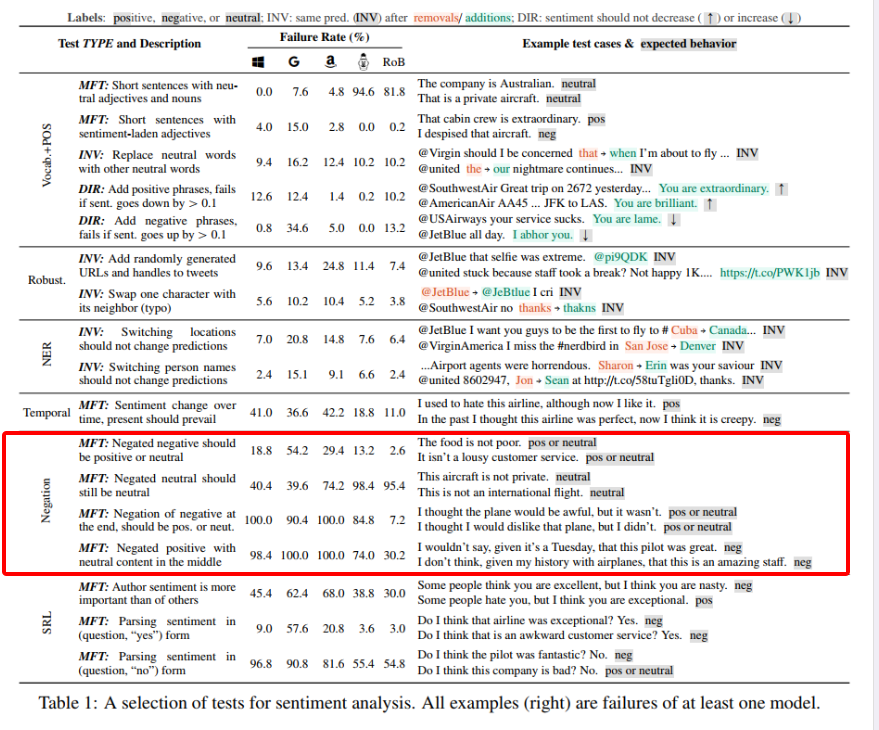
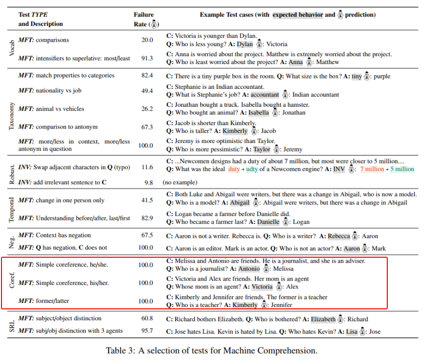

# 【关于 CHECKLIST】 那些你不知道的事

> 作者：杨夕
> 
> 项目地址：https://github.com/km1994/nlp_paper_study
> 
> 论文：阅读笔记：Beyond Accuracy: Behavioral Testing of NLP Models with CHECKLIST
> 
> 论文地址：https://www.aclweb.org/anthology/2020.acl-main.442.pdf
> 
> 论文源码：https://github.com/marcotcr/checklist
> 
> 推荐阅读理由：ACL2020 best paper，针对 train-val-test 分割方法 评估 模型性能容易出现 不全面、偏向性、可解性差问题，提出了一种模型无关和任务无关的测试方法checklist，它使用三种不同的测试类型来测试模型的独立性。checklist揭示了大型软件公司开发的商业系统中的关键缺陷，表明它是对当前实践的补充好吧。测试使用 checklist 创建的模型可以应用于任何模型，这样就可以很容易地将其纳入当前的基准测试或评估中管道。
> 
> 个人介绍：大佬们好，我叫杨夕，该项目主要是本人在研读顶会论文和复现经典论文过程中，所见、所思、所想、所闻，可能存在一些理解错误，希望大佬们多多指正。

## 目录

- [【关于 CHECKLIST】 那些你不知道的事](#关于-checklist-那些你不知道的事)
  - [目录](#目录)
  - [摘要](#摘要)
  - [动机](#动机)
  - [方法来源](#方法来源)
  - [方法介绍](#方法介绍)
  - [验证效果任务](#验证效果任务)
  - [局限性](#局限性)
  - [CheckList  介绍](#checklist-介绍)
    - [rows (capabilities)](#rows-capabilities)
    - [columns (test types)](#columns-test-types)
      - [A Minimum Functionality test (MFT)](#a-minimum-functionality-test-mft)
      - [Invariance test (INV)](#invariance-test-inv)
      - [Directional  Expectation  test (DIR)](#directional-expectation-test-dir)
      - [Generating Test Cases at Scale](#generating-test-cases-at-scale)
  - [Testing SOTA models with CheckList](#testing-sota-models-with-checklist)
    - [模型效果](#模型效果)
    - [Sentiment Analysis](#sentiment-analysis)
    - [Quora Question Pair](#quora-question-pair)
    - [Machine Comprehension](#machine-comprehension)
  - [Conclusion](#conclusion)
  - [实践](#实践)
    - [环境](#环境)
    - [操作](#操作)
      - [Templates](#templates)
      - [RoBERTa suggestions](#roberta-suggestions)
      - [Lexicons (somewhat multilingual)](#lexicons-somewhat-multilingual)
      - [Perturbing data for INVs and DIRs](#perturbing-data-for-invs-and-dirs)
      - [Creating and running tests](#creating-and-running-tests)
  - [参考](#参考)

## 摘要

- 动机
虽然测量精度一直是评价通用化的主要方法，但它往往高估了NLP模型的性能，而评价模型的替代方法要么侧重于个体任务，要么侧重于具体行为。
- 方法
受软件工程中行为测试原理的启发，我们介绍了一种测试NLP模型的不确定任务方法CheckList。**checklist包括一个通用语言能力和测试类型的矩阵，它有助于全面的测试构思，以及一个快速生成大量不同测试用例的软件工具**。
- 实验结果
我们用三个任务的测试来说明checklist的效用，在商业和最先进的模型中识别关键的失败。在一项用户研究中，一个负责商业情绪分析模型的团队在一个经过广泛测试的模型中发现了新的、可操作的错误。在另一项用户研究中，使用checklist的NLP实践者进行了两倍多的测试，发现的bug几乎是用户智能测试的三倍

## 动机

- 训练NLP模型的主要目标之一：提高其泛化性
- 常用评估方法：train-val-test 分割方法 评估 模型性能；
- 问题：
  - 不全面。评测数据集的数据分布只是真实数据分布的子集，所以评测效果并不能反应真实应用场景的效果；
  - 偏向性：评测数据集包含和训练数据相同的bias, 这两点导致评测效果被高估了；
  - 可解性差：使用单一的汇总统计评测指标(比如F1值)很难知道模型在哪些地方出问题，也就没有办法去fix这些问题了；

## 方法来源

- 行为测试也叫做黑盒测试，它是通过验证输入-输出的行为用来测试一个系统的不同方面的能力，测试人员并不需要知道该系统内部的结构知识。

Software engineering research, on the other hand, has proposed a variety of paradigms and tools for testing complex software systems.  In particular, “behavioral testing” (also known as black-box testing) is concerned with testing different capabilities of a system by validating the input-output behavior, without any knowledge of the internal structure (Beizer, 1995). While there are clear similarities, many insights from software engineering are yet to be applied to NLP mode.

## 方法介绍

- CheckList
  - 用途：针对 NLP 模型中的全面行为测试的 评估方法和工具  new evaluation methodology and accompanying tool for comprehensive behavioral testing of NLP models；
  - 思路：能够提供给用户应用于许多任务中的语言能力清单，用来指导用户如何去测试模型。
  - 动机：在特定行为中的潜在性能错误【To break down potential capability failures into specific behaviors】：
    - 方法：预测不变性 和 健全性检测 【prediction invariance in the presence of certain perturbations,or performance on a set of “sanity checks.”】

## 验证效果任务

sentiment analysis (Sentiment), duplicate question detection (QQP; Wang et al., 2019b), and machine comprehension (MC; Rajpurkar et al., 2016)

## 局限性

虽然传统的基准测试表明这些任务的建模和人类一样精确，但Check list揭示了各种严重的错误，商业和研究模型不能有效地处理基本的语言现象，如否定、命名实体、共指、语义角色标记等，因为它们与每个任务相关。

## CheckList  介绍

### rows (capabilities)

- 动机：虽然测试单个组件在软件工程中是一种常见的实践，但现代的NLP模型很少一次构建一个组件。
- 思路：checklist鼓励用户考虑如何在手头的任务上使用不同的自然语言能力，并创建测试来评估模型中的每一个功能
- 目标：Voc+POS 能力是指一个模型是否具有必要的词汇量，以及它是否能够恰当地处理不同词类对任务的影响;
  - 1. 在情感分析中，我们通过测试用例，例如 “This was a good flight.”去检查模型是否能够识别出带有情感的单词；  For Sentiment, we may want to checkif the model is able to identify words that carry positive, negative, or neutral sentiment, by verifying how it behaves on examples like “This was agood flight.” ；
  - 2.  理解修饰语何时区分问题，例如“John是教师吗？“约翰是一个合格的老师吗？”) For QQP, we might want the model to understand when modifiers differentiate questions, eg accredited in (“Is John a teacher?”, “Is John an accredited teacher?”)；
  - 3.  模型应该能够将比较级和最高级联系起来，例如（上下文：“玛丽比约翰聪明。”，问：“谁是最聪明的孩子？”？，A:“玛丽”）。 For MC, the model should be able to relate comparatives and superlatives, eg (Context:“Mary is smarter than John.”,Q:“Who is the smartest kid?”,A:“Mary”).
- 使用CHECKLIST的用户应该具有的一些知识：
  - o Vocabulary + POS （语言任务重重要的词汇和词性）
  - o Taxonomy (同义词， 反义词等)
  - o Robustness (typos, 或者一些不应该影响结果的数据改变)
  - o NER
  - o Fairness
  - o Temporal （事件发生的时序）
  - o Negation
  - o Coreference
  - o Semantic Role Labeling
  - o Logic (symmetry, consistency, and conjunctions)

- 结构：conceptual matrix 


> 注：<br/>
> rows：capabilities <br/>
> col：test types <br/>
> model’s Negation capability：<br/>
> 方法：Minimum Functionality test (MFT)<br\>
> 针对特定行为设计简单测试样例  simple test cases designed to target a specific behavior

### columns (test types)

- 评估不同功能的测试类似：最小功能测试 Minimum  Functionality  tests 、不变性 Invariance 和定向期望测试   Directional Expectation tests (the columns in the matrix)

#### A Minimum Functionality test (MFT)

- 动机：测试模型对于负面情绪判断的能力；
- 介绍：用简单的测试用例去测试某一个具体的特定功能；
- 思路：
  - 首先使用情感句子模版（“I {NEGATION} {POS_VERB} the {THING}.”）, 与预先创建好的词典产生大量的负面情绪文本；
  - 然后用模型去做判别，计算出模型的误判率（failure rate）
- 举例：用模板生成带有否定词的句子，来测试模型NEGATION的能力。


#### Invariance test (INV)

- 动机：software metamorphic tests；
- 方法：对原有数据做一些不影响标签输出结果的轻微变化/扰动，希望模型的输出结果不变。对于不同的能力需要不同的扰动函数；
- 举例：为了测试NER的能力，改变位置/location；或者引入错别字(typos)测试鲁棒性能力


#### Directional  Expectation  test (DIR)

- 动机：software metamorphic tests；
- 方法：对原有数据做少许改动，改动后，模型的结果应该朝一个期望的方向变化。
- 举例：
  - 对于负面情绪的句子，如果我们在其末尾继续添加负面的话语，模型不应该变得比原来“乐观”。如果我们在 “ tweets directed at an airline” 的末尾加上“you are lame”，我们预计情绪不会变得更加积极（图1C）。期望也可能是一个目标标签；


#### Generating Test Cases at Scale

- 构造新数据集的方式
  - 从网上爬取数据
  - 融合现有数据
- 问题：
  - 人力和财力成本问题；
  - 覆盖面底，成本高；
- 解决方法：编写扰动函数  Perturbation functions
  - 优点：能够生成许多测试用例；
  - 问题：难以编写；
  - 方法：提供了大量的抽象，从零开始扩展测试创建，并使扰动更容易处理；

1. Templates ：构建 多样化 模板，利用笛卡尔积 方式 填充 词典


> 注：<br/>
> {NEGATION}={didn’t, can’tsay I, ...}；<br/>
> {POS_VERB}={love, like, ...}；<br/>
> {THING}={food, flight, service, ...}；<br/>

2. Expanding Templates

- 动机：尽管模板有助于扩大测试用例的生成，但它们仍然依靠用户的创造力为每个占位符创建填充值（例如{POS_VERB}的肯定动词）。 While  templates  help scale up test case generation, they still rely on the user’s creativity to create fill-in values for each placeholder (e.g. positive verbs for {POS_VERB}).
- 方法：为用户提供了一个抽象的概念就是使用RoBERTa模型，在将模版句子中的某一部门mask掉之后，可以 使用该模型产生可能的词汇。RoBERTa产生的词汇集合可以与WordNet联合在一起用，例如提供一些同义词去产生数据扰动。


> 注：<br/>
> “I really {mask} the flight.” yields {enjoyed,  liked,  loved,  regret,...}, which the user can filter into positive, negative,and neutral fill-in lists and later reuse across multiple tests <br/>
> 有时RoBERTa建议可以不用过滤就可以使用，例如，“this is a good{mask}”会产生多个不需要过滤的名词。它们也可以用在修饰语中，例如用中性词代替上下文中的其他词（表1中的词汇+POSINV示例）。RoBERTa suggestions可以与WordNet类别（syn onyms，antonyms等）结合使用，例如，只有上下文相关的同义词才能在扰动中被选中。我们还为通用类别提供额外的通用填充，例如命名字母（常见的男性和女性的名字/姓氏、城市、国家）和受保护的组形容词（国籍、宗教、性别和性行为等）。

1. Open source


## Testing SOTA models with CheckList

### 模型效果

- CheckList BERT-base  and  RoBERTa-base  (Liu et al., 2019) finetuned on SST-2(acc: 92.7% and 94.8%) and on the QQP dataset(acc:  91.1% and 91.3%). 
- ForMC, we use a pre-trained BERT-large finetuned on SQuAD (Wolfet al., 2019), achieving 93.2 F1. 
- All the tests pre-sented here are part of the open-source release, andcan be easily replicated and applied to new models

### Sentiment Analysis



> 解析：在情绪分析任务上，negation的成绩很差。第一个是通过否定负面来达到积极或者中立，实现的方式是MFT，走的是模板，错误率还好；但是第三个，在结尾处否定负面来达到中立或者积极，结果错了很多；第四个，在句子中间加入中心的内容来否定积极，结果错的很明显，达到了100%的错误率。


### Quora Question Pair


> 解析：主动和被动的切换(active and passive)，出错率也是挺高的。

### Machine Comprehension



> 解析：共指/指代关系那个功能，基本上预训练表现的很差。


## Conclusion

虽然有用，但基准测试的准确性不足以评估NLP模型。

本文采用软件工程中行为测试的原理，提出了一种模型无关和任务无关的测试方法checklist，它使用三种不同的测试类型来测试模型的独立性。

为了说明它的实用性，我们在 conceptual nlp管道中强调了多个层次上的重要问题，这些模型已经“解决”了三个不同任务上的现有基准。

此外，checklist揭示了大型软件公司开发的商业系统中的关键缺陷，表明它是对当前实践的补充好吧。测试使用 checklist 创建的模型可以应用于任何模型，这样就可以很容易地将其纳入当前的基准测试或评估中管道。

我们的用户研究表明checklist易于学习和使用，对于那些已经详细测试过模型的专家用户以及在任务。任务本文中介绍的测试是check List的开源版本的一部分，可以很容易地合并到现有的基准测试中。更重要的是，ecklist中的抽象和工具可以用来为各种任务共同创建更详尽的测试套件。由于许多测试可以按原样（例如，打字错误）或小变化（例如更改名称）应用于任务，我们预计协作测试创建将导致对NLP模型的评估，而NLP模型更复杂、更详细，而不仅仅是保留数据的准确性。

## 实践

### 环境

```s
# Name                    Version                   Build  Channel
jupyter                   1.0.0                     <pip>
jupyter-client            6.1.7                     <pip>
jupyter-console           6.2.0                     <pip>
jupyter-core              4.6.3                     <pip>
jupyterlab-pygments       0.1.2                     <pip>
Keras                     2.3.1                     <pip>
keras-applications        1.0.8                      py_1    https://mirrors.tuna.tsinghua.edu.cn/anaconda/pkgs/main
keras-preprocessing       1.1.0                      py_1    https://mirrors.tuna.tsinghua.edu.cn/anaconda/pkgs/main
spacy                     2.3.2                     <pip>
tensorboard               1.14.0           py36hf484d3e_0    https://mirrors.tuna.tsinghua.edu.cn/anaconda/pkgs/main
tensorboard               2.1.1                     <pip>
tensorboard-plugin-wit    1.7.0                     <pip>
tensorflow                2.1.1                     <pip>
tensorflow                1.14.0          gpu_py36hfc5689a_0    https://mirrors.tuna.tsinghua.edu.cn/anaconda/pkgs/main
tensorflow-addons         0.7.1                     <pip>
tensorflow-base           1.14.0          gpu_py36h611c6d2_0    https://mirrors.tuna.tsinghua.edu.cn/anaconda/pkgs/main
tensorflow-estimator      2.1.0                     <pip>
tensorflow-estimator      1.14.0                     py_0    https://mirrors.tuna.tsinghua.edu.cn/anaconda/pkgs/main
tensorflow-gpu            1.14.0               h0d30ee6_0    https://mirrors.tuna.tsinghua.edu.cn/anaconda/pkgs/main
tensorflow-hub            0.8.0                     <pip>
tensorflow-probability    0.9.0                     <pip>
tensorflow-tensorboard    0.4.0                     <pip>
tokenizers                0.9.2                     <pip>
torch                     1.6.0+cu92                <pip>
torchvision               0.7.0+cu92                <pip>
tornado                   6.0.4                     <pip>
tqdm                      4.45.0                    <pip>
transformers              3.4.0                     <pip>

```

### 操作

#### Templates

```s
>>> import checklist
>>> from checklist.editor import Editor
>>> import numpy as np
>>> editor = Editor()
>>> ret = editor.template('{first_name} is {a:profession} from {country}.',
...                        profession=['lawyer', 'doctor', 'accountant'])
>>> np.random.choice(ret.data, 3)
array(['Ryan is a lawyer from Chile.',
       'Barbara is a doctor from Vietnam.',
       'Anthony is a doctor from Switzerland.'], dtype='<U67')
```

#### RoBERTa suggestions

- 单 mask

```s
>>> import checklist
>>> from checklist.editor import Editor
>>> import numpy as np
>>> editor = Editor()
>>> ret = editor.template('This is {a:adj} {mask}.',  
...                       adj=['good', 'bad', 'great', 'terrible'])
>>> ret.data[:3]
['This is a good idea.', 'This is a good example.', 'This is a good sign.']

```

- 多 mask

```s
>>> import checklist
>>> from checklist.editor import Editor
>>> import numpy as np
>>> editor = Editor()
['This is a good idea.', 'This is a good example.', 'This is a good sign.']
>>> ret = editor.template('This is {a:adj} {mask} {mask}.',
...                       adj=['good', 'bad', 'great', 'terrible'])
>>> ret.data[:3]
['This is a good history lesson.', 'This is a good news story.', 'This is a good chess move.']
```

- Getting suggestions rather than filling out templates

```s
>>> editor.suggest('This is {a:adj} {mask}.',
...                adj=['good', 'bad', 'great', 'terrible'])[:5]
['idea', 'example', 'sign', 'thing', 'one']
```

- Getting suggestions for replacements (only a single text allowed, no templates):

```s
>>> editor.suggest_replace('This is a good movie.', 'good')[:5]
['great', 'horror', 'bad', 'terrible', 'cult']
```
- Getting suggestions through jupyter visualization:

```s
>>> editor.visual_suggest('This is {a:mask} movie.')
TemplateEditor(bert_suggests=['amazing', 'excellent', 'interesting', 'awful', 'action', 'awesome', 'incredible', 'good', 'important', 'epic', 'great', 'American', 'underrated', 'extraordinary', 'okay', 'emotional', 'old', 'entertaining', 'experimental', 'educational', 'exciting', 'intense', 'independent', 'odd', 'unbelievable', 'adventure', 'enjoyable', 'upsetting', 'unusual', 'exceptional', 'exploitation', 'impressive', 'outstanding', 'expensive', 'indie', 'ambitious', 'ugly', 'animated', 'OK', 'horror', 'bad', 'art', 'astonishing', 'HBO', 'adult', 'ok', 'terrible', 'intriguing', 'original', 'easy'], templates=[['This', ' is', ([], 'a:mask', 'mask'), 'movie', '.']])

```


- 中文

```s
>>> editor = Editor(language='chinese')
>>> ret = editor.template('西游记的故事很{mask}。',)
>>> ret.data[:3]
['西游记的故事很有趣。', '西游记的故事很精彩。', '西游记的故事很真实。']
```


#### Lexicons (somewhat multilingual)

```s
>>> editor = Editor(language='chinese')
>>> editor.lexicons.keys()
dict_keys(['male', 'female', 'first_name', 'first_pronoun', 'last_name', 'country', 'nationality', 'city', 'religion', 'religion_adj', 'sexual_adj', 'country_city', 'male_from', 'female_from', 'last_from'])
>>> ret = editor.template('{male1}和{male2}去{city}度假.', remove_duplicates=True)
>>> list(np.random.choice(ret.data, 3))
['安德魯和路易去东莞市度假.', '曉東和阿尔弗雷德去德州市度假.', '俊和戈登去台州市度假.']
```

#### Perturbing data for INVs and DIRs

- Custom perturbation function:

```s
>>> import re
>>> import checklist
>>> from checklist.perturb import Perturb
>>> def replace_john_with_others(x, *args, **kwargs):
...     # Returns empty (if John is not present) or list of strings with John replaced by Luke and Mark...     if not re.search(r'\bJohn\b', x):
...         return None
...     return [re.sub(r'\bJohn\b', n, x) for n in ['Luke', 'Mark']]
... 
>>> dataset = ['John is a man', 'Mary is a woman', 'John is an apostle']
>>> ret = Perturb.perturb(dataset, replace_john_with_others)
>>> ret.data
[['John is a man', 'Luke is a man', 'Mark is a man'], ['John is an apostle', 'Luke is an apostle', 'Mark is an apostle']]
```
- General purpose perturbations (see tutorial for more):

```s
import spacy
nlp = spacy.load('en_core_web_sm')
pdataset = list(nlp.pipe(dataset))
ret = Perturb.perturb(pdataset, Perturb.change_names, n=2)
ret.data
[['John is a man', 'Ian is a man', 'Robert is a man'],
['Mary is a woman', 'Katherine is a woman', 'Alexandra is a woman'],
['John is an apostle', 'Paul is an apostle', 'Gabriel is an apostle']]

ret = Perturb.perturb(pdataset, Perturb.add_negation)
ret.data
[['John is a man', 'John is not a man'],
['Mary is a woman', 'Mary is not a woman'],
['John is an apostle', 'John is not an apostle']]
```

#### Creating and running tests


## 参考

1. [阅读笔记：Beyond Accuracy: Behavioral Testing of NLP Models with CHECKLIST](https://medium.com/@caiweiwei1005/阅读笔记-beyond-accuracy-behavioral-testing-of-nlp-models-with-checklist-690487be3135)
2. [如何评价ACL2020 Best Paper 使用CheckList对NLP模型进行行为测试？](https://www.zhihu.com/question/406053432/answer/1333137471)
3. [ACL 2020最佳论文：一种全新的NLP模型测试方法CheckList PPT ](https://my.oschina.net/u/4589405/blog/4483778)
4. [Beyond Accuracy:Behavioral Testing of NLP Models with Checklist 论文阅读 翻译](https://www.pianshen.com/article/14331652982/)
5. [笔记 Behavioral Testing of NLP Models with CheckList](https://zhuanlan.zhihu.com/p/190206550)


