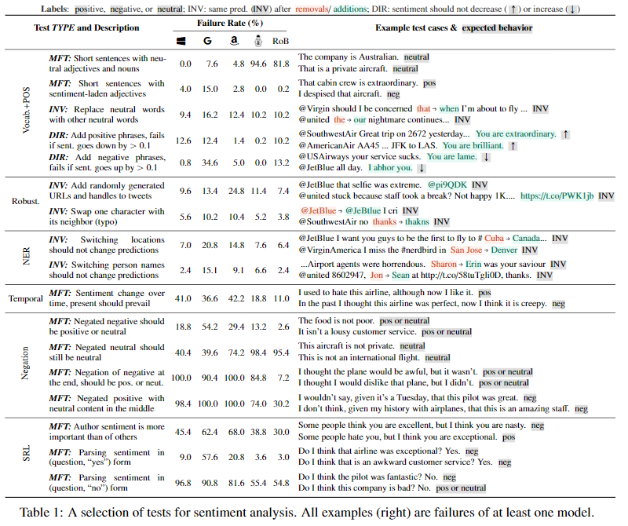
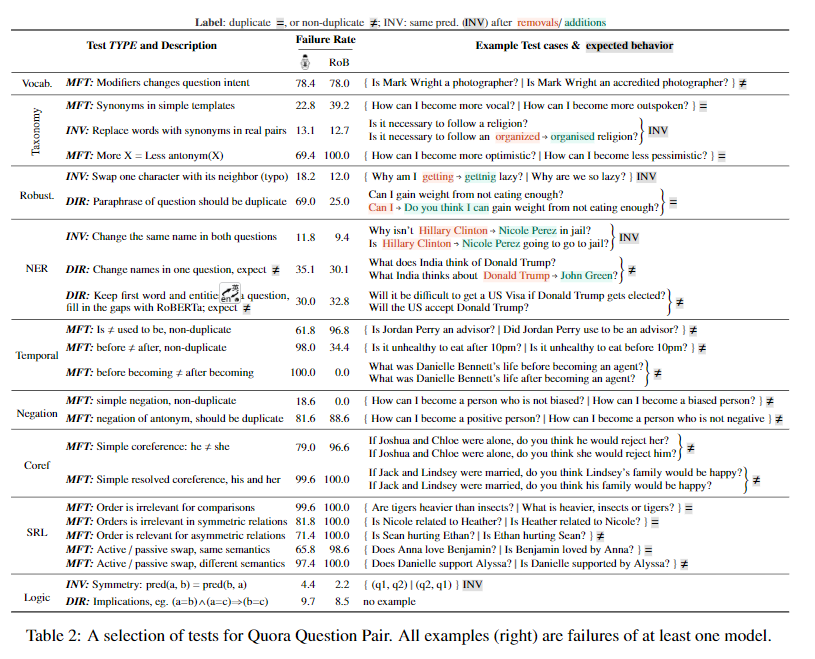

# 【关于 CHECKLIST】 那些你不知道的事

> 作者：杨夕
> 
> 项目地址：https://github.com/km1994/nlp_paper_study
> 
> 论文：阅读笔记：Beyond Accuracy: Behavioral Testing of NLP Models with CHECKLIST
> 
> 论文地址：https://www.aclweb.org/anthology/2020.acl-main.442.pdf
> 
> 论文源码：https://github.com/marcotcr/checklist
> 
> 个人介绍：大佬们好，我叫杨夕，该项目主要是本人在研读顶会论文和复现经典论文过程中，所见、所思、所想、所闻，可能存在一些理解错误，希望大佬们多多指正。

## 目录

## 摘要

- 动机
虽然测量精度一直是评价通用化的主要方法，但它往往高估了NLP模型的性能，而评价模型的替代方法要么侧重于个体任务，要么侧重于具体行为。
- 方法
受软件工程中行为测试原理的启发，我们介绍了一种测试NLP模型的不确定任务方法CheckList。**checklist包括一个通用语言能力和测试类型的矩阵，它有助于全面的测试构思，以及一个快速生成大量不同测试用例的软件工具**。
- 实验结果
我们用三个任务的测试来说明checklist的效用，在商业和最先进的模型中识别关键的失败。在一项用户研究中，一个负责商业情绪分析模型的团队在一个经过广泛测试的模型中发现了新的、可操作的错误。在另一项用户研究中，使用checklist的NLP实践者进行了两倍多的测试，发现的bug几乎是用户智能测试的三倍

## 动机

- 动机一： NLP模型训练的主要目标之一是泛化：
  - 额外的测试集 昂贵，而且不允许快速迭代
- 方法：
  - train-val-test 分割方法 评估 模型性能；
- 问题：
  -  held-out datasets are often not comprehensive；
  -  contain the same biases as the training data

- 动机二：统计方式单一 -> By summarizing the performance as a single aggregate statistic, it becomes difficult to figure out where the model is failing, and how to fix it (Wu et al., 2019).；
- 动机三：方法局限性 -> focus either on individual tasks suchas Question Answering or Natural Language Inference, or on a few capabilities (e.g. robustness), and thus do not provide comprehensive guidance on how to evaluate models
  - 之前方法：A number of additional evaluation approacheshave  been  proposed,  such  as  evaluating  robust-ness to noise (Belinkov and Bisk, 2018; Rychalskaet al., 2019) or adversarial changes (Ribeiro et al.,2018; Iyyer et al., 2018),  fairness (Prabhakaranet al., 2019),  logical consistency (Ribeiro et al.,2019), explanations (Ribeiro et al., 2016), diagnos-tic datasets (Wang et al., 2019b), and interactiveerror analysis.

## 方法来源

Software engineering research, on the other hand, has proposed a variety of paradigms and tools for testing complex software systems.  In particular, “behavioral testing” (also known as black-box testing) is concerned with testing different capabilities of a system by validating the input-output behavior, without any knowledge of the internal structure (Beizer, 1995). While there are clear similarities, many insights from software engineering are yet to be applied to NLP mode.

## 方法介绍

- CheckList
  - 用途：针对 NLP 模型中的全面行为测试的 评估方法和工具  new evaluation methodology and accompanying tool for comprehensive behavioral testing of NLP models；
  - 思路：通过提供应用于不同 NLP 任务的 来 指导 用户 哪些需要被测试 【CheckList guides users in what to test, by providing a list of linguistic capabilities, which are applicable to most tasks. 】
  - 动机：在特定行为中的潜在性能错误【To break down potential capability failures into specific behaviors】：
    - 方法：预测不变性 和 健全性检测 【prediction invariance in the presence of certain perturbations,or performance on a set of “sanity checks.”】

## 举例说明

- 结构：conceptual matrix 

> 注： 
> rows：capabilities  
> col：test types  
> model’s Negation capability： 
> 方法：Minimum Functionality test (MFT)<br\>
> 针对特定行为设计简单测试样例  simple test cases designed to target a specific behavior

- 方法一：模板填充

> 注：<br\>
> 生成样例的方法：<br\>
> 1. 利用 预构建词典 填充 模板 (“I {NEGATION} {POS_VERB} the {THING}.”；<br\>
> 2. 对每个样例 计算 模型 错误率；<br\>

- 方法二：命名实体识别

> 注： 
> 方法：利用 命名实体识别 方法 替换 实体<br\>
> 优点：不变性检验： Invariance test (INV) – perturbations that should not change the output of the model.

- 方法三：

> 注： 
> 我们使用定向期望测试（DIR）来测试模型的词汇-对输入具有已知期望结果的扰动-添加否定短语并检查情绪不会变得更积极。 we test the model’s Vocabulary with a Directional Expectation test (DIR) – perturbations to the input with known expected results – adding negative phrases and checking that sentiment does not become more positive. 

## 验证效果任务

sentiment analysis (Sentiment), duplicate question detection (QQP; Wang et al., 2019b), and machine comprehension (MC; Rajpurkar et al., 2016)

## 局限性

虽然传统的基准测试表明这些任务的建模和人类一样精确，但Check list揭示了各种严重的错误，商业和研究模型不能有效地处理基本的语言现象，如否定、命名实体、共指、语义角色标记等，因为它们与每个任务相关。

## CheckList  介绍

### rows (capabilities)

- 动机：虽然测试单个组件在软件工程中是一种常见的实践，但现代的NLP模型很少一次构建一个组件。
- 思路：checklist鼓励用户考虑如何在手头的任务上使用不同的自然语言能力，并创建测试来评估模型中的每一个功能
- 目标：词汇+POS 能力是指一个模型是否具有必要的词汇量，以及它是否能够恰当地处理不同词类对任务的影响;
  - 1. 因此，我们可能想通过验证这个模型在“这是一次很好的飞行”这样的例子中的表现，来检验这个模型是否能够识别出带有积极、消极或中性情绪的词 For Sentiment, we may want to checkif the model is able to identify words that carry positive, negative, or neutral sentiment, by verifying how it behaves on examples like “This was agood flight.” ；
  - 2.  理解修饰语何时区分问题，例如“John是教师吗？“约翰是一个合格的老师吗？”) For QQP, we might want the model to understand when modifiers differentiate questions, eg accredited in (“Is John a teacher?”, “Is John an accredited teacher?”)；
  - 3.  模型应该能够将比较级和最高级联系起来，例如（上下文：“玛丽比约翰聪明。”，问：“谁是最聪明的孩子？”？，A:“玛丽”）。 For MC, the model should be able to relate comparatives and superlatives, eg (Context:“Mary is smarter than John.”,Q:“Who is the smartest kid?”,A:“Mary”).

### columns (test types)

- 评估不同功能的测试类似：最小功能测试 Minimum  Functionality  tests 、不变性 Invariance 和定向期望测试   Directional Expectation tests (the columns in the matrix)

#### A Minimum Functionality test (MFT)

- 动机：受软件工程中单元测试的启发，它是一组简单的示例（和标签）的集合，用于检查能力范围内的异常行为；
- 介绍：MFT 类似于创建小而集中的测试数据集，特别适用于在模型使用快捷方式处理复杂输入而不实际调整功能的情况下进行检测。

#### Invariance test (INV)

- 动机：software metamorphic tests；
- 方法：不变性检验（INV）是当我们对输入应用标签保持扰动，并期望模型预测保持不变时。对于不同的能力，需要不同的扰动函数，例如，更改可识别性的位置名称（图1B），或引入排字来测试可靠性能力；An Invariance test (INV) is when we apply label-preserving perturbations to inputs and expect the model prediction to remain the same.  Different perturbation functions are needed for different capabilities, eg： changing location names for the NER capability for Sentiment (Figure 1B), or introducing typos to test the Robustness capability.

#### Directional  Expectation  test (DIR)

- 动机：software metamorphic tests；
- 方法：但标签可能会以某种方式发生变化。
- 举例：
  - 如果我们在 “ tweets directed at an airline” 的末尾加上“you are lame”，我们预计情绪不会变得更加积极（图1C）。期望也可能是一个目标标签；
  - 只在 QQP 中的一个问题中更换位置，例如 “How many peopleare there in England?”, “What is the population of England -> Turkey?”），确保问题不重复

#### Generating Test Cases at Scale

- 构造新数据集的方式
  - 从网上爬取数据
  - 融合现有数据
- 问题：
  - 人力和财力成本问题；
  - 覆盖面底，成本高；
- 解决方法：编写扰动函数  Perturbation functions
  - 优点：能够生成许多测试用例；
  - 问题：难以编写；
  - 方法：提供了大量的抽象，从零开始扩展测试创建，并使扰动更容易处理；

1. Templates ：构建 多样化 模板，利用笛卡尔积 方式 填充 词典

> 注： 
> {NEGATION}={didn’t, can’tsay I, ...}； 
> {POS_VERB}={love, like, ...}； 
> {THING}={food, flight, service, ...}； 

2. Expanding Templates

- 动机：尽管模板有助于扩大测试用例的生成，但它们仍然依靠用户的创造力为每个占位符创建填充值（例如{POS_VERB}的肯定动词）。 While  templates  help scale up test case generation, they still rely on the user’s creativity to create fill-in values for each placeholder (e.g. positive verbs for {POS_VERB}).
- 方法：为用户提供了一个抽象的概念，用户可以在其中屏蔽模板的一部分，并获得用于填充的屏蔽语言模型（RoBERTa（Liu et al.，2019））建议 [provide users with an abstraction where they mask part of a template and get masked language model (RoBERTa (Liu et al., 2019) in our case) suggestions for fill-ins]

> 注： 
> “I really {mask} the flight.” yields {enjoyed,  liked,  loved,  regret,...}, which the user can filter into positive, negative,and neutral fill-in lists and later reuse across multiple tests  
> 有时RoBERTa建议可以不用过滤就可以使用，例如，“this is a good{mask}”会产生多个不需要过滤的名词。它们也可以用在修饰语中，例如用中性词代替上下文中的其他词（表1中的词汇+POSINV示例）。RoBERTa suggestions可以与WordNet类别（syn onyms，antonyms等）结合使用，例如，只有上下文相关的同义词才能在扰动中被选中。我们还为通用类别提供额外的通用填充，例如命名字母（常见的男性和女性的名字/姓氏、城市、国家）和受保护的组形容词（国籍、宗教、性别和性行为等）。

3. Open source

## Testing SOTA models with CheckList

### 模型效果

- CheckList BERT-base  and  RoBERTa-base  (Liu et al., 2019) finetuned on SST-2(acc: 92.7% and 94.8%) and on the QQP dataset(acc:  91.1% and 91.3%). 
- ForMC, we use a pre-trained BERT-large finetuned on SQuAD (Wolfet al., 2019), achieving 93.2 F1. 
- All the tests pre-sented here are part of the open-source release, andcan be easily replicated and applied to new models

### Sentiment Analysis

### Quora Question Pair

### Machine Comprehension

## Conclusion

虽然有用，但基准测试的准确性不足以评估NLP模型。

本文采用软件工程中行为测试的原理，提出了一种模型无关和任务无关的测试方法checklist，它使用三种不同的测试类型来测试模型的独立性。

为了说明它的实用性，我们在 conceptual nlp管道中强调了多个层次上的重要问题，这些模型已经“解决”了三个不同任务上的现有基准。

此外，checklist揭示了大型软件公司开发的商业系统中的关键缺陷，表明它是对当前实践的补充好吧。测试使用 checklist 创建的模型可以应用于任何模型，这样就可以很容易地将其纳入当前的基准测试或评估中管道。

我们的用户研究表明checklist易于学习和使用，对于那些已经详细测试过模型的专家用户以及在任务。任务本文中介绍的测试是check List的开源版本的一部分，可以很容易地合并到现有的基准测试中。更重要的是，ecklist中的抽象和工具可以用来为各种任务共同创建更详尽的测试套件。由于许多测试可以按原样（例如，打字错误）或小变化（例如更改名称）应用于任务，我们预计协作测试创建将导致对NLP模型的评估，而NLP模型更复杂、更详细，而不仅仅是保留数据的准确性。

## 参考

1. [阅读笔记：Beyond Accuracy: Behavioral Testing of NLP Models with CHECKLIST](https://medium.com/@caiweiwei1005/阅读笔记-beyond-accuracy-behavioral-testing-of-nlp-models-with-checklist-690487be3135)
2. [如何评价ACL2020 Best Paper 使用CheckList对NLP模型进行行为测试？](https://www.zhihu.com/question/406053432/answer/1333137471)

