# 【关于 ACL 】那些你不知道的事

## 二、ACL2021

### 2.1 预训练语言模型及应用

#### [【How Good is Your Tokenizer? On the Monolingual Performance ofMultilingual Language Models】](https://arxiv.org/abs/2012.15613) 

- [github](https://github.com/Adapter-Hub/hgiyt)
- 介绍：在这项工作中，我们对预训练的多语种语言模型与单语种模型在单语任务性能方面进行了系统而全面的实证比较。我们在一组五种不同的单语下游任务中使用现成的预训练单语模型研究了一组九种类型不同的语言。
- 论文方法：
  - 我们首先旨在通过公平和受控的比较来确定该语言的多语言和相应的单语言表示之间是否存在差距;
  - 然后调查任何性能差异的原因。
  - 为了解决混淆因素，我们在相同的数据上训练新的单语模型，使用单语和多语训练的分词器
- 实验结果：虽然预训练数据大小是一个重要因素，但指定的单语分词器在下游性能中起着同样重要的作用。我们的结果表明，与单语模型相比，在多语言模型的词汇表中充分代表的语言表现出的性能下降可以忽略不计。我们进一步发现，用专门的单语分词器替换原始的多语言分词器可以提高多语言模型对几乎所有任务和语言的下游性能。
- 贡献：
  - 1）我们系统地比较了 9 种类型不同语言在 5 个结构不同的任务上的单语和多语言预训练语言模型。
  - 2）我们在具有不同分词器（即共享多语言与专用语言特定分词器）的同等大小数据集上训练新的单语模型) 从分词器的词汇表中分离出预训练数据大小的影响。
  - 3) 我们分离出导致性能差异的因素（例如，分词器的“生育力”、未见（子）词的数量、数据大小）并提供这些因素对任务性能的影响的深入分析。 
  - 4）我们的结果表明，单语适应的标记器可以有力地提高多语言模型的单语性能

#### [【Meta-KD: A Meta Knowledge Distillation Framework for Language ModelCompression across Domains】](https://arxiv.org/abs/2012.01266) 

- 动机：预训练的语言模型已应用于各种 NLP 任务，并获得了可观的性能提升。
  - 1） 较大的模型尺寸以及较长的推理时间限制了此类模型在实时应用程序中的部署。
  - 2） 典型的方法考虑知识提炼，将大型教师模型提炼为小型学生模型。然而，这些研究大多只关注单领域，而忽略了来自其他领域的可转移知识。

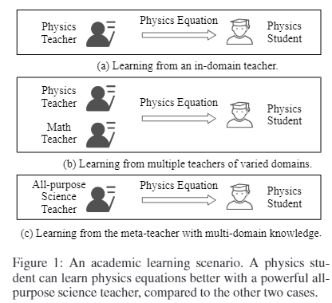

- 论文方法：用跨领域消化的可转移知识训练教师可以实现更好的泛化能力，以帮助知识提炼。为此，我们提出了一个元知识蒸馏 (Meta-KD) 框架来构建元教师模型，该模型捕获受元学习启发的跨领域的可转移知识，并将其用于将知识传递给学生。
- 思路：
  - 首先利用跨域学习过程在多个域上训练元教师；
  - 然后提出一种元蒸馏算法，在元教师的指导下学习单域学生模型。

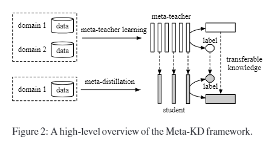

- 实验结果：在两个公共多领域 NLP 任务上的实验表明了所提出的 Meta-KD 框架的有效性和优越性。我们还在少样本和零样本学习设置中展示了 Meta-KD 的能力。
- 贡献：
  - 第一个探索基于元学习的 PLM 压缩算法的工作。
  - 提出了一种新颖的 Meta-KD 框架来提取跨领域的 PLM 知识，该框架由两个主要阶段组成：教师学习和元蒸馏。
  - 进行了广泛的实验来证明元 KD 的优越性，并探索该框架在小样本和零样本学习环境中的能力。

#### [【How is BERT surprised? Layerwise detection of linguistic anomalies】](https://arxiv.org/abs/2105.07452) 

- 动机：Transformer 语言模型在检测一个词在上下文中何时出现异常方面表现出非凡的能力，但似然分数没有提供有关异常原因的信息。
- 论文方法：使用高斯模型在三种语言模型（BERT、RoBERTa 和 XLNet）的中间层进行密度估计，并在语法判断基准 BLiMP 上评估我们的方法。在较低层中，surprisal 与低令牌频率高度相关，但这种相关性在较高层中减弱。
- 实验结果：从心理语言学研究中收集形态句法、语义和常识异常的数据集；我们发现，当异常是形态句法时，表现最好的模型 RoBERTa 在较早的层表现出惊人的表现，而不是在语义上，而常识性异常在任何中间层都没有表现出惊人的表现。这些结果表明语言模型采用不同的机制来检测不同类型的语言异常。

#### [【Super Tickets in Pre-Trained Language Models: From Model Compressionto Improving Generalization】](https://arxiv.org/abs/2105.12002) 

- 介绍：彩票假说表明，过度参数化的网络由“彩票”组成，训练它们的某个集合（即子网络）可以匹配完整模型的性能。
- 论文方法：在本文中，我们在极度过度参数化的模型（例如，预训练的语言模型）中研究了这种被称为“中奖券”的门票集合。我们观察到，在一定的压缩比下，中奖彩票的泛化性能不仅可以匹配，而且可以超过完整模型的泛化性能。特别是，我们观察到一个相变现象：随着压缩率的增加，中奖彩票的泛化性能先提高，然后在达到一定阈值后恶化。我们将门槛上的门票称为“超级门票”。我们进一步表明，相变取决于任务和模型——随着模型尺寸变大和训练数据集变小，相变变得更加明显。我们在 GLUE 基准测试中的实验表明，就任务平均得分而言，超级票证在 BERT-base 上将单任务微调提高了 0.9 分，在 BERT-large 上提高了 1.0 分。我们还证明了跨任务自适应共享超级票证有利于多任务学习。

#### [【IrEne: Interpretable Energy Prediction for Transformers】](https://arxiv.org/abs/2106.01199) 

- 代码：https://github.com/StonyBrookNLP/irene
- 介绍：现有的基于软件的 NLP 模型能量测量并不准确，因为它们没有考虑能量消耗和模型执行之间复杂的相互作用。
- 论文方法：提出了 IrEne，这是一种可解释且可扩展的能量预测系统，可准确预测各种基于 Transformer 的 NLP 模型的推理能量消耗。
- 思路：
  - IrEne 构建了一个模型树图，将 NLP 模型分解为模块，这些模块进一步分解为低级机器学习 (ML) 原语。 
  - IrEne 预测 ML 原语的推理能量消耗作为可泛化特征和细粒度运行的函数时间资源使用。 
  - IrEne 然后递归地聚合这些低级预测，以预测每个模块的能量，最终预测整个模型的能量。
- 实验结果：跨多个变压器模型的实验表明，与真实情况相比，IrEne 预测变压器模型的推理能耗具有低于 7% 的误​​差。相比之下，现有能源模型的误差超过 50%。我们还展示了如何使用 IrEne 进行能源瓶颈分析并轻松评估不同架构选择的能源影响。

#### [【Syntax-Enhanced Pre-trained Model】](https://arxiv.org/abs/2012.14116) 
#### [（9）PLOME: Pre-training with Misspelled Knowledge for Chinese SpellingCorrection]()
#### [（10）EnsLM: Ensemble Language Model for Data Diversity by SemanticClustering]()
#### [（11）StructFormer: Joint Unsupervised Induction of Dependency andConstituency Structure from Masked Language Modeling](https://arxiv.org/abs/2012.00857)
#### [（12）Convolutions and Self-Attention: Re-interpreting Relative Positionsin Pre-trained Language Models](https://arxiv.org/abs/2106.05505)
#### [（13）Implicit Representations of Meaning in Neural Language Model](https://arxiv.org/abs/2106.00737)
#### [（14）ERICA: Improving Entity and RelationUnderstanding for Pre-trained Language Models via Contrastive Learning](https://arxiv.org/abs/2012.15022)
#### [（15）Improving Formality Style Transfer with Context-Aware Rule Injection](https://arxiv.org/abs/2106.00210)
#### [（16）BinaryBERT: Pushing the Limit of BERT Quantization](https://arxiv.org/abs/2012.15701)
#### [（17）Shortformer: Better Language Modeling using Shorter Inputs](https://arxiv.org/abs/2012.15832)
#### [（18）Making Pre-trained Language Models Better Few-shot Learners](https://arxiv.org/abs/2012.15723)
#### [（19）ChineseBERT: Chinese Pretraining Enhanced by Glyph and PinyinInformation]()
#### [（20）Are Pretrained Convolutions Better than Pretrained Transformers?](https://arxiv.org/abs/2105.03322)
#### [（21）ERNIE-Doc: A Retrospective Long-Document Modeling Transformer](https://arxiv.org/abs/2012.15688)
#### [（22）LeeBERT: Learned Early Exit for BERT with cross-level optimization]()
#### [（23）Positional Artefacts Propagate Through Masked Language Model Embeddings](https://arxiv.org/abs/2011.04393)
#### [（24）Optimizing Deeper Transformers on Small Datasets](https://arxiv.org/abs/2012.15355)
#### [(25)When Do You Need Billionsof Words of Pretraining Data?](https://arxiv.org/abs/2011.04946)
#### [（26）Knowledgeable or Educated Guess? Revisiting Language Models asKnowledge Bases](https://arxiv.org/abs/2106.09231)
#### [（27）EarlyBERT: Efficient BERT Training via Early-bird Lottery Tickets](https://arxiv.org/abs/2101.00063)
#### [（28）SMedBERT: A Knowledge-Enhanced Pre-trained Language Model withStructured Semantics for Medical Text Mining]()
#### [（29）Structural Guidance for Transformer Language Models]()
#### [（30）MPC-BERT: A Pre-Trained Language Model for Multi-Party ConversationUnderstanding](https://arxiv.org/abs/2106.01541)
#### [（31）Language Model Evaluation Beyond Perplexity](https://arxiv.org/abs/2106.00085)
#### [（32）BERTGen: Multi-task Generation through BERT](https://arxiv.org/abs/2106.03484)
#### [（33）Pre-training Universal Language Representation](https://arxiv.org/abs/2105.14478)
#### [（34）Cascaded Head-colliding Attention](https://arxiv.org/abs/2105.14850)
#### [（35）Parameter-efficient Multi-task Fine-tuning for Transformers viaShared Hypernetworks](https://arxiv.org/abs/2106.04489)
#### [（36）Accelerating BERT Inference for Sequence Labeling via Early-Exit](https://arxiv.org/abs/2105.13878)
#### [（37）AutoTinyBERT: Automatic Hyper-parameter Optimization for EfficientPre-trained Language Models]()
#### [（38）Lexicon Enhanced Chinese Sequence Labeling Using BERT Adapter](https://arxiv.org/abs/2105.07148)
#### [（39）On the Effectiveness of Adapter-based Tuning for Pretrained LanguageModel Adaptation](https://arxiv.org/abs/2106.03164)
#### [（40）Taming Pre-trained Language Models with N-gram Representations forLow-Resource Domain Adaptation]()
#### [（41）Marginal Utility Diminishes: Exploring the Minimum Knowledge forBERT Knowledge Distillation](https://arxiv.org/abs/2106.05691)
#### [（42）Obtaining Better Static Word Embeddings UsingContextual Embedding Models](https://arxiv.org/abs/2106.04302)
#### [（43）Reflective Decoding: Beyond Unidirectional Generation withOff-the-Shelf Language Models](https://arxiv.org/abs/2010.08566)
#### [（44）Reservoir Transformers](https://arxiv.org/abs/2012.15045)
#### [（45）LexFit: Lexical Fine-Tuning of Pretrained Language Models]()
#### [（46）Selecting Informative Contexts Improves Language Model Fine-tuning](https://arxiv.org/abs/2005.00175)
#### [（47）BERT is to NLP what AlexNet is to CV: Can Pre-Trained LanguageModels Identify Analogies?](https://arxiv.org/abs/2105.04949)
#### [（48）Examining the Inductive Bias of Neural Language Models withArtificial Languages](https://arxiv.org/abs/2106.01044)
#### [（49）An Empirical Study on Hyperparameter Optimization for Fine-TuningPre-trained Language Models](https://arxiv.org/abs/2106.09204)
#### [（50）BERTAC: Enhancing Transformer-based Language Models withAdversarially Pretrained Convolutional Neural Networks]()
#### [（51）Enabling Lightweight Fine-tuning for Pre-trained Language ModelCompression based on Matrix Product Operators](https://arxiv.org/abs/2106.02205)
#### [（52）Length-Adaptive Transformer: Train Once with Length Drop, UseAnytime with Search](https://arxiv.org/abs/2010.07003)
#### [（53）H-Transformer-1D: Fast One-Dimensional Hierarchical Attention forSequences]()
#### [（54）Hi-Transformer: Hierarchical Interactive Transformer for Efficientand Effective Long Document Modeling](https://arxiv.org/abs/2106.01040)
#### [（55）Is Sparse Attention more Interpretable?](https://arxiv.org/abs/2106.01087)
#### [（56）Learning to Generate Task-Specific Adapters from Task Description](https://arxiv.org/abs/2101.00420)
#### [（57）Thank you BART! Rewarding Pre-Trained Models Improves FormalityStyle Transfer](https://arxiv.org/abs/2105.06947?context=cs)
#### [（58）Pre-training is a Hot Topic: Contextualized Document EmbeddingsImprove Topic Coherence](https://arxiv.org/abs/2004.03974)

### 2.2 信息抽取

#### 2.2.1 实体抽取

##### 2.2.1.1 嵌套&非连续NER

###### [A Span-Based Model for Joint Overlapped and Discontinuous Named Entity Recognition]()

###### [Locate and Label: A Two-stage Identifier for Nested Named Entity Recognition](https://arxiv.org/abs/2105.06804)

- 介绍：命名实体识别 (NER) 是自然语言处理中一项经过充分研究的任务。
- 动机：传统的 NER 研究只处理平面实体而忽略嵌套实体。Span-Based 的方法将实体识别视为 Span 分类任务。尽管这些方法具有处理嵌套 NER 的先天能力，但它们存在**计算成本高**、**边界信息无知**、与**实体部分匹配的 Span 利用不足**以及**长实体识别困难**等问题。

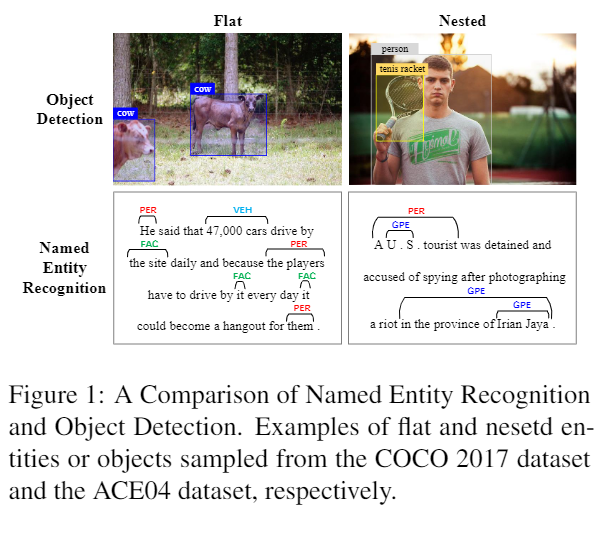
> 图 1：命名实体识别和对象检测的比较。分别从 COCO 2017 数据集和 ACE04 数据集采样的 lat 和 nestd 实体或对象的示例。

- 论文方法：提出了一个两阶段的实体标识符。
- 思路：
  - 首先，我们通过对种子 Span 进行过滤和边界回归来生成 Span 建议以定位实体；
  - 然后用相应的类别标记边界调整后的 Span 建议.

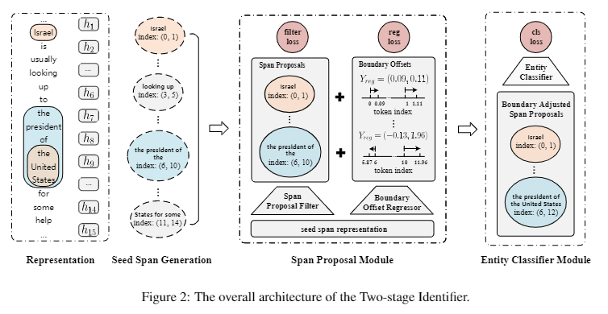

- 实验结果：我们的方法在训练过程中有效地利用了实体的边界信息和部分匹配的 Span 。
  - 通过边界回归，理论上可以覆盖任意长度的实体，提高识别长实体的能力。
  - 在第一阶段过滤掉了许多低质量的种子 Span ，从而降低了推理的时间复杂度。嵌套 NER 数据集的实验表明，我们提出的方法优于以前的最先进模型。

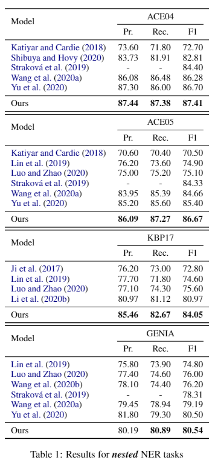

- 论文贡献：
  - 受物体检测中流行的两阶段检测器的启发，我们为 NER 提出了一种新的两阶段标识符，**首先定位实体，然后标记它们。我们将 NER 视为 boundary regression and spanclassification 的联合任务**。
  - 我们有效利用边界信息。进一步识别实体边界，我们的模型可以调整边界以准确定位实体。并且在训练边界回归器时，除了边界级别的 SmoothL1 损失之外，我们还使用了 Span 级别的损失，用于衡量两个 Span 之间的重叠。
  - 在训练过程中，我们不是简单地将部分匹配的 Span 视为反例，而是基于 IoU 构建软示例。这不仅减轻了正例和负例之间的不平衡，而且有效地利用了与真实实体部分匹配的 Span 。
  - 实验表明，我们的模型在 KBP17、ACE04 和 ACE05 上始终如一地实现了最先进的性能数据集，并在 F1-score 上比几个竞争的基线模型在 KBP17 上的表现高出 +3.08%，在 ACE04 上表现出 +0.71%，在 ACE05 上表现出 +1.27%。

###### [Nested Named Entity Recognition via Explicitly Excluding the Influence of the Best Path]()

###### [Discontinuous Named Entity Recognition as Maximal Clique Discovery](https://arxiv.org/abs/2106.00218)

- 动机：当实体提及可能不连续时，命名实体识别 (NER) 仍然具有挑战性。现有方法将识别过程分解为几个连续的步骤：
  - 在训练中，他们以黄金中间结果为条件进行预测；
  - 在推理时依赖于前面步骤的模型输出；
- 问题：引入了曝光偏差。

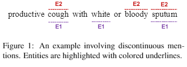

- 论文思路：
  - 首先为每个句子构造一个段图，其中每个节点表示一个段（一个连续的实体本身，或者不连续实体的一部分），一条边连接属于同一实体的两个节点.节点和边可以在一个阶段使用网格标记方案分别生成，并使用名为 Mac 的新型架构联合学习；
  - 然后，不连续的 NER 可以被重新表述为一个非参数过程，即在图中发现最大团并连接每个团中的 Span 。

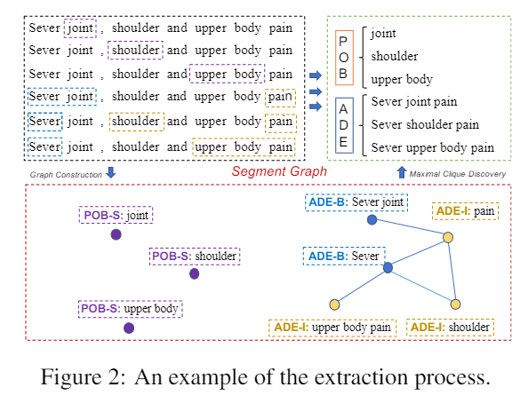

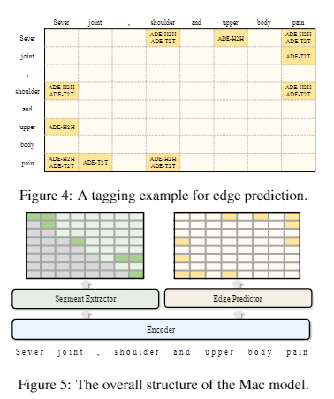

- 实验结果：在三个基准上的实验表明，我们的方法优于最先进的 (SOTA) 结果，在 F1 上提高了 3.5 个百分点，并且比 SOTA 模型实现了 5 倍的加速。

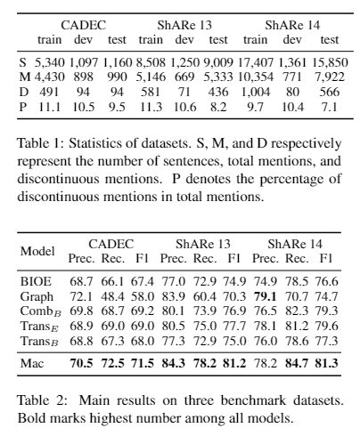

###### [A Unified Generative Framework for Various NER Subtasks](https://arxiv.org/abs/2106.01223)

- 代码：https://github.com/yhcc/BARTNER
- 动机：命名实体识别 (NER) 是识别表示句子中实体的 Span 的任务。无论实体 Span 是嵌套的还是不连续的，NER 任务都可以分为 Flat NER, nested NER 和 discontinuous NER subtasks。这些子任务主要通过token级别的序列标注或者span级别的分类来解决。然而，这些解决方案很难同时处理这三种 NER 子任务。

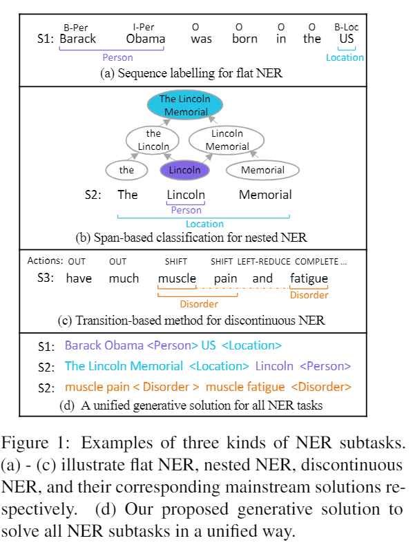

- 论文方法：将 NER 子任务制定为实体 Span 序列生成任务，可以通过统一的序列到序列 (Seq2Seq) 框架来解决。基于我们的统一框架，我们可以利用预训练的 Seq2Seq 模型来解决所有三种 NER 子任务，而无需特殊设计的标记模式或枚举 Span 的方法。我们利用三种类型的实体表示将实体线性化为序列。我们提出的框架易于实现

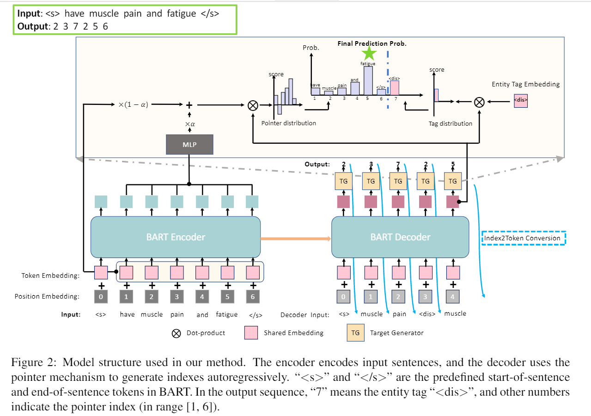

- 实验结果：并在八个英语 NER 数据集上实现了最先进的 (SoTA) 或接近 SoTA 的性能，包括两个 Fla NER 数据集、三个 nested 的 NER 数据集和三个 discontinuous 的 NER 数据集。

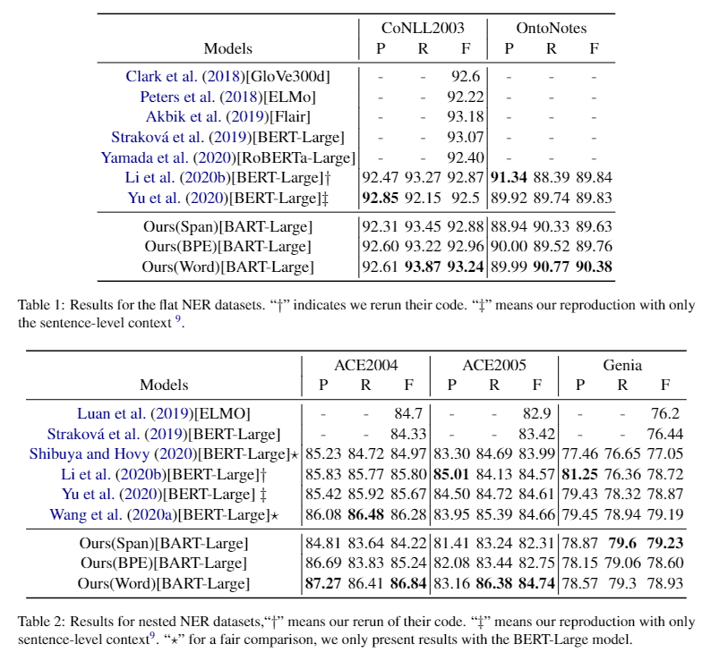

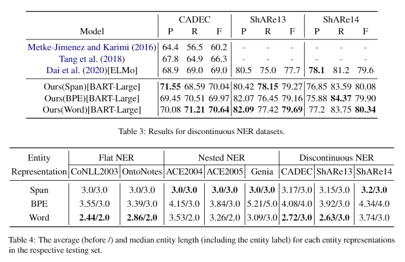

- 贡献：
  - 我们提出了一种新颖且简单的生成解决方案来解决统一框架中的Flat NER, nested NER 和 discontinuous NER subtasks，其中 NER 子任务被制定为实体 Span 序列生成问题。
  - 我们将预训练的 Seq2Seqmodel BART 合并到我们的框架并利用三种实体表示将实体线性化为序列。结果可以为 BART 在实体序列生成中的进一步探索提供一些启示。
  - 所提出的框架不仅避免了标记模式或 Span 枚举的复杂设计，而且在八个流行的数据集上实现了 SoTA 或接近 SoTA 的性能，包括两个平面 NER 数据集，三个嵌套的 NER 数据集和三个不连续的 NER 数据集

##### 2.2.1.2 少样本NER

###### [A Span-Based Model for Joint Overlapped and Discontinuous Named Entity Recognition](https://www.researchgate.net/publication/351885762_Subsequence_Based_Deep_Active_Learning_for_Named_Entity_Recognition)

- 代码：https://github.com/puria-radmard/RFL-SBDALNER
- 动机：主动学习 (AL) 已成功应用于深度学习，以大幅减少实现高性能所需的数据量。以前的工作表明，命名实体识别 (NER) 的轻量级架构只需 25% 的原始训练数据即可实现最佳性能。然而，这些方法**没有利用语言的顺序性和每个实例中不确定性的异质性**，需要对整个句子进行标记。此外，此标准方法要求注释者在标记时可以访问完整的句子。
- 论文方法：通过允许 AL 算法查询句子中的子序列并将它们的标签传播到其他句子来克服这些限制。
- 实验结果：我们在 OntoNotes 5.0 上取得了高效的结果，只需要原始训练数据的 13%，而在 CoNLL 2003 上，只需要 27%。与查询完整句子相比，这提高了 39% 和 37%。
- 贡献
1. 通过允许在完整句子上查询子序列来提高 AL 对 NER 的效率；
2. 基于实体的分析表明子序列查询 AL 策略倾向于查询更多相关的标记（即属于实体的标记）；
3. 对完整句子和子序列查询方法进行的查询的不确定性分析，证明查询完整句子会导致选择更多模型已经确定的标记。

###### [Few-NERD: A Few-shot Named Entity Recognition Dataset](https://arxiv.org/abs/2105.07464)

- 代码：https://github.com/thunlp/Few-NERD
- 动机：最近，围绕小样本命名实体识别 (NER) 的主题出现了大量文献，但很少发表专门针对实际和具有挑战性的任务的基准数据。当前的方法收集现有的受监督的 NER 数据集，并将它们重新组织到少数样本设置以进行实证研究。这些策略通常旨在用很少的例子来识别粗粒度的实体类型，而在实践中，大多数看不见的实体类型都是细粒度的。
- 论文方法：提出了 Few-NERD，这是一个大规模人工注释的小样本 NER 数据集，具有 8 个粗粒度和 66 个细粒度实体类型的层次结构。Few-NERD 由来自维基百科的 188,238 个句子组成，包含 4,601,160 个单词，每个单词都被注释为上下文或两级实体类型的一部分。据我们所知，这是第一个小样本 NER 数据集，也是最大的人造 NER 数据集。我们构建不同侧重点的基准任务来综合评估模型的泛化能力。大量的实证结果和分析表明，Few-NERD 具有挑战性，该问题需要进一步研究。

###### [Named Entity Recognition with Small Strongly Labeled and Large Weakly Labeled Data](https://arxiv.org/abs/2106.08977)

- 动机：弱监督在许多自然语言处理任务中显示出有希望的结果，例如命名实体识别 (NER)。现有工作主要集中在仅使用弱监督（即没有任何人工注释）学习深度 NER 模型，并表明仅使用弱标记数据可以获得良好的性能，尽管仍然不如使用手动/强标记数据的全监督 NER 模型。
- 论文方法：考虑了一个更实际的场景，其中我们既有少量强标记数据，也有大量弱标记数据。不幸的是，当我们在强标记和弱标记数据的简单或加权组合上训练深度 NER 模型时，我们观察到**弱标记数据不一定会改善甚至恶化模型性能**（由于弱标记中的大量噪声） .为了解决这个问题，我们提出了一个新的多阶段计算框架——NEEDLE
- 基本要素：
  - （1）弱标签完成；
  - （2）噪声感知损失函数；
  - （3）对强标签的最终微调数据。

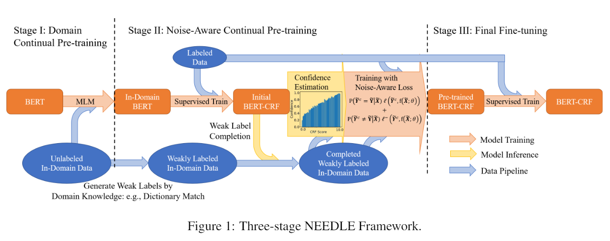

- 思路：
  - 1）我们首先通过对未标记的域内数据进行 MLM 连续预训练，使开放域预训练语言模型适应下游域。 
  - 2）我们使用知识库将未标记的数据转换为弱标记的数据通过弱监督获取数据。然后我们应用噪声感知持续预训练从强标记和弱标记数据中学习任务特定的知识；
  - 3）最后，我们再次在强标记数据上微调模型

- 实验结果：通过对电子商务查询 NER 和生物医学 NER 的实验，我们证明 NEEDLE 可以有效抑制弱标签的噪声并优于现有方法。特别是，我们在 3 个生物医学 NER 数据集上获得了新的 SOTA F1 分数：BC5CDR-chem 93.74、BC5CDR-disease 90.69、NCBI-disease 92.28。

###### [Weakly Supervised Named Entity Tagging with Learnable Logical Rules]()

###### [Leveraging Type Descriptions for Zero-shot Named Entity Recognition and Classification]()

###### [Learning from Miscellaneous Other-Class Words for Few-shot Named Entity Recognition]()

##### 2.2.1.3 中文&多模NER

###### [MECT: Multi-Metadata Embedding based Cross-Transformer for Chinese Named Entity Recognition]()

###### [A Large-Scale Chinese Multimodal NER Dataset with Speech Clues]()

##### 2.2.1.4 实体标准化

###### [An End-to-End Progressive Multi-Task Learning Framework for Medical Named Entity Recognition and Normalization]()

###### [A Neural Transition-based Joint Model for Disease Named Entity Recognition and Normalization](https://academic.oup.com/bioinformatics/article/33/15/2363/3089942?login=true)

- 动机：疾病命名实体在生物医学研究的许多领域都发挥着核心作用，此类实体的自动识别和规范化在生物医学研究界受到越来越多的关注。
- 现有方法通常使用具有两个独立阶段的管道模型：
  - （i）疾病命名实体识别（DER）系统用于查找文本中提及的边界
  - （ii）疾病命名实体规范化
  - （DEN）系统用于连接在受控词汇表中识别出概念的提及。
- 此类模型的主要问题是：
  - （i）从 DER 到 DEN 存在错误传播；
  - （ii）DEN 对 DER 有用，但管道模型无法利用这一点。
- 方法：我们提出了一种基于转换的模型来联合执行疾病命名实体识别和归一化，将输出构建过程转换为增量状态转换过程，全局学习转换动作序列，对应于联合结构输出。使用光束搜索和在线结构化学习，学习旨在指导搜索。与唯一现有的联合 DEN 和 DER 方法相比，我们的方法允许使用非局部特征，这显着提高了准确性。
- 实验结果：我们在两个语料库上评估我们的模型：BioCreative V 化学疾病关系 (CDR) 语料库和 NCBI 疾病语料库。实验表明，与竞争管道基线相比，我们的联合框架实现了显着更高的性能。我们的方法优于其他最先进的方法。

### 参考资料

1. [ACL2021 信息抽取相关论文汇总](https://zhuanlan.zhihu.com/p/382960251)
2. [ACL2021主会议论文汇总及分类](https://mp.weixin.qq.com/s/qsOZMnrkxyHDOihAxft7Rg)

## 一、ACL2020

1. [ACL2020信息抽取相关论文汇总](https://zhuanlan.zhihu.com/p/142408584)
2. [ACL2020放榜！事件抽取、关系抽取、NER、Few-Shot相关论文整理~](https://zhuanlan.zhihu.com/p/142159870)
3. [ACL 2020 最新论文概览](https://zhuanlan.zhihu.com/p/127062292)