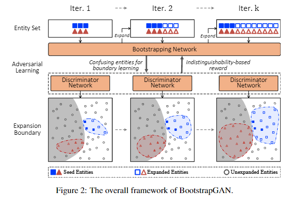
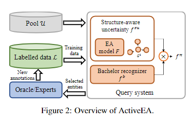

# EMNLP 论文收集

## EMNLP 2021 精选

- 地址：https://2021.emnlp.org/papers#main-long
- 参考：
  - [72篇信息抽取论文梳理：涉及NER、复杂关系、小样本、文档级、多模态、开放域抽取](https://mp.weixin.qq.com/s/P8HP4zoh9mQ51Kg88bLIgg)

### 一、实体抽取（共19篇）

#### 1.1 小样本&低资源&降噪&跨领域NER

##### Learning from Noisy Labels for Entity-Centric Information Extraction

- 论文地址：https://arxiv.org/abs/2104.08656
- github:https://github.com/wzhouad/NLL-IE
- 动机：最近的信息提取方法依赖于训练深度神经模型。然而，这样的模型很**容易过度拟合嘈杂的标签并导致性能下降**。虽然在大型学习资源中**过滤噪声标签的成本非常高**，但最近的研究表明，此类标签需要更多的训练步骤来记忆，并且比干净的标签更容易被遗忘，因此在训练中是可识别的。
- 论文方法：提出了一个用于以实体为中心的信息提取的简单协同正则化框架，该框架由几个结构相同但参数初始化不同的神经模型组成。这些模型与特定于任务的损失一起进行了优化，并进行了正则化以基于一致性损失生成类似的预测，从而防止在嘈杂的标签上过度拟合。
- 实验结果：在两个广泛使用但嘈杂的信息提取基准 TACRED 和 CoNLL03 上的大量实验证明了我们框架的有效性。我们将代码发布给社区以供将来研究。

##### Data Augmentation for Cross-Domain Named Entity Recognition

- 论文地址：https://arxiv.org/abs/2109.01758
- github : https://github.com/RiTUAL-UH/style_NER
- 动机：命名实体识别 (NER) 的当前工作表明，数据增强技术可以产生更强大的模型。然而，**大多数现有技术都专注于在标注数据非常有限的低资源场景中增加域内数据**。
- 论文方法：研究了 NER 任务的跨域数据增强。我们研究了通过将高资源领域的数据投射到低资源领域来利用数据的可能性。具体来说，我们提出了一种新颖的神经架构，通过学习文本中区分它们的模式（例如样式、噪声、缩写等）和共享特征空间，将数据表示从高资源域转换为低资源域两个域对齐的地方。
- 实验结果：我们对不同的数据集进行了实验，并表明将数据转换为低资源域表示比仅使用来自高资源域的数据实现了显着改进。

##### Unsupervised Paraphrasing Consistency Training for Low Resource Named Entity Recognition

##### Few-Shot Named Entity Recognition: An Empirical Baseline Study

#### 1.2 细粒度实体分类&实体集拓展

##### Progressive Adversarial Learning for Bootstrapping: A Case Study on Entity Set Expansion

- 论文地址：https://arxiv.org/abs/2109.12082
- 动机：Bootstrapping 已经成为实体集扩展的主流方法。传统的 bootstrapping 方法大多使用基于种子的距离度量来定义扩展边界，这在很大程度上取决于所选种子的质量，并且由于监督极其稀疏而难以调整。
- 论文方法：提出了 BootstrapGAN，这是一种新的引导学习方法，它在 GAN 框架中联合建模引导过程和边界学习过程。
  - 通过不同的判别器网络学习不同引导迭代的扩展边界；
  - the bootstrapping network 是生成新的正实体的生成器，
  - 鉴别器网络通过尝试将生成的实体与已知的正实体区分开来识别扩展边界。
  - 通过迭代执行上述对抗性学习，生成器和鉴别器可以相互加强，并在整个引导过程中逐步完善。
- 实验表明，BootstrapGAN 实现了新的最先进的实体集扩展性能。

##### Fine-grained Entity Typing via Label Reasoning

- 论文地址：https://arxiv.org/abs/2109.05744
- github : https://github.com/loriqing/Label-Reasoning-Network
- 动机：传统的实体类型方法基于独立的分类范式，这使得它们难以识别相互依赖、长尾和细粒度的实体类型，论文认为标签之间隐含的外在和内在依赖关系可以提供解决上述挑战的关键知识。
- 论文方法：提出了\emph{标签推理网络（LRN）}，它通过发现和利用数据中包含的标签依赖性知识来顺序推理细粒度实体标签。具体来说，LRN利用自回归网络进行演绎推理，利用二部属性图进行标签之间的归纳推理，可以有效地以序列到集合、端到端的方式对复杂的标签依赖进行建模、学习和推理。 

- 实验方法：LRN 在标准的超细粒度实体类型基准上达到了最先进的性能，并且还可以有效地解决长尾标签问题。

##### An Empirical Study on Multiple Information Sources for Zero-Shot Fine-Grained Entity Typing

##### Fine-grained Entity Typing without Knowledge

#### 1.3 NER鲁棒性

##### RockNER: A Simple Method to Create Adversarial Examples for Evaluating the Robustness of Named Entity Recognition Models

- 论文地址：https://arxiv.org/abs/2109.05620
- 论文代码：https://inklab.usc.edu/rockner/
- 动机：为了审核命名实体识别 (NER) 模型的稳健性
- 论文方法：提出了 RockNER，这是一种创建自然对抗样本的简单而有效的方法。
  - **在实体层面，我们将目标实体替换为维基数据中相同语义类的其他实体**；
  - **在上下文级别，我们使用预训练的语言模型（例如 BERT）来生成单词替换**。
  - 这两个级别的攻击共同产生了自然的对抗性示例，导致我们训练目标模型的训练数据的分布发生了变化。
- 实验结果：我们将所提出的方法应用于 OntoNotes 数据集，并创建了一个名为 OntoRock 的新基准，用于通过系统评估协议评估现有 NER 模型的稳健性。我们的实验和分析表明，即使是最好的模型也有显着的性能下降，而且这些模型似乎记住了域内实体模式，而不是从上下文中进行推理。我们的工作还研究了一些简单的数据增强方法对提高 NER 模型鲁棒性的影响。

##### SeqAttack: On Adversarial Attacks for Named Entity Recognition

- 论文代码：https://github.com/WalterSimoncini/SeqAttack

#### 1.4 实体链接&消歧

##### Low-Rank Subspaces for Unsupervised Entity Linking

- 论文地址：https://arxiv.org/abs/2104.08737
- 动机：实体链接是许多应用程序的一个重要问题。大多数以前的解决方案是为可以使用带标注的训练数据的设置而设计的，但是，在许多领域中并非如此。
- 论文方法：提出了一种轻量级和可扩展的实体链接方法 Eigenthemes，它完全依赖于实体名称和参考知识库的可用性。特征主题利用这样一个事实，即文档中真正提到的实体（“gold entities”）倾向于形成文档中所有候选实体集的语义密集子集。从几何上讲，当通过一些给定的嵌入将实体表示为向量时，gold entities往往位于完整嵌入空间的低秩子空间中。特征主题使用奇异值分解来识别这个子空间，并根据候选实体与子空间的接近程度对它们进行评分。
- 实验结果：在经验方面，我们引入了多个强大的基线，这些基线与现有技术相比（有时甚至优于）现有技术水平。对来自各种真实世界领域的基准数据集进行的大量实验展示了我们方法的有效性。

##### ActiveEA: Active Learning for Neural Entity Alignment

- 论文地址：https://arxiv.org/abs/2110.06474
- 动机：实体对齐 (EA) 旨在匹配不同知识图谱 (KG) 中的等效实体，并且是 KG 融合的重要步骤。当前的主流方法——神经 EA 模型——依赖于种子对齐的训练，即**一组预先对齐的实体对，标注的成本非常高**。
- 论文方法：**为神经 EA 设计了一种新颖的主动学习 (AL) 框架**，旨在创建信息量丰富的种子对齐方式，从而以更少的标注成本获得更有效的 EA 模型。
  - 框架解决了将 AL 应用于 EA 时遇到的两个主要挑战：
    - **（1）如何利用 AL 策略中实体之间的依赖关系**。大多数 AL 策略都假设要采样的数据实例是独立同分布的。但是，KG 中的实体是相关的。为了应对这一挑战，我们提出了一种结构感知不确定性抽样策略，该策略可以衡量每个实体的不确定性及其对 KG 中相邻实体的影响。 
    - **(2) 如何识别出现在一个 KG 中但不在另一个 KG 中的实体（即 bachelors ）**。识别 bachelors 可能会节省标注预算。为了应对这一挑战，我们设计了一个 bachelors 识别器，注意减轻采样偏差的影响。
- 实证结果表明，我们提出的 AL 策略可以显着提高采样质量，并且在不同数据集、EA 模型和 bachelors 数量之间具有良好的通用性。

##### Highly Parallel Autoregressive Entity Linking with Discriminative Correction

- 论文地址：https://arxiv.org/abs/2109.03792
- 动机：生成方法最近已被证明对实体消歧和实体链接（即联合提及检测和消歧）都很有效。然而，先前提出的 EL 自回归公式存在以下问题：
  - i）由于复杂（深度）解码器导致计算成本高，
  - ii）随源序列长度缩放的不可并行解码，
  - iii）需要大量训练数据的。
- 论文方法：
  - 提出了一种非常有效的方法，该方法可以并行化所有潜在提及的自回归链接，并依赖于浅层高效的解码器。
  - 用一个额外的判别组件来增加生成目标，即一个修正项，它可以让我们直接优化生成器的排名。
- 实验结果：这些技术解决了上述所有问题：我们的模型比之前的生成方法快 70 倍以上，并且更准确

