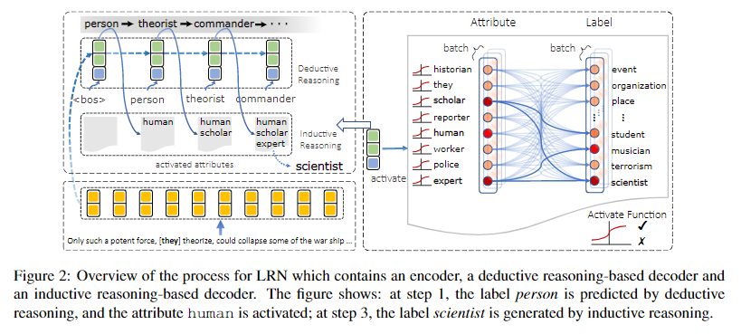

# EMNLP 论文收集

## EMNLP 2021 精选

- 地址：https://2021.emnlp.org/papers#main-long

### 一、实体抽取（共19篇）

#### 1.1 小样本&低资源&降噪&跨领域NER

##### Learning from Noisy Labels for Entity-Centric Information Extraction

- 论文地址：https://arxiv.org/abs/2104.08656
- github:https://github.com/wzhouad/NLL-IE
- 动机：最近的信息提取方法依赖于训练深度神经模型。然而，这样的模型很**容易过度拟合嘈杂的标签并导致性能下降**。虽然在大型学习资源中**过滤噪声标签的成本非常高**，但最近的研究表明，此类标签需要更多的训练步骤来记忆，并且比干净的标签更容易被遗忘，因此在训练中是可识别的。
- 论文方法：提出了一个用于以实体为中心的信息提取的简单协同正则化框架，该框架由几个结构相同但参数初始化不同的神经模型组成。这些模型与特定于任务的损失一起进行了优化，并进行了正则化以基于一致性损失生成类似的预测，从而防止在嘈杂的标签上过度拟合。
- 实验结果：在两个广泛使用但嘈杂的信息提取基准 TACRED 和 CoNLL03 上的大量实验证明了我们框架的有效性。我们将代码发布给社区以供将来研究。

##### Data Augmentation for Cross-Domain Named Entity Recognition

- 论文地址：https://arxiv.org/abs/2109.01758
- github : https://github.com/RiTUAL-UH/style_NER
- 动机：命名实体识别 (NER) 的当前工作表明，数据增强技术可以产生更强大的模型。然而，**大多数现有技术都专注于在标注数据非常有限的低资源场景中增加域内数据**。
- 论文方法：研究了 NER 任务的跨域数据增强。我们研究了通过将高资源领域的数据投射到低资源领域来利用数据的可能性。具体来说，我们提出了一种新颖的神经架构，通过学习文本中区分它们的模式（例如样式、噪声、缩写等）和共享特征空间，将数据表示从高资源域转换为低资源域两个域对齐的地方。
- 实验结果：我们对不同的数据集进行了实验，并表明将数据转换为低资源域表示比仅使用来自高资源域的数据实现了显着改进。

##### Unsupervised Paraphrasing Consistency Training for Low Resource Named Entity Recognition

##### Few-Shot Named Entity Recognition: An Empirical Baseline Study

#### 1.2 细粒度实体分类&实体集拓展

##### Fine-grained Entity Typing via Label Reasoning

- 论文地址：https://arxiv.org/abs/2109.05744
- github : https://github.com/loriqing/Label-Reasoning-Network
- 动机：传统的实体类型方法基于独立的分类范式，这使得它们难以识别相互依赖、长尾和细粒度的实体类型，论文认为标签之间隐含的外在和内在依赖关系可以提供解决上述挑战的关键知识。
- 论文方法：提出了\emph{标签推理网络（LRN）}，它通过发现和利用数据中包含的标签依赖性知识来顺序推理细粒度实体标签。具体来说，LRN利用自回归网络进行演绎推理，利用二部属性图进行标签之间的归纳推理，可以有效地以序列到集合、端到端的方式对复杂的标签依赖进行建模、学习和推理。 

- 实验方法：LRN 在标准的超细粒度实体类型基准上达到了最先进的性能，并且还可以有效地解决长尾标签问题。

##### An Empirical Study on Multiple Information Sources for Zero-Shot Fine-Grained Entity Typing

##### Fine-grained Entity Typing without Knowledge

