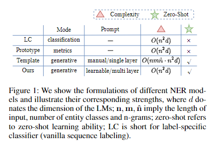
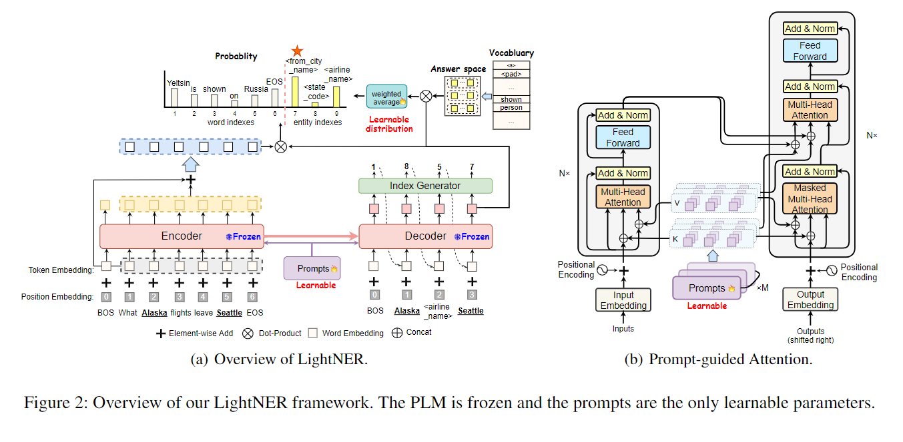

# 【关于 LightNER】 那些你不知道的事

> 作者：杨夕
> 
> 论文名称：LightNER: A Lightweight Generative Framework with Prompt-guided Attention for Low-resource NER
> 
> 会议：
> 
> 论文链接：https://arxiv.org/pdf/2109.00720.pdf
> 
> 论文 github 地址：
> 
> NLP论文学习笔记：https://github.com/km1994/nlp_paper_study
> 
> **[手机版NLP论文学习笔记](https://mp.weixin.qq.com/s?__biz=MzAxMTU5Njg4NQ==&mid=100005719&idx=1&sn=14d34d70a7e7cbf9700f804cca5be2d0&chksm=1bbff26d2cc87b7b9d2ed12c8d280cd737e270cd82c8850f7ca2ee44ec8883873ff5e9904e7e&scene=18#wechat_redirect)**
> 
> 个人介绍：大佬们好，我叫杨夕，该项目主要是本人在研读顶会论文和复现经典论文过程中，所见、所思、所想、所闻，可能存在一些理解错误，希望大佬们多多指正。
> 
> NLP 百面百搭 地址：https://github.com/km1994/NLP-Interview-Notes
> 
> **[手机版NLP百面百搭](https://mp.weixin.qq.com/s?__biz=MzAxMTU5Njg4NQ==&mid=100005719&idx=3&sn=5d8e62993e5ecd4582703684c0d12e44&chksm=1bbff26d2cc87b7bf2504a8a4cafc60919d722b6e9acbcee81a626924d80f53a49301df9bd97&scene=18#wechat_redirect)**
> 
> 推荐系统 百面百搭 地址：https://github.com/km1994/RES-Interview-Notes
> 
> **[手机版推荐系统百面百搭](https://mp.weixin.qq.com/s/b_KBT6rUw09cLGRHV_EUtw)**

## 一、摘要

- 动机：大多数现有的 NER 方法依赖于广泛的标记数据进行模型训练，这在训练数据有限的低资源场景中挣扎。
- 现有方法：预训练语言模型的提示调整方法通过利用提示作为任务指导来减少训练进度和下游调整之间的差距，在小样本学习中取得了显着的性能。
- 论文方法：受即时学习的启发，提出了一种新颖的轻量级生成框架，对低资源 NER (LightNER) 进行即时引导注意。
  - 构建了实体类别的语义感知答案空间以进行提示学习以生成实体跨度序列和实体类别，而无需任何特定于标签的分类器；
  - 通过将连续提示合并到自注意力层来重新调整注意力并适应预先训练的权重，进一步提出了提示引导的注意力；
- 论文优点：仅在固定预训练语言模型的整个参数的情况下调整那些连续提示，因此，使论文方法轻巧且灵活，适用于低资源场景，并且可以更好地跨领域转移知识。
- 实验结果：LightNER 可以在标准监督设置中获得可比的性能，并通过仅调整一小部分参数在低资源设置中优于强基线。

## 二、论文动机

- 传统的 NER 方法：
  - 方法：在BERT的顶层加classifier来做token-level的分类；
  - 存在问题：**低资源场景下泛化性不强**。在低资源场景中，即target domain上的带标注数据比较有限的时候，source domain和target domain的label可能会不同，没法共享一个classifier，对target domain上unseen class的泛化性并不好
- 低资源的NER传统方法：
  - 方法：基于度量学习的方式
  - 存在问题：因为在test set上执行预测的时候是依靠相似度度量，不涉及到模型参数更新，所以**需要source domain和target domain具有相似的pattern**，这样就会**导致在cross-domain的问题上表现不好**。
- template-based NER：
  - 方法：迭代所有可能的span，然后对每个span构造一个template去预测
  - 存在问题：复杂度高，同时也需要设计template

## 三、论文方法

- BARTNER的框架：
  - 输入:一个句子;
  - 输出是：实体的序列;
  - 每个实体包括：实体span在输入句子中的start index，end index，以及实体类型（tag，实际也是index）；
  - 在decoder端，输出的hidden state与输入序列的编码以及tag序列的编码做点积+softmax，转换为在输入句子词表+tag词表中的概率分布。
- Semantic-aware Answer Space：实际就是说NER中很多实体类型比较复杂，是由多个单词组合而成的，比如：return_date.month_name。因此，针对这个tag，把他分解成单个word进行编码，然后加权得到tag的表示，这个权重也是学出来的。
- Prompt-guided Attention：实际就是使用soft prompt，是在encoder和decoder的每层的attention部分加入key和value的可微调参数，其他都是固定的。

## 四、低资源设置

- 高资源的NER数据集+低资源的NER数据集，两个数据集的label可能会有不同
- In-domain few-shot NER：CONLL-2003这个数据集，指定PER和ORG为高资源的class，MISC和LOC为低资源的class，所以训练样例分别是2496，3763，100和100
- cross-domain few-shot NER：source domain：conll-2003这个数据集；target domain：对MIT Movie，MIT restaurant和ATIS中的每个class分别采若干shot

> 注意：并不是传统的N-way K-shot的评测方式

## 参考

1. [LightNER: A Lightweight Generative Framework with Prompt-guided Attention for Low-resource NER](https://arxiv.org/pdf/2109.00720.pdf)
2. [Prompt在低资源NER中的应用](https://zhuanlan.zhihu.com/p/428225612)

