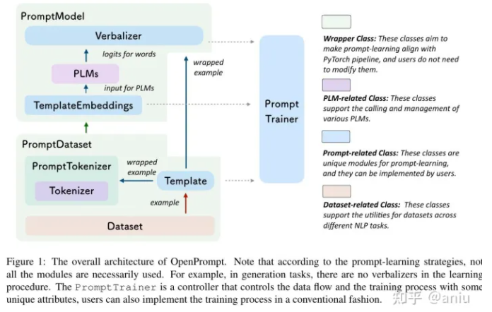
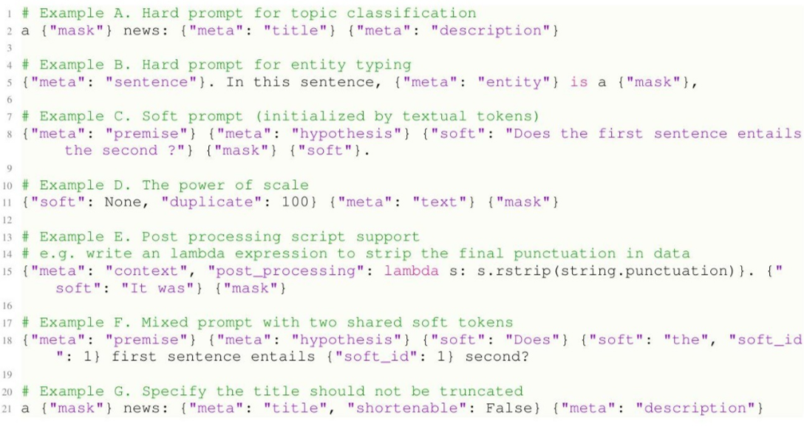
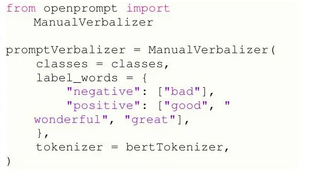
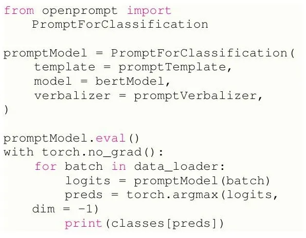

# 【关于 OpenPrompt】 那些你不知道的事

> 作者：杨夕
> 
> 论文名称：OpenPrompt： An Open-source Framework for Prompt-learning
> 
> 会议：
> 
> 论文链接：https://arxiv.org/abs/2111.01998
> 
> 论文 github 地址：https://github.com/thunlp/OpenPrompt
> 
> NLP论文学习笔记：https://github.com/km1994/nlp_paper_study
> 
> 个人介绍：大佬们好，我叫杨夕，该项目主要是本人在研读顶会论文和复现经典论文过程中，所见、所思、所想、所闻，可能存在一些理解错误，希望大佬们多多指正。
> 
> NLP 百面百搭 地址：https://github.com/km1994/NLP-Interview-Notes
> 
> 推荐系统 百面百搭 地址：https://github.com/km1994/RES-Interview-Notes
> 
> **[手机版推荐系统百面百搭](https://mp.weixin.qq.com/s/b_KBT6rUw09cLGRHV_EUtw)**

## 一、论文背景

Prompt-learning 已经成为现代自然语言处理的一个新范式，它直接将预训练好的语言模型（PLM）适应于cloze-style预测、自回归建模或seq2seq的生成，从而在各种任务上产生了可喜的表现。

## 二、论文动机

1. 目前还没有提出 Prompt-learning 的标准实施框架，大多数现有的 Prompt-learning 代码库，往往是不规范的，只为特定场景提供有限的实现；
2. 由于在 Prompt-learning 中需要考虑许多细节，如模板策略、初始化策略和口语化策略等，从业者在快速调整所需的提示学习方法以适应其应用方面面临着障碍。

## 三、论文方法

### 3.1 什么是 Prompt-learning？

以一个简单的基于提示的情感分类为例，pipeline由一个模板和一个verbalizers组成，其中**模板用于处理原始文本和一些额外的标注**，**verbalizers将原始标签投射到单词表中以进行最终预测**。

假设模板是"<text> It is <mask>"，其中标注<text>代表原文，而verbalizer是{"positive": "great", "negative": "terrible"}。

句子 "ALBERT-爱因斯坦是他那个时代最伟大的智者之一。"将首先被预定义的模板包装成 "ALBERT-爱因斯坦是他那个时代最伟大的智者之一。它是<mask>"。然后将包装好的句子tokenize，并送入PLM以预测<mask>token位置上的单词表分布。预计 "伟大 "这个词应该比 "可怕 "有更大的概率。

**如上所述， Prompt-learning 在文本或软编码提示的帮助下，将下游任务投射到PLM的预训练目标中。**

### 3.2 OpenPrompt 特点

1. OpenPrompt是一个便于研究的框架，它具有高效、模块化和可扩展性，其可组合性允许在一个统一的范式中自由组合不同的PLM、任务格式和提示模块；
2. 用户可以方便地部署 Prompt-learning 框架，并评估它们在不同的NLP任务上的泛化性，不受限制

### 3.3 OpenPrompt 所整合的方法

> 注：由OpenPrompt实现的一些例子，其中M.是手动定义的缩写，A.是自动生成的缩写。请注意，不同的方法专注于提示学习的不同部分。除了整个pipeline之外，我们对这些方法的具体实现被整合到OpenPrompt的具体类中。例如，KPT的核心实现是在KnowledgeableVerbalizer类中。

## 四、论文设计和实现

- 设计理念：同时考虑每个模块的独立性和相互耦合性

> 注：OpenPrompt的整体架构。请注意，根据提示学习策略，并非所有的模块都必须使用。例如，在生成任务中，学习过程中没有verbalizers。PromptTrainer是一个控制数据流和训练过程的控制器，具有一些独特的属性，用户也可以用常规方式实现训练过程。

### 4.1 可组合性

- 动机：对不同的底层任务（大致是分类和生成）采用不同的PLM，需要使用相应的目标函数
- 解决方法：模仿下游任务中的预训练任务，这些任务本质上是 "基于上下文预测单词"，进一步统一下游任务的执行。OpenPrompt以灵活的方式支持任务（分类和生成）、PLM（MLM、LM和Seq2Seq）和提示模块（不同的模板和verbalizers）的组合。

> 注：从模型的角度来看，T5（Raffel等人，2019）不仅用于跨度预测，GPT（Brown等人，2020）不仅用于生成任务。从提示的角度来看，前缀微调也可用于分类，软提示也可用于生成。所有这些组合都可以在我们的框架中很容易地在NLP任务上实现和验证，这样我们就可以更好地理解其中的机制。

### 4.2 预训练语言模型

- Prompt-learning 核心思想：使用带有 <mask> 的额外上下文来模仿PLM的预训练目标并更好地刺激这些模型。因此，PLM的选择对 Prompt-learning 的整个pipeline至关重要。PLMs可以根据其预训练目标大致分为三组：

1. PLM 使用 mask 语言模型（MLM）来重建被随机 <mask>  破坏的序列，其中只计算被 <mask>  的损失。具有MLM目标的典型PLM包括BERT（Devlin等人，2019）、RoBERTa（Liu等人，2019）等，这样的目标被认为适合自然语言理解（NLU）;
2. 利用自回归式的语言模型（LM），根据其领先的token来预测当前的token。GPT-3（Brown等人，2020）是采用这一目标的代表性工作之一;
3. seq2seq（Seq2Seq）模型，其目的是以输入序列的独立编码器为条件，用解码器生成一个序列。典型的seq2seq PLMs ⼯具包设计图，包括T5（Raffel等人，2020）、MASS（Song等人，2019）和BART（Lewis等人，2020）等。

### 4.3 tokenization

- 动机：在设计好模板后，对原始输入和设计好的模板进行tokenization的具体实施可能会很费时且容易出错。
  - 在 Prompt-learning 中，一些特定的信息，如实体的索引和被masked的token，在tokenization中应该被仔细处理，被masked的token指数的不匹配，可能会导致严重的后果；
  - tokenization之后的拼接和截断问题（模板不应该被截断）也应该被处理，由于不同的PLM可能有不同的tokenization策略，应该考虑到附加上下文处理细节的不一致性。
- 思路：封装数据处理API，用户可以使用人类可读的风格来设计模板，并方便地同时对输入和模板进行操作。组件整合了输入和模板的复杂信息，然后进行tokenization处理。基于PLM（MLM、LM和Seq2Seq）的选择，OpenPrompt在 Prompt-learning 中自动选择合适的tokenizer，这可以为用户处理提示相关数据节省大量时间。

### 4.4 模板

- 模板模块作用：用文本或软编码模板来包装原文。一个模板通常包含上下文token（文本或软编码）和mask的token。在OpenPrompt中，所有的模板都继承自一个具有通用属性和抽象方法的普通基类。
- 设计思路：一个模板节点是一个带有属性描述的文本（或空文本）。在模板语言中，人们可以自由地编辑模板中每个token的属性，例如哪些字符是共享嵌入的，如何对字符进行后期处理（例如通过MLP），等等。

> 注：模板语言的一些例子。在模板语言中，可以用关键的 "元 "来指代原始输入文本（例B），原始输入的部分内容（例A、C、G），或其他关键信息。我们还可以自由指定哪些token是硬的，哪些是软的（以及它们的初始化策略）。可以为软token指定一个id，以指定哪些token是共享嵌入的（例F）。OpenPrompt还支持对每个token的后期处理（例E），如lambda表达式或MLP。

### 4.5 verbalizers

- 动机：当涉及到基于提示的分类时，需要构建一个verbalizer类来将原始标签映射到单词表中的标签词
- 思路：当PLM预测一个被masked的位置在单词表上的概率分布时，verbalizer将提取标签词的logits，并将标签词的logits整合到相应的类别中，从而负责损失的计算。

> 一个定义Verbalizer的例子，每个类别的标签词的数量是灵活的。

### 4.6 PromptModel

- 思路：使用一个PromptModel对象来负责训练和推理，它包含一个PLM、一个模板对象和一个Verbalizer对象（可选）。用户可以灵活地组合这些模块，并定义它们之间的高级互动。在基类中实现了一个与模型无关的前向方法，以预测被masked位置的词。这个模块的一个目标是，用户不需要专门为不同的PLM实现头像，而是使用一个统一的API来 "为需要预测的位置预测单词"，而不考虑预训练的目标

> 定义PromptModel和进行评估的例子

### 4.7 训练

从可训练参数的角度来看，提示学习的训练可以分为两类策略。

1. 第一种策略是同时调整提示语和PLM，这在低数据体制下被验证是有效的（OpenPrompt还提供了一个FewshotSampler来支持few-shot的学习场景）;
2. 第二种策略是只训练提示语的参数，而保持PLM的冻结，这被认为是一种参数有效的优化方法，被认为是刺激超大型PLM的一种有希望的方法。

这两种策略都可以在OpenPrompt的训练器（或运行器）模块中一键调用。OpenPrompt中的训练器模块实现了伴随着面向提示的训练技巧的训练过程，例如模板的集合。同时，OpenPrompt支持通过配置进行实验，以轻松推动大规模的实证研究。

## 参考

1. [OpenPrompt: 一个开源的提示性学习框架](https://zhuanlan.zhihu.com/p/607206925)
2. [【踩坑记录】OpenPrompt工具包如何使用？](https://blog.csdn.net/qq_39328436/article/details/121744344)

