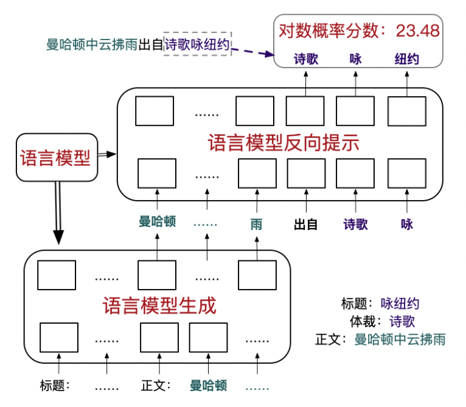
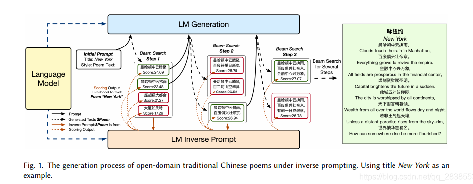

# 【关于 基于反向提示的预训练模型可控文本生成】 那些你不知道的事

> 作者：杨夕
> 
> 论文名称：Controllable Generation from Pre-trained Language Models via Inverse Prompting
> 
> 会议：KDD 2021 Research Track
> 
> 论文链接：https://www.aminer.cn/pub/605869d391e011537aff4c3c
> 
> 论文 github 地址：
> 
> NLP论文学习笔记：https://github.com/km1994/nlp_paper_study
> 
> 个人介绍：大佬们好，我叫杨夕，该项目主要是本人在研读顶会论文和复现经典论文过程中，所见、所思、所想、所闻，可能存在一些理解错误，希望大佬们多多指正。
> 
> NLP 百面百搭 地址：https://github.com/km1994/NLP-Interview-Notes
> 
> 推荐系统 百面百搭 地址：https://github.com/km1994/RES-Interview-Notes
> 
> **[手机版推荐系统百面百搭](https://mp.weixin.qq.com/s/b_KBT6rUw09cLGRHV_EUtw)**

## 一、摘要

- 动机：大规模预训练语言模型在生成仿真文本时有强大的功能。但控制生成的结果使之符合给定的需求仍然有着巨大的困难。之前能够控制生成的方式寥寥无几，比如“给定前文”的方法，只能够控制生成文本中开头的一些文字的导向，而后面则会随着生成的长度渐渐增加而渐渐离题万里。
- 论文方法：提出了“反向提示”（Inverse Prompting）的方法，在搜索最佳生成结果的过程中以“能否还原给定的主题”为搜索准则，生成文本。
- 实验结果：生成的诗歌和问答在真人评分中均获得了很好的结果，取得了接近人类的水平。

## 二、论文动机

可控文本中给的提示原不足够，这导致易在生成过程中逐渐偏离主题，因此该论文提出inverse prompt来更好的控制文本生成，激励生成文本与prompt之间的联系。

## 三、论文方法

论文 提出了反向提示的方法来解决此问题

### 3.1 反向提示(Inverse Prompting) 的打分流程

- 核心思想：利用生成的文本去复原给定的标题
- 流程

如生成诗歌《咏纽约》时，生成了“曼哈顿中云拂雨”，计算inverse prompting分数的时候，我们就以“‘曼哈顿中云拂雨’出自”作为输入，让模型给出预测，计算模型预测出“诗歌《咏纽约》”的概率。这里利用了语言模型的泛用性——语言模型可以模拟自然语言。那么我们输入“‘曼哈顿中云拂雨’出自”，他自然会自动去预测此句所属的文献的题材和篇目，而我们则可以计算出预测出我们需要的输出——“诗歌《咏纽约》”的概率。

### 3.2 反向提示(Inverse Prompting) 的生成的整体流程

- 思路

1. 给定标题《咏纽约》，我们先生成很多句可选项（曼哈顿中云拂雨，曼哈顿中云腾聚，一座超级大都会，大厦如天峙……等）；
2. 然后对每个可选项进行inverse prompting评分，选择其中最高的几句进入下一步搜索；
3. 然后继续生成一个短句就进行一次inverse prompting评分并保留分数最高的beam，最后生成诗歌。

### 3.3 反向提示(Inverse Prompting) 的自我学习（Self training）

自我学习（Self training）框架对于诗歌这种训练数据中极少出现的体裁的文本，还有一种进一步提升模型效果的方法——自我学习。我们借鉴了alphago zero的方法，给定一些标题，让模型使用inverse prompting方法通过集束搜索自我生成一些诗歌，然后使用这些诗歌对模型进行微调（fine tune）如此自我学习数轮后，新的模型作诗能力大幅提升。

## 参考

1. [Planning with Learned Entity Prompts for Abstractive Summarization](https://aclanthology.org/2021.tacl-1.88/)
2. [Prompt之文本生成](https://zhuanlan.zhihu.com/p/521512441)
3. [「SMP学术速递」：基于反向提示的预训练模型可控文本生成](https://www.aminer.cn/research_report/6126027230e4d5752f50f671)
4. [基于预训练语言模型的文本生成研究综述](https://zhuanlan.zhihu.com/p/417117371)
5. [Controllable Generation from Pre-trained Language Models via Inverse Prompting翻译](https://blog.csdn.net/qq_28385535/article/details/117993395)

