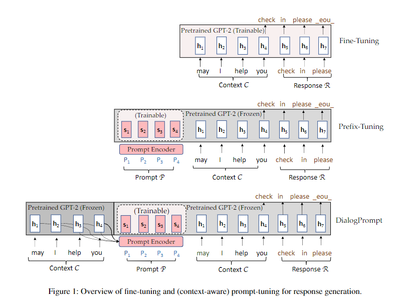

# 【关于 Response Generation with Context-Aware Prompt Learning】 那些你不知道的事

> 作者：杨夕
> 
> 论文名称：Response Generation with Context-Aware Prompt Learning
> 
> 会议：
> 
> 论文链接：https://arxiv.org/pdf/2111.02643.pdf
> 
> 论文 github 地址：
> 
> NLP论文学习笔记：https://github.com/km1994/nlp_paper_study
> 
> 个人介绍：大佬们好，我叫杨夕，该项目主要是本人在研读顶会论文和复现经典论文过程中，所见、所思、所想、所闻，可能存在一些理解错误，希望大佬们多多指正。
> 
> NLP 百面百搭 地址：https://github.com/km1994/NLP-Interview-Notes
> 
> 推荐系统 百面百搭 地址：https://github.com/km1994/RES-Interview-Notes
> 
> **[手机版推荐系统百面百搭](https://mp.weixin.qq.com/s/b_KBT6rUw09cLGRHV_EUtw)**

## 一、摘要

## 二、论文动机

## 三、论文方法

该论文设计了一个新颖的动态prompt编码器来鼓励上下文感知的prompt learning，以更好地重利用大规模预训练语言模型中的知识并生成更有知识的回复。

首先将上文文本的embedding送入可学习的prompt编码器中获得感知上文的prompt编码表示，再同时利用prompt的编码表示和上文文本来预测下文。论文中实验证明该方法可以有效利用预训练语言模型中的知识来促进富有知识的高质量回复。

## 参考

1. [Response Generation with Context-Aware Prompt Learning](https://arxiv.org/pdf/2111.02643.pdf)
2. [Prompt之文本生成](https://zhuanlan.zhihu.com/p/521512441)

