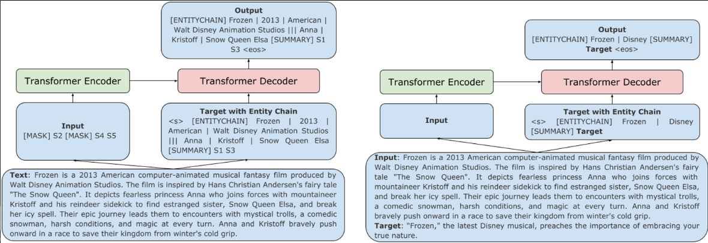

# 【关于 Planning with Learned Entity Prompts for Abstractive Summarization】 那些你不知道的事

> 作者：杨夕
> 
> 论文名称：Planning with Learned Entity Prompts for Abstractive Summarization
> 
> 会议：TACL 2021
> 
> 论文链接：https://aclanthology.org/2021.tacl-1.88/
> 
> 论文 github 地址：
> 
> NLP论文学习笔记：https://github.com/km1994/nlp_paper_study
> 
> 个人介绍：大佬们好，我叫杨夕，该项目主要是本人在研读顶会论文和复现经典论文过程中，所见、所思、所想、所闻，可能存在一些理解错误，希望大佬们多多指正。
> 
> NLP 百面百搭 地址：https://github.com/km1994/NLP-Interview-Notes
> 
> 推荐系统 百面百搭 地址：https://github.com/km1994/RES-Interview-Notes
> 
> **[手机版推荐系统百面百搭](https://mp.weixin.qq.com/s/b_KBT6rUw09cLGRHV_EUtw)**

## 一、摘要

- 动机：我们引入了一种简单而灵活的机制来学习中间计划，以实现抽象摘要的生成。
- 做法：

1. 在目标摘要前加上(or prompt)实体链——摘要中提到的实体的有序序列；
2. 然后训练 Transformer-based sequence-to-sequence models 生成实体链，然后继续生成以实体链和输入为条件的摘要；

- 实验结果：当在CNN/DailyMail、XSum、SAMSum和BillSum上进行评估时，我们通过经验证明，具有规划目标的 grounded generation 提高了所有数据集摘要中的 entity specificity and planning，并在XSum和SAMSum上获得了 state-of-the-art performance。此外，我们实证地证明了实体链规划提供了一种机制来控制抽象摘要中的幻觉。通过使用修改后的内容计划来提示解码器，删除幻觉实体，当自动和人工评估时，我们在可靠性方面优于最先进的方法。

## 二、论文动机

如何 将 prompt 引入 Abstractive Summarization

## 三、论文方法

该论文通过引入简单灵活的中间过程来生成摘要，构造prompt prefix提示生成对应的实体链和摘要，prompt模板为：[ENTITYCHAIN] entity chain [SUMMARY] summary，该方式使模型能够学会链接生成的摘要和摘要中的实体链。另外，可以通过删除预测实体链中的不可靠实体来生成可靠摘要，更为灵活。

## 参考

1. [Planning with Learned Entity Prompts for Abstractive Summarization](https://aclanthology.org/2021.tacl-1.88/)
2. [Prompt之文本生成](https://zhuanlan.zhihu.com/p/521512441)

