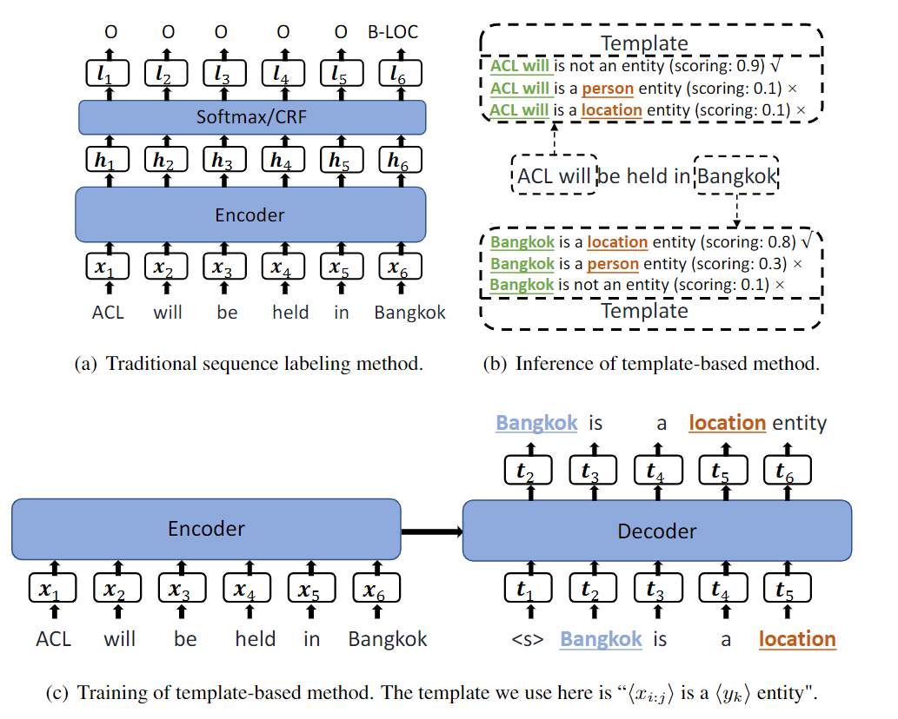

# 【关于 templateNER】 那些你不知道的事

> 作者：杨夕
> 
> 论文名称：Template-Based Named Entity Recognition Using BART
> 
> 会议：ACL 2020
> 
> 论文链接：https://aclanthology.org/2021.findings-acl.161/
> 
> 论文 github 地址：https://github.com/Nealcly/templateNER
> 
> NLP论文学习笔记：https://github.com/km1994/nlp_paper_study
> 
> **[手机版NLP论文学习笔记](https://mp.weixin.qq.com/s?__biz=MzAxMTU5Njg4NQ==&mid=100005719&idx=1&sn=14d34d70a7e7cbf9700f804cca5be2d0&chksm=1bbff26d2cc87b7b9d2ed12c8d280cd737e270cd82c8850f7ca2ee44ec8883873ff5e9904e7e&scene=18#wechat_redirect)**
> 
> 个人介绍：大佬们好，我叫杨夕，该项目主要是本人在研读顶会论文和复现经典论文过程中，所见、所思、所想、所闻，可能存在一些理解错误，希望大佬们多多指正。
> 
> NLP 百面百搭 地址：https://github.com/km1994/NLP-Interview-Notes
> 
> **[手机版NLP百面百搭](https://mp.weixin.qq.com/s?__biz=MzAxMTU5Njg4NQ==&mid=100005719&idx=3&sn=5d8e62993e5ecd4582703684c0d12e44&chksm=1bbff26d2cc87b7bf2504a8a4cafc60919d722b6e9acbcee81a626924d80f53a49301df9bd97&scene=18#wechat_redirect)**
> 
> 推荐系统 百面百搭 地址：https://github.com/km1994/RES-Interview-Notes
> 
> **[手机版推荐系统百面百搭](https://mp.weixin.qq.com/s/b_KBT6rUw09cLGRHV_EUtw)**

## 一、摘要

- 小样本NER：源领域数据多，目标领域数据少
- 现有方法：基于相似性的度量
  - 缺点：不能利用模型参数中的知识进行迁移
- 论文方法：提出基于模板的方法
  - NER看作一种语言模型排序问题，seq2seq框架
  - 原始句子和模板分别作为源序列和模板序列，由候选实体span填充
  - 推理：根据相应的模板分数对每个候选span分类
- 数据集
  - 在 CoNLL03（资源丰富的任务）上达到了 92.55%的 F1score
  - 明显优于在 MIT Movie、MIT Restaurant 和ATIS（低资源任务）

## 二、引言

- NER：NLP基础任务，识别提及span，并分类
- 神经NER模型：需要大量标注数据，新闻领域很多，但其他领域很少
  - 理想情况：富资源 知识迁移到 低资源
  - 实际情况：**不同领域实体类别不同**
  - 训练和测试：softmax层和crf层需要一致的标签
  - 新领域：输出层必须再调整和训练
- 最近，小样本NER采用距离度量：训练相似性度量函数
  - 优：降低了领域适配
  - 缺：
    - (1)启发式最近邻搜索，查找最佳超参，未更新网络参数，不能改善跨域实例的神经表示；
    - (2)依赖源域和目标域相似的文本模式
- 论文方法：**提出基于模板的方法**
  - **利用 生成PLM 的小样本学习潜力，进行序列标注**
  - BART由标注实体填充的预定义模板微调
  - 实体模板：<candidate_span> is a <entity_type> entity
  - 非实体模板：<candidate_span> is not a named entity
- 论文方法优点：
  - 可有效利用标注实例在新领域微调
  - **比基于距离的方法更鲁棒**，即使源域和目标域在写作风格上有很大的差距
  - 可应用任意类别的NER，不改变输出层，可持续学习
- 第一个使用生成PLM解决小样本序列标注问题
- Prompt Learning（提示学习）

## 三、论文方法介绍

## 四、问题点

1. 论文 用 Bart 而不是 Bert 的 原因？

- 因为 BART 输出是一个句子，更加自然，而不是特定的标签，句子的词汇来自于预训练词表，能够利用标签之间的相关性 ；
- inference的时候，encoder端只需要编码一次，decoder端迭代所有的span；而bert的话，需要每次inference都编码一次输入句子。

## 参考

1. [Template-Based Named Entity Recognition Using BART](https://aclanthology.org/2021.findings-acl.161/)
2. [templateNER 代码](https://github.com/Nealcly/templateNER)
3. [论文解读：ACL2021 NER | 基于模板的BART命名实体识别](https://zhuanlan.zhihu.com/p/424368973)

