# 【关于 Prompt Tuning】 那些你不知道的事

> 作者：杨夕
> 
> NLP论文学习笔记：https://github.com/km1994/nlp_paper_study
> 
> **[手机版NLP论文学习笔记](https://mp.weixin.qq.com/s?__biz=MzAxMTU5Njg4NQ==&mid=100005719&idx=1&sn=14d34d70a7e7cbf9700f804cca5be2d0&chksm=1bbff26d2cc87b7b9d2ed12c8d280cd737e270cd82c8850f7ca2ee44ec8883873ff5e9904e7e&scene=18#wechat_redirect)**
> 
> 个人介绍：大佬们好，我叫杨夕，该项目主要是本人在研读顶会论文和复现经典论文过程中，所见、所思、所想、所闻，可能存在一些理解错误，希望大佬们多多指正。
> 
> NLP 百面百搭 地址：https://github.com/km1994/NLP-Interview-Notes
> 
> **[手机版NLP百面百搭](https://mp.weixin.qq.com/s?__biz=MzAxMTU5Njg4NQ==&mid=100005719&idx=3&sn=5d8e62993e5ecd4582703684c0d12e44&chksm=1bbff26d2cc87b7bf2504a8a4cafc60919d722b6e9acbcee81a626924d80f53a49301df9bd97&scene=18#wechat_redirect)**
> 
> 推荐系统 百面百搭 地址：https://github.com/km1994/RES-Interview-Notes
> 
> **[手机版推荐系统百面百搭](https://mp.weixin.qq.com/s/b_KBT6rUw09cLGRHV_EUtw)**

- [【关于 Prompt Tuning】 那些你不知道的事](#关于-prompt-tuning-那些你不知道的事)
  - [动机](#动机)
  - [一、Prompt Tuning 发展路线](#一prompt-tuning-发展路线)
    - [1.1 Prompt 是什么？](#11-prompt-是什么)
    - [1.2 技术发展路线](#12-技术发展路线)
    - [1.3 工业界 vs 学术界](#13-工业界-vs-学术界)
  - [二、Prompt Tuning 工作流程介绍](#二prompt-tuning-工作流程介绍)
    - [2.0 工作流程](#20-工作流程)
    - [2.1 文本代入 Template](#21-文本代入-template)
    - [2.2 映射 Verbalizer 构造](#22-映射-verbalizer-构造)
    - [2.3 Prediction预测](#23-prediction预测)
    - [2.4 Mapping映射](#24-mapping映射)
  - [三、Prompt Tuning 研究方向介绍](#三prompt-tuning-研究方向介绍)
    - [3.1 Template 设计研究](#31-template-设计研究)
      - [3.1.1 Template 形状研究](#311-template-形状研究)
      - [3.1.2 Template 设计研究](#312-template-设计研究)
    - [3.2 Verbalizer 设计研究 (Answer Engineering)](#32-verbalizer-设计研究-answer-engineering)
    - [3.3 Pre-trained Model Choice（预训练模型选择）](#33-pre-trained-model-choice预训练模型选择)
    - [3.4 Expanding the Paradigm（范式拓展）](#34-expanding-the-paradigm范式拓展)
    - [3.5 训练策略(Prompt-based Training Strategies)](#35-训练策略prompt-based-training-strategies)
  - [四、prompt进阶——自动学习prompt](#四prompt进阶自动学习prompt)
    - [4.1 动机](#41-动机)
    - [4.2 P-tuning——token+vector组合成prompt 论文 github](#42-p-tuningtokenvector组合成prompt-论文-github)
    - [4.3 P-tuning v2——全vector prompt 论文 github](#43-p-tuning-v2全vector-prompt-论文-github)
    - [4.4 PPT——预训练prompt 论文 github](#44-ppt预训练prompt-论文-github)
  - [五、prompt 优势与总结](#五prompt-优势与总结)
    - [5.1 prompt 优势](#51-prompt-优势)
      - [5.1.1 Level 1. Prompt Learning 使得所有的NLP任务成为一个语言模型的问题](#511-level-1-prompt-learning-使得所有的nlp任务成为一个语言模型的问题)
      - [5.1.2 Level 2. Prompt Learning 和 Fine-tuning 的范式区别](#512-level-2-prompt-learning-和-fine-tuning-的范式区别)
      - [5.1.3 Level 3. 现代 NLP 第四范式](#513-level-3-现代-nlp-第四范式)
      - [5.1.4 Level 4. 超越NLP的角度](#514-level-4-超越nlp的角度)
    - [5.2 prompt 总结](#52-prompt-总结)
  - [六、prompt-tuning 代码学习](#六prompt-tuning-代码学习)
    - [6.1 prompt-tuning 学习代码](#61-prompt-tuning-学习代码)
    - [6.2 prompt-tuning 实战](#62-prompt-tuning-实战)
      - [6.2.1 定义任务](#621-定义任务)
      - [6.2.2 定义预训练语言模型](#622-定义预训练语言模型)
      - [6.2.3 定义prompt模板](#623-定义prompt模板)
      - [6.2.4 定义输出-label映射](#624-定义输出-label映射)
      - [6.2.5 组合构建为PromptModel类](#625-组合构建为promptmodel类)
      - [6.2.6 组定义dataloader](#626-组定义dataloader)
      - [6.2.7 开始训练、测试](#627-开始训练测试)
  - [参考资料](#参考资料)

## 动机

在很长的一段时间内，NLP的任务采用的都是 Pretrain + Fine-tuning（Model Tuning）的解决方案，但是这种方案，**需要对于每个任务都重新 fine-tune 一个新的模型，且不能共用**。

但是**对于一个预训练的大语言模型来说，这就仿佛好像是对于每个任务都进行了定制化，十分不高效**。

**是否存在一种方式，可以将预训练语言模型作为电源，不同的任务当作电器，仅需要根据不同的电器（任务），选择不同的插座，对于模型来说，即插入不同的任务特定的参数，就可以使得模型适配该下游任务**。

Prompt Learning 就是这个适配器，它能高效得进行预训练语言模型的使用。

这种方式大大地提升了预训练模型的使用效率，如下图：

- 左边是传统的 Model Tuning 的范式：对于不同的任务，都需要将整个预训练语言模型进行精调，每个任务都有自己的一整套参数。
- 右边是Prompt Tuning，对于不同的任务，仅需要插入不同的prompt 参数，每个任务都单独训练Prompt 参数，不训练预训练语言模型，这样子可以大大缩短训练时间，也极大的提升了模型的使用率。

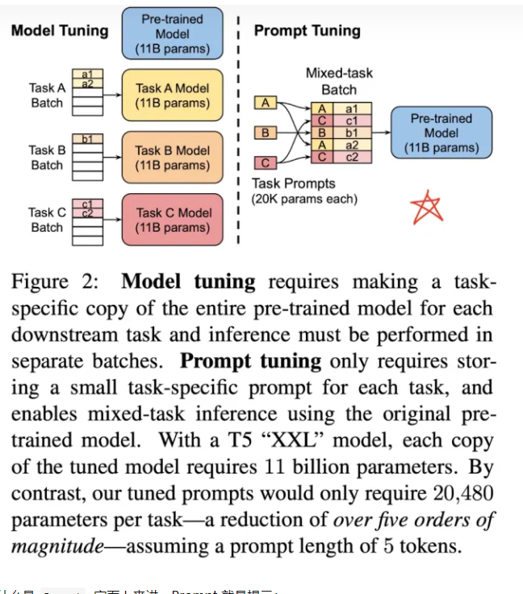

所以什么是 Prompt, 字面上来讲，Prompt 就是提示：

例如我们有人忘记了某个事情，我们给予特定的提示，他就可以想起来，例如我们说：

> 白日依山尽,

大家自然而然地会想起来下一句诗：黄河入海流。

亦或者，搜索引擎，可以根据我们的输入，进行输出的提示：

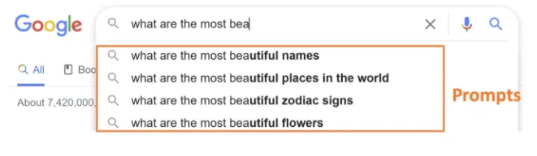

## 一、Prompt Tuning 发展路线

### 1.1 Prompt 是什么？

那么在NLP中 Prompt 代表的是什么呢？

- prompt 就是给 预训练语言模型 的一个线索/提示，帮助它可以更好的理解 人类的问题。

例如，下图的BERT/BART/ERNIE 均为预训练语言模型，对于人类提出的问题，以及线索，预训练语言模型可以给出正确的答案。

- 根据提示，BERT能回答，JDK 是 Oracle 研发的
- 根据 TL;DR: 的提示，BART知道人类想要问的是文章的摘要
- 根据提示，ERNIE 知道人类想要问鸟类的能力--飞行

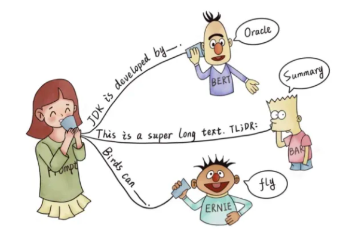

Prompt 更严谨的定义如下：

> Prompt is the technique of making better use of the knowledge from the pre-trained model by adding additional texts to the input.

> Prompt 是一种为了更好的使用预训练语言模型的知识，采用在输入段添加额外的文本的技术。

- 目的：更好挖掘预训练语言模型的能力
- 手段：在输入端添加文本，即重新定义任务（task reformulation）

### 1.2 技术发展路线

- 特征工程阶段
  - 依赖大量人工
  - 需要监督数据
- 架构工程阶段
  - 人工构建特征的工作量减少
  - 设计各异的神经网络结构从而拿到结果需要监督数据
- 预训练-微调阶段
  - 预训练可以不需要监督数据

### 1.3 工业界 vs 学术界

- 工业界:更适合工业界的少数据场景，减少一部分标注成本
  - 工业界对于少数据场景，往往(也有用半监督学习) 先rule-based走通业务逻辑，在线上线下标注数据，再进一步监督学习或微调。
  - 目前工业界里还难打的过微调
  - 定位:可以探索
- 学术界:适合学术研究
  - 新任务+PL，效果不要太差，都是一次新的尝试与探索
  - 定位:做研究

## 二、Prompt Tuning 工作流程介绍

### 2.0 工作流程

1. Prompt 模版（Template）的构造
2. Prompt 答案空间映射（Verbalizer）的构造
3. 文本代入template，并且使用预训练语言模型进行预测
4. 将预测的结果映射回label。

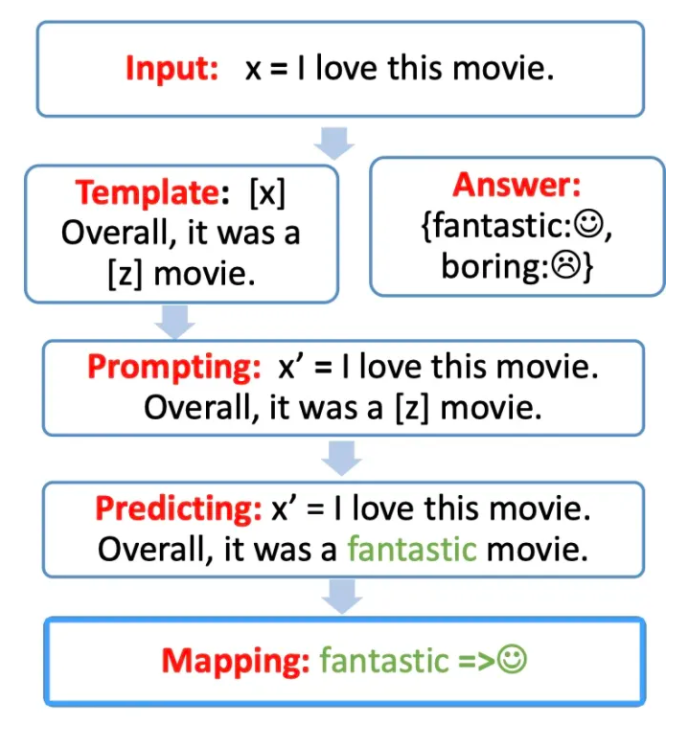

### 2.1 文本代入 Template

- 模板Template的作用：输入和输出进行重新构造，变成一个新的带有mask slots的文本
- 介绍：模板Template 构造，文本代入 Template
- 思路：
  - step 1: 构建模板：[x] overall,it was a [z] movie.
  - step 2: 构建文本x ：l love this movie.
  - step 3: 文本x 代入 Template [x]位置: l love this movie. overall, it was a [z] movie

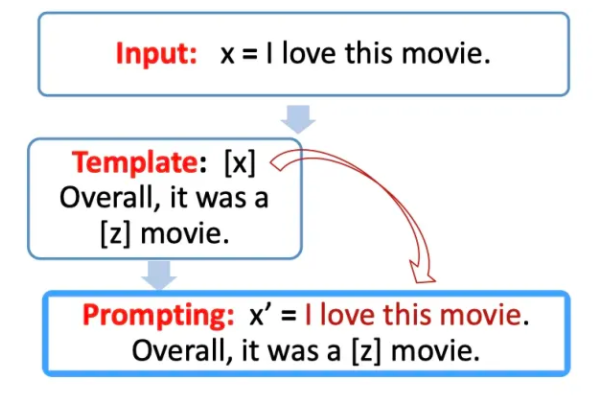

### 2.2 映射 Verbalizer 构造

- 动机：对于构造的prompt，需要知道预测词和 label 之间的关系，并且也不可能允许 z 是任意词
- 介绍：建立预测词-标签的映射关系
- eg:

```s
    fantastic、great、amazing -> positive
    boring、bad -> negative
```

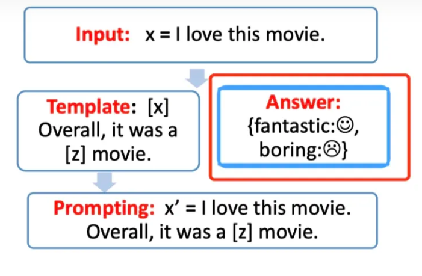

### 2.3 Prediction预测

- 介绍：根据 Verbalizer ，使用预训练模型对 2.1 代后的 mask slots [z] 进行预测
- eg:
  - I love this movie.overallit was a **fantastic** movie

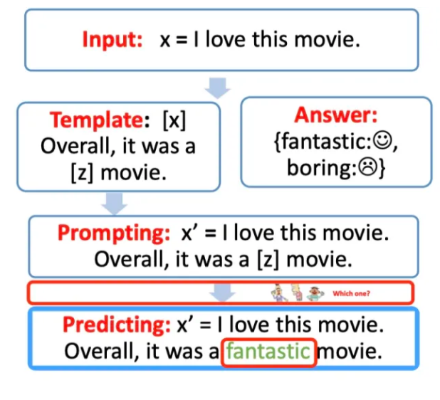
> 注：预训练模型预测得到了结果 fantastic, 我们需要将其代入[z] 中

### 2.4 Mapping映射

- 介绍：预测结果代入Verbalizer，得到映射后的结果
- eg：

```s
    fantastic -> positive
```

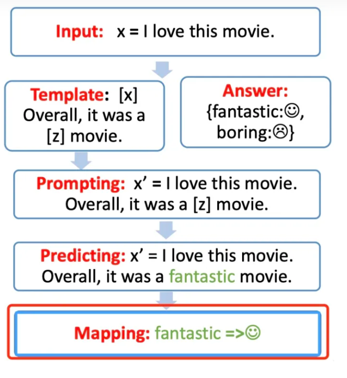

## 三、Prompt Tuning 研究方向介绍

### 3.1 Template 设计研究

> eg: I love this movie. overall, it was a [z] movie

#### 3.1.1 Template 形状研究

1. cloze prompt
   1. 介绍：[z] 在句中，适合使用了Mask任务的LM
2. prefix prompt
   1. 介绍：[z] 在句末，适合生成LM、自回归LM （自编码LM（Bert） vs 自回归LM（GPT））
3. 文本匹配任务，Prompt可以有两个[X]

#### 3.1.2 Template 设计研究

1. 手工设计

- 介绍：人工 手工设计 Template
- 优点：直观
- 缺点：成本高，需要实验、经验等

2. 自动学习 模Template板

- 介绍：通过模型学习上下文，自动生成 Template
- 离散Prompt
  - 介绍：自动生成自然语言词
  - eg: 给定一个大的文本库，给定输入x和输出y，在文本库中离散地搜索出现频繁的中间词或连词等，从而得到一个模板。
- 连续Prompt
  - 介绍：Template的设计不必拘泥于自然语言，直接变成embedding表示也是可以的，设置独立于LM的模板参数，可以根据下游任务进行微调
  - eg：给定一个可训练的参数矩阵，将该参数矩阵与输入文本进行连接，从而丢入模型进行训练。

### 3.2 Verbalizer 设计研究 (Answer Engineering)

- 介绍：寻找合适的答案空间Z，以及答案与标签的映射
- eg：Knowledgeable Prompt-tuning:Incorporating Knowledge intoPrompt Verbalizer for Text Classification (KPT)
  - 用KB去查询Label相关词作为候选集，然后去噪

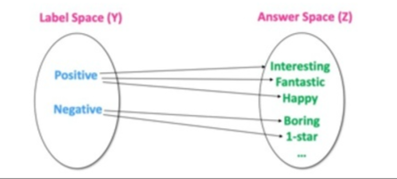
> 注：Label Space Y 是: Positive, Negative, Answer Space Z 可以是表示positive或者negative 的词，例如 Interesting/Fantastic/Happy/Boring/1-Star/Bad，具体的 Answer Space Z 的选择范围可以由我们指定。可以指定一个 y 对应1-N个字符/词。

具体的答案空间的选择可以有以下三个分类标注：

- 根据形状
  - 1.1 Token 类型
  - 1.2 Span 类型
  - 1.3 Sentence 类型
- 是否有界
  - 2.1 有界
  - 2.2 无界
- 是否人工选择
  - 3.1 人工选择
  - 3.2 自动搜素
    - 3.2.1 离散空间
    - 3.2.2 连续空间

### 3.3 Pre-trained Model Choice（预训练模型选择）

- 动机：在定义完模版以及答案空间后，需要选择合适的预训练语言模型对 prompt 进行预测，如何选择一个合适的预训练语言模型也是需要人工经验判别的。
- 具体的预训练语言模型分类：
  - autoregressive-models: 自回归模型，主要代表有 GPT，主要用于生成任务；
  - autoencoding-models: 自编码模型，主要代表有 BERT，主要用于NLU任务；
  - seq-to-seq-models：序列到序列任务，包含了an encoder 和 a decoder，主要代表有 BART，主要用于基于条件的生成任务，例如翻译，summary等；
  - multimodal-models：多模态模型
  - retrieval-based-models：基于召回的模型，主要用于开放域问答

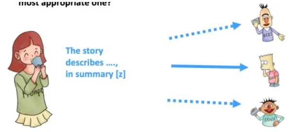
> 注：想要做summary 任务，我们可以选择更合适的 BART 模型

### 3.4 Expanding the Paradigm（范式拓展）

- 动机：如何对已有的 Prompt 进行任务增强以及拓展
- 从以下几个方面进行探讨

1. Prompt Ensemble：Prompt 集成，采用多种方式询问同一个问题

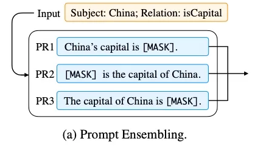

2. Prompt Augmentation：Prompt 增强，采用类似的 prompt 提示进行增强

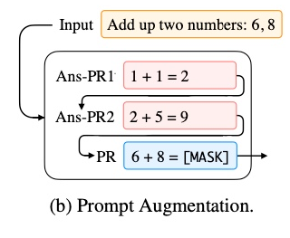

3. Prompt Composition：Prompt 组合，例如将一个任务，拆成多个任务的组合，比如判别两个实体之间是否是父子关系，首先对于每个实体，先用Prompt 判别是人物，再进行实体关系的预测。

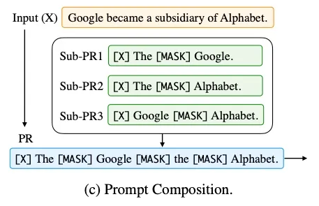

4. Prompt Decomposition：将一个prompt 拆分成多个prompt

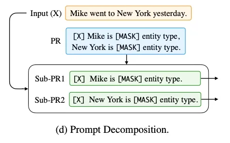

### 3.5 训练策略(Prompt-based Training Strategies)

- 动机：Prompt-based 模型在训练中，有多种训练策略，可以选择哪些模型部分训练，哪些不训练
- 根据训练数据区分：
  - Zero-shot: 对于下游任务，没有任何训练数据
  - Few-shot: 对于下游任务只有很少的训练数据，例如100条
  - Full-data: 有很多的训练数据，例如1万多条数据
- 根据不同的参数更新的部分：
  - 预训练模型
  - Prompts 参数
- 预训练语言模型：可以选择精调，或者不训练
- 对于prompts：
  - Tuning-free Prompting
    - 直接做zero-shot
  - Fixed-LM Prompt Tuning
    - 引入额外与Prompt相关的参数，固定LM参数，微调与Prompt相关参数
  - Fixed-prompt LM Tuning
    - 引入额外与Prompt相关的参数，固定与Prompt相关参数，微调LM
  - Prompt + LM Tuning
    - 引入额外与Prompt相关的参数，两者都微调
- 策略选择
  - 数据量级是多少
  - 是否有个超大的 Left-to-right 的语言模型（注：通常如果只有很少的数据的时候，往往希望不要去 fine-tune 预训练语言模型，而是使用LM的超强能力，只是去调prompt 参数。而让数据量足够多的时候，可以精调语言模型。）

## 四、prompt进阶——自动学习prompt

### 4.1 动机

手工设计prompt（基于token的prompt）还有一个问题是，**模型对prompt很敏感，不同的模板得到的效果差别很大**。

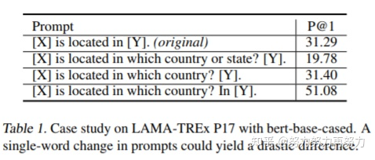
> 注：prompt一字之差效果也会差别很大 (来自文献[2])

所以研究学者就提出自动学习prompt向量的方法。因为我们输入进去的是人类能看懂的自然语言，那在机器眼里是啥，啥也不是， 也不能这么说吧，prompt经过网络后还是得到一个个向量嘛，既然是向量，当然可以用模型来学习了，甚至你输入一些特殊符号都行，模型似乎无所不能，什么都能学，只要你敢想，至于学得怎么样，学到了什么，还需进一步探究。

### 4.2 P-tuning——token+vector组合成prompt [论文](https://arxiv.org/abs/2103.10385) [github](https://github.com/THUDM/P-tuning)

- 动机：手工设计prompt（基于token的prompt）存在问题，那么是否可以引入（基于vector的prompt），所以就有了 基于 token+vector 的 prompt
- 具体说明（如下图）：
  - 任务：模型来预测一个国家的首都
  - 左边是全token的prompt，文献里称为“离散的prompt”，有的同学一听"离散"就感觉懵了，其实就是一个一个token组成的prompt就叫“离散的prompt”。
  - 右边是token+vector形式的prompt，其实是保留了原token prompt里面的关键信息(capital, Britain)，(capital, Britain)是和任务、输出结果最相关的信息，其他不关键的词汇(the, of ,is)留给模型来学习。

- token形式的prompt: “The captital of Britain is [MASK]”
- token+vector: “h_0 , h_1, ... h_i, captital, Britain, h_(i+1), ..., h_m [MASK]”

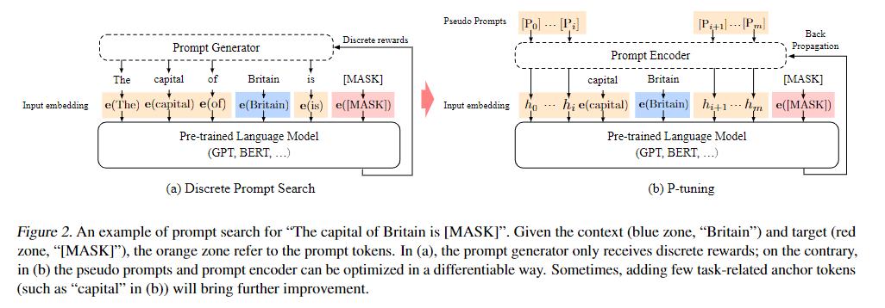

### 4.3 P-tuning v2——全vector prompt [论文](https://arxiv.org/pdf/2110.07602.pdf) [github](https://github.com/THUDM/P-tuning-v2)

- 思路：全vecotor可以直接拼接在预训练模型的layer里面，而且这个模型可以做序列tagging任务(给输入序列中每个token打标签)

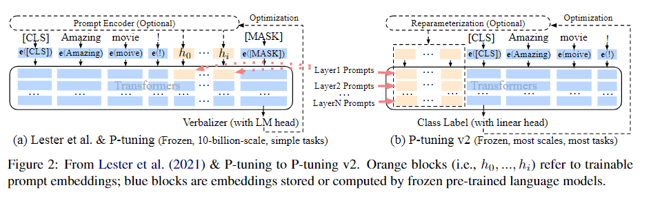

### 4.4 PPT——预训练prompt [论文](https://arxiv.org/pdf/2109.04332.pdf) [github](https://github.com/THUDM/P-tuning-v2)

- 动机：以上Prompt采用vector形式之后，在训练集比较大(full-data)的时候效果是好的，但是在few-shot(训练集很小)场景下就不好了，因为数据量小不好学嘛。那怎么办呢？既然NLP任务都有预训练模型，那么prompt是否也可以先进行预训练再微调呢？
- 思路：拿大量无标签语料对Prompt先做个预训练，再在下游任务上做微调

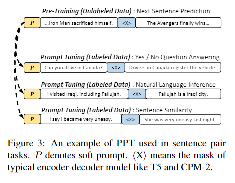

## 五、prompt 优势与总结

### 5.1 prompt 优势

Prompt Learning 的优势有哪些呢？我们可以从四个角度进行分析。

- Level 1. Prompt Learning 角度
- Level 2. Prompt Learning 和 Fine-tuning 的区别
- Level 3. 现代 NLP 历史
- Level 4. 超越NLP

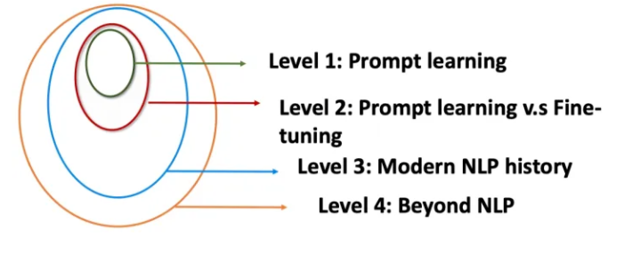

#### 5.1.1 Level 1. Prompt Learning 使得所有的NLP任务成为一个语言模型的问题

- Prompt Learning 可以将所有的任务归一化预训练语言模型的任务
- 避免了预训练和fine-tuning 之间的gap，几乎所有 NLP 任务都可以直接使用，不需要训练数据。
- 在少样本的数据集上，能取得超过fine-tuning的效果。
- 使得所有的任务在方法上变得一致

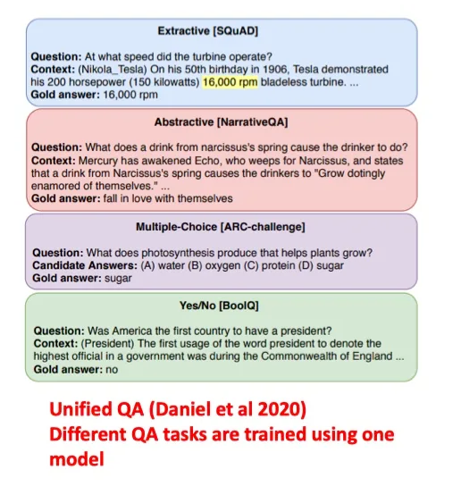

#### 5.1.2 Level 2. Prompt Learning 和 Fine-tuning 的范式区别

- Fine-tuning 是使得预训练语言模型适配下游任务
- Prompting 是将下游任务进行任务重定义，使得其利用预训练语言模型的能力，即适配语言模型


#### 5.1.3 Level 3. 现代 NLP 第四范式

Prompting 方法是现在NLP的第四范式。其中现在NLP的发展史包含

1. Feature Engineering：即使用文本特征，例如词性，长度等，在使用机器学习的方法进行模型训练。（无预训练语言模型）
2. Architecture Engineering：在W2V基础上，利用深度模型，加上固定的embedding。（有固定预训练embedding，但与下游任务无直接关系）
3. Objective Engineering：在bert 的基础上，使用动态的embedding，在加上fine-tuning。（有预训练语言模型，但与下游任务有gap）
4. Prompt Engineering：直接利用与训练语言模型辅以特定的prompt。（有预训练语言模型，但与下游任务无gap）

我们可以发现，在四个范式中，预训练语言模型，和下游任务之间的距离，变得越来越近，直到最后Prompt Learning是直接完全利用LM的能力。

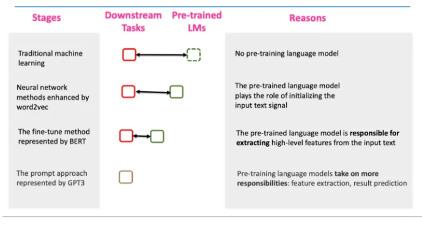

#### 5.1.4 Level 4. 超越NLP的角度

Prompt 可以作为连接多模态的一个契机，例如 CLIP 模型，连接了文本和图片。相信在未来，可以连接声音和视频，这是一个广大的待探索的领域。

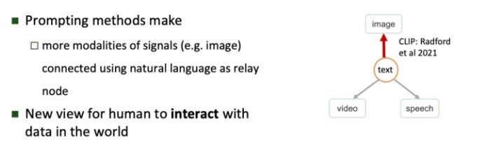

### 5.2 prompt 总结

1. prompt设计：可以手动设计模板，也可以自动学习prompt，这里可填坑的地方比较多；
2. 预训练模型的选择：选择跟任务贴近的预训练模型即可；
3. 预测结果到label的映射：如何设计映射函数，这里可填坑的地方也比较多
4. 训练策略：根据prompt是否有参数，预训练模型参数要不要调，可以组合出各种训练模式，根据标注数据样本量，选择zero-shot, few-shot还是full-data。比如few-shot场景，训练数据不多，如果prompt有参数，可以固定住预训练模型的参数，只调prompt的参数，毕竟prompt参数量少嘛，可以避免过拟合。

## 六、prompt-tuning 代码学习

### 6.1 prompt-tuning 学习代码

- [OpenPrompt](https://github.com/thunlp/OpenPrompt)
  - 由清华推出了prompt-tuning工具包
  - 特点：每个 class 都继承了 torch 的类或者 huggingface 的类，可以方便地部署自己的任务

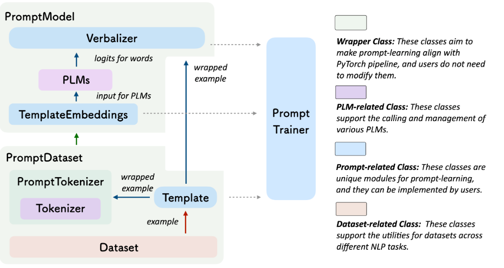

- [Prompt在中文分类few-shot场景中的尝试](https://zhuanlan.zhihu.com/p/424888379)
  - 特点：包含数据集构建、模板构建、训练测试一套完整代码

### 6.2 prompt-tuning 实战 

#### 6.2.1 定义任务

根据你的任务和数据来定义classes 和 InputExample。

以情感分类任务为例，classes包含2个label："negative"和"positive"

```s
  from openprompt.data_utils import InputExample
  classes = [ # There are two classes in Sentiment Analysis, one for negative and one for positive
      "negative",
      "positive"
  ]
  dataset = [ # For simplicity, there's only two examples
      # text_a is the input text of the data, some other datasets may have multiple input sentences in one example.
      InputExample(
          guid = 0,
          text_a = "Albert Einstein was one of the greatest intellects of his time.",
      ),
      InputExample(
          guid = 1,
          text_a = "The film was badly made.",
      ),
  ]
```

#### 6.2.2 定义预训练语言模型

根据具体任务选择合适的预训练语言模型，这里采用的预训练模型是bert，因为根据prompt的设计，是想让模型输出[mask]位置的词语，属于填空问题。

```s
  from openprompt.plms import load_plm
  plm, tokenizer, model_config, WrapperClass = load_plm("bert", "bert-base-cased")
```

#### 6.2.3 定义prompt模板

这个例子是手动设计模板，模板放在ManualTemplate里面，text = '{"placeholder":"texta"} It was {"mask"}', 其中text_a就是InputExample里面的输入text_a，It was {"mask"} 就是prompt。

```s
  from openprompt.prompts import ManualTemplate
  promptTemplate = ManualTemplate(
      text = '{"placeholder":"text_a"} It was {"mask"}',
      tokenizer = tokenizer,
  )
```

#### 6.2.4 定义输出-label映射

在情感分类里面，[Mask]位置的输出是一个单词，我们要把这些单词映射成"positive","negative"标签，这个过程称为"Verbalizer"，比如"bad"属于"negative"， "good", "wonderful", "great"属于"positive"。

```s
  from openprompt.prompts import ManualVerbalizer
  promptVerbalizer = ManualVerbalizer(
      classes = classes,
      label_words = {
          "negative": ["bad"],
          "positive": ["good", "wonderful", "great"],
      },
      tokenizer = tokenizer,
  )
```

#### 6.2.5 组合构建为PromptModel类

将前面几步构建的模板(promptTemplate)、预训练模型(plm)、输出映射(promptVerbalizer)组成promptModel

```s
  from openprompt import PromptForClassification
  promptModel = PromptForClassification(
      template = promptTemplate,
      plm = plm,
      verbalizer = promptVerbalizer,
  )
```

#### 6.2.6 组定义dataloader

将前面几步构建的模板(promptTemplate)、预训练模型(plm)、输出映射(promptVerbalizer)组成promptModel

```s
from openprompt import PromptDataLoader
data_loader = PromptDataLoader(
        dataset = dataset,
        tokenizer = tokenizer, 
        template = promptTemplate, 
        tokenizer_wrapper_class=WrapperClass,
    )
```

#### 6.2.7 开始训练、测试

```s
 # making zero-shot inference using pretrained MLM with prompt
 promptModel.eval()
 with torch.no_grad():
 for batch in data_loader:
        logits = promptModel(batch)
        preds = torch.argmax(logits, dim = -1)
        print(classes[preds])
        # predictions would be 1, 0 for classes 'positive', 'negative'
```


## 参考资料

- [Prompt Learning全面梳理扫盲](https://zhuanlan.zhihu.com/p/493900047)
- [一文轻松入门Prompt(附代码)](https://zhuanlan.zhihu.com/p/440169921)
- [prompt工程指南](https://github.com/dair-ai/Prompt-Engineering-Guide)
- [[细读经典]P-tuning：用“连续提示微调”来增强“超大规模语言模型”的下游能力](https://zhuanlan.zhihu.com/p/391992466)
- [NLPer福利！清华推出Prompt-tuning开源工具包，取代传统的微调fine-tuning](https://zhuanlan.zhihu.com/p/415944918)
- [一文跟进Prompt进展！综述+15篇最新论文逐一梳理](https://blog.csdn.net/qq_27590277/article/details/121173627)
- [Prompt在低资源NER中的应用](https://zhuanlan.zhihu.com/p/428225612)
- [Pre-train, Prompt, and Predict: A Systematic Survey of Prompting Methods in Natural Language Processing](https://arxiv.org/abs/2107.13586)
- [GPT Understands, Too](https://arxiv.org/pdf/2103.10385.pdf)
- [P-Tuning v2: Prompt Tuning Can Be Comparable to Fine-tuning Universally Across Scales and Tasks](https://arxiv.org/abs/2110.07602)
- [PPT: Pre-trained Prompt Tuning for Few-shot Learning](https://arxiv.org/pdf/2109.04332.pdf)
- [Fine-tune之后的NLP新范式：Prompt越来越火，CMU华人博士后出了篇综述文章](https://zhuanlan.zhihu.com/p/395795968)
- [【NLP】Prompt Learning 超强入门教程](https://zhuanlan.zhihu.com/p/442486331)
- [大模型prompt tuning技术上](https://www.bilibili.com/video/BV1Sf4y1g7ra/?from=search&seid=12417442891380693418&spm_id_from=333.337.0.0)
- [Pre-train, Prompt, and Predict: A Systematic Survey of Prompting Methods in Natural Language Processing](https://arxiv.org/pdf/2107.13586.pdf)
