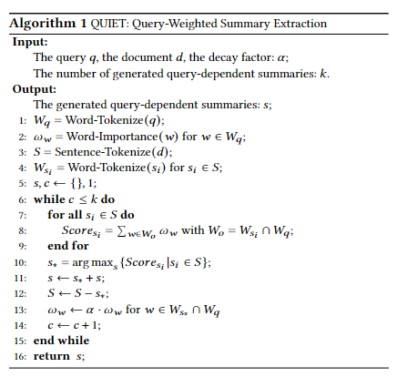
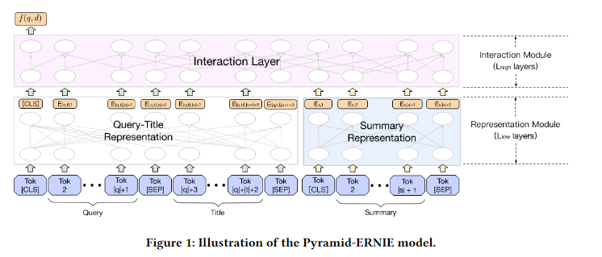
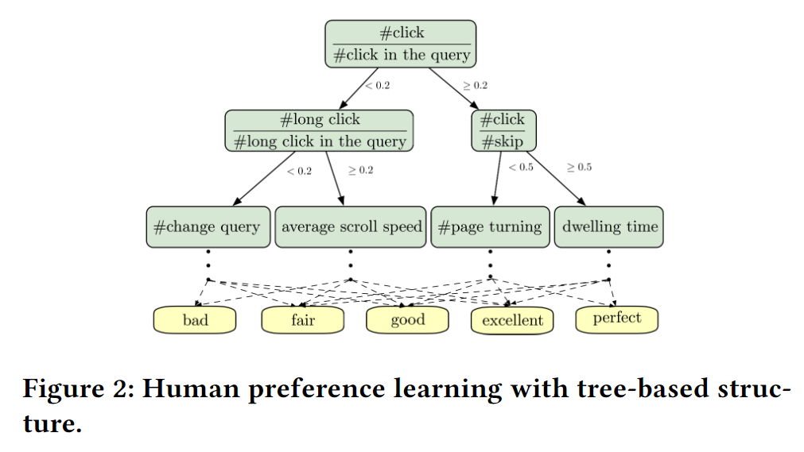
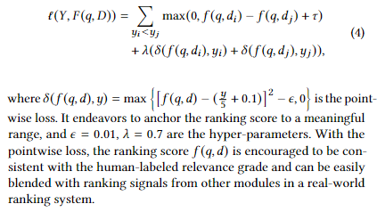

# 【关于 PLM based Ranking in Baidu Search 】 那些你不知道的事

> 作者：杨夕
> 
> 论文：Pre-trained Language Model based Ranking in Baidu Search
> 
> 论文地址：https://arxiv.org/abs/2105.11108
> 
> 论文出处：KDD'21
> 
> 项目地址：https://github.com/km1994/nlp_paper_study
> 
> NLP 面经地址：https://github.com/km1994/NLP-Interview-Notes
> 
> 推荐系统 百面百搭：https://github.com/km1994/RES-Interview-Notes
> 
> 个人介绍：大佬们好，我叫杨夕，该项目主要是本人在研读顶会论文和复现经典论文过程中，所见、所思、所想、所闻，可能存在一些理解错误，希望大佬们多多指正。

## 一、摘要

- 动机：
  - 作为搜索引擎的核心， Ranking System 在满足用户的信息需求方面起着至关重要的作用；
  - 基于 PLM 的 Neural Rankers 难以直接应用：
    - （1）推理时延高：大规模神经 PLM 的计算成本过高，尤其是对于网络文档中的长文本，禁止将它们部署在需要极低延迟的 Online Ranking System 中；
    - (2) 目标不一致问题：基于 PLM 的训练目标 与 临时检索场景目标 存在不一致问题；
    - (3) 兼容性问题：搜索引擎通常涉及 committee of ranking components，如何 让 Fine-tuning PLM 得到的 Ranking System 与其 兼容，存在问题；
- 论文方法：在线搜索引擎系统中部署最先进的中文预训练语言模型（即 ERNIE）时，贡献了一系列成功应用的技术来解决这些暴露的问题。
  - 首先，阐述了一种新颖的做法，以经济高效地汇总 Web 文档，并使用廉价但功能强大的 Pyramid-ERNIE 架构将结果汇总内容与查询联系起来。
  - 然后，赋予了一种创新范式来精细地利用大规模嘈杂和有偏见的点击后行为数据进行面向相关的预训练。
  - 提出了一种 针对 在线排名系统 的 human-anchored 微调策略 ，旨在稳定各种在线组件的排名信号。
- 实验结果：大量的离线和在线实验结果表明，所提出的技术显着提高了搜索引擎的性能。

## 二、动机

1. 传统的排序方法，依赖于人工制造的特征这很容易丢失query与doc之间的语义关系；
2. 基于 PLM 的 Neural Rankers 虽然 能够 捕获 query 和 doc 间 的 语义关系，但是 如果直接 应用于 Online Ranking System 存在以下问题：
    - （1）推理时延高：大规模神经 PLM 的计算成本过高，尤其是对于网络文档中的长文本，禁止将它们部署在需要极低延迟的 Online Ranking System 中；
    - (2) 目标不一致问题：基于 PLM 的训练目标 与 临时检索场景目标 存在不一致问题；
    - (3) 兼容性问题：搜索引擎通常涉及 committee of ranking components，如何 让 Fine-tuning PLM 得到的 Ranking System 与其 兼容，存在问题；

## 三、论文贡献

1. Content-aware Pyramid-ERNIE: 
   1. QUITE算法：快速提取 doc 和 query 摘要信息；
   2. Pyramid-ERNIE 架构：快速计算 doc 和 query 间 相关性；
2. Relevance-oriented Pre-training：设计了一种创新的面向相关性的预训练范式来精细地 挖掘 大规模的点击后行为数据（校准嘈杂和有偏见的用户点击），以对齐人类专家 标注 的相关性信号；
3. Human-anchored Fine-tuning：利用 human-anchored 微调策略，并进一步减轻 目标不一致问题 问题.

## 四、方法解读

### 4.1 Content-aware Pyramid-ERNIE

#### 4.1.1 动机

- 现有的 large-scale search system, 只 计算 query 和 doc 的 title，并用 该分数 来 表示 query 和 doc 内容的相关性，存在问题：
  - doc 的 title 和 content 可能存在差异性 问题；
  - doc 的 content 长度太长，以至于 高计算复杂度 问题；

#### 4.1.2 QUery-WeIghted SummaryExTraction (QUITE) 

- 动机：
  - content 过长；
  - content 只有部分段落 包含 关键信息；
- 方法：使用 QUITE 方法 提取出 doc content 的摘要

#### 4.1.3 Pyramid-ERNIE

利用 Pyramid-ERNIE 计算 query 与 doc 的 title 和 content summary 的 相关性

### 4.2 Relevance-Oriented Pre-training withCalibrated Large-Scale User Clicks

- 动机：PLM 直接学习 点击行为 来 学习 Ranking 信息 存在问题：
  - 点击数据中包含大量的假正例，也就是噪声信息；
  - 曝光偏置问题，线上得到曝光的商品往往有更多的点击行为，盲目学习线上行为可能导致离线评估和线上指标的不一致
  - 点击行为与query文本相关性可能是不一致的，这点妨碍了与训练模型直接学习点击数据
- 解决方法：利用一些后验特征 来判定 点击行为（eg：点击跳过比率，停留时间等） 与 query-doc 的 相关性

1. 人工标注 7w query-doc pair;
2. 利用 这些标注数据 训练 一个五分类的基于树的点击矫正模型；
3. 使用该模型预测大量的未标注数据；
4. 最终得到了矫正数据，然后进行PLM的训练。训练使用的是triplet loss。

### 4.3 Human-anchored Fine-Tuning

- 动机：兼容性问题：搜索引擎通常涉及 committee of ranking components，如何 让 Fine-tuning PLM 得到的 Ranking System 与其 兼容，存在问题；
- 方法：利用 human-anchored 微调策略
  - 人工标注 1kw query-doc pair 训练 Pyramid-ERNIE 
  - 损失函数：pairwise and pointwise loss

## 参考

1. [Pre-trained Language Model based Ranking in Baidu Search](https://arxiv.org/abs/2105.11108)
2. [论文笔记 | Pre-trained Language Model based Ranking in Baidu Search](https://zhuanlan.zhihu.com/p/386780882)

