# 【关于 PLM for Web-scale Retrieval in Baidu Search 】 那些你不知道的事

> 作者：杨夕
> 
> 论文：Pre-trained Language Model for Web-scale Retrieval in Baidu Search 
> 
> 论文地址：https://arxiv.org/abs/2106.03373
> 
> 论文出处：KDD'21
> 
> 项目地址：https://github.com/km1994/nlp_paper_study
> 
> NLP 面经地址：https://github.com/km1994/NLP-Interview-Notes
> 
> 推荐系统 百面百搭：https://github.com/km1994/RES-Interview-Notes
> 
> 个人介绍：大佬们好，我叫杨夕，该项目主要是本人在研读顶会论文和复现经典论文过程中，所见、所思、所想、所闻，可能存在一些理解错误，希望大佬们多多指正。

## 一、引言

- 介绍： Retrieval 是网络搜索中的一个关键阶段，它从十亿规模的语料库中识别出一个与查询相关的候选集。在 retrieval 阶段发现更多语义相关的候选集 有助于 向最终用户展示更多高质量的结果。
- 动机：
  - 【语义匹配】：**如何 解决 用户 query 多样化和口语化问题？**
  - 【冷启动问题】：**对于 大多数 第一次出现的 query 和 doc，如何让 Retrieval Models 捕获 其对应语义信息？**
  - 【工程实践】：**如何 将 Retrieval Models 应用于 Baidu Search？**
- 论文方法：论文描述了作者在 Baidu Search 中开发和部署的 Retrieval Models 。
  - 该系统利用了最近最先进的中文预训练语言模型，即通过知识整合 (ERNIE) 的增强表示，它促进了系统的表达语义匹配。
  - 基于 ERNIE 的 Retrieval Models 拥有：
    - 1）expressive Transformer-based semantic encoders：能够 帮助 Retrieval 充分捕获 query 和 doc 对应语义信息；
    - 2）多阶段训练范式：ERNIE 预训练模型 分别采用 不同的语料数据 进行 多阶段训练，提高模型 泛化能力；
  - 系统工作流程：基于 ERNIE 的 Retrieval Models 结合 传统 Retrieval Models 和 Deep Retrieval Models，并 采用  lightweight post-retrieval filtering module 引入更多的统计特征（例如，点击率、停留时间），来对上述 Retrieval Models 的 检索结果 进行 统一过滤，；
  - 最终，该系统完全部署到生产环境中，并进行了严格的离线和在线实验。
- 实验结果：
  - 该系统可以执行高质量的候选 retrieval ，特别是对于那些需求不常见的尾部查询。
  - 由预训练语言模型（即 ERNIE）推动的新 retrieval system 可以在很大程度上提高我们搜索引擎的可用性和适用性。

## 二、动机

- 【语义匹配】：**如何 解决 用户 query 多样化和口语化问题？**
- 【冷启动问题】：**对于 大多数 第一次出现的 query 和 doc，如何让 Retrieval 捕获 其对应语义信息？**
- 【工程实践】：**如何 将 Retrieval 模型 应用于 Baidu Search？**

## 三、论文方法

- 基于 ERNIE 的 Retrieval Models 拥有：
  - 1）expressive Transformer-based semantic encoders：能够 帮助 Retrieval 充分捕获 query 和 doc 对应语义信息；
  - 2）多阶段训练范式：ERNIE 预训练模型 分别采用 不同的语料数据 进行 多阶段训练，提高模型 泛化能力；
- 系统工作流程：基于 ERNIE 的 Retrieval Models 结合 传统 Retrieval Models 和 Deep Retrieval Models，并 采用  lightweight post-retrieval filtering module 引入更多的统计特征（例如，点击率、停留时间），来对上述 Retrieval Models 的 检索结果 进行 统一过滤，；
- 最终，该系统完全部署到生产环境中，并进行了严格的离线和在线实验。

## 四、论文细节分析

### 4.1 检索模型

#### 4.1.1 任务定义

- 任务：对于 给定 query q，Retrieval Models 如何 从 大规模的 Corpus D 中 检索出 相关候选文档集；
- 公式定义：计算 query 与 doc 间的 相关性分数：

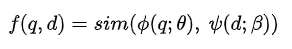

#### 4.1.2 模型结构介绍

1. 参数共享：query 和 doc 共享 bi-encoder（ERNIE） 的网络参数。以此降低 模型参数量，以控制 模型复杂度；
2. 先验知识引入：将 先验知识 引入 模型，以 正则化模型 和 节约 存储空间；
3. Poly attention：利用 Poly attention 计算 query 和 doc 间相似度分数，为建模查询语义提供了更大的灵活性。

#### 4.1.3 模型训练介绍

1. 全局上下文特征提取：每个 $c_i$ 通过 关注 所有 query encoder {C, F1,...,FN} 来 提取 全局上下文特征；

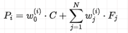

> 注：所有查询词语义的不同聚合，反映了 fine-grained 的查询需求。

1. query和doc的相关性得分计算: 使用 dot-produc 将每个全局上下文特征与 doc 表示进行比较，然后进行 max-pooling 以最终确定相关性分数

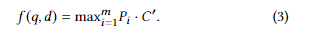

#### 4.1.4 模型预测介绍

- 动机：在检索/预测阶段，由于实际问题，论文采用了略有不同的策略。在具有海量网络文档的实际应用中，**必须预先计算文档表示以构建索引，从而通过快速最近邻搜索实现高效检索**。在这种情况下，基于等式（3）的相关性计算显然是不可行的，因为**现有的索引方案很难支持这种具有最大池化的度量**。
- 解决方法：对 query 端的多个输出 emb 做 Mean-pooling，然后与doc向量的相关性得分

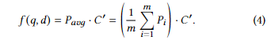

- 优点：利用基于索引的最近邻搜索，极大地提高了模型的适用性。

> 备注：前面已经提到，在训练和预测阶段之间计算相关性分数是不一致的。在实践中，论文 发现这种不一致不会破坏语义检索的模型性能。因此，通过上下文代码学习到的bagging distinct features ，论文可以实现查询的更好、更异构的表示，从而与文档的语义匹配更强大。

#### 4.1.5 Optimization

- maximum likelihood estimation 引入：最大化 query 检索正例的概率和

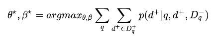

- contrastive probability 引入：
  - 动机：如何 将 相关doc 和 不相关的doc 分开
  - 方法：利用 contrastive probability 计算 query召回单个正例的概率：

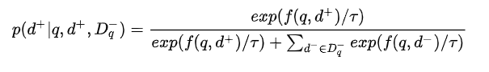

> 其中 t 是温度，越大得到的softmax概率越平滑。

### 4.2 Training Data Mining

- 训练数据 挖掘:
  - 搜索日志数据，其中使用点击信号记录查询和文档，即用户是否点击了文档。对于每个查询，我们将那些点击的 doc 作为正面，将那些曝光未点击的 doc 作为负面，因为 clicks 可以 粗略地表明了用户意图的满意度；
  - 人工标注数据：人工将doc分为0-4分，然后得分高的样本为正样本，得分低的样本为负样本

- In-batch negative mining
  - 动机：online retrieval 会检索出 大量不相关 的 doc;
  - 做法：为了模仿这种环境，使用batch内负采样的到无关的样本。为了更好区分，将一个query下：
    - strong negative：曝光未点击的样本和评分较低的样本；
    - random negative：batch 内其他 query 的正样本和负样本；

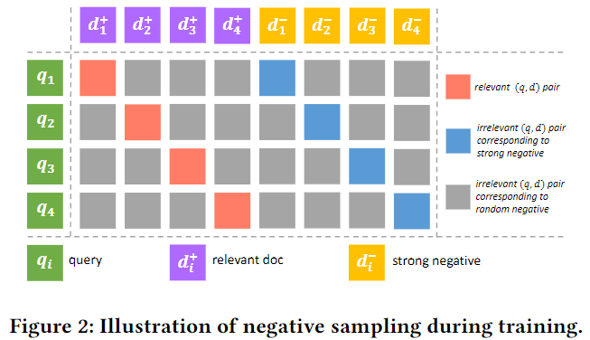

### 4.3 TRAINING PARADIGM

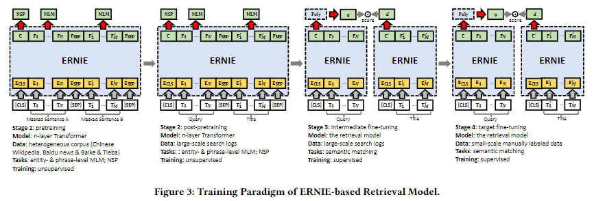

#### 4.3.1 Stage 1: Pretraining

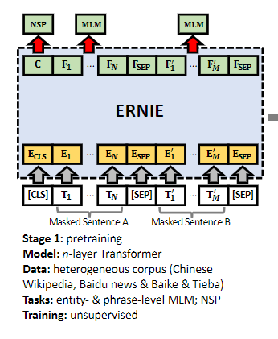

使用百科，新闻等数据进行预训练，从而获得通用的语言知识，可以提升模型的泛化性；

#### 4.3.2 Stage 2: Post-pretraining

使用搜索的query和title进行预训练，更符合搜索场景下的语料分布；

#### 4.3.3 Stage 3: Intermediate Fine-tuning

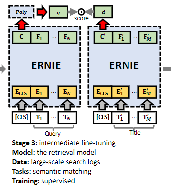

基于海量的点击日志进行微调，这个任务更加接近最终的微调任务，可以让最终结果表现的更好，收敛也更快；

#### 4.3.4 Stage 4: Target Fine-tuning

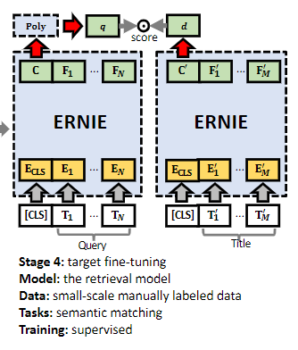

基于小规模精标数据上进行微调

### 4.4 DEPLOYMENT

#### 4.4.1 Embedding Compression and Quantization

- 动机：由于 PLM 模型太大，而且计算复杂，所以 离线doc 侧的存储消耗过大 以及 线上query侧传输和检索耗时 问题
- 解决方法：
  - Compression：使用mlp对  ERNIE 输出进行 Compression ，从768到256，最终效果有一定损失但效率提升了3倍
  - Quantization：使用int8 量化技术 应用于输出 embedding，效率提升了4倍

#### 4.4.2 System Workflow

- 动机：无论是 传统 Retrieval Models 和 Deep Retrieval Models 都无法处理所有类型的查询。相反，将两种类型的检索方法集成在一起更有希望提供更好的整体性能

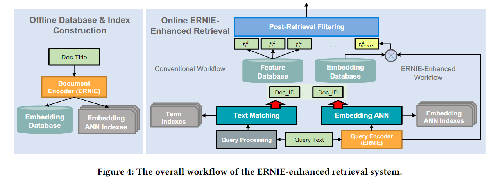

- offline and online stages
  - Offline database and index construction：根据 语义匹配模型 预先计算好doc的Embedding，然后构建Embedding ANN Indexes用于向量检索，构建Embedding Database用于在过滤阶段计算语义特征；
  - Online integrated retrieval：在线计算query的向量，然后检索得到最近的doc，这部分doc与文本匹配得到的doc一起进入召回候选集合；
  - ERNIE-enhanced post-retrieval filtering：对于候选集合的doc，使用统计特征和语义特征计算得分，然后过滤掉一部分doc进入下面的排序阶段

## 参考

1. [Pre-trained Language Model for Web-scale Retrieval in Baidu Search](https://arxiv.org/abs/2106.03373)
2. [论文笔记 | Pre-trained Language Model for Web-scale Retrieval in Baidu Search](https://zhuanlan.zhihu.com/p/386584736)
3. [大规模搜索+预训练，百度是如何落地的？](https://mp.weixin.qq.com/s?__biz=MzIxMzkwNjM2NQ==&mid=2247504279&idx=1&sn=8d02ecbde4076932d4d5260379d32780&chksm=97ad3745a0dabe532b697b4407c4f947ce94a5a6a6cae0df534fd290a97fd2bdd2467bd81e86&scene=21#wechat_redirect)
4. [向量召回 - 基于内容的embedding训练](https://mp.weixin.qq.com/s/ggWHuUh7_1pNqnza1QQPjg)