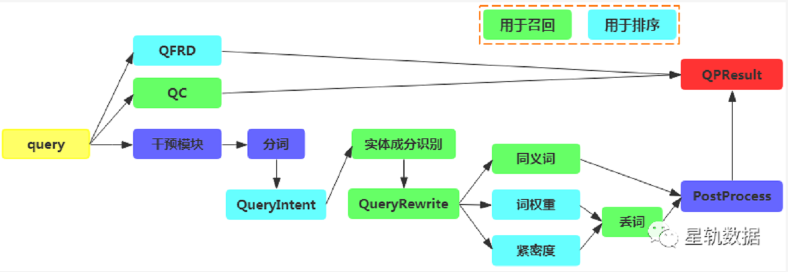
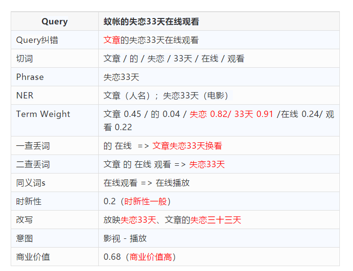
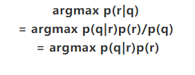
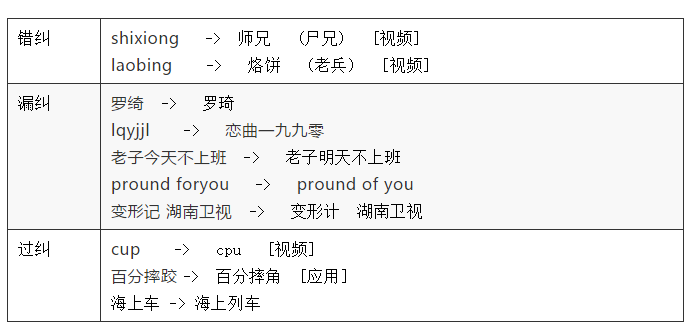

# 【关于 搜索引擎】 那些你不知道的事

- [【关于 搜索引擎】 那些你不知道的事](#关于-搜索引擎-那些你不知道的事)
  - [搜索系统的架构设计](#搜索系统的架构设计)
    - [搜索 QP（query理解）的架构设计](#搜索-qpquery理解的架构设计)
  - [搜索j介绍](#搜索j介绍)
    - [搜索排序 介绍](#搜索排序-介绍)
    - [Embedding 搜索](#embedding-搜索)
      - [动机](#动机)
      - [Embedding 搜索优点](#embedding-搜索优点)
      - [Embedding的学习形式](#embedding的学习形式)
      - [Embedding 搜索 所关心的问题](#embedding-搜索-所关心的问题)
      - [参考资料](#参考资料)
    - [Query纠错](#query纠错)
      - [Query纠错 之  原理](#query纠错-之--原理)
      - [Query纠错 之 文本错误类型](#query纠错-之-文本错误类型)
        - [动机](#动机-1)
        - [常见的错误类型](#常见的错误类型)
      - [Query纠错 之 纠错结果类型](#query纠错-之-纠错结果类型)
        - [动机](#动机-2)
        - [介绍](#介绍)
        - [纠错结果类型](#纠错结果类型)
  - [搜索引擎两大问题](#搜索引擎两大问题)
    - [问题一：召回](#问题一召回)
      - [什么是召回？](#什么是召回)
      - [基于关键词的召回方法](#基于关键词的召回方法)
        - [什么是 基于关键词的召回方法 ？](#什么是-基于关键词的召回方法-)
      - [基于关键词的召回方法存在哪些问题？](#基于关键词的召回方法存在哪些问题)
        - [Q1：索引粒度如何选择问题](#q1索引粒度如何选择问题)
        - [Q2：保证 召回 有相关文档数问题](#q2保证-召回-有相关文档数问题)
        - [Q3：召回 候选 query 多样性问题](#q3召回-候选-query-多样性问题)
        - [Q4：召回 候选 query 无语义效果问题](#q4召回-候选-query-无语义效果问题)
      - [基于语义的召回方法](#基于语义的召回方法)
        - [什么是 基于语义的召回方法？](#什么是-基于语义的召回方法)
        - [基于语义的召回方法 的思路](#基于语义的召回方法-的思路)
        - [基于语义的召回方法 存在问题](#基于语义的召回方法-存在问题)
      - [参考资料](#参考资料-1)
    - [问题二：相关性](#问题二相关性)
      - [什么是 相关性？](#什么是-相关性)
      - [相关性 存在哪些问题？](#相关性-存在哪些问题)
      - [相关性方法介绍](#相关性方法介绍)
        - [计算场景角度](#计算场景角度)
        - [计算方法角度](#计算方法角度)
      - [参考资料](#参考资料-2)
  - [搜索未来新趋势](#搜索未来新趋势)
    - [1. 多模态搜索](#1-多模态搜索)
    - [2. 更语义搜索](#2-更语义搜索)
    - [3。 多轮搜索](#3-多轮搜索)

## 搜索系统的架构设计

- 前言：搜索系统 是由 多个处理不同任务的模块构成，多个模块相互配合和兜底返回用户看到的结果。
- 本质：召回+排序（可以应用于 推荐系统、计算广告等任务）

- 搜索系统 处理流程：

1. 前端CGI负责接收用户的检索请求，发送至RU模块（ROOT UNIT）；【注：RU是一个总控模块，负责和其它模块的调用交互】
2. RU会请求QP（QUERY PROCESSER）模块获取query的分析结果，生成检索下发项（不止一个），也可以看成是确定检索策略的过程；
   1. 调用 QFRD 模块去获取 query 的**时新性**；
   2. 调用 QC 去获取 query 的**纠错结果**；
3. RU 利用 QP 生成的检索策略**去索引集群中求交召回**，这里索引集群分为三种类型：【注：这样设计的原因是当全量文章比较多时会对检索造成比较大的压力，实际使用中优先召回GDU中的doc。】
   1. FDU（Fresh Doc Unit）存储一些比较新的文章；
      1. 每个索引集群下面又连着 **feature server（获取离线计算的doc特征，用于排序计算）**和 **doc server（获取doc的正文）**；
   2. GDU存储一些优质的文章；
   3. WDU存储全量的文章。
4. RU 获取召回结果后，会将 召回 doc 送入到排序模块依次执行以下操作：【注：精排 相对于 粗排 处理的候选 doc 数量降低，所以可以采用 精度更高的模型 和 复杂特征】
   1. 先做 粗排序（query-doc的单点排序）；
   2. 然后做 精排序（query-doc list的整体排序）。
5. RU 会请求 Filter 模块过滤一些非法信息；
6. 通过 ABU 获取摘要和飘红结果用于搜索结果的展示。其中cache模块的加入可以缩短命中cache的query检索耗时。

### 搜索 QP（query理解）的架构设计

- 介绍：QP（query理解）是搜索系统中一个关键的模块，负责对用户的检索串（query）进行理解，然后将分析结果送至下游模块进行使用；

- 搜索 QP（query理解） 处理流程：

1. 首先利用偏运营对 query 进行干预模块，其主要目的是为了及时临时干预出现的一些 badcase。
2. 同时并行的去调用 QC 纠错和 QFRD 时新性结果，这两个模块相对于其它模块是比较独立的模块，因此可并行调用。
3. 对query分词后，先对query做意图分类，并利用意图识别结果来指导query中的成分提取。
4. 在识别成分的基础上对query进行改写，以便进行更好的召回。
5. 其次并行的去调用同义词、词权重、紧密度模块，在词权重和紧密度结果的基础上，对query进行丢词。
6. 最后经过后处理模块做一些QP结果的合法性检测和偏业务场景的策略。
7. 最后综合所有模块的结果形成用于检索下发的QPResult。

- 举例说明

## 搜索j介绍

### 搜索排序 介绍

- 动机：搜索排序 是否就是 相关性排序？
- 介绍：搜索排序 有别于 相关性排序。相关性排序 只是将 和用户输入 query 最相关的检索出来，但是 对于 搜索排序，不仅需要考虑 相关性还需要考虑以下因素：

1. **时效性**：当用户在阿里发财报的当天去搜“阿里财报”时，之前发布的财报旧文章从相关性上来说肯定没问题，而用户是想了解最新的财报，所以需要有限把新文章排到前面，这里称为时新性维度，其是衡量搜索引擎对突发性、周期性事件的快速响应程度。时效性检索在总搜索次数中可能占大头，毕竟都是热点事件导流的搜索需求；
2. **权威性**：耳熟能详的PageRank便是为此而生，更泛的去理解，权威性可以理解成内容质量，如果用户看了一篇高质量的文章、权威的官方解答，相比于看了一篇标题党文章，其体验肯定是截然不同，这里成为权威性，其是衡量搜索引擎对内容质量的理解程度 。同时内容质量也影响着搜索生态是否能健康发展，百度医疗搜索便是一个活生生的例子；
3. **多样性**：*多样性又可分为话题多样性和资源类型多样性*。
   1. 话题多样性：指当用户输入泛query时，其特点是无明显意图，但存在较多潜在意图。比如搜“糖尿病“，比较理想结果是top结果把关于糖尿病的病因、症状、预防、药物...等都能覆盖，则是一个好的话题多样性。
   2. 资源类型多样性是指，相比于都是文章类的结果，混合着文章、视频、音频等的搜索结果用户体验会更好；
4. **场景性**：场景性则是具体搜索业务绑定的，也可理解成规则调序。比如置顶、插入在固定位置、根据检索和资源类型预定义一些槽位映射等。尤其当出现类似新冠肺炎的突发事件时，短时间排序模型很难立即调整，通常需要规则调序先顶上。

- 不同因素间的重要长度：
  - 相关性排序保证相关>不相关；
  - 时效性排序保证相关&新>相关&旧>不相关；
  - 权威性排序保证相关&高质量>相关&低质量>不相关；
  - 多样性排序保证相关&多样>相关&重复>不相关；

- 参考资料

1. [搜索排序 = 相关性排序？](https://mp.weixin.qq.com/s/mjLWl0S3rZudlWMnx6sLdA)

### Embedding 搜索

#### 动机

万物皆可embedding，尤其在推荐系统中。

> eg： 
> airbnb将user和house表示成向量帮助用户获取更准确的house推荐； 
> youtoube将user和video分别表示成向量，提供给用户最好的视频推荐。 

那在搜索系统中里是否也可以用embedding来表示query和doc，然后进行召回排序？如果此路行的通，那embedding搜索能否革了文本搜索的命？

#### Embedding 搜索优点

Embedding有个好处是**方便和统一**，通过端对端的模型训练去学习item的表示。并且加大数据规模，加强计算能力，理论上可以学习到更好的表示。搜索的doc是多种模态的，有文章、视频、图片、音乐… *如果能用embedding统一表示这些多模态的doc，那后面则可以用统一的召回和排序算法。同时也可以避免不同模态doc的字段不可比的问题*，比如视频、图片的文本信息相比于文章是比较少的。然而，笔者先验认为embedding目前还革不了文本搜索的命。

#### Embedding的学习形式

1. 首先学习细粒度的embedding（词/像素...），再根据细粒度embedding去计算更长/复杂item的embedding（句子/文章/图片/视频...），实际中尤其是文本领域大都采用这种方式；
2. 基于用户行为日志去学习item的整体embedding，比如用户的点击行为可表示成序列，那用户/item则是序列中的元素，那可采用普通的embedding训练方法去获取embedding表示。这种方法需要丰富的用户行为；

#### Embedding 搜索 所关心的问题

1. **Embedding的稳定性**：增删改操作是否影响 Embedding。

> 比如一篇文章多加上/减去几个无关的字，embedding是否和原embedding很接近，还是抖动很大？ 
> 比如在电商搜索，item的修改是经常发生的（比如商品的营销标题），修改前后学习到的embedding是否稳定； 
> 比如在视频搜索，同一份视频会以加logo，在最前面插入一些广告等方式被复制变成新的视频，这时视频的内容仍然是相似的，embedding学习该怎么去保证学得到相似的表示？ 

2. **长尾的embedding**

中长尾问题又是搜索中比较难解决的问题。在文本搜索里，**长尾query难解决主要是没有资源或者query的语义难学习**。但是当长尾query有少量资源时，文本搜索靠文本匹配一定能够将对应doc召回。那embedding是否做到？无论是上文提到的方法1还是方法2，对于中长尾都比较难去学习embedding。

> 比如query=“科比”的embedding能学习很好，但query=“科比和麦迪单挑谁能更胜一筹”的embedding能否学好就不一定了；

3. **搜索强调精准**

区别于推荐，**搜索的特性是需要将最相关的item排在top位置**。那embedding检索能够支持这种特性？文本搜索是可以做到，因为最相关的，通常文本匹配度都是匹配比较好的；
   
4. **Embedding能否支持分层计算**

文本搜索考虑耗时通常采用分层排序，对大量候选item的轻计算粗排序和少量item的重计算细排序，那么embedding能否支持这种特性还是embedding采用的单层排序就够了？

5. **Embedding是单个还是多个**

item可能不止一个字段，并且不同字段可能反映不同维度的信息。是学习单个统一的embedding还是为不同字段学习多个embedding？如果学习多个embedding，这些embedding该如何融合或者如何在召回和排序中使用。

6. **不同模态embedding可比性**

如果通过统一模型同时学习不同模态item的embedding，得到的embedding是可比的。但大多场景很难同时学习或者学习复杂度高，并且多模态或多任务方法还不太成熟，单独去学习item的emebedding能否保证可比性？

7.  **Embedding搜索可控性**

本检索在一定程度上是可控的，因为召回的item和query是至少存在共同的词。Embedding通过向量相似度计算并不能保证一定存在共同的词，那会不会误召回一些很飘的item？碰到这种badcase该如何解决？

8.  **Embedding能否解决一词多义**
 
embedding在多词一义上取得了不错的效果，但是对于消歧问题呢？目前来看，其还只能覆盖一些非常明显的歧义case，比如苹果、黎明…

9.  **Embedding扩展性**

除了相关性，embedding是否能cover排序的其他因子呢？比如时新性、多样性...：文本检索在一定程度上是可控的，因为召回的item和query是至少存在共同的词。Embedding通过向量相似度计算并不能保证一定存在共同的词，那会不会误召回一些很飘的item？碰到这种badcase该如何解决？

#### 参考资料

1. [Embedding搜索能代替文本搜索吗？](https://mp.weixin.qq.com/s/cbIqkGg8IwjnSKpEd54wZg)

### Query纠错

#### Query纠错 之  原理

- 动机：属于 Query纠错 中比较常见且核心的模块；
- 流程：召回 和 排序
  - 召回，即获取可能正确的候选纠错串；
  - 排序，在候选纠错串中挑选纠错概率最大的作为纠错结果；
- 思路：

如果把纠错当成一个黑盒，其输入可称为原串：用户query（q），输出可称为纠错串：纠错后的query（r）。纠错算法就是选出r使得q纠成r的概率最大，用贝叶斯公式表示就是：

所以纠错可以分解成：

1. p(q|r)：计算原串到纠错串的转移概率，常见方法有编辑距离，q和r的共点击概率，以及分别抽取q和r的相应特征，用模型预测p(q|r)等；
2. p(r)：衡量纠错串作为正常query的概率，比如语言模型，高频query，实体知识库等，即如果r的语言模型得分很高或者是个搜索次数比较多的query，其作为正确纠错串的概率就越大。

纠错后续的流程和不同方法大都是围绕着这两个概率来计算。

还有个问题是纠错是和资源相关的，如果某个错误query下的资源很多，虽然能正确纠成正确的query，但此时也可能不会去纠错。所以p(q|r)、p(r)、p(q)在纠错中都会使用。由此可见，纠错是个比较复杂的系统，后续将分别介绍以下内容：

1. 文本错误类型
2. 纠错结果类型
3. 纠错的召回方法
4. 片段纠错
5. 生成式纠错
6. 先检后纠
7. 纠错如何用于排序

- 参考资料：[Query纠错（1） - 原理](https://mp.weixin.qq.com/s/D2vsnEB3bJ0deS3jQvzzaQ)

#### Query纠错 之 文本错误类型

##### 动机

- 动机：首先看下为什么会出现query错误。常见的输入方式是拼音输入法，用户输入拼音，输入法提示候选词，由于误选或无需要候选词时，query就有可能出错。

> eg：
> 当新的网络词汇出现时，如"耗子尾汁"； 
> 当一些陌生的词出现时，如"芈月传"； 
> 当一些错别字出现时，“尿酸高通风 -> 尿酸高痛风”； 
> 很多人都知道其拼音，实际哪些字并不确定。 
> 此外，通过复制粘贴来搜索，也可能导致搜索query不完整或带入无关字符。 

##### 常见的错误类型

1. 少字：微信跳一 -> 微信跳一跳
2. 多字：微信跳一跳跳 -> 微信跳一跳
3. 错字：微信 挑一挑 -> 微信跳一跳
4. 拼音：tiaoyitiao -> 跳一跳
5. 中英文混拼：held住 -> hold住 
6. 中文拼音混拼：跳yi跳 -> 跳一跳
7. 知识错误：南山平安金融中心 -> 福田平安金融中心
8. 音转：灰机 -> 飞机
...

> 注： 这里有个细节值得注意，是否是错误还和是否被很多人来用有关，比如“西红柿首富”先验看是个错的电影名，正确的应该是“西虹市首富”，但是由于最开始的很多用户、自媒体都使用了“西红柿首富”，反而使得其是个正常的query，现在百度也专门有个“西红柿首富”的电影词条。这种问题对具体的纠错处理以及纠错应用都有比较大的影响。

#### Query纠错 之 纠错结果类型

##### 动机

从前面结果来看，qc的错误类型是非常多的，并且比较细，使得准确完成这些纠错本身就是个很困难的事情，所以对不同query，纠错系统产生的纠错结果的置信度也不一样。因此考虑到置信度，会对纠错结果标记为不同的纠错类型，并且影响下游的搜索策略和结果展示。具体纠错类型将在下一篇文章中介绍。后续将分别介绍以下内容：

##### 介绍

纠错是搜索召回阶段的一个模块，利用纠错后query去召回一些可能的相关文章，在排序阶段去和未纠错query召回结果做融合，通常是采用按页整体插入的方式。取决于原query召回doc数、纠错query召回doc数等后验，使用纠错的方式也不同，不同的使用方式也导致了不同的纠错结果类型。

##### 纠错结果类型

1. 全纠错

搜索结果都是纠错query的，但在页面展示时依然保留给用户“仍然搜索yyy”的提示，用户可以选择不纠错。

2. 混合纠错

检索结果是原query和纠错query的混排，给用户纠错提示。以一定的置信度下发纠错串和原串，由搜索模块决定使用哪个串还是说两个串都是用并返回两部分的结果，最终在页面展示提示，通常使用了纠错串则是“包含xxx结果。仍然搜索yyy”，使用了原串则是“是否想要搜索xxx”；

1. 提示纠错

不参与排序，给用户纠错提示，最多有3个相关纠错。

因此qc结果类型分类其实也是依据置信度来分类，非常置信的用全纠错，不置信的用提示纠错，介于两者中间的用混合纠错。

纠错是个挑战非常大的模块，也会存在一些错误结果，主要分为三类：

4. 纠错的召回方法
5. 片段纠错
6. 生成式纠错
7. 先检后纠
8. 纠错如何用于排序

## 搜索引擎两大问题

### 问题一：召回

#### 什么是召回？

- 介绍：从 **庞大的资源库** 中 **更高效** 检索出 与 query 相关的 候选 doc 集合；
- 存在问题： 如果 召回的 候选 doc 集合 与 query 不相关，那么**即使后面的相关性排序做好的再好，也是徒劳**。

#### 基于关键词的召回方法 

##### 什么是 基于关键词的召回方法 ？

 基于关键词的召回方法 主要是 利用一些 关键词召回方法（eg：关键词匹配、倒排表等）从 资源库 中召回 一些含有 相同关键词的 候选 query。

#### 基于关键词的召回方法存在哪些问题？

##### Q1：索引粒度如何选择问题

召回是通过**倒排索引求交**得到的，可能存在以下问题：

- 当以词为粒度，粒度较细，召回的文章的数目较多，但也可能由于倒排过长把一些相关的结果误截断；
- 当以更大的phrase粒度，粒度较粗，召回的文章相对更相关，但也容易造成召回的结果过少。

##### Q2：保证 召回 有相关文档数问题

召回问题：

1. 非必留，同义词问题。由于 用户输入 query 和 资源库中候选 query 存在描述不一致问题。

> eg：用户 query：深大图书馆怎么样？ 
> 解析： 候选库 中 可能 只存在 “深圳大学” 相关的 候选 query，那么需要将 “深大” 映射到 “深圳大学” 才能 召回 相关性高的 query

2. 语法错误问题。 用户输入 query 中 会重新一些 编写错误的实体问题。

> eg：用户 query：深镇大学图书馆怎么样？ 
> 解析： query 中 “深镇大学” 属于错别字，用户可能想知道的是“深圳大学”，那么需要将 “深镇大学” 映射到 “深圳大学” 才能 召回 相关性高的 query

3. 用户query也会存在和doc不是完全匹配问题。对于一些 长 query，容易出现 不完全匹配。

> eg：用户 query：无问西东电影的主演是谁？  
> 解析： query 中 “无问西东电影的主演是谁？”  如果要求原搜索串完全命中，可能导致召回结果数过少或零结果。这里分析“电影”是一个冗余的信息，“是谁”是一个不重要的词，其参不参与倒排的求交并不影响召回doc的相关性，这时召回时可以直接把这2个词直接丢掉。

##### Q3：召回 候选 query 多样性问题

- 动机：尤其是对于短query。因为相比于长query，短query往往是一些实体，召回doc数往往不是关键问题，用户也希望有一些惊喜的结果，避免搜索结构都是一些类似或重复结果。
- 方法：query事件扩展，query改写都是为了解决召回的多样性问题。

> eg：用户 query：武汉大学  
> 解析：如果只是返回一些武汉大学的百科、高考录取信息，可能对用户并没有什么吸引力。这是如果能将武汉大学能和最近比较热的“武汉大学 樱花”、“武汉大学 和服”关联起来，可能会有侧重召回扩展内容相关的doc，增加结果多样性。

##### Q4：召回 候选 query 无语义效果问题

- 动机：基于关键词的召回方法 只能 召回 关键词相关 的 候选 query 集，但是对于一些 语义相关 的 query 无法召回。

> eg：用户 query：周星星的简介  
> 解析：query 中 “周星星”，确实是 “周星驰”，也就是 用户想知道 “周星驰”的相关信息，那么需要将 “周星星” 映射到 “周星驰” 才能 召回 相关性高的 query

#### 基于语义的召回方法 

##### 什么是 基于语义的召回方法？

基于语义的召回方法 主要是 利用一些 语义召回方法（eg：向量召回等）从 资源库 中召回 一些含有 相同关键词的 候选 query。

##### 基于语义的召回方法 的思路

1. 分别 将query和doc表示成embedding；
2. 然后基于embedding 计算 从 资源库中检索出 一些语义相似的 候选 query;

##### 基于语义的召回方法 存在问题

虽然 基于语义的召回方法 能够召回一些相关doc，但其不能保证一些最相关的文章被一定会被召回回来。存在以下问题：

1. 语义漂移问题。候选 query 可能 与 query 存在差异性。

> eg：用户 query：吃苹果的好处  
> 解析：基于语义的召回方法 可能 从 库中 检索出 “吃梨的好处”，这个时候，可能不是用户想要的，但是，“苹果“ 和 “梨” 都属于一种水果，又没有错误。

2. 难以调试问题。embedding模型往往是黑盒模型，很难debug。

#### 参考资料

1. [搜索引擎的两大问题（1） - 召回](https://mp.weixin.qq.com/s/fcIL5yBbjohbfBtMBVEAWg)

### 问题二：相关性

#### 什么是 相关性？

- 动机：召回 得到的 候选query 集，但是 不一定所有 候选query 都和 查询query 相关，那么需要 怎么从 中找出 真正相似的 候选query 呢？
- 介绍：相关性计算就需要充分的理解 query和doc，所以需要对 query和doc 进行相关性计算
- 举例说明：
  - 从quey角度，需要知道query中的哪些词比较重要，有没有实体成分，意图是什么？是要找药品的介绍还是要找药品的购买网站？query的时效性如何？是要找最新的事件新闻还是一般的事件介绍？
  - 从doc角度来看，需要理解doc的话题类型，doc的核心词，doc的文本质量，是否是标题党，是否是推销、广告、色情等页面？

#### 相关性 存在哪些问题？

充分的理解query和doc是非常有难度的，更进一步去计算query和doc相关性计算也存在很大挑战，比如以下几种场景问题：

1. query是**歧义**的，当用户搜索苹果时，是要找水果还是要找苹果手机？
2. query的意图不完全体现在term的匹配上，比如用户搜索“北京到上海的火车票”，doc“北京到上海的火车票的乘车体验”，虽然query完全紧邻命中doc，但用户要找的是 “火车票”，并不是 “火车票的乘车体验”；
3. query 和 doc 的mismatched term对相关性也有很大的影响，而传统的相关性计算只考虑了matched term对相关性的贡献；
4. query 和 doc 很多时候需要从语义维度来判断是否相关，比如 query “苹果手机多少钱？”和“ iphone xs max 的官方标价？”；

#### 相关性方法介绍

##### 计算场景角度

- query是**变化**的，需要在线动态计算，因此通常都是一些简单快速的方法，做轻一些；
- doc **相对静态**的，偏离线运算，因此可以使用很复杂的模型事先把doc的相关属性计算好，做重一些。

##### 计算方法角度

1. 字面相关性

- 思路：主要是根据term的匹配度来计算相关性
- 存在问题：无法处理一词多义或者多词一义，并且会忽略词之间的顺序
- 常用方法：BM25方法

2. 语义相关性

- 思路：计算query的doc和语义相关性。其核心思想在于分别将query和doc标称一个低位稠密向量，然后用其cosine距离表示其相似性。
- 常用方法：SVD，Topic Model，Embedding（类似word2vec，doc2vec，sent2vec，lstm等）等等
- 存在问题：
  - 如何学习长文本、有oov的文本的embedding一直没有得到很好的解决。
  - bert 效果比较差
  - 是不太具有解释性，出现badcase只能大概猜个可能的原因。虽然embedding是个趋势，但字面相关性仍然是一个不可或缺的模块，起个断后的作用。

#### 参考资料

1. [搜索引擎的两大问题（2） - 相关性](https://mp.weixin.qq.com/s/XoH_ge6Kz-wKYo6LedIcZw)

## 搜索未来新趋势

### 1. 多模态搜索

从网页端到手机端，获取用户多模态的输入（图片、语音、视频等）变得更为容易，像主流的app都已提供语音、相机等入口。同时5G时代的来临，数据传输速度更快，相比于只使用若干个关键词的文本搜索表达方式，表达能力更丰富的多模态输入作为一种自然+高效的形态会越来越流行、越方便。同时多模态输入，所见即所得，一方面缓解用户不知道如何用关键词来表达自己的需求，一方面也缓解了搜索引擎理解复杂query的难度。当然这里也会产生一些新的技术挑战。比如语音搜索中，如何更好的方言语音识别，口语化语音识别；视频搜索中，如何准确理解每个像素的重要性和语义，类似文本中理解每个词的词权重和语义，分词就类似图像中的物体检测和识别。像微信识物，淘宝拍照搜索都属于这种，但是目前流量并不大，优化的空间也比较大。多模态搜索始于4g，繁荣5g智能时代。

### 2. 更语义搜索

相比于关键字搜索，语义搜索则是透过现象看本质，也是一种更精准的搜索，也是一种不仅仅只看title的搜索，理解doc的文本在搜索会越来越重要。比如搜索“梦字去掉林是什么”，语义搜索则是直接出现“夕”，而不仅仅只是返回一些词重叠的标题。结合产品形态，具体有以下几点：

1. 语义排序：传统的搜索方式都是基于关键词对结果进行排序，而基于 Transformer 的语义排序引擎则能够理解文本背后的含义。
2. 语义摘要：相关性只是一方面，搜索结果中的标题和摘要也非常重要。好的标题和摘要能够让用户“一眼”看出结果是不是自己想要的。
3. 语义高亮：语义高亮的简单理解是：给一段搜索结果画重点，并用文字加粗的形式进行展示。通过语义高亮，用户可以直接获得所需的答案，或者通过快速扫描结果页面就可以查找到所需的文档，甚至直接获得一段摘要。
4. 语义问答：疑问句查询是搜索引擎经常遇到的搜索方式，这背后用户往往想要优先获得一个简短、确切的答案，而不是文档。语义搜索可以通过机器学习阅读语料库中的所有文档，然后进行总结，并将答案置顶展示。

### 3。 多轮搜索

传统的搜索虽说有session的说法，但是对于每个query大都是还是独立处理的。搜索体验中，经常会碰到一些很难在一次搜索中得到满足，通常要多次换不同的query才会得到想要的答案。类似现在比较火热的虚拟人，后面的产品形式可能搜索即对话，对话即搜索，一切以满足用户的需求为主。目前有一些类似作用的产品形态，比如结合query意图知识的多伦hint，比如搜索“拉萨布达拉宫介绍”，则给出“布达拉宫门票预约”“大昭寺小昭寺攻略”这样的hint。在医疗中，有一种特殊的预问诊形态，通过多轮交互尽可能的全面收集用户的疾病信息，帮助后面的分析和诊断。这里通过对多轮的query及上下文理解用户的精准需求是个挑战。

- 参考资料：[搜索的一些新趋势](https://mp.weixin.qq.com/s/9T8J3O_OnmNOIk040cjUEA)

