# Get To The Point: Summarization with Pointer-Generator Networks

> 作者：杨夕
> 
> 项目地址：https://github.com/km1994/nlp_paper_study
> 
> 个人介绍：大佬们好，我叫杨夕，该项目主要是本人在研读顶会论文和复现经典论文过程中，所见、所思、所想、所闻，可能存在一些理解错误，希望大佬们多多指正。

## 前言

- 文本摘要类别
  - extractive 抽取式
    - 方式：直接从原文抽取一些段落
    - 优点：简单
    - 问题：无法生成高质量的摘要，因为不具备一些复杂的摘要能力(如释义(paraphasing), 概括(generalization), 与现实世界知识的融合(incorporation of real-world knowledge))
  - abstractive 生成式
    - 方式：根据长文本 生成 摘要
    - 代表：seq2sq架构
    - 问题：
      - 难以准确复述原文细节；
      - 无法处理原文中的未登录词(OOV)；
      - 在生成的摘要中存在一些重复的部分；

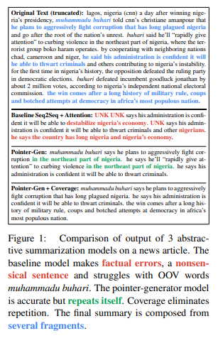

## 论文方法

Pointer-Generator Networks在基于attention机制的seq2seq模型中融合copy机制，并应用于文本摘要任务中，实则是基于上下文向量、decoder input以及decoder hidden state计算一个生成单词的概率p，对应拷贝单词的概率则为1-p，根据概率综合encoder的注意力分布和decoder的output分布得到一个综合的基于input token和output vocabulary的token分布。

## 方法介绍

### Sequence-to-Sequence + Attention

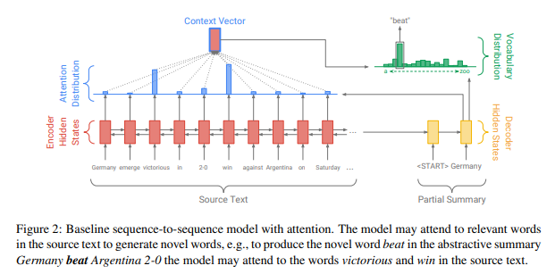

- 编码器（encoder） 
  - 方式：BiLSTM
  - 作用：将文章中每个词的词向量编码为 隐状态 ht
- 解码器（decoder）
  - 方式：单向 LSTM
  - 作用：每一时刻 t，将上一时刻 生成 的 词的词向量作为输入，得到 Decoder Hidden State st，该状态被用于计算attention分布和词的预测
- Attention
  - 作用：每个时间步t,考虑当前序列的注意力分布，注意力分布用于生成编码器隐藏状态的加权总和，转化为上下文向量，与解码器t时刻的隐状态进行concatenated然后喂到两个线性层来计算词汇分布P（一个固定维度的向量，每个维度代表被预测词的概率，取argmax就能得到预测的单词）。
  - 目的：告诉模型在当前步的预测过程中，原文中的哪些词更重要
  - 公式：

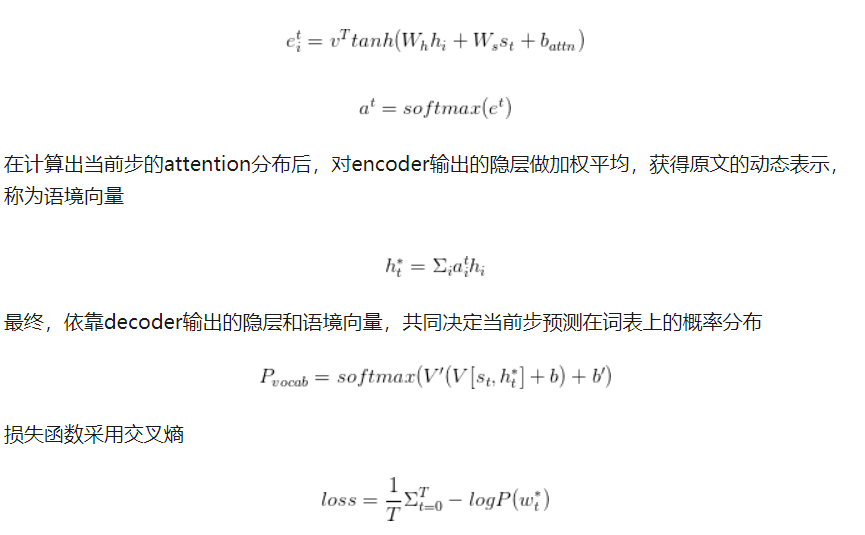

### Pointer-generator network

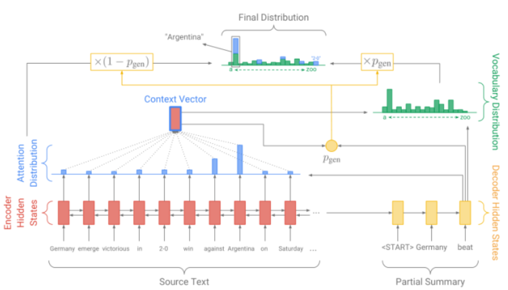
- baseline 
  - 问题：在应用中出现的一个问题是很难在摘要中反映原文中的事实细节（比如一场比赛是几比几、事件发生的事件之类），并且由于词表大小的限制， 必然会出现OOV问题（例如大量的人名、地名、组织机构名不可能全出现在训练语料里）
  - 解决方法：模型在保持抽象生成能力的同时，也能直接从原文中直接复制一些重要的词、片段过来
- Pointer-generator network 组成
  - 通过seq2seq模型保持抽象生成的能力
  - 通过pointer network直接从原文中取词，提高摘要的准确度和缓解OOV问题
- 预测阶段
  - 方式：

1. 通过动态计算 一个 生存概率 Pgen，将两者 合并
   
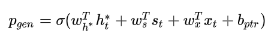

2. 直接把baseline计算出的attention分布作为pointer network的输出，通过参数复用，降低的模型的复杂度（毕竟生成式的模型训练起来都挺耗时的）。最终，摘要中新一个词的概率分布为
  
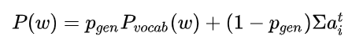

- 核心：在每次摘要生成过程中，都会把原文动态地加入到词表中去，并且在每一步的预测过程中，相比于单纯的seq2seq模型，选原文中出现的词作为摘要的概率要更大一些。

### Coverage mechanism

- coverage模型：
  - 目的：为了解决多句子文本的重复问题
  - 方式：
    - 预测过程中，维护一个coverage向量 ct
      - 该向量是过去所有预测步计算的attention分布的累加和，记录着模型已经关注过原文的哪些词,并且让这个coverage向量影响当前步的attention计算
      - 目的：在模型进行当前步attention计算的时候，告诉它之前它已经关注过的词，希望避免出现连续attention到某几个词上的情形
    - coverage loss 函数：添加一个额外的 coverage loss，来对重复的attention作惩罚
    - 损失函数：

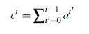
> coverage向量 ct

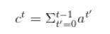
> coverage向量

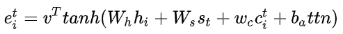
> coverage向量 参与 attention计算

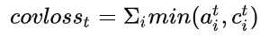
> coverage loss

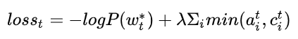
> 损失函数

## 实验结果

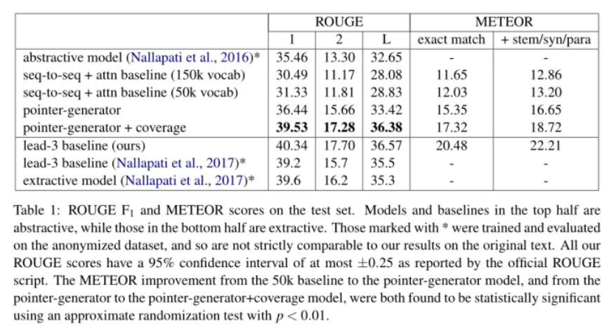

## 总结

###  seq2seq-Attention

- 问题：
  - 难以准确复述原文细节；
  - 无法处理原文中的未登录词(OOV)；
  - 在生成的摘要中存在一些重复的部分；

### Pointer-generator network

提出 Pointer-generator network，

- 特点：
  - 通过seq2seq模型保持抽象生成的能力
  - 通过pointer network直接从原文中取词，提高摘要的准确度和缓解OOV问题
- 优点
  - 指针生成器网络使从源文本复制单词变得容易。网络只需要对相关单词给予足够大的关注，并使Pgen足够大。
  - 指针生成器模型甚至还能够从源文本中复制词汇外的单词。这是一个重大的好处，它使我们能够处理看不见的单词，同时也使我们可以使用较小的词汇量（所需的计算和存储空间更少）。
  - 指针生成器模型的训练速度更快，所需的训练迭代次数更少，以实现与序列到序列注意系统相同的性能。

### coverage mechanism

- 目的：解决多句子文本的重复问题
- 方式：在模型进行当前步attention计算的时候，告诉它之前它已经关注过的词，希望避免出现连续attention到某几个词上的情形

