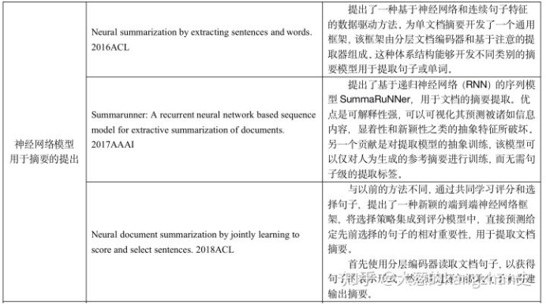
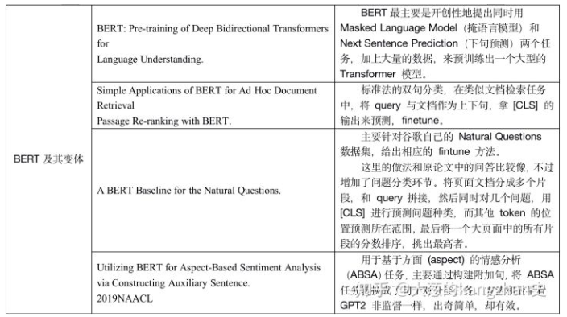
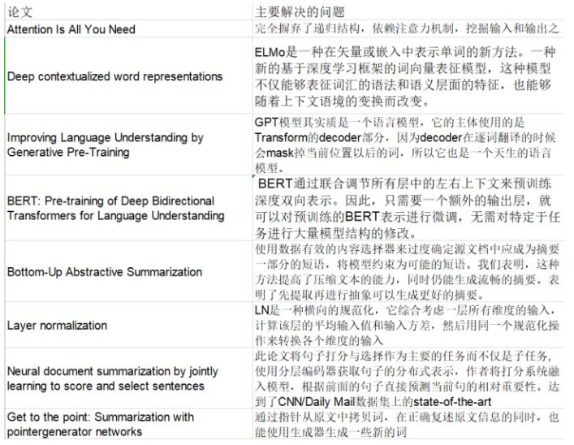
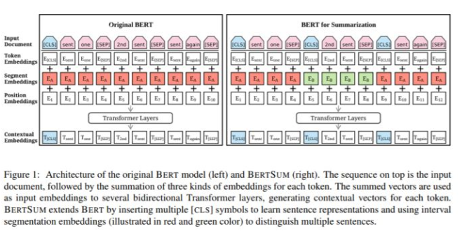
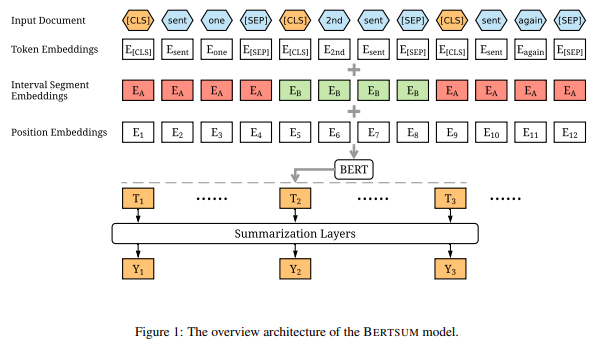

# Fine-tune BERT for Extractive Summarization

> 论文：https://arxiv.org/pdf/1903.10318.pdf
> 英文coding: https://github.com/nlpyang/BertSum
> 中文coding: https://github.com/Machine-Tom/bertsum-chinese-LAI

## 摘要

BERT (Devlin et al., 2018), a pre-trained Transformer (Vaswani et al., 2017) model, has achieved ground-breaking performance on multiple NLP tasks. 

In this paper, we describe BERTSUM, a simple variant of BERT, for extractive summarization. Our system is the state of the art on the CNN/Dailymail dataset, outperforming the previous best-performed system by 1.65 on ROUGE-L. 

## 前期知识

- Single-document summarization ： 自动生成较短版本的文档，同时保留其最重要信息的任务。
- 方法类别：
  - abstractive summarization：转化为一个生成式问题，生成一个新的目标摘要。目标摘要包含不在原始文本中的单词或短语，并且通常需要各种文本重写操作才能生成；
  - extractive summarization：转化为一个二分类问题，判断每个句子是否在这个摘要里面。 通过复制和连接文档中最重要的跨度（通常是句子）来形成摘要。
- 论文介绍：

## 动机

- BertSum 在抽取式文本摘要中的应用
  - 问题：
    - 如何获得每个句子向量？
    - 如何将向量用于二分类问题？
    - 如何判断每个句子的去留？

## 方法

- 思路：定义文档 $d=[sent_1,sent_2,...,sent_m]$,$sent_i$ 表示 文档中的第$i$个句子，Extractive summarization 定义为 给每个$sent_i$分配一个标签$y_i∈{0,1}$，用于判断该句子是否包含于 摘要 中。
- 方法介绍
  - Extractive Summarization with BERT
    - 动机：
      - Bert 作为 一个 masked-language model，输出向量基于标记而不是句子；
      - Bert 只包含 两个标签（sentence A or sentence B），而不是多个句子；
    - 方法
      - Encoding Multiple Sentences：在每个句子之前插入一个[CLS] token**【bert 就开头一个】**，在每个句子之后插入一个[SEP] token 

      

      - Interval Segment Embeddings 
        - 我们使用区间段嵌入来区分文档中的多个句子。
        > 例如：对于$[sent_1，sent_2，sent_3，sent_4，sent_5]$，我们将分配[E_A，E_B，E_A，E_B，E_A]

      

      > $sent_i$ 由向量 $T_i$ 表示，$T_i$是来自顶部BERT层的第$i$个[CLS]符号的向量。

## 参考文献

1. [《Fine-tune BERT for Extractive Summarization》阅读笔记](https://zhuanlan.zhihu.com/p/112282988)
2. [抽取式摘要：TextRank和BertSum](https://flashgene.com/archives/108808.html)