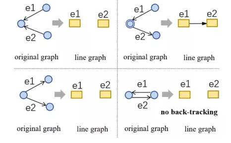

# 【关于 LGESQL 】 那些你不知道的事

> 作者：杨夕
> 
> 论文：LGESQL: Line Graph Enhanced Text-to-SQL Model with Mixed Local and Non-Local Relations
> 
> 来源：ACL2021
> 
> 链接：https://arxiv.org/abs/2106.01093
> 
> Github地址：https://github.com/rhythmcao/text2sql-lgesql
> 
> 项目地址：https://github.com/km1994/nlp_paper_study
> 
> 个人介绍：大佬们好，我叫杨夕，该项目主要是本人在研读顶会论文和复现经典论文过程中，所见、所思、所想、所闻，可能存在一些理解错误，希望大佬们多多指正。
> 
> NLP 面经地址：https://github.com/km1994/NLP-Interview-Notes

## 一、摘要

- 动机：这项工作旨在解决 text-to-SQL 任务中具有挑战性的异构图编码问题。以前的方法通常以节点为中心，仅利用不同的权重矩阵来参数化边类型 
  - 1) 忽略了边的拓扑结构中嵌入的丰富语义 
  - 2) 无法区分每个节点的局部和非局部关系。
- 论文方法：提出了一种 Line Graph Enhanced Text-to-SQL (LGESQL) 模型来挖掘底层关系特征，而无需构建元路径。凭借线图，消息不仅通过节点之间的连接，而且通过有向边的拓扑更有效地传播。此外，在图迭代期间，局部和非局部关系都被独特地整合在一起。我们还设计了一个称为图修剪的辅助任务，以提高编码器的判别能力。
- 论文实验：在撰写本文时，我们的框架在跨域文本到 SQL 基准 Spider 上取得了最先进的结果（Glove 为 62.8%，Electra 为 72.0%）。

## 二、论文动机

现有多个工作提出用有向图的方法来构建问题与数据库schema内部之间的关系，并用图神经网络（GNN）来进行编码。然而这些方法普遍存在两个问题：

- 1）无法很好的找出整个查询所涉及的路径；
- 2）针对图中每个节点，**没有对局部邻居以及非局部邻居进行区分**。并且这些方法在图表征上比较注重节点的表示，而忽略了边中大量存在的语义信息。

## 三、论文方法

### 3.1 线性有向图的构建

线性有向图中的节点和边分别是普通有向图中的边和节点：

- 对普通有向图中顺序连接的边，在线性有向图中用有向边连接；
- 对于没有连接关系的边，则在线性有向图中不添加边。

这种构图方法优点：

- 一方面增强了普通有向图中边的信息的使用
- 另一方面线型图能很好的找到查询所相关的主路径。

## 参考

- [论文浅尝 | LGESQL: 结合线性有向图以及普通有向图的自然语言转换SQL语句模型](https://mp.weixin.qq.com/s/oBtcr7gCp-JdaJQ3ZkghWg)

