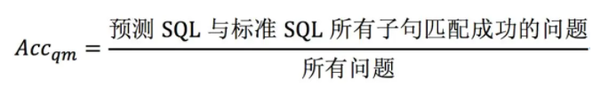
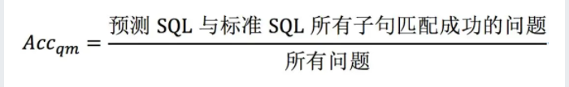
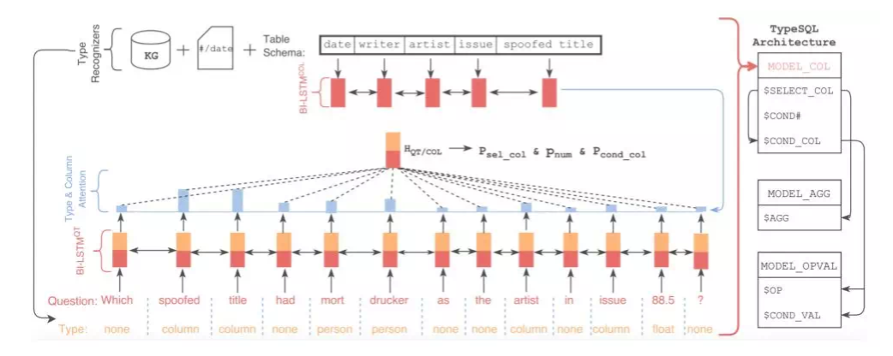
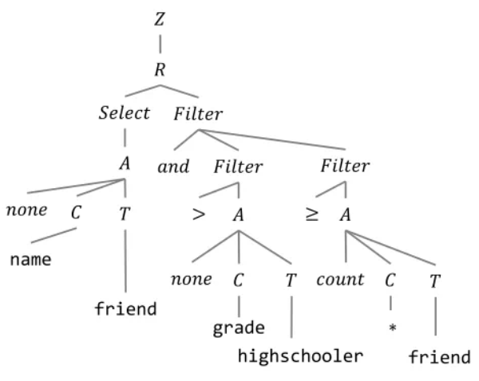

# 【关于 Text-to-SQL 】 那些你不知道的事

- [【关于 Text-to-SQL 】 那些你不知道的事](#关于-text-to-sql--那些你不知道的事)
  - [一、什么是 Text-to-SQL?](#一什么是-text-to-sql)
  - [二、为什么需要 Text-to-SQL?](#二为什么需要-text-to-sql)
  - [三、Text-to-SQL 定义?](#三text-to-sql-定义)
  - [四、Text-to-SQL 有哪些数据集?](#四text-to-sql-有哪些数据集)
  - [五、Text-to-SQL 如何评价?](#五text-to-sql-如何评价)
  - [六、Text-to-SQL 有哪些模型，都存在哪些优缺点?](#六text-to-sql-有哪些模型都存在哪些优缺点)
    - [6.1 seq2seq 模型](#61-seq2seq-模型)
    - [6.2 模板槽位填充方法](#62-模板槽位填充方法)
      - [6.2.1 SQLNet 模型](#621-sqlnet-模型)
      - [6.2.2 TypeSQL 模型](#622-typesql-模型)
      - [6.2.3 SyntaxSQLNet 模型](#623-syntaxsqlnet-模型)
    - [6.3 中间表达方法](#63-中间表达方法)
      - [6.3.1 IRNet 模型](#631-irnet-模型)
    - [6.4 结合图网络的方法](#64-结合图网络的方法)
      - [6.4.1 Global-GNN && RAT-SQL](#641-global-gnn--rat-sql)
    - [6.5 强化学习方法](#65-强化学习方法)
    - [6.6 结合预训练模型、语义匹配的方法](#66-结合预训练模型语义匹配的方法)
  - [参考资料](#参考资料)

## 一、什么是 Text-to-SQL?

Text-to-SQL : 一项转化自然语言描述为SQL查询语句的技术。让机器自动将用户输入的自然语言问题转成数据库可操作的SQL查询语句，实现基于数据库的自动问答能力。

```python
    举个例子：
        当我们询问智能助手 “贾樟柯导演是在哪出生的啊？”
    思路：
        1. Text-to-SQL模型就会先根据问句解析出SQL语句
            “SELECT birth_city FROM director WHERE name ="贾樟柯"”
        2. 再对数据库执行该命令
        3. 最后向用户返回查询结果“山西省汾阳市”。
```

## 二、为什么需要 Text-to-SQL?

1. SQL 作为一种 数据库查询语言 被广泛使用；
2. SQL 对于普通人来说，SQL学习门槛比较高;

如果我们能够有一个工具，自动地把我们的描述转化为SQL查询语句，再交给计算机去执行，就能方便地对数据库进行查询，那就大大提高了我们的生活和工作效率。

## 三、Text-to-SQL 定义?

在给定关系型数据库（或表）的前提下，由用户的提问生成相应的SQL查询语句。

> 下图是一个具体的实例，问题为：有哪些系的教员平均工资高于总体平均值，请返回这些系的名字以及他们的平均工资值。可以看到该问题对应的SQL语句是很复杂的，并且有嵌套关系。


## 四、Text-to-SQL 有哪些数据集?

参考：[一文了解Text-to-SQL](https://www.jiqizhixin.com/articles/2019-12-27-11)

## 五、Text-to-SQL 如何评价?

1. 精确匹配率（exact match ）：预测得到的SQL与正确的SQL语句在SELECT、WHERE等模块达到字符串完全匹配，即整句匹配；



2. 执行正确率（executionaccuracy）：执行预测得到的SQL语句，数据库能够返回正确答案。



## 六、Text-to-SQL 有哪些模型，都存在哪些优缺点?

### 6.1 seq2seq 模型

- 效果：
  - 在ATIS、GeoQuery数据集上达到84%的精确匹配；
  - 在WikiSQL上只能达到23.3%的精确匹配，37.0%的执行正确率；
  - 在Spider上则只能达到5～6%的精确匹配。
- 问题原因分析：
  - 在编码方面，**自然语言问句与数据库之间需要形成很好的对齐或映射关系**，即问题中到底涉及了哪些表格中的哪些实体词，以及问句中的词语触发了哪些选择条件、聚类操作等；
  - 在解码部分，**SQL作为一种形式定义的程序语言，本身对语法的要求更严格（关键字顺序固定）以及语义的界限更清晰**，失之毫厘差之千里。普通的seq2seq框架并不具备建模这些信息的能力。
- 优化方法：
  - 通过更强的表示（BERT、XLNet）、更好的结构（GNN）来**显式地加强Encoder端的对齐关系及利用结构信息**；
  - 通过树形结构解码、填槽类解码来**减小搜索解空间**，以增加SQL语句的正确性；
  - 通过中间表示等技术**提高SQL语言的抽象性**；
  - 通过定义新的对齐特征，利用重排序技术，对beamsearch得到的多条候选结果进行正确答案的挑选；
  - 数据增强方法。

### 6.2 模板槽位填充方法

- 介绍：将SQL的生成过程分为多个子任务，每一个子任务负责预测一种语法现象中的列
- 优点：对于单表无嵌套效果好，并且生成的SQL可以保证语法正确；
- 缺点：只能建模固定的SQL语法模板，对于有嵌套的SQL情况，无法对所有嵌套现象进行灵活处理

#### 6.2.1 SQLNet 模型


- 方法介绍：将SQL语句分成了SELECT和WHERE两个部分，每个部分设置了几个槽位，只需向槽位中填入相应的符号即可。
- 思路：
  - SELECT子句部分与Seq2SQL类似；
  - 在于WHERE子句，它使用了一种 **sequence-to-set**（由序列生成集合）机制，用于**选取目标SQL语句中的WHERE子句可能出现的列**。对于表中的每一列给出一个概率。之后计算出WHERE子句中的条件个数k，然后选取概率最高的前k个列。最后通过注意力机制进行分类得到操作符和条件值。

#### 6.2.2 TypeSQL 模型


> 图5 TypeSQL示意图：显式地赋予每个单词类型

- 介绍：基于SQLNet，使用模版填充的方法生成SQL语句。为了更好地建模文本中出现的罕见实体和数字，TypeSQL显式地**赋予每个单词类型**。
- 类型识别过程：
  - 将问句分割n-gram （n取2到6），并搜索数据库表、列；
  - 对于匹配成功的部分赋值column类型赋予数字、日期四种类型：INTEGER、FLOAT、DATE、YEAR。
  - 对于命名实体，通过搜索FREEBASE，确定5种类型：PERSON，PLACE，COUNTREY，ORGANIZATION，SPORT。这五种类型包括了大部分实体类型。当可以访问数据库内容时，进一步将匹配到的实体标记为具体列名（而不只是column类型）

- 与 SQLNet 区别：
  - SQLNet：为模版中的每一种成分设定了单独的模型；
  - TypeSQL：对于相似的成分，例如SELECT_COL 和COND_COL以及#COND（条件数），这些信息间有依赖关系，通过合并为单一模型，可以更好建模。TypeSQL使用3个独立模型来预测模版填充值：
    - MODEL_COL：SELECT_COL，#COND，COND_COL
    - MODEL_AGG：AGG
    - MODEL_OPVAL：OP, COND_VAL

#### 6.2.3 SyntaxSQLNet 模型

- 介绍：相比于之前decoder输出一段线性的文本，SyntaxSQLNet将解码的过程引入了结构性信息，即解码的对象为SQL语句构成的树结构。通过该技术，模型的精确匹配率提高了14.8%。


> 图6 SyntaxSQLNet利用SQL的树结构进行解码

- 思路：SyntaxSQLNet将SQL语句的预测分解为9个模块，每个模块对应了SQL语句中的一种成分。解码时由预定义的SQL文法确定这9个模块的调用顺序，从而引入结构信息。树的生成顺序为深度优先。分解出的9个模块有：
  - IUEN模块：预测INTERCEPT、UNION、EXCEPT、NONE（嵌套查询相关）
  - KW模块：预测WHERE、GROUP BY、ORDER BY、SELECT关键字
  - COL模块：预测列名
  - OP模块：预测>、<、=、LIKE等运算符
  - AGG模块：预测MAX、MIN、SUM等聚合函数
  - Root/Terminal模块：预测子查询或终结符
  - Module模块：预测子查询或终结符
  - AND/OR模块：预测条件表达式间的关系
  - DESC/ASC/LIMIT模块：预测与ORDERBY相关联的关键字
  - HAVING模块：预测与GROUPBY相关的Having从句
- 数据增强方法：
  - 效果：精确匹配率提高了7.5%
  - 做法：
    - 对SPIDER中的每条数据，将值和列名信息除去，得到一个模板；
    - 对处理后的SQL模版进行聚类，通过规则去除比较简单的模板，并依据模板出现的频率，挑选50个复杂SQL模板；
    - 人工核对SQL-问句对，确保SQL模板中每个槽在问句中都有对应类型的信息。
    - 得到一一对应的模板后，应用于WikiSQL数据库：
      - 首先随机挑选10个模板；
      - 然后从库中选择相同类型的列；
      - 最后用列名和值填充SQL模板和问句模板。

### 6.3 中间表达方法

- 介绍：将SQL生成分为两步，第一步预测SQL语法骨干结构，第二步对前面的预测结果做列和值的补充。

#### 6.3.1 IRNet 模型

- 介绍：
  - 改进一：定义了一系列的CFG文法，将SQL转发为语法树结构。可以将其看作一种自然语言与SQL语句间的中间表示（作者称之为SemQL），整个parsing的过程也是针对SemQL进行的。
  - 改进二：在schemelinking，即如何找到问题中所提到的表格与列。他将问题中可能出现的实体分为3类：表格名、列名、表中的值。根据3类实体的不同，具体做法分为：
    - a）表格名和列名：以n-gram的形式枚举问题中的span，然后和表格名、列名进行匹配。可以看到下图中的Question中对应的单词有的被标成了Column或者Table。
    - b) 表中的值：将问题中以引号为开头结尾的span，送给ConceptNet进行查询，再将返回结果中的 ‘is a type of’/'related terms'关系的词与列名进行匹配。


> 图7 IRNet利用定义的CFG将SQL转化为更抽象的SemQL


> 图8 IRNet的模型结构

### 6.4 结合图网络的方法

- 动机：此方法主要为解决多个表中有同名的列的时候，预测不准确的问题
- 问题：由于数据库之间并没有边相连接，所以此方法提升不大且模型消耗算力较大

#### 6.4.1 Global-GNN && RAT-SQL

- 参考：[Global-GNN && RAT-SQL](https://www.jiqizhixin.com/articles/2019-12-27-11)

### 6.5 强化学习方法

- 介绍：此方法以Seq2SQL为代表，每一步计算当前决策生成的SQL是否正确，本质上强化学习是基于交互产生的训练数据集的有监督学习，此法效果和翻译模型相似。

### 6.6 结合预训练模型、语义匹配的方法

- 介绍：该方法以表格内容作为预训练语料，结合语义匹配任务目标输入数据库Schema，从而选中需要的列
- 例如：BREIDGE、GRAPPA等。

## 参考资料

1. [一文了解Text-to-SQL](https://www.jiqizhixin.com/articles/2019-12-27-11)
2. [语义解析 (Text-to-SQL) 技术研究及应用 上篇](https://aijishu.com/a/1060000000195677)
3. [语义解析 (Text-to-SQL) 技术研究及应用 下篇](https://mp.weixin.qq.com/s/5lTLW5OOuRMo2zjbzMxr_Q)
4. [百分点认知智能实验室：基于NL2SQL的问答技术和实践](https://zhuanlan.zhihu.com/p/448833359)
