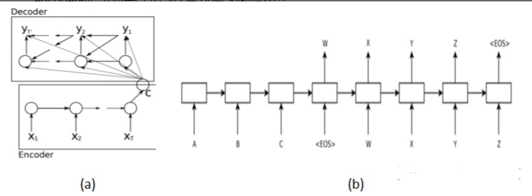
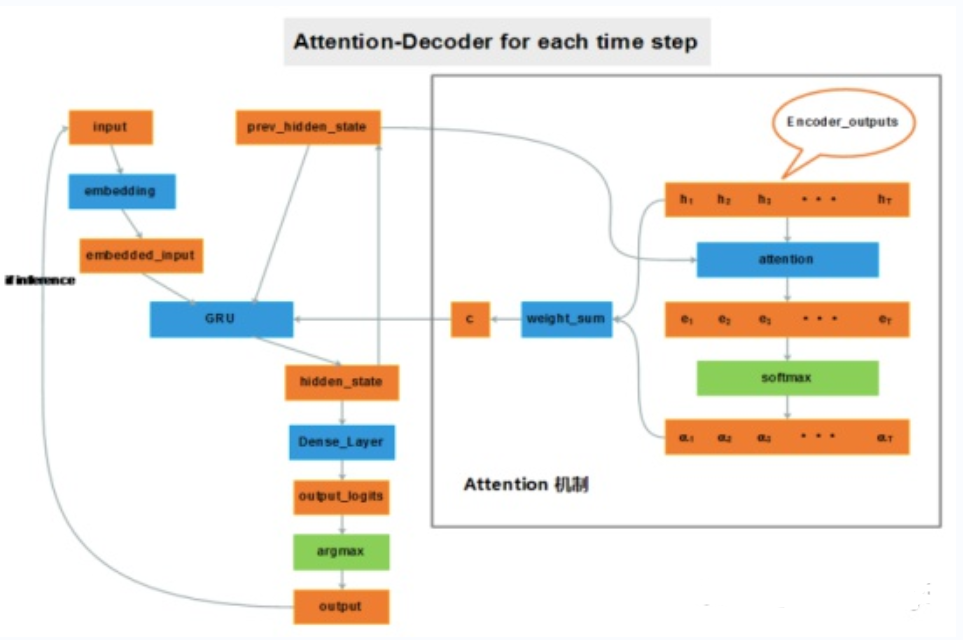

# 【关于 GECToR】 那些你不知道的事

> 作者：杨夕
> 
> 论文：GECToR–Grammatical Error Correction: Tag, Not Rewrite
> 
> 会议： ACL2020
> 
> 论文下载地址：chrome-extension://ikhdkkncnoglghljlkmcimlnlhkeamad/pdf-viewer/web/viewer.html?file=https%3A%2F%2Farxiv.org%2Fpdf%2F2005.12592.pdf#=&zoom=125
> 
> 论文代码：https://github.com/grammarly/gector
> 
> 本文链接：https://github.com/km1994/nlp_paper_study
> 
> 个人介绍：大佬们好，我叫杨夕，该项目主要是本人在研读顶会论文和复现经典论文过程中，所见、所思、所想、所闻，可能存在一些理解错误，希望大佬们多多指正。
> 
> 【注：手机阅读可能图片打不开！！！】

## 一、摘要

In this paper, we present a simple and efficient GEC sequence tagger using a Transformer encoder.  Our system is pre-trained on synthetic data and then fine-tuned in two stages: first on errorful corpora, and second on a combination of errorful and error-free parallel corpora. We design custom token-level transformations to map input tokens to target corrections. Our best single-model/ensemble GEC tagger achieves an F0.5 of 65.3/66.5 on CoNLL-2014 (test) and F0.5of 72.4/73.6 on BEA-2019 (test).  Its inference speed is up to 10 times as fast as a Transformer-based seq2seq GEC system.

- 论文方法：提出了仅使用Transformer编码器的简单有效的GEC序列标注器。
- 论文思路：
  - 系统在综合数据上进行了预训练；
  - 然后分两个阶段进行了微调：
    - 首先是错误的语料库；
    - 其次是有错误和无错误的平行语料库的组合。
  - 我们设计了自定义的字符级别转换，以将输入字符映射到纠正后的目标。
- 效果：
  - 我们最好的单模型以及联合模型GEC标注器分别在CoNLL-2014测试集上F0.5达到65.3和66.5，在BEA-2019上F0.5达到72.4和73.6。模型的推理速度是基于Transformer的seq2seq GEC系统的10倍

## 二、论文背景

### 2.1 什么是 seq2seq？

- 背景：由于Seq2Seq在机器翻译等领域的成功应用，把这种方法用到类似的语法纠错问题上也是非常自然的想法。
- seq2seq 的输入输出：
  - 机器翻译的输入是源语言(比如英语)，输出是另外一个目标语言(比如法语);
  - 语法纠错的输入是有语法错误的句子，输出是与之对应的语法正确的句子;
- 区别：只在于机器翻译的输入输出是不同的语言而语法纠错的输入输出是相同的语言。

### 2.2 Transformer 后 的 seq2seq ？

随着 Transformer 在机器翻译领域的成功，主流的语法纠错也都使用了 Transformer 来作为 Seq2Seq 模型的 Encoder 和 Decoder。

当然随着 BERT 等 Pretraining 模型的出现，机器翻译和语法纠错都使用了这些 Pretraining 的 Transformer 模型来作为初始化参数，并且使用领域的数据进行 Fine-Tuning。由于领域数据相对 Pretraining 的无监督数据量太少，最近合成的(synthetic)数据用于 Fine-tuning 变得流行起来。查看一下 nlpprogress 的 GEC 任务 ，排行榜里的方法大多都是使用了BERT 等 Pretraining 的 Seq2Seq 模型。

## 三、论文动机

### 3.1 什么是 GEC 系统？

#### 3.1.1 基于 encoder-decoder 模型 GEC 系统

- 介绍：基于 NMT 自然还是要使用基于encoder-decoder 模型的 Seq2Seq。使用 RNN 作为核心网络；
- 结构：
  - 用一个 RNN （Encoder）输入句子F编码成一个固定长度的向量；
  - 用另一个 RNN （Decoder）基于该向量进行解码，输出纠正后的句子；

#### 3.1.2 基于 attention 机制 GEC 系统

- 动机：RNN 对长距离依赖的不敏感和“输入的表示”（就是第5个模型中的压紧处理），
输入的表示问题相比于长距离依赖问题更加严重。

> eg：想象有两个输入句子，第一个仅包含3个单词，第二个包含100个单词，而encoder居然无差别地将它们都编码成相同长度的向量（比如说50维）。这一做法显然存在问题，长度为100的句子中很多信息可能被忽略了。

- 介绍：加入attention机制后，如果给 decoder 多提供了一个输入“c”，在解码序列的每一步中都让“c”参与就可以缓解瓶颈问题。输入序列中每个单词对 decoder 在不同时刻输出单词时的帮助作用不一样，所以就需要提前计算一个 attention score 作为权重分配给每个单词，再将这些单词对应的 encoder output 带权加在一起，就变成了此刻 decoder 的另一个输入“c”。

#### 3.1.3 基于 Transformer-NMT 的 GEC 系统

- 介绍：基于 Transformer-NMT 自然还是要使用基于encoder-decoder 模型的 Seq2Seq。使用 Transformer 作为核心网络；

### 3.2 NMT-based GEC系统 存在 什么问题？

由于 NMT-based GEC系统 的 核心是 seq2seq 结构，所以在部署的时候会遇到以下问题：

1. 缓慢的推理速度；
2. 需要大量的训练数据；
3. 可解释性，从而使他们需要其他功能来解释更正，例如语法错误类型分类；

## 四、论文介绍

### 4.1 论文解决 NMT-based GEC系统 问题的核心是什么？

- 将GEC任务从序列生成简化到序列标注来解决 NMT-based GEC系统 问题

### 4.2 GEC 的 训练阶段？

1. 对合成数据进行预训练；
2. 对有错误的平行语料库进行微调；
3. 对有错误和无错误的平行语料库的组合进行微调。

### 4.3 NMT-based GEC 系统 与 GEC 在预测阶段的区别？

- NMT-based GEC 系统：保留字符，删除字符以及在字符之前添加短语；
- GEC 系统：解码器是 softmax 层。PIE是一个迭代序列标注 GEC 系统，可预测字符级编辑操作。

### 4.4 NMT-based GEC 系统 与 GEC 的区别是什么？

1. 开发自定义的 g-transformations：通过字符级编辑以执行语法错误纠正。预测 g-transformations 而不是常规字符可改善 GEC 序列标签系统的通用性。
2. 将微调阶段分为两个阶段：
   1. 对仅错误的句子进行微调；
   2. 然后对包含有错误和无错误句子的小型高质量数据集进行进一步的微调。
3. 通过在我们的GEC序列标注系统中加入预训练的Transformer编码器，可以实现卓越的性能。在实验中，XLNet和RoBERTa的编码器的性能优于其他三个Transformer编码器（ALBERT，BERT和GPT-2）。

## 五、论文思路

### 5.1 Token-level transformations

包含 Basic transformations 和 g-transformations 两种方法。

#### 5.1.1 Basic transformations

保持不变、删除、在目前的 token 后面添加一个 token、将目前的 token 替换为另一个 token

#### 5.1.2 g-transformations

 主要是一些具体的任务，比如：改变大小写、将当前的token与下一个token合并、把目前的token分解为两个、单数转复数等等

#### 5.1.3  数据预处理

要将任务作为序列标注问题进行处理，我们需要将每个目标句子从训练/评估集中转换为标记序列，其中每个标记都映射到单个源字符。下面是表3中针对颜色编码的句子对的三步预处理算法的简要说明：

1. 将源句子中的每个字符映射到目标句子中的字符的子序列;
2. 对于列表中的每个映射，需要找到将源字符转换为目标子序列的字符级别转换;
3. 每个源字符仅保留一个转换

> 注：迭代序列标记方法增加了一个约束，因为我们只能为每个字符使用单个标记。如果有多个转换，我们将采用第一个不是$KEEP标记的转换。

## 六、Tagging model architecture

GEC序列标注模型是一种编码器，由预训练的 BERT 型 transformer 组成，堆叠有两个线性层，顶部有 softmax 层。

我们始终使用预训练 transformer 的 Base 配置。

- Tokenization 取决于特定 transformer 的设计：
  - BPE被用于RoBERTa；
  - BERT 使用 WordPiece；
  - XLNet 则使用 SentencePiece。

为了在字符级别处理信息，我们从编码器表示中获取每个字符的第一个子词，然后将其传递到后续的线性层，这些线性层分别负责错误检测和错误标记。

## 七、Iterative sequence tagging approach

使用GEC sequence tagger标注修改过的序列，然后再次纠正，以这样的方式进行迭代，保证尽可能地完全纠正句子。由于模型问题，一次迭代只能执行一次编辑，但是很多错误并不能由一次编辑来纠正，所以多次迭代具有相应的科学性。

## 参考

1. [GECToR语法纠错算法](https://flashgene.com/archives/126726.html)
2. [GECToR–Grammatical Error Correction: Tag, Not Rewrite翻译](https://blog.csdn.net/qq_28385535/article/details/109676935)
3. [《GECToR -- Grammatical Error Correction: Tag, Not Rewrite》论文笔记](https://blog.csdn.net/qq_42890800/article/details/112753285)
4. [基于神经机器翻译(NMT)的语法纠错算法](https://zhuanlan.zhihu.com/p/88732380)