# 【关于 文本纠错】那些你不知道的事

## 一、动机

由于用户在文本输入法，语音输入法使用上的随意性，后续又缺少审核，极易产生语法错误内容。

中文常见的错别字类型如下：

1. 别字： 感帽，随然，传然，呕土
2. 人名，地名错误：哈蜜（正：哈密）
3. 拼音错误：咳数（ke shu）—> ke sou,
4. 知识性错误：广州黄浦（埔）
5. 用户发音、方言纠错：我系东北滴黑社会，俚蛾几现在在我手上。（我是东北的黑社会，你儿子现在在我手上。）
6. 重复性错误：在 上 上面 上面 那 什么 啊
7. 口语化问题：呃 。 呃 ，啊，那用户名称是叫什么呢？（正：那用户名称是叫什么呢？）

## 二、什么是 文本语法纠错（Grammatical Error Correction）？

文本语法纠错（Grammatical Error Correction） ：指**自动检测出句子语法不通顺的错误，然后将检测出的错误进行纠正，进而减少人工校验成本**。其在搜索 query，OCR，ASR，写作辅助与文章审核等场景中有着广泛的应用。

## 三、学术界 vs 工业界

### 3.1 学术界

#### 3.1.1 学术界研究方向

1. 自动构建训练数据。
   1. 动机：**标注数据稀缺问题**；
   2. 方法：研究**构建伪数据来增强训练数据**，尽可能使伪造数据近似于现实情况。
2. 基于序列标注的纠错方法。基于 Token 级进行修改（增删改）。
3. 基于文本生成的纠错方法。利用生成模型直接使用错误文本生成正确文本。

#### 3.1.2 构建数据

##### 3.1.2.1 基于规则的方法

- 【去噪自编码】思路

1. 对文本进行随机处理加噪声；
2. 然后使用 seq2seq 对其复原；
3. 将训练好的 seq2seq 迁移到真实数据上进行微调；
4. 模型 loss 采用 MaskedLoss， 也就是只计算加噪声部分的 loss，其余部分只计算 3% 的位置。

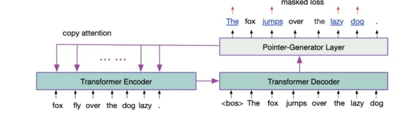

- 优点：可以强迫模型学习有意义的表示，而不是直接复制原文。
- 缺点：
  - 随机噪声和人为噪声存在差异；
  - 回译方式产生的错误类型局限在训练数据；

##### 3.1.2.2 基于文本生成的方法

- 动机：文本纠错任务的目标：错误文本->正确问题，那么是否可以 正确文本->错误问题？
- 方法一：分类器和 encoder-decoder 自编码器

1. 目标：将错误句子编码得到隐向量，模型有两个目标，一是进行错误类别分类，另一个是利用隐向量进行 decoder 自编码
2. 思路：
   1. 对于刚才训练好的模型，输入正确句子和指定错误类别 z；
   2. 首先对隐向量 h 加上随机扰动 r，基于扰动向量预测错误类别 z'，最小化分类 loss；
   3. 然后就可以更新这个扰动 r，再基于更新后的表示进行解码，就可以生成指定类型的错误了；

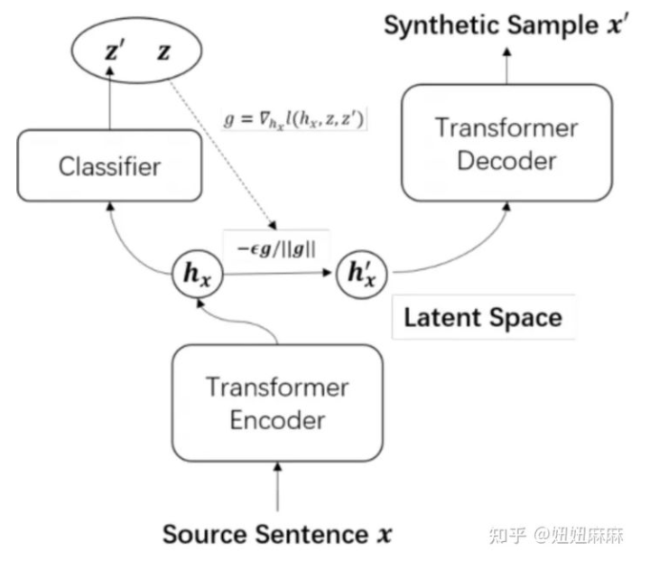

- 方法二：fluency boost sentence pairs

1. 思路：出发点是基于错误句子-正确句 pair 训练的 seq2seq 模型会生成 n-best 个句子。那么这些句子中 ppl 低于正确的句子就还可以和正确句子组合成一个 pair，这样子补充的数据就又可以在训练中利用。

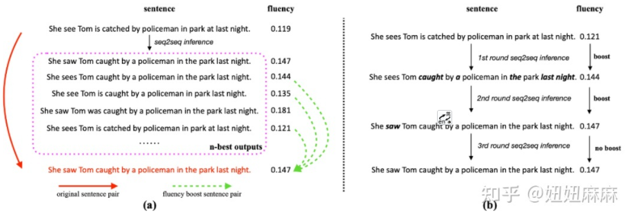

##### 3.1.2.3 基于翻译的方法

- 动机：机器翻译得到的数据会存在语法或逻辑上的错误，那么是否可以利用 机器翻译 的方法构建语料呢？
- 方法：以某种语言作为中间语言，先将句子翻译成英文，再翻译回来，构建成 错误样本；
- 存在问题：存在固定的语法错误

##### 3.1.2.4 基于外部数据的方法

- 动机：百度百科 或 维基百科 中最后的句子一般语法错误较少的句子，那么是否可以被利用呢？
- 做法：根据 百度百科 或 维基百科 编辑历史构造 pair；
- 存在问题：pair 的大幅变化，未全部改正，百科的 spam 等；

##### 3.1.2.5 基于选择替换位置的方法

- 动机：从经验来看，人不一定是在所有的地方都容易写错，那么实际数据的错误位置分布也应该是不均衡的。
- 方法

1. 首先**识别大概率容易错的地方**。在这里有个巧妙的地方就是，他**根据 seq2seq 解码的时候每个步骤的预测概率来判断当前词是不是可能有问题**；
2. 然后**根据 attention 对齐去找到原文本对应的位置**。找到位置后再进行替换，生成错误句子。

- 存在问题:

1. 预定义的加噪声规则或者（错误-正确对）替换方法会让模型去学习到这些策略。而这些策略与真实的场景还是有点差异或覆盖不全，进而限制模型的泛化性能
2. 一些基于生成或翻译的方法，无法定位错误片段，其可能表达的意思与输入有很大不同了。
3. 构建的样本可能带入噪声，伪正例对模型训练会造成困扰。

#### 3.1.3 基于序列标注的纠正方法

- 动机：
  - seq2seq 生成文本的可控性较差;
  - decode 的推理速度也比较慢;
  - 在语法纠错的场景中，错误文本和正确文本的交集特别大;
  - **联系到字符串编辑距离的方式，如何通过较少的 token 编辑操作将错误文本改造成正确文本。**
- [9] 方法：

1. 首先定义了 copy, appends, deletes, replacements, case-changes 这些编辑操作（比如下图的错误句子 X 和正确句子 y，可以得出编辑方法 e）；
2. 然后对每个 token 打上标记；
3. 再使用迭代序列标注方法预测 token- 级别的编辑操作。

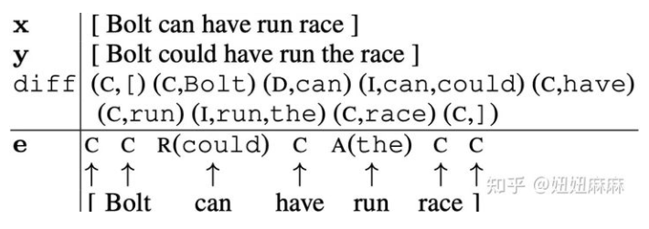

- [8] 方法：

1. 设置了两种标签 keep 和 delete;
2. 然后在 keep 和 delete 的基础上添加额外标签 P（表示在当前位置需要在前面加入短语 P，P 是空或单词或短语），如下图所示 。
   
实验设置的词表 V 大小只有500（覆盖 85% 的训练数据），在实际应用场景可能会很大，所以整个预测空间是 2V（V 代表词表大小，2 是 keep 或 delete）。模型上在 BERT 的输出后添加 MLP 或 transformer decoder 进行序列标注。

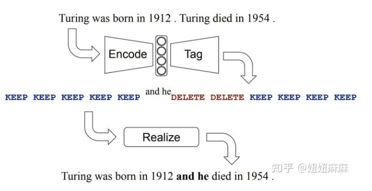

- [10] 方法：
 
1. 思路：详细定义了多种语法操作的 tag。tag 空间达到了 5000 个，包括 KEEP，DELETE，1167 个依赖于 token 的 append，3802 个 replace，和 29 个独立于 token 的语法变化（包括 CASE：大小写，MERGE：将当前 TOKEN 和后面 TOKEN 合并成一个，SPLIT：将当前 TOKEN 拆成两个，单复数转换，时态转换等等）。

2. 思路：
   1. 首先需要做的是预处理，对错误句子的每个 token 打上前面定义的 tag；
   2. 模型上就是基于 bert 的 tagging 模型，采用迭代序列标注的方法多轮 tagging。

3. 效果：这个方法是 grammaly 在 conll 数据上的 sota，应该是和工业应用场景比较接近，基于 tag 方法的纠错就是需要这种细致的数据处理和 tag 定义。

- 优点：
  - 准确率会很高；
  - 可控性强；
  - 解释性很强。
- 缺点：需要对数据的细致分析和处理，tag 的定义取舍要求较高。由于一般不会把 tag 的集合设置过大，在封闭集上效果会较好，但开放集上的复杂情况和长尾问题很难处理。

#### 3.1.4 生成模型

- 目标：利用原句得到正确的句子
- 与机器翻译的区别：target 和 source 是同一种语言，且有很大的交集，也比较容易想到可以借鉴文本摘要中的 Copy 机制 。
- 主要的研究方向：数据使用及训练策略，如何解决 target 和 source 交集过多的问题，解码策略。

##### 数据使用及训练策略

- [11] 方法：

1. 首先基于去噪自编码方法在大规模数据上预训练，同时引入 token 级序列标注（判断这个 token 是否错误）和句子级别 copy（判断改句子是否正确，正确就是应该全 copy）做多任务提升 copy 机制在正确句子上的效果。

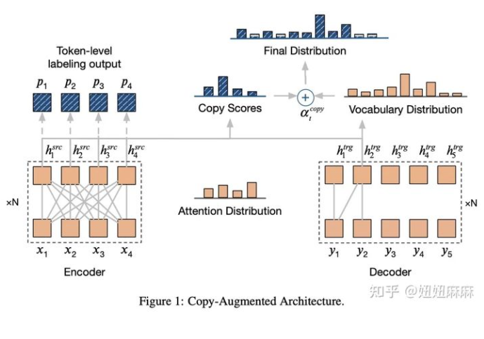

- [16] 方法：

在每轮迭代的时候动态随机增加噪声 Padding，随机替换，词频替换，同音异形替换，混合替换（随机选择前面的替换方式）。

-  bert 引入到 Encoder-Decoder 方案

1. 方案一：
   1. 思路：使用 bert 进行 encoder 的初始化
   2. 问题：
      1. seq2seq 很容易会破坏预训练的表示；
      2. 在大规模的 seq2seq 数据上会导致灾难遗忘；
2. 方案二：
   1. 思路：使用预训练表示作为额外特征， 然而预训练语言模型不会对输入数据和语法纠错任务泛化（eg：文章[12]首先在检测数据上微调序列标注的 BERT 模型，然后使用 Bert 的输出和原始输入训练基于 feature-based-Bert 的 Enc-Dec 模型。主要动机是想如何把预训练 bert 的表示融入到 enc-dec 框架中。）

##### copy 浪费效率

- 动机：语法纠错的 seq2seq 大部分都在 copy，所以这个地方的效率可以被优化。
- [13] 方法

1. 首先利用序列标注 01 二分类来识别错误 spans；
2. 然后利用 seq2seq 模型进行纠错。


- [29] 方法

1. 动机：针对**生成模型无中生有和难以与原文本对齐**，**Tag 编辑方法的标签空间较大且需要多轮解码**的问题
2. 思路：

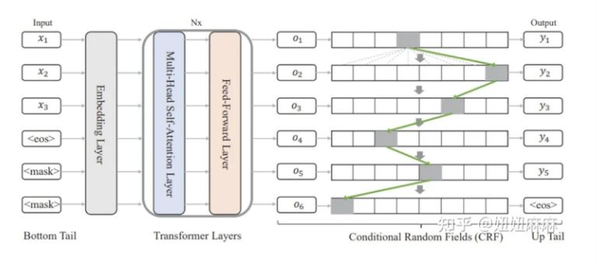

##### 解码策略

- 动机：由于句子中可能会**包含多次错误**，**一次生成可能无法全部改正**，所以很多研究使用迭代解码策略。每一轮选择置信度高的候选作为下一轮的输入，一直解码直到输入无需纠正[2]
- 文章[14]方法：提出了 diverse local beram search ，当一个 token 只有在需要修改时候，采用 diverse beam search。

#### 3.1.5 学术界相关工作

[学术界相关工作]([img/](https://zhuanlan.zhihu.com/p/398928434))

### 3.2 工业界

#### 3.2.1 整体方法介绍

- 分阶段的纠错架构：
  - 错误检测；
  - 候选召回；
  - 候选排序和结果评价

#### 3.2.2 百度中文纠错 【Query 纠错】

##### 3.2.2.1 错误类型


##### 3.2.2.2 思路

1. 错误检测：**检测句子中错误位置和错误类型**
   1. 模型上采用 transformer/lstm+CRF 序列标注模型
   2. 模型输入层引入多种特征：词法句法分析，字词多粒度特征
2. 候选召回：对检测出来的错误位置召回正确候选
   1. **离线候选挖掘**，利用大规模的错误对齐语料，通过对齐模型，得到字、词、短语级混淆矩阵；
   2. **在线候选预排序**，对召回的大量候选，结合语言模型和混淆矩阵特征进行候选粗筛。
3. 纠错排序：deep&wide， deep 结合当前错误点上下文表示，wide 部分基于形音、词法、语义、用户行为等特征学习原词与候选词的多维度距离表示。通过 GBDT&LR 进行排序。

##### 3.2.2.3 主要特点

1. 语言模型：传统的语言模型是基于上文的词预测该位置的词，与语法纠错场景有一定的 gap，为了更贴近语法纠错的使用场景，使用受限语言模型，基于原词生成该位置的词；

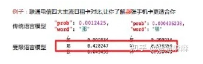

2. 知识型错误：对标题进行检索或者上下文的关联知识辅助排序；
   


3. 低频知识：在训练数据中出现很少，对语言模型的预测概率和 ppl 计算影响较大。因此不能单单依靠语言模型的结果，要进行语义分析得到语义特征，辅助排序

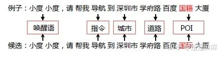


#### 3.2.3 阿里语音纠错 【ASR 纠错】

##### 3.2.3.1 纠错系统整体架构

- 模式：检测-召回-排序

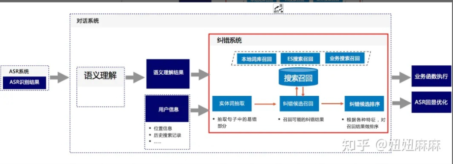
> 纠错系统整体架构

- 实体词抽取：
  - 动机：常用的实体序列标注模型都是基于正确数据训练出来的，与纠错场景的实际应用分布不一致，所以需要构造包含错误的样本。
  - 方法：首先使用业务规则增加 20% 的包含错别字的数据，使得训练数据和线上场景分布一致；
  - 效果：实体抽取结果提升 10 个点。
- 纠错候选召回：

1. 方式一：本地词库召回
   1. 方法：建立索引时使用各阶拼音 n-gram 作为键值，召回时优先查询高阶键值，无法满足数量阈值时回退到低阶键值查询，保证召回数量。

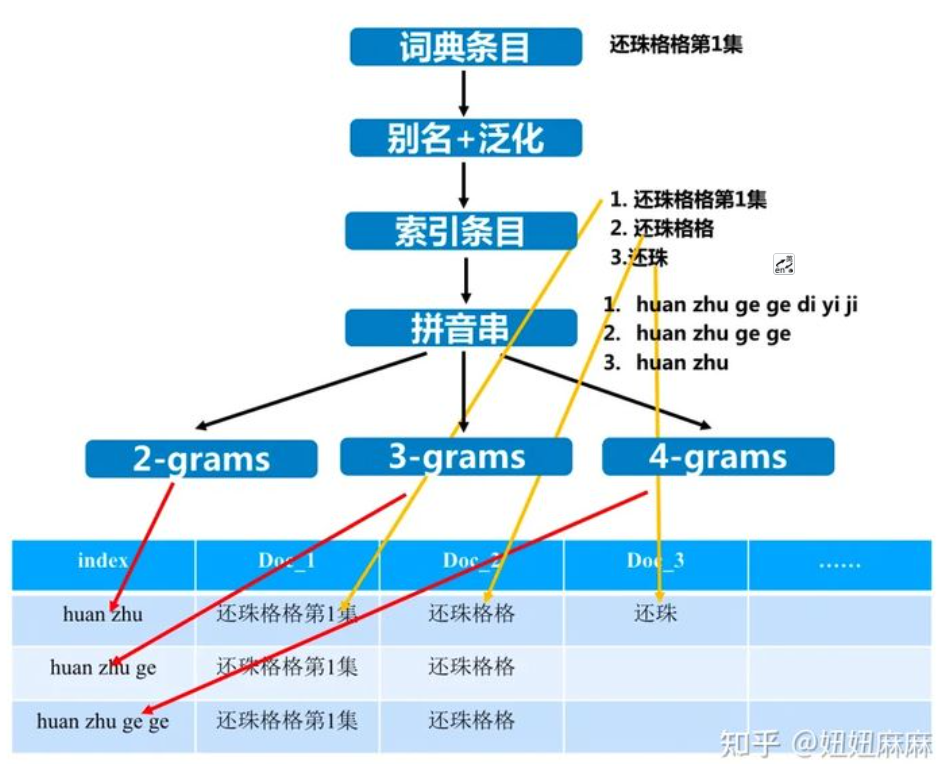

2. 方式二：ES检索召回
   1. 方法：使用 Elastic Search 检索进行召回。采用词条拼音名作为索引项，按照词条长度以及城市信息对索引表进行分片。

3. 方式三：业务搜索召回
   1. 方法：使用业务搜索接口，比如高德地名查询、虾米音乐查询、优酷视频查询等。进一步丰富召回内容。

- 纠错候选排序：对召回的实体进行纠错候选进行排序，模型上采用 pointwise 的二分类 svr 模型，使用哪个的特征包括：

1. 拼音层面：声母近似（平翘舌等）、韵母近似（前后鼻音等）、整体近音、方言等
2. 字层面：编辑距离、公共子串、公共子序列等
3. 业务层面：PV、城市信息等

- ASR 回显优化

1. 动机：用户的语音输入是“菏泽鲁星医院”，而匹配的词条是“菏泽市鲁心医院”。识别的错误是将“心”识别成了“星”，但是匹配词条中还有被用户省略的“市”这个字。使用词条直接替换会导致识别结果和用户真实发音不一致，这是回显优化需要尽量避免的情况；
2. 方法：提出了一种基于拼音相似的公共子序列算法，通过查询原始串和替换串的拼音，找出拼音相似的最长连续路径。

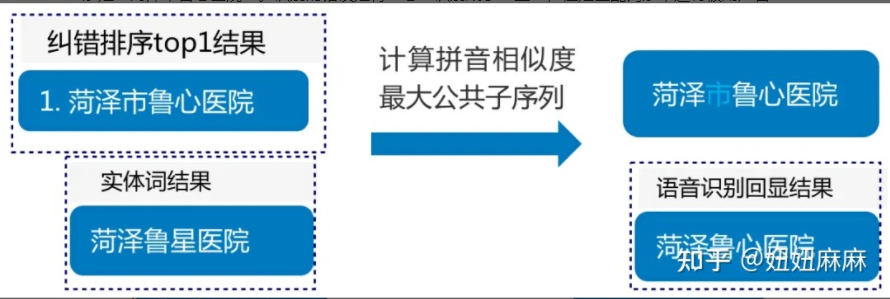

#### 3.2.4 小爱音箱的语音识别纠错【ASR 纠错】

- 动机一：针对近音字纠错模型。一对一纠错，不考虑音频信息，只考虑文本信息。
- 错误样本构建方式：

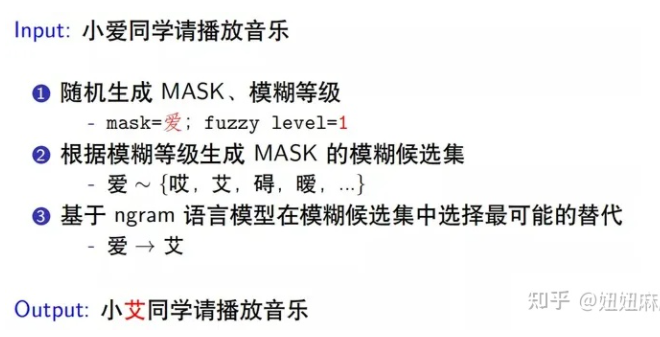

- 动机二：标准拼音对汉字音似建模有误差，比如"挖"和"华"读音很相似，标准拼音的编辑距离为 2 ( "wa"，"hua" )，
- 方法：提出了非标准拼音方案更准确描述 ASR 语音错误。
- 思路：

1. 模型上是两个 Bert 模型的 ensemble，先用汉字语料训练一个端到端的纠错模型，再训练一个拼音到汉字的纠错模型；
2. 两个模型拼接后通过输出层 softmax 训练每个位置的交叉熵损失。特别的是将汉字拆成声母韵母声调，而不是单独的英文字母。

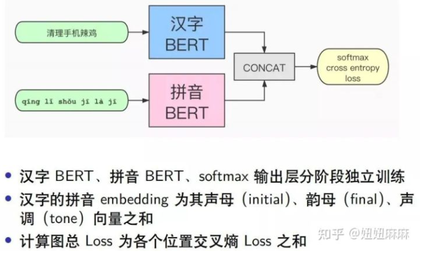
> trick：a. 词表，限制纠错词表范围，只在相似词中选择，提升准确率b. 递归预测，把纠正后的句子再输入模型，直至两次结果相同

#### 3.2.5 [滴滴asr纠错](https://mp.weixin.qq.com/s?__biz=MzU1ODEzNjI2NA==&mid=2247517316&idx=1&sn=06a1d823c48732d18bd7b2d28387098d&scene=21#wechat_redirect) 【ASR 纠错】

##### 3.2.5.1 滴滴语音交互的整体算法框架


> 语音交互整体流程

##### 3.2.5.2 动机

- 应用场景问题：对语音识别错误结果进行纠正；
- 学术界 end2end 方法 问题：
  - 模型都需要大量高质量的训练数据保障模型效果；
  - 无法直接更新纠错词库，需要重新训练模型或增加额外模块。

- 待解决问题
  - 如何高效地检测错误位置和错误纠正？
  - 在实际项目中如何实现可复用？
  - 如何实现纠错效果的持续性优化？

##### 3.2.5.3 基础方案

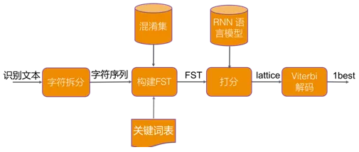
> 纠错整体框架

##### 3.2.5.4 错误检测

- 错误类型类别：
  - 替换错误【占大多数】
    - 解决方法：主要针对的是发音相同或相似的替换错误。使用的方法是利用识别的混淆集和关键词构建AC自动机，将待纠句子的音节序列来寻找适配的热词。
  - 删除错误
  - 插入错误
- 混淆集的构建
  - 方法：基于识别结果和标注文本进行对齐得到混淆字对，对应的不同音节则视为发音混淆集。当然由于识别结果中删除错误和插入错误的存在，获取的混淆集并非可能性都一致。此处不同发音混淆集的概率由出现的频次来决定，概率和门限值均是经验值。


- AC自动机构建错误检测网络
  - 做法：以关键词表的音节作为模式串

> yu shi ju jin, yu ren wei shan, ju jing hui shen, shan gu作为模式串，以音节为单位，在初步的图网络上再创建fail指针。


> 音节图网络


> 创建FAIL指针

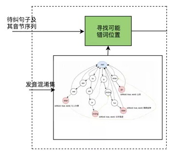
> AC自动机错误检测网络

##### 3.2.5.5 候选召回

- 思路：在上面的AC自动机错误检测网络中，利用待纠句子的音节序列在网络中进行匹配，匹配到的叶子节点上的word即为召回的候选词。另外增加了基于ngram拼音的回退召回，增加对少数的同音删除错误的召回概率，多个索引词最大长度优先。
- 做法：【建立索引时使用各阶拼音n-gram作为键值】

1. 召回时优先查询高阶键值；
2. 无法满足数量阈值时回退到低阶键值查询，保证召回数量。

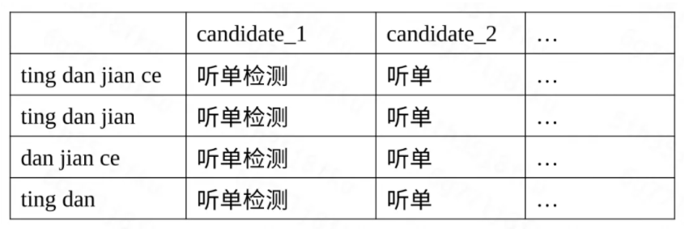
> 拼音ngram候选


> badcase上性能结果

##### 3.2.5.6 候选排序

RNNLM转换成WFST后，compose到包含错误候选的句子主题上，对FST的候选排序进行打分，维特比解码后最终输出1best的结果。当然对于ngram语言模型也适用，在相同的合适语料上，RNNLM的效果相对较好，ngram模型的优点在于简单高效。在智能客服项目上，此种方式纠错后字准提升2% (90.17%-92.16%)。

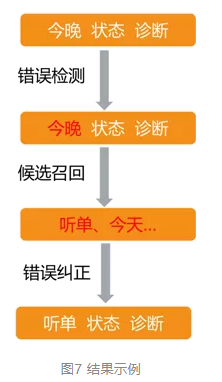
> 结果示例

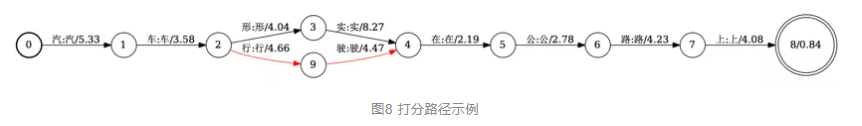
> 打分路径示例

#### 3.2.6 [小PAI 纠错](https://mp.weixin.qq.com/s?__biz=MzU2MDkwMzEzNQ==&mid=2247485798&idx=2&sn=122b00674bfb7033d8b6875f1d6a9360&scene=21#wechat_redirect) 【ASR 纠错】

##### 3.2.6.1 问题类型描述

- 语言转化和发音不标准的错误【50%】

> eg：一款保险产品“少儿平安福”被语言识别转化为“少儿平安符”、“飞机”因方言差异被读成“灰机”、“难受想哭”变成“难受香菇”等

- 拼写错误【35%】

> eg：“眼镜蛇”-“眼睛蛇”、“缺铁性贫血”-“缺铁性盆血”等

- 语法和知识错误【其他】

> eg：语法错误包括多字少字乱序，如“地中海投保”-“投保地中海”，知识关联错误如“福田平安金融中心”错写为“南山平安金融中心”

##### 3.2.6.2 动机

- 无点击语料，有点只是没有标注过的机器人问题；送标效率低，而且易引入标注错误问题；
- 无标准数据；
- 对内存和时效要求高；
- 线上要求高准确率【低召回高准确】；
- 替换错误高；

##### 3.2.6.3 性能评估指标

- 过纠率：代表正确的句子被改错的比率；
- 召回率：代表错误的句子被全部纠正的比率，其中较大的过纠率将会对系统和用户体验带来负面效果。

> 目标：让纠对句子数量远远大于被改错句子的数量

##### 3.2.6.4 整体思路

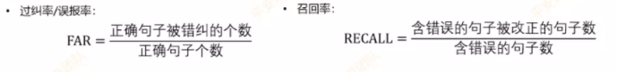

- 思路：

1. 在系统输入用户问题后，首先进入到错误检测模块找出相应的错误点位；
2. 然后针对错误片段进行正确候选词召回；
3. 其次经过粗排序、精排序等排序模块；
4. 最后通过候选筛选模块处理候选交叉冲突等情况。

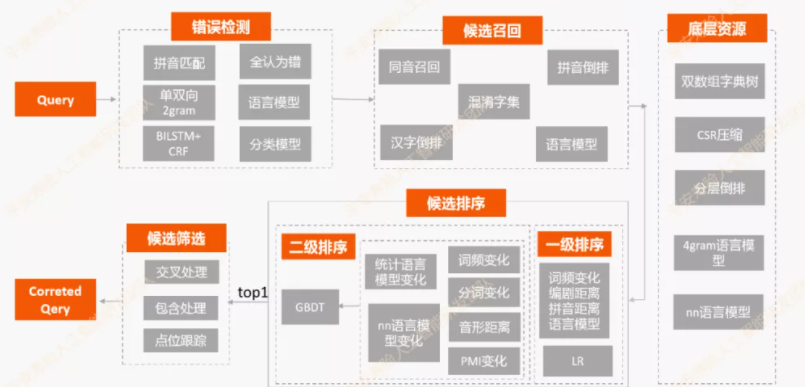
> 纠错模块架构

> 注：其中底层资源用于存放各类底层字典资源、上下文语义信息从而方便各模块调用，其存储的数据结构主要包括：双数组字典树、稀疏矩阵压缩算法CSR和分层倒排索引等；上下文语义信息则以统计语言模型及NN语言模型的形式保存。

##### 3.2.6.5 错误检测

###### 3.2.6.5.1 基于规则的错误检测

1. 方法一：基于近似拼音匹配的产品专名纠错

- 动机：近音错误问题
- 方法：构建拼音-> 实体 的 映射词典， 错词->拼音->正确实体（eg：福保保-> fu bao bao -> 福宝宝）
- 存在问题：当错误片段的拼音不在映射表中时就无法进行匹配
- 改进方法：将映射字典的存储结构改进为拼音Trie树，从而可以进行拼音编辑距离的匹配。

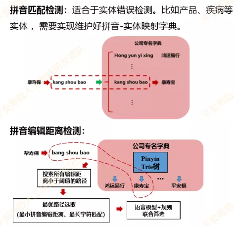

2. 双向2gram检测

- 假设：正确表述发生频次要比错误的表述发生频次要高很多

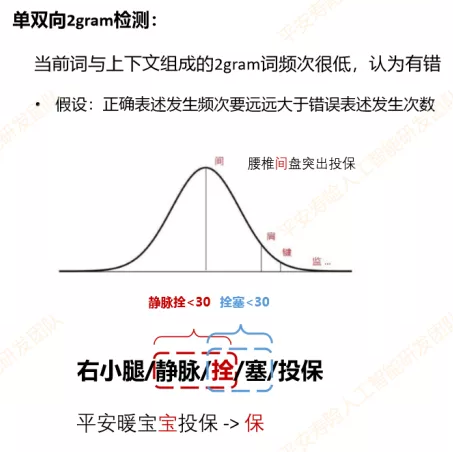
> 注：将语料中所有2gram的联合概率分布拟定为正态分布，正确2gram片段的出现概率将远大于错误出现的概率，从直观上来看这种假设也符合常理，因此可在此假设的基础上将联合概率的比值作为错误判断的依据。

###### 3.2.6.5.2 基于模型的错误检测

1. 基于 Bert的Mask Language Model

- 动机：基于 Bert的Mask Language Model
- 方法：把错误检测的过程转化成字级别的完形填空问题；在进行错误检测时对每个字所在位置进行逐一预测，如果原字的概率不在 topk 或者 与 top1 比值超过阈值则认为有误；

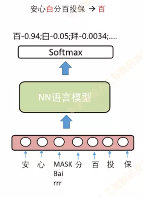

- 改进措施：

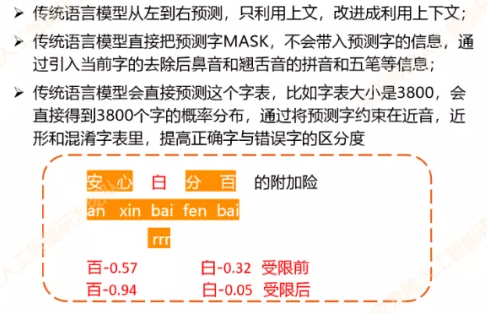

2. 基于 word2vec-cbow 改进的音字混合错误检测算法
   
- 方法：
  - 第一、传统语言在预测当前位置时候是不会带入当前字的先验信息，但是在我们的场景中，因为正确字可能为错误字的近音、近形词，所以我们**加入了待预测字的拼音和五笔特征**；
  - 第二、我们将字典压缩为领域内的高频字，同时对NN的输出进行受限，**在预测时输出层只计算近音、近形和混淆字所对应的神经元**，在提高正区分度的同时，增加计算效率。

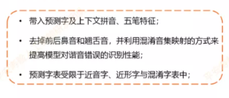

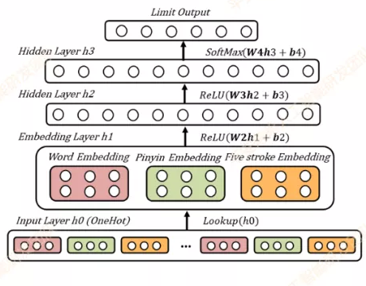

- 存在问题：
  - 受预设窗口大小的限制，这些信息均是局部信息，长距离的依赖使用该模型无法解决

2. 基于 BiLSTM 改进的音字混合错误检测算法

- 思路：
  - 第一步，利用了BiLstm，前向Lstm从左到右学习 $h_{k-1}$，后向Lstm从后到左学习 $h_{k+1}$;
  - 第二步，合并两个得到 $h_{k}$ ,得到 $h_{k}$ 先与输入的字向量 $x_{i}$ 做Attention得到 $c_{k}$;
  - 第三步，$c_{k}$与$h_{k}$拼接得到 $p_{k}$；再用$p_{k}$与候选字向量做Attention，用Attention后的分数作为预测概率分布。


3. 基于 Bert 改进的音字混合错误检测算法

- 改进方式:
  - 加入了拼音和字形特征;
  - 将训练的超参数进行调整，比如层数变成3层，embedding_size从750降到150，使用5个头，字典从原来2w变成3.8k。


##### 3.2.6.6 候选召回

- 基于语言模型召回：从 语言模型预测输出 topk 中 获取正确的候选词
- 基于混淆词典召回：利用 混淆词典 召回正确候选词：
  - 混淆词典：基于近音、近型、编辑距离的1、2gram混淆词典
  - 优化方案：
    - 为了提高字典的索引效率及搜索时间，将1gram词及词频和1gram近音词词典使用双数组字典树存储，而2gram词典采用CSR数据结构存储，同时2gram的近音混淆词可以从以上词典里恢复出来。
    - 为了进行编辑距离召回候选词，建立了分层倒排索引词典从而提高搜索效率。

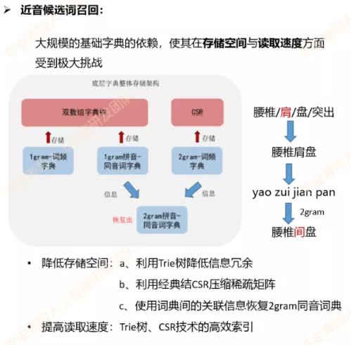

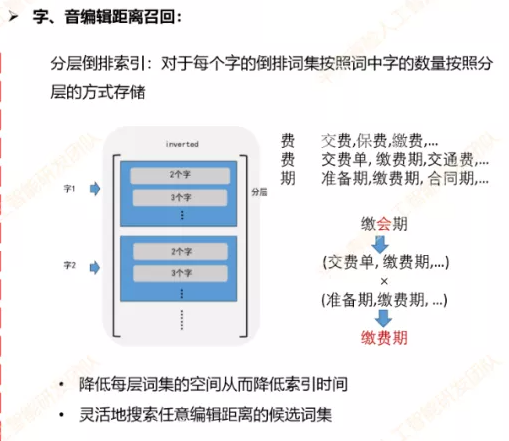

- 高频的混淆词挖掘
  - 方法一：首先采用**新词挖掘算法挖掘语料中的新词**，从而得到正确的种子词，再**通过拼音编辑距离得到语料中与种子词拼音相近的错误词**，从而通过人工标注得到高质量的高频混淆词典；
  - 方法二：**通过ICD10等标准的疾病词典与挖掘到的新词进行匹配**，可以得到新词中与疾病相关的口语词，再根据疾病口语词挖掘与疾病相关的混淆词典。

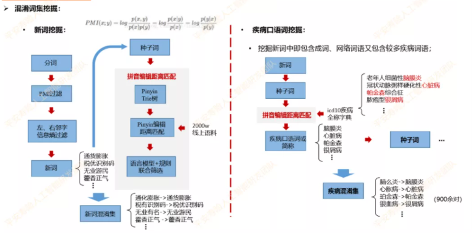

##### 3.2.6.7 候选排序 

- 动机：**候选召回** 会召回 TopN 个候选词，但是答案唯一，所以需要对 召回的候选词 进行打分排序，并将得分最高的作为最终的答案替换；
- 方法：

1. 粗排：**利用 逻辑回归模型 做粗排**。人工抽取的特征主要包括：频率比值、编辑距离、拼音jaccard距离、Ngram统计语言模型分数差值等。

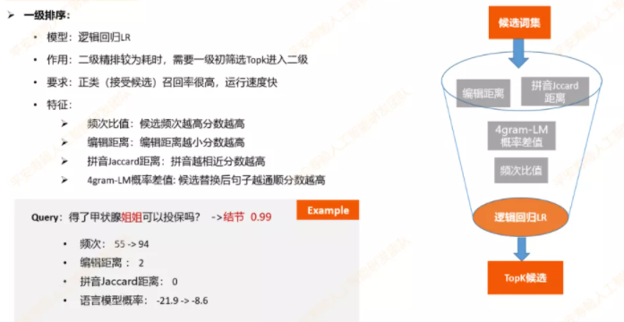

1. 精排：**采用Xgboost模型对候选进行打分**，同时在特征工程方面我们也进行了更精细化地处理。候选特征:
   1. 局部特征：分词变化、频次变化、形音变化、PMI互信息变化、Ngram语言模型分数变化以及一些其他的基础特征;
   2. 全部特征: CBOW-LM、LSTM-Attention LM、BERT LM;

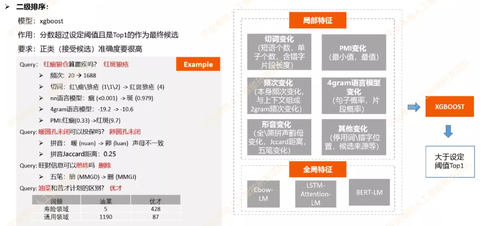

##### 3.2.6.8 实现路径 

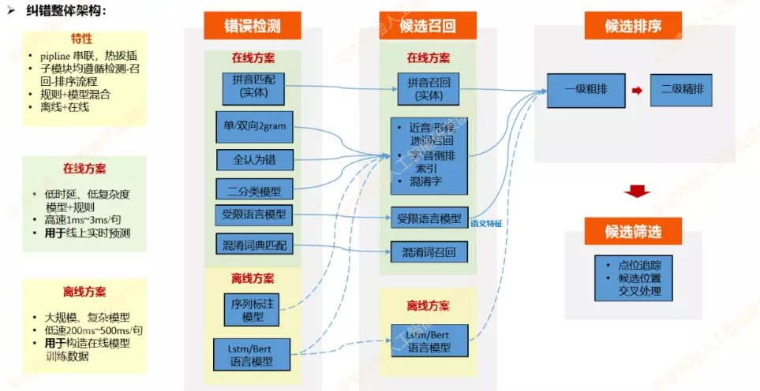

#### 3.2.7 [丁香园 纠错](https://zhuanlan.zhihu.com/p/146749345) 【Query 纠错】

##### 3.2.7.1 动机

- 垂直领域搜索问题：用户输入 query 存在错误；（常见的错误：由于输入法带来的拼音错误、形近字，用户习惯带来的谐音错误，内容缺失和内容中有多余字符的错误。）
- 论文方法落地问题：解决形近字和谐音这种同等长度的问题，但是像拼音和内容补全删除问题就不太好办了。而且还有一个问题，纠错文本的标注成本较高，而且做垂直领域纠错最好用该领域文本的标注数据效果最好。

##### 3.2.7.2 文本纠错流程

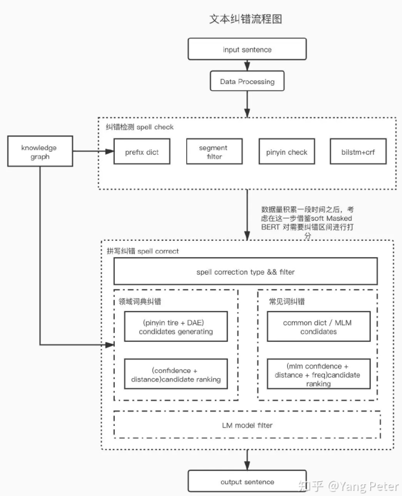

##### 3.2.7.3 文本预处理

需要对用户输入做预处理：

1. 对长句子按照符号进行切分；
2. 实体链接获取词性和实体关系等信息。对所有的mention进行提取。

##### 3.2.7.4 拼写检测

从字词两方面检测拼写错误

- prefix dict根据已有知识图谱中的实体信息构建的前缀字典树，尽可能的获取各mention的前缀信息。
- segment filter 用于标注不需要纠错的部分靠谱的实体词/和停用词等。
- pinyin check 检测输入是否是拼音，或者是否是实体的拼音缩写，并且正确的对拼音进行分割。
- bilstm+crf 根据用户搜索行为构建了一批需纠错数据集，对需纠错部分进行标注，根据bilstm+crf结果进行比对获取错误类型和可能需纠错文本。

##### 3.2.7.5 拼写纠错

- 领域词纠错：在医疗垂直领域，依赖领域内知识，根据之前构建的知识图谱中的实体构建前缀字典树，并根据搜索日志构建常见的confusion set，并且基于DAE对需纠错词进行向量表示，其中用到了字型，拼音，上下文语义等特征作为输入层，中间隐藏层作为向量表示，根据embedding simility生成候选集合，再根据embedding cosine distance和edit distance进行联合打分进行排序过滤。


> 前缀树召回候选集

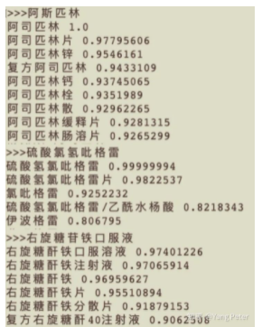
> DAE召回候选集

- 常用词字粒度的纠错：借鉴了上述很多方法进行融合，基于BERT fine-tune MLM生成候选，再根据common dict构建n-gram模型根据字的confusion set生成候选。最后将生成的候选集与原句子中的mention进行替换，与原句子的language model的preplexity再一次的比较。


## 四、难点及优化方向

### 4.1 数据优化

- 资源建设：混淆集资源（形似，音似，其他易错），词典资源（实体，POI等） 。
- 数据增强：如何模拟各个场景中人类易产生的语法错误，增强的数据如何使用 Pretrain+Finetune？
- 数据噪声：无论是人工标注还是自动增强都会引入大量的噪声，对后续模型训练造成困扰。那么标注数据噪声及漏标注数据的处理也会很关键 [33]。

### 4.2 模型和架构优化

#### 4.2.1. 资源的利用：

- 对于实体词的纠正如何融入到模型中。
- 模型对新词新表达方式容易误判，数据更新需要重新训练，如何进行可持续性优化。

#### 4.2.2. Tag式序列标注：

- tag 训练数据的处理会比较繁杂，预处理、后处理的细节非常多。
- tag 的定义需要精细化，如何让 tag 包括大部分情况。
- tag 标签集合太小，泛化性不够，集合太大的话预测空间很大。

#### 4.2.3. 生成模型：

- 生成模型的不可控，难解释。
- 对训练数据的量级需求大。
- Copy 很多，影响效率。解码阶段的推理速度慢。

#### 4.2.4. Pipeline方法：

- 不同阶段的错误会逐级传递。
- 每个模型单独学习，模型之间知识无法共享。
- 混淆集之外的非字形、拼音相似纠正处理的不太好。

#### 4.2.5. 语言模型效率优化

- 很多方案中都使用了语言模型的 ppl 作为特征，那么传统的语言模型最多到 5-gram 就会到了计算的极限，而纠错通常也需要长距离的语义信息。另一方面基于 BERT 的 MLM 式语言模型在速度上会比较慢，计算 ppl 的 inference 阶段只能每次 mask 一个字，预测每个位置概率，增加了 n-1 倍复杂度，严重影响效率。那么如何优化语言模型的效率也是重点[34, 35]。


## 中文文本纠错开源项目整理

### [pycorrector](https://github.com/shibing624/pycorrector)

- github地址：https://github.com/shibing624/pycorrector
- 采用的方案

1. 基于规则（第一步是错误检测，第二步是错误纠正）
   1. 错误检测部分。先通过结巴中文分词器切词，由于句子中含有错别字，所以切词结果往往会有切分错误的情况，这样从字粒度和词粒度两方面检测错误， 整合这两种粒度的疑似错误结果，形成疑似错误位置候选集；
   2. 错误纠正部分。是遍历所有的疑似错误位置，并使用音似、形似词典替换错误位置的词，然后通过语言模型计算句子困惑度，对所有候选集结果比较并排序，得到最优纠正词
2. 基于深度模型
   1. 优点：端到端的深度模型可以避免人工提取特征，减少人工工作量，RNN序列模型对文本任务拟合能力强，rnn_attention在英文文本纠错比赛中取得第一名成绩，证明应用效果不错；
   2. CRF作用。计算全局最优输出节点的条件概率，对句子中特定错误类型的检测，会根据整句话判定该错误，阿里参赛2016中文语法纠错任务并取得第一名，证明应用效果不错；
   3. seq2seq模型。使用encoder-decoder结构解决序列转换问题，目前在序列转换任务中（如机器翻译、对话生成、文本摘要、图像描述）使用最广泛、效果最好的模型之一。
   4. 常用方法：
      1. kenlm：kenlm统计语言模型工具
      2. rnn_lm：TensorFlow、PaddlePaddle均有实现栈式双向LSTM的语言模型
      3. rnn_attention模型：参考Stanford University的nlc模型，该模型是参加2014英文文本纠错比赛并取得第一名的方法
      4. rnn_crf模型：参考阿里巴巴2016参赛中文语法纠错比赛并取得第一名的方法
      5. seq2seq模型：使用序列模型解决文本纠错任务，文本语法纠错任务中常用模型之一
      6. seq2seq_attention模型：在seq2seq模型加上attention机制，对于长文本效果更好，模型更容易收敛，但容易过拟合
      7. transformer模型：全attention的结构代替了lstm用于解决sequence to sequence问题，语义特征提取效果更好
      8. bert模型：中文fine-tuned模型，使用MASK特征纠正错字

- 可扩展性：词典可扩展，可使用自己的语料进行训练，该repo使用的是人民日报数据。扩展性强。

### [correction](https://github.com/ccheng16/correction)

- github地址：https://github.com/ccheng16/correction
- 大致思路：

1. 使用语言模型计算句子或序列的合理性
2. bigram, trigram, 4-gram 结合，并对每个字的分数求平均以平滑每个字的得分
3. 根据Median Absolute Deviation算出outlier分数，并结合jieba分词结果确定需要修改的范围
4. 根据形近字、音近字构成的混淆集合列出候选字，并对需要修改的范围逐字改正
5. 句子中的错误会使分词结果更加细碎，结合替换字之后的分词结果确定需要改正的字
6. 探测句末语气词，如有错误直接改正

### [Cn_Speck_Checker](https://github.com/PengheLiu/Cn_Speck_Checker)

- github地址：https://github.com/PengheLiu/Cn_Speck_Checker
- 程序原理：

1. 使用了贝叶斯定理
2. 初始化所有潜在中文词的先验概率，将文本集（50篇医学文章）分词后，统计各个中文词的出现频率即为其先验概率
3. 当给定一待纠错单词时，需要找出可能的正确单词列表，这里根据字符距离来找出可能的正确单词列表
4. 对构造出来的单词做了一次验证后再将其加入候选集合中，即判断了下该词是否为有效单词，根据其是否在单词模型中

### [chinese_correct_wsd](https://github.com/taozhijiang/chinese_correct_wsd)

- github地址：https://github.com/taozhijiang/chinese_correct_wsd
- 方法：

1. 用于用户输入语句的同音自动纠错
2. 使用到了同义词词林

### [Autochecker4Chinese](https://github.com/beyondacm/Autochecker4Chinese)

- github地址：https://github.com/beyondacm/Autochecker4Chinese
- 方法：

1. 构造一个词典来检测中文短语的拼写错误，key是中文短语，值是在语料库中的频率
2. 对于该字典中未出现的任何短语，检测器会将其检测为拼写错误的短语
3. 使用编辑距离为错误拼写的短语制作正确的候选列表
4. 对于给定的句子，使用jieba做分割
5. 在分段完成后获取分段列表，检查其中是否存在保留短语，如果不存在，那么它是拼写错误的短语

### [xmnlp](https://github.com/SeanLee97/xmnlp)

- GitHub地址：https://github.com/SeanLee97/xmnlp
- 功能概览：

1. 中文分词 & 词性标注
   1. 支持繁體
   2. 支持自定义词典
2. 中文拼写检查
3. 文本摘要 & 关键词提取
4. 情感分析
5. 文本转拼音
6. 获取汉字偏旁部首

## [中文纠错数据集与训练](https://github.com/li-aolong/li-aolong.github.io/issues/18)

### [NLPCC 2018 GEC](http://tcci.ccf.org.cn/conference/2018/taskdata.php%EF%BC%89%E6%9D%A5%E8%87%AA%E4%BA%8E)

- NLPCC 2018 GEC 训练集（http://tcci.ccf.org.cn/conference/2018/taskdata.php）来自于 NLPCC 2018 GEC 共享任务测评，官方数据的原始格式为：

1. 每行是对一个原始输入的校对，每行可能包含0个（即原始输入为正确句子）、1 个或多个平行句子对
2. 各行包括 4 个字段，各字段间用制表符（tab）分隔

- 样例：

```s
1	1	我在家里一个人学习中文。	我在家里自学中文。
2	0	我是里阿德，来自以色列。
1	3	这个软件让我们什么有趣的事都记录。	这个软件讓我们能把任何有趣的事都记录下來。	这个软件能让我们把有趣的事都记录下来。	这个软件能让我们把任何有趣的事都记录。
1	1	两位易知基金代表访白目的为连接两国高等院校。	两位易知基金代表访白目的为开展两国高等院校的合作。
```

- 各字段含义：

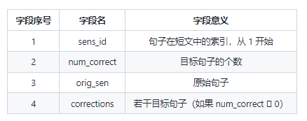

### [lang8](https://lang-8.com/)

- 目前中英文公开的最大规模平行校对语料（中文的 NLPCC 2018 GEC 数据集， 英文的 Lang-8 语料）都源自于 Lang-8 网站（https://lang-8.com/）
- Lang-8 是一个多 语言学习平台，由原生语言人士（native speakers）挑选学习者写的短文（作文）进行修 改
- 当前公开的较大规模平行语料都以类似众包的形式得到，数据质量并不高

### [汉语水平考试(HSK)](https://github.com/blcu-nlp/NLPCC_2018_TASK2_GEC)

- HSK（汉语水平考试的拼音缩写）语料来自北京语言大学（BLCU）的“HSK动态作文语料库”
- “HSK动态作文语料库”是母语非汉语的外国人参加高等汉语水平考试作文考试的答卷语料库，收集了 1992-2005 年的部分外国考生的作文答卷。语料库 1.0 版收入语料 10740 篇，约 400 万字
- 本次使用的 HSK 平行数据来自 NLPCC 2018 GEC 共享任务 BLCU 团队 github 上开源的项目（https://github.com/blcu-nlp/NLPCC_2018_TASK2_GEC），该平行语料质量较高，且已经预处理完毕，共计有 156870 个平行句子对

### seq2seq_attention模型

- 将以上的数据集进行混合并进行处理，得到了训练集共1347639个平行句子对，测试集5017对
- 将最终的混合数据集输入到开源项目pycorrector的seq2seq_attention模型中进行训练
- 共跑40个epoch，1个epoch大约需要25分钟，目前还在跑

### [维基百科中文语料](https://dumps.wikimedia.xn--org%29-894fk085a/)

- 可以从维基 dump 网站（https://dumps.wikimedia.org）下载 XML 格式的中文维基百科语料（https://dumps.wikimedia.org/zhwiki/latest/zhwiki-latest-pages-articles.xml.bz2），得到1.65G的压缩包
- XML 文件中的 text 标签内部即为文章内容，由于维基百科语料属于网络文本，需要对其进行必要的处理与清洗
- 该语料可供后续使用


## 参考

- [1] Denoising based Sequence-to-Sequence Pre-training for Text Generation. EMNLP 2019.
- [2] Corpora Generation for Grammatical Error Correction. NAACL 2019 Google
- [3] Improving Grammatical Error Correction with Data Augmentation by Editing Latent Representation COLING 2020
- [4] Fluency Boost Learning and Inference for Neural Grammatical Error Correction. ACL 2018
- [5] Improving Grammatical Error Correction with Machine Translation Pairs EMNLP2020
- [6] An Empirical Study of Incorporating Pseudo Data into Grammatical Error Correction EMNLP 2019
- [7] Improving Grammatical Error Correction Models with Purpose-Built Adversarial Examples ENNLP 2020
- [8] Encode, Tag, Realize: High-Precision Text Editing. EMNLP 2019.
- [9] Parallel Iterative Edit Models for Local Sequence Transduction EMNLP 2019
- [10] GECToR – Grammatical Error Correction: Tag, Not Rewrite. ACL 2020 workshop
- [11] Improving Grammatical Error Correction via Pre-Training a Copy-Augmented Architecture with Unlabeled Data. NAACL 2019.
- [12] Encoder-Decoder Models Can Benefit from Pre-trained Masked Language Models in Grammatical Error Correction. ACL2020
- [13] Improving the Efficiency of Grammatical Error Correction with Erroneous Span Detection and Correction EMNLP2020
- [14] Generating Diverse Corrections with Local Beam Search for Grammatical Error CorrectionCOLING2020
- [15] A Self-Refinement Strategy for Noise Reduction in Grammatical Error Correction EMNLP 2020
- [16] MaskGEC: Improving Neural Grammatical Error Correction via Dynamic Masking. AAAI-2020
- [17] Wronging a Right: Generating Better Errors to Improve Grammatical Error Detection EMNLP2020
- [18] Adversarial Grammatical Error Correction EMNLP2020
- [19] Heterogeneous Recycle Generation for Chinese Grammatical Error Correction COLING 2020
- [20] PLOME: Pre-training with Misspelled Knowledge for Chinese Spelling Correction ACL2021
- [21] PHMOSpell: Phonological and Morphological Knowledge Guided Chinese Spelling Check ACL2021
- [22] Exploration and Exploitation: Two Ways to Improve Chinese Spelling Correction Models ACL 2021
- [23] Read, Listen, and See: Leveraging Multimodal Information Helps Chinese Spell Checking ACL 2021
- [24] Global Attention Decoder for Chinese Spelling Error Correction ACL 2021
- [25] Correcting Chinese Spelling Errors with Phonetic Pre-training ACL2021
- [26] ChineseBERT: Chinese Pretraining Enhanced by Glyph and Pinyin Information ACL2021
- [27] Dynamic Connected Networks for Chinese Spelling Check ACL 2021
- [28] Instantaneous Grammatical Error Correction with Shallow Aggressive Decoding ACL 2021
- [29] Tail-to-Tail Non-Autoregressive Sequence Prediction for Chinese Grammatical Error Correction ACL 2021
- [30] Do Grammatical Error Correction Models Realize Grammatical Generalization? ACL 2021
- [31] Grammatical Error Correction as GAN-like Sequence LabelingACL 2021
- [32] A Hybrid Model for Chinese Spelling Check
- [33] Empirical Analysis of Unlabeled Entity Problem in Named Entity Recognition ICLR2021
- [34] Fast and Accurate Deep Bidirectional Language Representations for Unsupervised Learning ACL 2020
- [35] Levenshtein Transformer NIPS 2019
- [文本语法纠错不完全调研：学术界 v.s. 工业界最新研究进展](https://zhuanlan.zhihu.com/p/398928434)
- [中文文本纠错算法--错别字纠正的二三事](https://zhuanlan.zhihu.com/p/40806718)
- [医疗健康领域的短文本纠错](https://zhuanlan.zhihu.com/p/146749345)
- [垂域文本纠错和通用文本纠错](https://zhuanlan.zhihu.com/p/396545158)
- [百度中文纠错技术](https://www.ruilog.com/notebook/view/286fb6a3d873.html)
- [平安寿险 AI 团队 | 文本纠错技术探索和实践](https://www.6aiq.com/article/1594474039153)
- [7.25——中文文本纠错开源项目整理](https://github.com/li-aolong/li-aolong.github.io/issues/12)
- [开源项目pycorrector分析](https://github.com/li-aolong/li-aolong.github.io/issues/13)
- [滴滴asr纠错](https://mp.weixin.qq.com/s?__biz=MzU1ODEzNjI2NA==&mid=2247517316&idx=1&sn=06a1d823c48732d18bd7b2d28387098d&scene=21#wechat_redirect)
- [AI LIVE | 文本纠错技术探索和实践](https://mp.weixin.qq.com/s?__biz=MzU2MDkwMzEzNQ==&mid=2247485798&idx=2&sn=122b00674bfb7033d8b6875f1d6a9360&scene=21#wechat_redirect)


