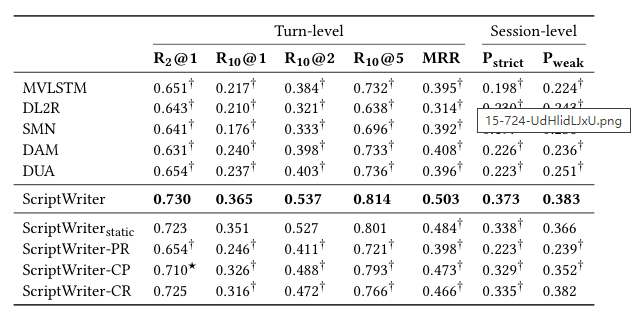
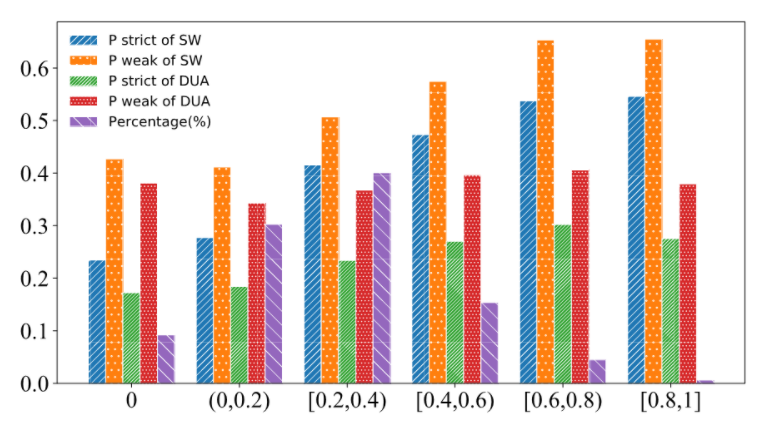

# 【关于 ScriptWriter 】 那些的你不知道的事

> 作者：杨夕
> 
> 项目地址：https://github.com/km1994/nlp_paper_study
> 
> NLP 面经地址：https://github.com/km1994/NLP-Interview-Notes
> 
> 个人介绍：大佬们好，我叫杨夕，该项目主要是本人在研读顶会论文和复现经典论文过程中，所见、所思、所想、所闻，可能存在一些理解错误，希望大佬们多多指正。
> 
> 论文：ScriptWriter: Narrative-Guided Script Generation
> 
> 发表会议：ACL2020
> 
> 论文地址：https://arxiv.org/abs/2005.10331
> 
> github：https://github.com/DaoD/ScriptWriter

## 一、论文摘要

- 动机：有一个从故事情节自动生成故事或脚本的系统是很有吸引力的，尽管这仍然是我们力所能及的。在对话系统中，通过对话计划推动对话也是有益的。
- 论文方法：在本文中，我们讨论了这些应用程序中涉及的一个关键问题——通过叙述引导对话。提出的模式编剧选择最佳的回应候选人中，符合上下文以及给定的叙述。它记录了叙述中已经说过的话和将要说的话。叙事与语境（即先前的话语）起着不同的作用，语境通常在当前的对话系统中使用。
- 实验结果：由于这个新应用程序的数据不可用，我们从一个电影网站构建了一个新的大规模数据收集GraphMovie，最终用户可以在观看电影时自由上传他们的叙述。在数据集上的实验结果表明，我们提出的基于叙述的方法明显优于单纯将叙述作为一种语境的基线方法。

## 二、论文背景

- 情节通常可以被理解为叙述一个故事的方式，其在自然语言处理特别是文本生成中发挥了很大的作用。比如在故事生成中，故事线就是一种情节，其能够帮助模型生成更连贯且一致的故事。在对话生成中，整个对话的目标也可以看作是一种情节，其可以帮助模型避免生成不一致或无关的回复。
- 文本生成是自然语言处理领域的难题之一，随着深度学习技术的不断发展，特别是预训练语言模型的出现，文本生成的质量得到了很大提高。但是，较长文本的生成仍然存在着很多问题，比如前后逻辑不一致等等。

## 三、动机

- 如果人为提供一些参考信息（例如情节），能否进一步提高文本生成的质量？例如，在故事生成这一问题中，现有模型要从头考虑如何生成一整个故事，难度比较大，那如果人为提供一个故事线，是否可以提升模型的性能呢？

## 四、论文方法

- ScriptWriter模型：根据给定的情节和已有的台词上文生成后续台词。在这一模型中，我们设计了一个情节追踪模块，这一模块可以使模型根据已有的上文内容判断情节的表达情况，并在后续生成中更加关注未表达的情节。实验结果表明，情节的确可以帮助模型提高台词的生成质量，且相比于其他模型，ScriptWriter能够更有效地利用情节信息。

## 五、数据集介绍

可以看到整段台词与给定情节是对应的，且台词本身是连贯的。类似于对话生成，台词生成的任务也可以采用生成式或检索式两种方法来解决。我们采用的是检索式的方法，因为已有研究表明检索式方法能够产生更加相关且语法正确的句子，此外，检索式方法的标准也更加明确。当然，我们的数据集也支持生成式任务，我们将其作为未来的进一步探索。

> 图1: 图解电影数据集中的一个样例

## 六、ScriptWriter模型

### 6.1 ScriptWriter 框架

- 采用了“表示-匹配-聚合”框架。

### 6.2 ScriptWriter 思路

1. 多层注意力机制：将情节、上文、候选回复表示为向量。
2. 情节更新机制：使情节的表示包含更多未表达部分的情节信息。
3. 抽取了三类匹配特征：
   1. （1）上文-回复匹配，其能够反映回复是否与上文连贯；
   2. （2）情节-回复匹配，其能够反映回复是否与情节相符；
   3. （3）上文-情节匹配，其能够隐式反映哪些情节已经被上文表达。
4. 最后，这些匹配特征经过CNN的进一步抽取和聚集，再经过MLP得到最终的匹配得分。

## 七、实验结果

### 7.1 实验结果

ScriptWriter比现有模型好很多，侧面反映了我们对情节的使用是更加有效的。其中DAM、DUA和我们的模型都使用了注意力机制对句子建模，其也都好于不使用注意力机制的模型。其次，我们发现从Pstrict到 Pweak，我们的模型性能下降较少，这说明我们的模型不仅可以选出正确的回复，还可以更好地将回复放在正确的位置。

> 实验结果

表格的后四行是消融实验的结果，其中第一个变种模型没有使用情节表示更新机制，可以看到其性能下降了，这说明我们提出的情节表示更新机制是有效的。后三行分别是取消了一种匹配进行的实验。根据结果，我们发现情节-候选回复匹配影响最大，说明情节对回复选择起到了至关重要的作用。另外两种匹配也都发挥了作用，值得注意的是，情节-台词上文匹配对选择正确的回复位置非常重要。

### 7.2 探究不同类型情节对模型的影响

由于数据集中的情节来自于网友撰写，可能存在直接摘抄台词内容的情况。为了对此进行探究，我们统计了情节与台词的词共现率，并据此将数据分为6组，其中0表示情节与台词没有任何词共现，这也是最难的一种情况，可以看到所有的模型效果都很差。而随着词共现率的上升，模型的性能也得到了提高。此外，我们发现词共现率在[0.2, 0.4)的样本最多，说明我们的任务并不简单。

> 不同类型情节的结果

## 参考资料

1. [ACL 2020 | ScriptWriter: 基于给定情节的电影台词生成](https://www.aminer.cn/research_report/5f1a7ec621d8d82f52e5a709)
2. [github：ScriptWriter: Narrative-Guided Script Generation](https://github.com/DaoD/ScriptWriter)