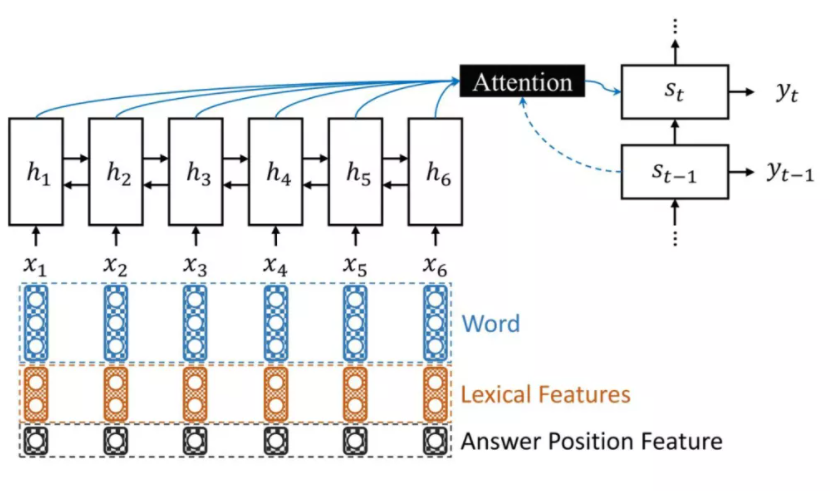

# 【关于 问题生成（Question Generation）】 那些你不知道的事

> 作者：杨夕
> 
> NLP论文学习笔记：https://github.com/km1994/nlp_paper_study
> 
> **[手机版NLP论文学习笔记](https://mp.weixin.qq.com/s?__biz=MzAxMTU5Njg4NQ==&mid=100005719&idx=1&sn=14d34d70a7e7cbf9700f804cca5be2d0&chksm=1bbff26d2cc87b7b9d2ed12c8d280cd737e270cd82c8850f7ca2ee44ec8883873ff5e9904e7e&scene=18#wechat_redirect)**
> 
> 个人介绍：大佬们好，我叫杨夕，该项目主要是本人在研读顶会论文和复现经典论文过程中，所见、所思、所想、所闻，可能存在一些理解错误，希望大佬们多多指正。
> 
> NLP 百面百搭 地址：https://github.com/km1994/NLP-Interview-Notes
> 
> **[手机版NLP百面百搭](https://mp.weixin.qq.com/s?__biz=MzAxMTU5Njg4NQ==&mid=100005719&idx=3&sn=5d8e62993e5ecd4582703684c0d12e44&chksm=1bbff26d2cc87b7bf2504a8a4cafc60919d722b6e9acbcee81a626924d80f53a49301df9bd97&scene=18#wechat_redirect)**
> 
> 推荐系统 百面百搭 地址：https://github.com/km1994/RES-Interview-Notes
> 
> **[手机版推荐系统百面百搭](https://mp.weixin.qq.com/s/b_KBT6rUw09cLGRHV_EUtw)**

> **关注公众号 【关于NLP那些你不知道的事】 加入 【NLP && 推荐学习群】一起学习！！！**

> 注：github 网页版 看起来不舒服，可以看 **[手机版NLP论文学习笔记](https://mp.weixin.qq.com/s?__biz=MzAxMTU5Njg4NQ==&mid=100005719&idx=1&sn=14d34d70a7e7cbf9700f804cca5be2d0&chksm=1bbff26d2cc87b7b9d2ed12c8d280cd737e270cd82c8850f7ca2ee44ec8883873ff5e9904e7e&scene=18#wechat_redirect)**

## 一、什么是 问题生成（Question Generation）？

作为文本生成中的重要子任务，问题生成（Question Generation） 旨在根据输入文本数据生成与输入相关且自然流畅的问题。

## 二、问题生成（Question Generation）起源？

- 基于规则和模板的问题生成方法：
  - 介绍：该方法主要 **根据专家知识人工设计的规则和模版将陈述句转换为疑问句**
  - 存在问题：需要消耗大量人力且依赖于深层的语法知识，泛化性能和可扩展能力较差
- 基于深度学习的问题生成方法：
  - Learning to Ask: Neural Question Generation for Reading Comprehension （ACL 2017）将端到端训练的神经网络应用于问题生成，采用 seq2seq+attention 模型架构，摆脱了转换规则与模版的局限，取得了相比于传统方法更好的性能；
  - Neural question generation from text: A preliminary study（EMNLP 2017）：将神经网络应用于 QG ，在编码时额外考虑了答案位置与语法信息，取得了更好的性能。

## 三、问题生成（Question Generation）改进方案？

### 3.1 答案编码

- 介绍：将答案作为输入来指导模型生成问题时更关注答案以提升模型性能，常用方法包括将答案位置作为输入特征或使用额外的编码器对答案编码。
- 代表论文：
  - Answer-focused and Position-aware Neural Question Generation.EMNLP, 2018
  - Improving Neural Question Generation Using Answer Separation.AAAI, 2019.
  - Answer-driven Deep Question Generation based on Reinforcement Learning.COLING, 2020.

### 3.2 语言特征

- 介绍：将额外的语言特征与词向量拼接作为输入来提升 QG，例如 word case、POS 和 NER 标签等。
- 代表论文：
  - Automatic Question Generation using Relative Pronouns and Adverbs.ACL, 2018.
  - Learning to Generate Questions by Learning What not to Generate.WWW, 2019.

### 3.3 问题类型建模

- 介绍：通过对问题类型或疑问词的显式建模来改善生成问题疑问词预测不准确的问题。
- 代表论文：
  - Question Generation for Question Answering.EMNLP,2017.
  - Answer-focused and Position-aware Neural Question Generation.EMNLP, 2018.
  - Question-type Driven Question Generation.EMNLP, 2019.

### 3.4 段落级别上下文

- 介绍：利用输入文本周围的相关上下文增加输入信息来提升问题生成效果。
- 代表论文：
  - Harvesting paragraph-level question-answer pairs from wikipedia.ACL, 2018.
  - Leveraging Context Information for Natural Question Generation.ACL, 2018.
  - Paragraph-level Neural Question Generation with Maxout Pointer and Gated Self-attention Networks.EMNLP, 2018.
  - Capturing Greater Context for Question Generation.AAAI, 2020.

### 3.5 内容选择

- 方式一：当答案信息不提供给模型时，给定输入段落，QG 系统需自动识别段落中值得提问的部分再生成问题。
- 代表论文：
  - Identifying Where to Focus in Reading Comprehension for Neural Question Generation.EMNLP, 2017.
  - Neural Models for Key Phrase Extraction and Question Generation.ACL Workshop, 2018.
  - A Multi-Agent Communication Framework for Question-Worthy Phrase Extraction and Question Generation.AAAI, 2019.
- 方式二：答案已知时，识别与答案相关的内容也有利于提升生成问题的效果。
- 代表论文：
  - Improving Question Generation With to the Point Context.EMNLP, 2019.

## 参考

- [浅谈问题生成（Question Generation）](https://mp.weixin.qq.com/s?__biz=MzIwMTc4ODE0Mw==&mid=2247550906&idx=2&sn=85a217498977d448516c8ca37e9f3af6&chksm=96ead83aa19d512c412594f4dd08dba751be2c703a4b234a3e841065eb82410b182e21b02dc0&mpshare=1&scene=22&srcid=121239reonfr3r29670e9kBX&sharer_sharetime=1639263770368&sharer_shareid=da84f0d2d31380d783922b9e26cacfe2#rd)