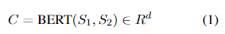
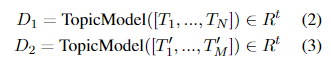
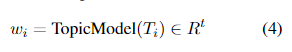
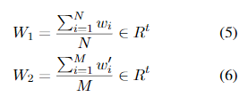
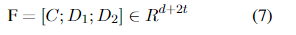
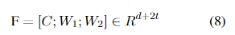
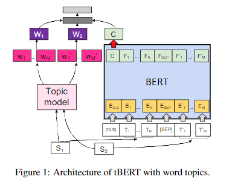
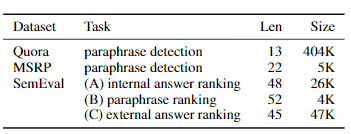
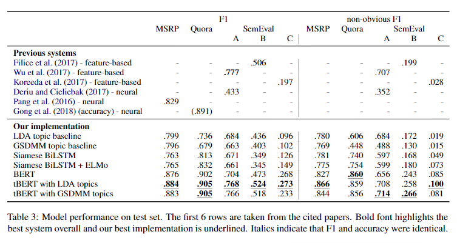

# 【关于 tBERT 】那些你不知道的事 

> 作者：杨夕
> 
> 项目地址：https://github.com/km1994/nlp_paper_study
> 
> 个人介绍：大佬们好，我叫杨夕，该项目主要是本人在研读顶会论文和复现经典论文过程中，所见、所思、所想、所闻，可能存在一些理解错误，希望大佬们多多指正。
> 
> 论文：tBERT: Topic Models and BERT Joining Forces for Semantic Similarity Detection
> 
> 会议：ACL2020
> 
> 论文地址：https://www.aclweb.org/anthology/2020.acl-main.630/
> 
> 论文代码：https://github.com/wuningxi/tBERT

## 目录

- [【关于 tBERT 】那些你不知道的事](#关于-tbert-那些你不知道的事)
  - [目录](#目录)
  - [前言](#前言)
  - [动机](#动机)
  - [方法提出](#方法提出)
  - [贡献](#贡献)
  - [方法介绍](#方法介绍)
  - [数据集选取](#数据集选取)
  - [实验结果](#实验结果)
  - [结论](#结论)
  - [参考](#参考)

## 前言

- 动机：未存在将主题模型和BERT结合的方法。 语义相似度检测是自然语言的一项基本任务理解。添加主题信息对于以前的特征工程语义相似性模型和神经网络模型都是有用的其他任务。在那里目前还没有标准的方法将主题与预先训练的内容表示结合起来比如 BERT。

- 方法：我们提出了一种新颖的基于主题的基于BERT的语义相似度检测体系结构，并证明了我们的模型在不同的英语语言数据集上的性能优于强神经基线。我们发现在BERT中添加主题特别有助于解决特定领域的情况。

## 动机

- Bert 等预训练模型的提出；
- Com-munity Question Answering (CQA) ：CQA利用用户从问答网站（例如StackExchange）生成的内容来回答复杂的现实世界问题（Nakov等人，2017年）。这项任务需要对问题-答案对之间的关系进行建模，由于某些在线论坛的高领域特定语言和问题与答案之间的直接文本重叠程度较低，这可能具有挑战性；
- 主题模型可以为语义相似性提供额外的信号。因为早期的语义相似性检测的特征工程模型完全融合了主题（Qin等人，2009年；Tran等人，2015年；Mihaylov和Nakov，2016年；Wu等人，2017年）。由于主题模型被用于域适应，因此它们对于处理特定于领域的语言特别有用（Huet al.，2014；Guo et al.，2009）。此外，最近关于神经结构的研究表明，主题的整合可以在语言建模（Ghosh et al.，2016）、机器翻译（Chen et al.，2016）和文本摘要（Narayan et al.，2018；Wang et al.，2018）等其他任务中产生改进。

## 方法提出

- 我们提出了一种新的语义相似性检测体系结构，它结合了主题模型和BERT。

## 贡献

- 我们提出了一个简单的体系结构tBERT，结合主题和BERT进行语义相似性预测；
- 我们证明了tBERT在多个语义相似性预测数据集上，相对于一个经过微调的vanillaBERT和其他神经模型，无论是F1还是更严格的评估指标，tBERT都实现了改进；
- 在我们的错误分析中，我们发现tBERT的优点在特定领域的情况下非常突出，比如在CQA中遇到的那些情况

## 方法介绍

- 动机： if topic models canfurther improve BERT’s performance for semanticsimilarity detection. 
- 思路：
1. 利用 Bert 编码句子 S1 和 句子 S2;
2. 使用 [CLS] 特征作为 输入句子对的表示向量，表示为 C；

> 注：Bert 768的隐藏基数

3. 对于文档主题 D1和 D2，将一个句子中的所有 token 输入到主题模型，以推断每个句子的一个主题分布【注：这里采用 LDA 和 GSDMM】：

> 其中t表示主题数。

4. 对于单词主题W1和W2，每个 Token Ti推断一个主题分布wi:

5. 在求平均值以获得句子水平上的固定长度 topic representation之前:

6. 我们将句子对向量与类似于 （Os tendorff et al.（2019）） 的内容级主题表示相结合
 

7. for document topics and as

8. 对于单词主题（其中；表示连接）。后面是隐藏层和softmax分类层。我们训练了3个具有早期停止和交叉熵损失的周期模型。学习率根据数据集和随机种子进行调整

## 数据集选取

- MSRP：微软研究所的释义数据集（MSRP）包含新闻网站的成对句子，这些句子带有用于释义检测的二进制标签
- SemEval：SemEval CQA数据集（Nakovet al.，2015、2016、2017）包含三个子任务，基于online expatforumQatar Living 的帖子；每个子任务包含一个初始帖子以及10个可能有 binary labels 的相关帖子，并要求将相关帖子排在不相关帖子之前：
  - 在子任务A中，post是来自同一个 thread 的问题和评论，在答案排名场景中；
  - 子任务B是问题释义排序；
  - 子任务 C 与 A 类似，但注释是从外部 thread 中检索的，这增加了任务的难度
- Quora：Quora duplicate questions数据集包含超过40万个带有 binary labels 的问题对，是迄今为止最大的数据集。这项任务是预测两个问题是否被改写。这个设置类似于SemEvalsubtask B，但它是一个分类问题，而不是一个排名问题。我们使用Wang等人（2017）的应变/开发/测试集划分。

## 实验结果

## 结论

在这项工作中，我们提出了一个灵活的框架来结合主题模型和BERT。我们证明，在BERT中添加LDA主题可以显著提高一系列相似性预测数据集的性能。在我们的质量分析中，我们发现这些改进主要是在涉及领域特定词的例子上实现的。未来的工作将集中于如何在不破坏预先训练的信息的情况下直接将主题信息归纳到bert中，以及将主题与其他预先训练的上下文模型相结合是否可以获得类似的收益。另一个研究方向是研究在提议的框架中引入更复杂的主题模型，例如命名实体促进主题模型（Krasnash chok和Jouili，2018）是否能进一步提高结果。

## 参考

1. [文本匹配、文本相似度模型之ESIM](https://blog.csdn.net/u012526436/article/details/90380840)
2. [短文本匹配的利器-ESIM](https://zhuanlan.zhihu.com/p/47580077)