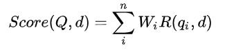
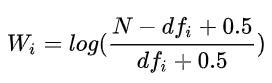
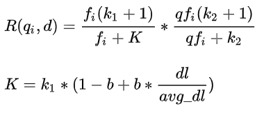

# 【关于 BM25】那些你不知道的事

> 笔者：杨夕
> 
> 项目地址：https://github.com/km1994/nlp_paper_study
> 
> 个人介绍：大佬们好，我叫杨夕，该项目主要是本人在研读顶会论文和复现经典论文过程中，所见、所思、所想、所闻，可能存在一些理解错误，希望大佬们多多指正。

## 目录

- [【关于 BM25】那些你不知道的事](#关于-bm25那些你不知道的事)
  - [目录](#目录)
  - [内容](#内容)
    - [TF-IDF 是什么？](#tf-idf-是什么)
    - [TF-idf 计算公式是什么样的？](#tf-idf-计算公式是什么样的)
    - [如何计算一个用户问题与一个标准问题的TF-IDF相似度？](#如何计算一个用户问题与一个标准问题的tf-idf相似度)
    - [BM25 是什么样的？](#bm25-是什么样的)
    - [BM25 计算公式 是 怎么样的？](#bm25-计算公式-是-怎么样的)
    - [BM25 代码 实战](#bm25-代码-实战)
    - [如何使用？](#如何使用)
  - [参考](#参考)

## 内容

### TF-IDF 是什么？

-  类型：一种统计方法
-  作用：用以评估句子中的某一个词（字）对于整个文档的重要程度；
-  重要程度的评估：
   -  对于 句子中的某一个词（字）随着其在整个句子中的出现次数的增加，其重要性也随着增加；（正比关系）【体现词在句子中频繁性】
   -  对于 句子中的某一个词（字）随着其在整个文档中的出现频率的增加，其重要性也随着减少；（反比关系）【体现词在文档中的唯一性】
- 重要思想：
  - 如果某个单词在一篇文章中出现的频率TF高，并且在其他文章中很少出现，则认为此词或者短语具有很好的类别区分能力，适合用来分类；

### TF-idf 计算公式是什么样的？

- 词频 （Term Frequency，TF）
  - 介绍：体现 词 在 句子 中出现的频率；
  - 问题：
    - 当一个句子长度的增加，句子中 每一个 出现的次数 也会随之增加，导致该值容易偏向长句子；
    - 解决方法：
      - 需要做归一化（词频除以句子总字数）
  - 公式


- 逆文本频率(Inverse Document Frequency，IDF)
  - 介绍：体现 词 在文档 中出现的频率
  - 方式：某一特定词语的IDF，可以由总句子数目除以包含该词语的句子的数目，再将得到的商取对数得到；
  - 作用：如果包含词条t的文档越少, IDF越大，则说明词条具有很好的类别区分能力
  - 公式：


- TF-IDF
    - 介绍：某一特定句子内的高词语频率，以及该词语在整个文档集合中的低文档频率，可以产生出高权重的TF-IDF。因此，TF-IDF倾向于过滤掉常见的词语，保留重要的词语。
    - 优点：
      - 容易理解；
      - 容易实现；
    - 缺点：
      - 其简单结构并没有考虑词语的语义信息，无法处理一词多义与一义多词的情况


### 如何计算一个用户问题与一个标准问题的TF-IDF相似度？

一个用户问题与一个标准问题的TF-IDF相似度，是将用户问题中每一词与标准问题计算得到的TF-IDF值求和

### BM25 是什么样的？

BM25 概念和 TF-idf 差不多，只是做了一些优化。

### BM25 计算公式 是 怎么样的？

- 公式



> 其中，Q 为用户问题，d 为“标准问”库中的一个标准问题，n 为用户问题中词的个数，qi 为用户问题中第 i 个词，Wi 为该词的权重，R(qi,d) 为该词与标准问题的相关性分数。

- 解释
  - Wi：相当于 IDF 上做改进;
  - R(qi,d)：相当于 TF 上做改进;
- 改进
  - Wi 
  - R(qi,d) 


> Wi
> N表 示“标准问”库中标准问题的总个数，dfi 表示包含词汇 qi 的标准问题的个数


> R(qi,d) 
> 其中，k1,k2 是 b 调协因子，一般分别设为2，1，0.75； fi 表示词汇qi 在标准问题中出现的次数；qfi  表示词汇 qi 在用户问题中出现的次数； dl 为标准问题的长度；avg_dl  为“标准问”库中所有标准问题的平均长度。

### BM25 代码 实战

```python
import numpy as np
from collections import Counter
class BM25_Model(object):
    def __init__(self, documents_list, k1=2, k2=1, b=0.5):
        self.documents_list = documents_list
        self.documents_number = len(documents_list)
        self.avg_documents_len = sum([len(document) for document in documents_list]) / self.documents_number
        self.f = []
        self.idf = {}
        self.k1 = k1
        self.k2 = k2
        self.b = b
        self.init()

    def init(self):
        df = {}
        for document in self.documents_list:
            temp = {}
            for word in document:
                temp[word] = temp.get(word, 0) + 1
            self.f.append(temp)
            for key in temp.keys():
                df[key] = df.get(key, 0) + 1
        for key, value in df.items():
            self.idf[key] = np.log((self.documents_number - value + 0.5) / (value + 0.5))

    def get_score(self, index, query):
        score = 0.0
        document_len = len(self.f[index])
        qf = Counter(query)
        for q in query:
            if q not in self.f[index]:
                continue
            score += self.idf[q] * (self.f[index][q] * (self.k1 + 1) / (
                        self.f[index][q] + self.k1 * (1 - self.b + self.b * document_len / self.avg_documents_len))) * (
                                 qf[q] * (self.k2 + 1) / (qf[q] + self.k2))

        return score

    def get_documents_score(self, query):
        score_list = []
        for i in range(self.documents_number):
            score_list.append(self.get_score(i, query))
        return score_list
```

> 其中，documents_list 表示需要输入的文本列表，内部每个文本需要事先分好词；documents_number表示文本总个数；avg_documents_len 表示所有文本的平均长度；f 用于存储每个文本中每个词的出现的次数；idf用于存储每个词汇的权重值；init函数是类初始化函数，用于求解文本集合中的f和idf变量；get_score函数是获取一个文本与文本列表中一个文本的bm25相似度值；get_documents_score函数是获取一个文本与文本列表中所有文本的bm25相似度值。

### 如何使用？

- 首先，给出文本集合，也就是我们上文场景中提到的“标准问”库；

```python
document_list = ["行政机关强行解除行政协议造成损失，如何索取赔偿？",
                 "借钱给朋友到期不还得什么时候可以起诉？怎么起诉？",
                 "我在微信上被骗了，请问被骗多少钱才可以立案？",
                 "公民对于选举委员会对选民的资格申诉的处理决定不服，能不能去法院起诉吗？",
                 "有人走私两万元，怎么处置他？",
                 "法律上餐具、饮具集中消毒服务单位的责任是不是对消毒餐具、饮具进行检验？"]
```
- 然后，我们对其进行分词操作；

```python
import jieba
document_list = [list(jieba.cut(doc)) for doc in document_list]
```
得到结果如下：

```python
[['行政', '机关', '强行', '解除', '行政', '协议', '造成', '损失', '，', '如何', '索取', '赔偿', '？'],
['借钱', '给', '朋友', '到期', '不', '还', '得', '什么', '时候', '可以', '起诉', '？', '怎么', '起诉', '？'],
['我', '在', '微信', '上', '被', '骗', '了', '，', '请问', '被', '骗', '多少', '钱', '才', '可以', '立案', '？'],
['公民', '对于', '选举', '委员会', '对', '选民', '的', '资格', '申诉', '的', '处理', '决定', '不服', '，', '能', '不能', '去', '法院', '起诉', '吗', '？'],
['有人', '走私', '两万元', '，', '怎么', '处置', '他', '？'],
['法律', '上', '餐具', '、', '饮具', '集中', '消毒', '服务', '单位', '的', '责任', '是不是', '对', '消毒', '餐具', '、', '饮具', '进行', '检验', '？']]
```

- 接下来，我们实例化TF-IDF类，生成一个对象；

``` python
    bm25_model = BM25_Model(document_list)
```

我们默认 使用默认值。

通过参数调用，观察示例化的对象中documents_list ，documents_number，avg_documents_len ，f 和idf变量具体存储了什么；

```python
print(bm25_model.documents_list)
print(bm25_model.documents_number)
print(bm25_model.avg_documents_len)
print(bm25_model.f)
print(bm25_model.idf)
```
结果如下：

```python
documents_list:
[['行政', '机关', '强行', '解除', '行政', '协议', '造成', '损失', '，', '如何', '索取', '赔偿', '？'], ['借钱', '给', '朋友', '到期', '不', '还', '得', '什么', '时候', '可以', '起诉', '？', '怎么', '起诉', '？'], ['我', '在', '微信', '上', '被', '骗', '了', '，', '请问', '被', '骗', '多少', '钱', '才', '可以', '立案', '？'], ['公民', '对于', '选举', '委员会', '对', '选民', '的', '资格', '申诉', '的', '处理', '决定', '不服', '，', '能', '不能', '去', '法院', '起诉', '吗', '？'], ['有人', '走私', '两万元', '，', '怎么', '处置', '他', '？'], ['法律', '上', '餐具', '、', '饮具', '集中', '消毒', '服务', '单位', '的', '责任', '是不是', '对', '消毒', '餐具', '、', '饮具', '进行', '检验', '？']]
15.666666666666666
documents_number:
6
avg_documents_len：
15.666666666666666
tf:
[{'行政': 0.15384615384615385, '机关': 0.07692307692307693, '强行': 0.07692307692307693, '解除': 0.07692307692307693, '协议': 0.07692307692307693, '造成': 0.07692307692307693, '损失': 0.07692307692307693, '，': 0.07692307692307693, '如何': 0.07692307692307693, '索取': 0.07692307692307693, '赔偿': 0.07692307692307693, '？': 0.07692307692307693},
{'借钱': 0.06666666666666667, '给': 0.06666666666666667, '朋友': 0.06666666666666667, '到期': 0.06666666666666667, '不': 0.06666666666666667, '还': 0.06666666666666667, '得': 0.06666666666666667, '什么': 0.06666666666666667, '时候': 0.06666666666666667, '可以': 0.06666666666666667, '起诉': 0.13333333333333333, '？': 0.13333333333333333, '怎么': 0.06666666666666667},
{'我': 0.058823529411764705, '在': 0.058823529411764705, '微信': 0.058823529411764705, '上': 0.058823529411764705, '被': 0.11764705882352941, '骗': 0.11764705882352941, '了': 0.058823529411764705, '，': 0.058823529411764705, '请问': 0.058823529411764705, '多少': 0.058823529411764705, '钱': 0.058823529411764705, '才': 0.058823529411764705, '可以': 0.058823529411764705, '立案': 0.058823529411764705, '？': 0.058823529411764705},
{'公民': 0.047619047619047616, '对于': 0.047619047619047616, '选举': 0.047619047619047616, '委员会': 0.047619047619047616, '对': 0.047619047619047616, '选民': 0.047619047619047616, '的': 0.09523809523809523, '资格': 0.047619047619047616, '申诉': 0.047619047619047616, '处理': 0.047619047619047616, '决定': 0.047619047619047616, '不服': 0.047619047619047616, '，': 0.047619047619047616, '能': 0.047619047619047616, '不能': 0.047619047619047616, '去': 0.047619047619047616, '法院': 0.047619047619047616, '起诉': 0.047619047619047616, '吗': 0.047619047619047616, '？': 0.047619047619047616},
{'有人': 0.125, '走私': 0.125, '两万元': 0.125, '，': 0.125, '怎么': 0.125, '处置': 0.125, '他': 0.125, '？': 0.125},
{'法律': 0.05, '上': 0.05, '餐具': 0.1, '、': 0.1, '饮具': 0.1, '集中': 0.05, '消毒': 0.1, '服务': 0.05, '单位': 0.05, '的': 0.05, '责任': 0.05, '是不是': 0.05, '对': 0.05, '进行': 0.05, '检验': 0.05, '？': 0.05}]
idf:
{'行政': 1.2992829841302609, '机关': 1.2992829841302609, '强行': 1.2992829841302609, '解除': 1.2992829841302609, '协议': 1.2992829841302609, '造成': 1.2992829841302609, '损失': 1.2992829841302609, '，': -0.587786664902119, '如何': 1.2992829841302609, '索取': 1.2992829841302609, '赔偿': 1.2992829841302609, '？': -2.5649493574615367, '借钱': 1.2992829841302609, '给': 1.2992829841302609, '朋友': 1.2992829841302609, '到期': 1.2992829841302609, '不': 1.2992829841302609, '还': 1.2992829841302609, '得': 1.2992829841302609, '什么': 1.2992829841302609, '时候': 1.2992829841302609, '可以': 0.5877866649021191, '起诉': 0.5877866649021191, '怎么': 0.5877866649021191, '我': 1.2992829841302609, '在': 1.2992829841302609, '微信': 1.2992829841302609, '上': 0.5877866649021191, '被': 1.2992829841302609, '骗': 1.2992829841302609, '了': 1.2992829841302609, '请问': 1.2992829841302609, '多少': 1.2992829841302609, '钱': 1.2992829841302609, '才': 1.2992829841302609, '立案': 1.2992829841302609, '公民': 1.2992829841302609, '对于': 1.2992829841302609, '选举': 1.2992829841302609, '委员会': 1.2992829841302609, '对': 0.5877866649021191, '选民': 1.2992829841302609, '的': 0.5877866649021191, '资格': 1.2992829841302609, '申诉': 1.2992829841302609, '处理': 1.2992829841302609, '决定': 1.2992829841302609, '不服': 1.2992829841302609, '能': 1.2992829841302609, '不能': 1.2992829841302609, '去': 1.2992829841302609, '法院': 1.2992829841302609, '吗': 1.2992829841302609, '有人': 1.2992829841302609, '走私': 1.2992829841302609, '两万元': 1.2992829841302609, '处置': 1.2992829841302609, '他': 1.2992829841302609, '法律': 1.2992829841302609, '餐具': 1.2992829841302609, '、': 1.2992829841302609, '饮具': 1.2992829841302609, '集中': 1.2992829841302609, '消毒': 1.2992829841302609, '服务': 1.2992829841302609, '单位': 1.2992829841302609, '责任': 1.2992829841302609, '是不是': 1.2992829841302609, '进行': 1.2992829841302609, '检验': 1.2992829841302609}

```

- 最后，我们给出一个用户问题，通过bm25算法，计算出“标准问”库中所有标准问的相似度值；

```python
query = "走私了两万元，在法律上应该怎么量刑？"
query = list(jieba.cut(query))
scores = bm25_model.get_documents_score(query)
```
结果如下：
```python
[-3.41951, -3.39528, 0.03410, -2.88660, 0.04016, -0.67311]
```

## 参考

1. [【短文本相似度】传统方法BM25解决短文本相似度问题](https://mp.weixin.qq.com/s?__biz=MjM5ODkzMzMwMQ==&mid=2650416175&idx=4&sn=49af035eb4699254480cbd6b203b9093&chksm=becda27589ba2b631b583569bd09b40747f5a0b3e33ab299bf56456c87151ece2930c2712c08&mpshare=1&scene=22&srcid=0905ZgnZANzp8jGTJXpwvUBJ&sharer_sharetime=1599301621581&sharer_shareid=da84f0d2d31380d783922b9e26cacfe2#rd)
