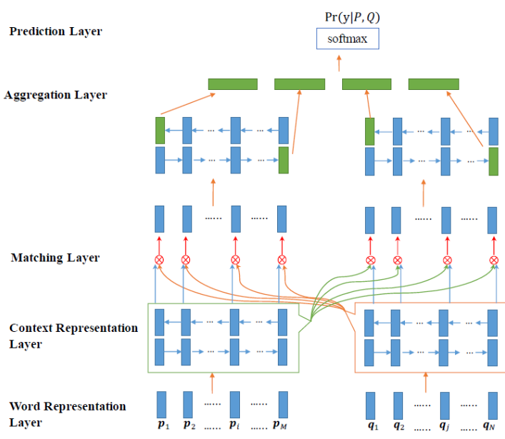

# 【关于 BiMPM 】那些你不知道的事   

> 作者：杨夕
> 
> 项目地址：https://github.com/km1994/nlp_paper_study
> 
> 个人介绍：大佬们好，我叫杨夕，该项目主要是本人在研读顶会论文和复现经典论文过程中，所见、所思、所想、所闻，可能存在一些理解错误，希望大佬们多多指正。
> 
> 论文：Bilateral multi-perspective matching for natural language sentences
> 
> 会议：IJCAI2017
> 
> 论文地址：https://arxiv.org/abs/1702.03814

## 模型介绍

- Word Representation Layer:其中词表示层使用预训练的Glove或Word2Vec词向量表示, 论文中还将每个单词中的字符喂给一个LSTM得到字符级别的字嵌入表示, 文中使用两者构造了一个dd维的词向量表示, 于是两个句子可以分别表示为 P:[p1,⋯,pm],Q:[q1,⋯,qn].

- Context Representation Layer: 上下文表示层, 使用相同的双向LSTM来对两个句子进行编码. 分别得到两个句子每个时间步的输出.

- Matching layer: 对两个句子PP和QQ从两个方向进行匹配, 其中⊗⊗表示某个句子的某个时间步的输出对另一个句子所有时间步的输出进行匹配的结果. 最终匹配的结果还是代表两个句子的匹配向量序列.

- Aggregation Layer: 使用另一个双向LSTM模型, 将两个匹配向量序列两个方向的最后一个时间步的表示(共4个)进行拼接, 得到两个句子的聚合表示.

- Prediction Layer: 对拼接后的表示, 使用全连接层, 再进行softmax得到最终每个标签的概率.

## 参考

1. [文本匹配、文本相似度模型之BiMPM](https://blog.csdn.net/u012526436/article/details/88663975)
2. [论文笔记：BiMPM 阅读和实现 (PyTorch)](https://zhuanlan.zhihu.com/p/50184415)
3. [Bilateral Multi-Perspective Matching for Natural Language Sentences---读书笔记](https://www.cnblogs.com/lyrichu/p/11204574.html)
4. [双边多视角自然语言句子匹配(BiMpm)](https://blog.csdn.net/uhauha2929/article/details/91461311)