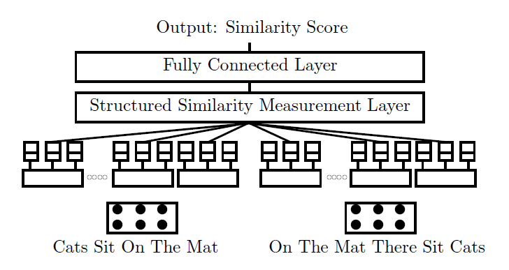
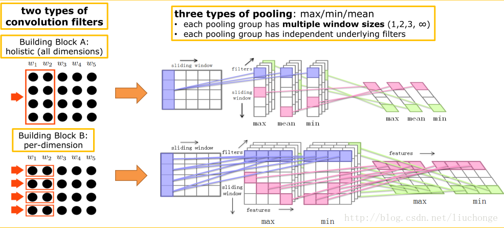
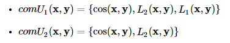

# 【关于 MPCNN】 那些你不知道的事

> 作者：杨夕
> 
> 项目地址：https://github.com/km1994/nlp_paper_study
> 
> 论文：Multi-Perspective Sentence Similarity Modeling with Convolution Neural Networks
> 地址：https://www.aclweb.org/anthology/D15-1181/
> 
> 个人介绍：大佬们好，我叫杨夕，该项目主要是本人在研读顶会论文和复现经典论文过程中，所见、所思、所想、所闻，可能存在一些理解错误，希望大佬们多多指正。

## 目录

- [【关于 MPCNN】 那些你不知道的事](#关于-mpcnn-那些你不知道的事)
  - [目录](#目录)
  - [解决方案](#解决方案)
  - [句子模型(sentence model)](#句子模型sentence-model)
    - [论文中使用了两种卷积核:](#论文中使用了两种卷积核)
      - [整体卷积核(holistic)](#整体卷积核holistic)
      - [单维卷积核(per-dimension)](#单维卷积核per-dimension)
      - [池化层](#池化层)
  - [相似度计算模型](#相似度计算模型)

## 解决方案

文章将整个问题的解决分成两部分:

1. 对句子进行建模, 将句子转换为某种向量表示. 这部分使用CNN完成

2. 两个句子相似度衡量的方式. 这里是新颖的地方.

然后将衡量计算得到的相似度向量投入到Dense层中, 再根据目标接Output层(如sigmoid层, softmax层等), 训练得到模型.

## 句子模型(sentence model)

首先预训练一个embedding层, 将句子按词转换为embedding后的结果.

对于一个长度为SEQ_LEN的句子, 若embedding向量的长度为EMBED_SIZE, 那么输入到句子模型中的每个句子的数据矩阵为大小为(SEQ_LEN, EMBED_SIZE). 这里我们不考虑BATCH_SIZE的大小, 实际在模型中的Tensor, 只需在第一维上拼接上BATCH_SIZE即可.

### 论文中使用了两种卷积核:

#### 整体卷积核(holistic)

这种卷积核就是我们正常使用的卷积核, 大小为(ws, A_num_filters).

- ws为卷积核的window大小, 代表评价相邻的若干个词之间关系, 论文中取ws={1, 2, 3, SEQ_LEN}, 之所以有一种卷积核的window为SEQ_LEN, 是衡量整个句子的特征.

- A_num_filters表示这个卷积核的通道数量, 论文中没有给出具体数值.

文章中卷积核进行卷积都是采用valid方式, 造成输出序列长度减小. 具体来说, 对于此类卷积核的输出output_A的大小为(SEQ_LEN + 1 - ws, A_num_filters).

#### 单维卷积核(per-dimension)

上面的卷积核是会对输入在EMBED_SIZE所有维上卷积相加得到一个输出. 这里的单维指的是一个卷积核只对输入向量的一个维度进行卷积, 输入向量有多长, 就有多少个卷积核, 考虑每个卷积核自己的通道数量, 因此单维卷积核的大小为(ws, EMBED_SIZE, B_num_filters).

- ws在这里只取{1, 2}即可.

- B_num_filters区别与A_num_filters, 即两种卷积核各自的通道数是不同的. 但同种卷积核的通道数是相同的.

因此, 这种卷积核的输出output_B的大小为(SEQ_LEN + 1 - ws, EMBED_SIZE, B_num_filters).

两种卷积核的输出维度不同, 但由于后文中计算相似度的特殊方式, 这里并不需要把结果展平.

#### 池化层

- 对于整体卷积核, 使用{max, min, avg}三种池化层, 将它们的结果合并起来.
- 对于单维卷积核, 使用{max, min}两种池化层, 将它们的结果合并起来.

## 相似度计算模型

引入三种计算距离的方式:

- 余弦距离, L1距离, L2距离

组合成两种距离计算函数:

在输入经过不同的卷积层, 池化层之后, 会得到数据的结果, 我们不能简单的把所有的结果展开并拼接在一起, 组成一个大的向量, 然后计算相似度. 我们要考虑结果来源的相似程度, 具体来说, 从以下四个角度判断:

结果是否来自同一个block, 即同一个输入, 同一种卷积核长度, 区别只在于池化层不同

- 结果是否来自同一个卷积核长度
- 结果是否来自同一个池化层
- 结果是否来自相同的通道, 可以是不同卷积核
- 以上四种衡量标准对于两种卷积核是分开的, 即相互之间不比较. 而且计算相似度时独立.

论文中提出了两种算法计算句子的相似度, 这两种算法都是结合以上四种规则中, 至少满足两种, 才能认为来源相似, 从而分块计算相似度. 将每一块的相似度累加得到最终的两个句子的相似度.

算法如下：

其中算法1只能对整体卷积核使用, 算法2对两种卷积核都适用. 我们将算法计算得到的相似度向量在接上一个Dense层, 最后接Output层, 就得到了完整的模型结构.

1. [论文阅读笔记: Multi-Perspective Sentence Similarity Modeling with Convolution Neural Networks](https://www.cnblogs.com/databingo/p/9280716.html)
2. [CNN在句子相似性建模的应用--模型介绍篇](https://blog.csdn.net/liuchonge/article/details/62424805)
3. [Tensorflow实例-CNN处理句子相似度（MPCNN）](https://blog.csdn.net/irving_zhang/article/details/70036708)
4. [MPCNN 复现](https://github.com/Fengfeng1024/MPCNN)
5. [CNN在句子相似性建模的应用--tensorflow实现篇1](https://blog.csdn.net/liuchonge/article/details/64128870)
6. [CNN在句子相似性建模的应用--tensorflow实现篇2](https://blog.csdn.net/liuchonge/article/details/64440110)