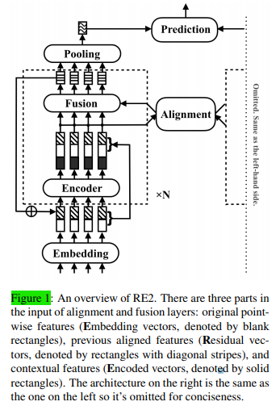

# 【关于 RE2】 那些你不知道的事

> 作者：杨夕
> 
> 项目地址：https://github.com/km1994/nlp_paper_study
> 
> 论文：Simple and Effective Text Matching with Richer Alignment Features
> 
> 地址：https://www.aclweb.org/anthology/P19-1465/
> 
> 个人介绍：大佬们好，我叫杨夕，该项目主要是本人在研读顶会论文和复现经典论文过程中，所见、所思、所想、所闻，可能存在一些理解错误，希望大佬们多多指正。

## 目录

- [【关于 RE2】 那些你不知道的事](#关于-re2-那些你不知道的事)
  - [目录](#目录)
  - [摘要](#摘要)
  - [介绍](#介绍)
  - [相关工作](#相关工作)
  - [动机](#动机)
  - [方法介绍](#方法介绍)
  - [模型框架](#模型框架)
    - [Augmented Residual Connections（增强剩余链接）](#augmented-residual-connections增强剩余链接)
    - [AlignmentLayer（对齐层）](#alignmentlayer对齐层)
    - [Fusion Layer（融合层）](#fusion-layer融合层)
    - [Prediction Layer（预测层）](#prediction-layer预测层)
  - [数据集](#数据集)
- [总结](#总结)
  - [参考文献](#参考文献)

## 摘要

In this paper, we present a fast and strong neural approach for general purpose text matching applications. 

We explore what is sufficient to build a fast and well-performed text matching model and propose to keep three key features available for inter-sequence alignment: original point-wise features, previous aligned features, and contextual features while simplifying all the remaining components. （我们探索了足以建立一个快速且性能良好的文本匹配模型的方法，并建议保留三个可用于序列间对齐的关键功能：原始点对齐特性、先前对齐特性和上下文特性，同时简化所有其余组件。）

We conduct experiments on four well-studied benchmark datasets across tasks of natural language inference, paraphrase identification and answer selection. The performance of our model is on par with the state-of-the-art on all datasets with much fewer parameters and the inference speed is at least 6 times faster compared with similarly performed ones.（我们在自然语言推理、意图识别和答案选择等任务中，对4个研究良好的基准数据集进行了实验。我们的模型性能与最先进的模型相当，并且使用的参数更少，除此之外，在推理速度方面与类似模型的相比，至少要快6倍。）

## 介绍

 语义对齐和两个文本序列的比较是神经文本匹配的关键。 
 
 先前的许多深度神经网络都包含单个序列间对齐层。 为了充分利用这种唯一的对齐过程，该模型必须采用丰富的外部句法特征或手工设计的对齐特征作为对齐层的附加输入（Chen等，2017; Gong等，2018），采用 复杂的对齐机制（Wang等人，2017; Tan等人，2018），或者构建大量的后处理层来分析对齐结果（Tay等人，2018b; Gong等人，2018）。

 ## 相关工作

 Three major paradigms are adopted to further improve performance. 
 
 First is to **use richer syntactic or hand-designed features. HIM（使用更丰富的句法或手工设计的功能）** (Chen et al., 2017) uses syntactic parse trees. POS tags are found in many previous works including Tay et al. (2018b) and Gong et al. (2018). The exact match of lemmatized tokens is reported as a powerful binary feature in Gong et al. (2018) and Kim et al. (2018). 
 
 The second way is **adding complexity to the alignment computation（增加对齐计算的复杂性）**. BiMPM (Wang et al., 2017) utilizes an advanced multiperspective matching operation, and MwAN (Tan et al., 2018) applies multiple heterogeneous attention functions to compute the alignment results. 
 
 The third way to **enhance the model is building heavy post-processing layers for the alignment results（增强模型，为对齐结果构建大量的后处理层）**. CAFE (Tay et al., 2018b) extracts additional indicators from the alignment process using alignment factorization layers. DIIN (Gong et al., 2018) adopts DenseNet as a deep convolutional feature extractor to distill information from the alignment results. 

 ## 动机

 可以使用多个序列间比对层构建更强大的模型。 代替基于单个对准过程的比较结果进行预测，具有多个对准层的堆叠模型将保持其中间状态并逐渐完善其预测。**但是，由于底层特征的传播效率低下和梯度消失，这些更深的体系结构更难训练。** 
 
 最近的工作提出了连接堆叠构建块的方法，包括密集连接（Tay等，2018a； Kim等，2018）和递归神经网络（Liu等，2018），这些方法增强了下级特征的传播，并产生比单一对齐过程更好的结果。

## 方法介绍

This paper presents RE2, a fast and strong neural architecture with multiple alignment processes for general purpose text matching. We question the necessity of many slow components in text matching approaches presented in previous literature, including complicated multi-way alignment mechanisms, heavy distillations of alignment results, external syntactic features, or dense connections to connect stacked blocks when the model is going deep. These design choices slow down the model by a large amount and can be replaced by much more lightweight and equally effective ones. Meanwhile, we highlight three key components for an efficient text matching model. These components, which the name RE2 stands for, are previous aligned features (Residual vectors), original point-wise features (Embedding vectors), and contextual features (Encoded vectors). The remaining components can be as simple as possible to keep the model fast while still yielding strong performance.

本文介绍了RE2，这是一种快速强大的神经体系结构，具有用于通用文本匹配的多个对齐过程。 我们对以前文献中介绍的文本匹配方法中许多慢速组件的必要性提出了质疑，包括复杂的多向对齐机制，对齐结果的大量提炼，外部句法特征或当模型深入时用于连接堆叠块的密集连接。 这些设计选择会极大地减慢模型的速度，并且可以用重量更轻且效果相同的模型代替。 同时，我们重点介绍了有效文本匹配模型的三个关键组成部分。 这些组件（名称为RE2代表）是以前的对齐特征（残差矢量），原始点向特征（嵌入矢量）和上下文特征（编码矢量）。 其余组件可能尽可能简单，以保持模型快速，同时仍能产生出色的性能。

## 模型框架

对齐融合层的输入分为三个部分:原始点态特征(嵌入向量，用空白矩形表示)、先前对齐特征(剩余向量，用对角线矩形表示)和上下文特征(编码向量，用实矩形表示)。右边的架构与左边的架构相同，所以为了简洁起见省略了它。

1) connected by augmented residual connections. Inside each block, a sequence encoder first computes contextual features of the sequence (solid rectangles in Figure 1). The input and output of the encoder are concatenated and then fed into an alignment layer to model the alignment and interaction between the two sequences. A fusion layer fuses the input and output of the alignment layer. The output of the fusion layer is considered as the output of this block. The output of the last block is sent to the pooling layer and transformed into a fixed-length vector. The prediction layer takes the two vectors as input and predicts the final target. The cross entropy loss is optimized to train the model in classification tasks.

### Augmented Residual Connections（增强剩余链接）

 为了给对齐过程提供更丰富的特性，RE2采用了增强版的剩余连接来连接连续块。在增强剩余连接的情况下，对齐和融合层的输入分为三个部分，即原始的点方向特征(嵌入向量)、先前对齐特征(残差向量)和后编码层上下文特征(编码向量)。这三个部分在文本匹配过程中都起到了互补的作用。

### AlignmentLayer（对齐层）

对齐层(如上面架构图所示)将来自两个序列的特性作为输入，并计算对齐后的表示形式作为输出。

### Fusion Layer（融合层）

    融合层比较三个透视图中的局部表示和对齐表示，然后将它们融合在一起。

### Prediction Layer（预测层）

    预测层以池层中v1和v2两个序列的向量表示作为输入，预测最终目标。

## 数据集

SNLI（Bowman等人，2015）（斯坦福大学自然语言推理）是自然语言推理的基准数据集。 在自然语言推理任务中，两个输入句子是不对称的。 第一个被称为“前提”，第二个被称为“假设”。 数据集包含来自图像字幕语料库的570k个人注释的句子对，标签为“包含”，“中性”，“矛盾”和“-”。 “-”标签表示注释者无法达成共识，因此在Bowman等人的训练和测试中，我们将忽略带有此类标签的文本对。 （2015）。 我们使用与原始论文相同的数据集拆分。 准确性用作此数据集的评估指标。

SciTail（Khot et al。，2018）（Science Entailment）是根据科学问题和答案构建的物类分类数据集。 由于科学事实不能相互矛盾，因此该数据集仅包含两种类型的标签：蕴含标签和中性标签。 我们使用原始数据集分区。 该数据集总共包含27k个示例。 10k的示例带有包装标签，其余的17k则标记为中性。 准确性用作此数据集的评估指标。

Quora Question Pairs 是用于释义识别的数据集，具有两个类别，指示一个问题是否是另一个问题的释义。 数据集包含从Quora.com收集的超过40万个真实问题对。 我们使用与Wang等人所述相同的数据集分区。 （2017）。 准确性用作此数据集的评估指标。

WikiQA（Yang等人，2015）是基于维基百科的基于检索的问题回答数据集。 它包含问题及其候选答案，并带有二进制标签，指示候选句子是否是对其所属问题的正确答案。 该数据集具有20.4k训练对，2.7k开发对和6.2k测试对。 平均平均精度（MAP）和平均倒数排名（MRR）用作此任务的评估指标。

# 总结

我们为通用文本匹配提出了一种高效的方法RE2。 它在三个不同的文本匹配任务上，仅需很少的参数和很高的推理速度，就可以在四个经过充分研究的数据集上实现与最新技术相当的性能。 它突出显示了三个关键特征，即**先前的对齐特征，原始的逐点特征和用于序列间对齐的上下文特征**，并简化了大多数其他组件。 由于其速度快和性能强，该模型非常适合广泛的相关应用。

## 参考文献

1. [Text Matching with Richer Alignment Features 论文解读](https://zhuanlan.zhihu.com/p/84703949)
